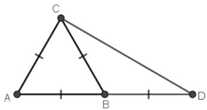
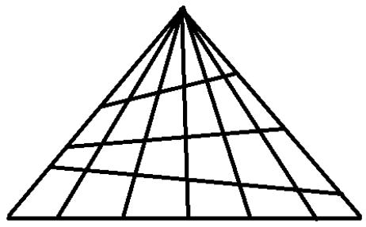
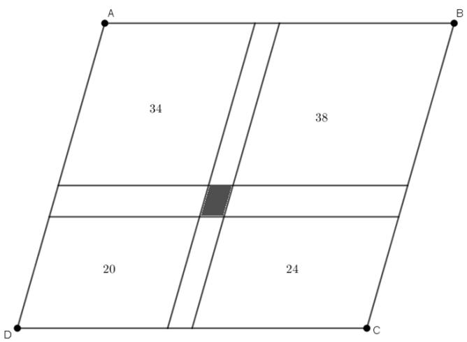
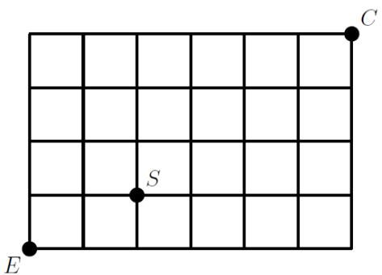
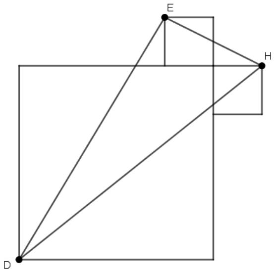

# Singapore International Math Olympiad Challenge 2019

# GRADE 5 (PRIMARY 5)

July 7, 2019 

Time: 1 hour 30 minutes 

NAME: 

GRADE: 

COUNTRY: 

## INSTRUCTIONS

1. Please DO NOT OPEN the contest booklet until the Proctor has given permission. 

2. There are 25 questions. 

Section A: Questions 1 to 15 score 2 points each, no points are deducted for unanswered question and 1 point is deducted for wrong answer. 

Section B: Questions 16 to 25 score 4 points each, no points are deducted for unanswered or wrong answer. 

3. Shade your answers neatly using a pencil in the Answer Entry Sheet. 

4. PROCTORING: No one may help any student in any way during the contest. 

5. No electronic devices capable of storing and displaying visual information is allowed during the course of the exam. Strictly No Calculators are allowed into the exam. 

6. Students must show detailed working and transfer answers to the Answer Entry Sheet. 

7. No exam papers and written notes can be taken out by any contestant. 

Rough Working 

## Section A (Correct answer – 2 points| No answer – 0 points| Incorrect answer – minus 1 point)

## Question 1

## Calculate

$$
(2 0 1 8 - 2 0 1 6) + (2 0 1 6 - 2 0 1 4) + (2 0 1 4 - 2 0 1 2) + \dots + (6 - 4) + (4 - 2)
$$

A. 2 

B. 1008 

C. 1009 

D. 2016 

E. None of the Above 

## Question 2

It is given that $n ! = n \times ( n - 1 ) \times ( n - 2 ) \times \ldots \times 2 \times 1$ . For example, 5! = 

$5 \times 4 \times 3 \times 2 \times 1 = 1 2 0$ . What is the remainder when $1 ! + 2 ! + 3 ! + 4 ! + \dots + 1 9 ! + 2 0 ! \ \mathrm { i } s$ divided by 20? 

A. 12 

B. 13 

C. 14 

D. 15 

E. None of the Above 

## Question 3

What is the remainder when the number 2222222222 ��������� is divided by 7? 10 2???? 

A. 3 

B. 4 

C. 5 

E. None of the Above 

## Question 4

In how many ways can three students in a class receive grades  or  so that no two students receive the same grade. 

A. 6 

B. 24 

C. 27 

D. 64 

E. None of the Above 

## Question 5

The total number of apples and pears in a container is 220. Ben later gave away 38 pears and $\frac { 5 } { 9 }$ of the apples. The remaining apples and the remaining pears in the container were now equal in number. How many pears were there in the container at first? 

A. 38 

B. 56 

C. 94 

D. 182 

## Question 6

The clock in my bedroom shows the time which is four minutes ahead the real time. When the real time is 7:00 AM, it shows 7:04 AM. The clock in my kitchen is also faulty. When the one in the bedroom shows 8:55 AM, the one in the kitchen shows 8:53 AM. I can’t trust the clock in Dad’s car, either. When I got in the car yesterday, the clock in the kitchen showed 8:30 PM and the clock in the car said 8:24 PM. When I arrived to school, the clock outside the building showed 9:01 AM and the clock in the car said 8:56 AM. What did the clock outside school show when I got up at 6:30 AM, according to my bedroom clock? 

A. 6:22 AM 

B. 6:24 AM 

C. 6:26 AM 

D. 6:27 AM 

E. None of the Above 

## Question 7

In the figure below, $A B = A C = B C = B D$ . What is the measure of $\angle D$ in degrees? 

A. 15 

B. 30 

D. 120 

E. None of the Above 

## Question 8

John’s speed of climbing up a mountain is 2 km/h. His speed of descent is 6 km/h. What is his average speed (in km/h) for the whole journey? 

A. 3 

B. 4 

E. 8 

## Question 9

In a class of 42 students, 18 students are in the Math club, 5 students are in both the Math Club and Science Club, and 14 students are not in any clubs. How many students are in the Science Club? 

A. 10 

B. 15 

C. 24 

D. 28 

E. None of the Above 

## Question 10

Given that a number 3A4A6A9A2 is divisible by 11, what is the value of A? 

A. 5 

B. 6 

C. 7 

D. 8 

E. None of the Above 

## Question 11

John was computing for the average of the fractions ${ \frac { 3 } { 4 } } , { \frac { 4 } { 5 } } , { \frac { 7 } { 9 } } , { \frac { 9 } { 1 1 } }$ when he mistakenly interchanged the numerator and the denominator of one of the given fractions. What is the greatest possible difference between the new average and the supposed average of the original set of fractions? 

A. 17/140 

B. 9/80 

C. 7/48 

D. 10/99 

E. None of the Above 

## Question 12

How many triangles are there in the figure below? 

A. 21 

B. 63 

C. 42 

D. 84 

E. None of the Above 

## Question 13

The operation $\otimes$ is defined as $\begin{array} { r } { a \otimes b = \frac { a } { b } + \frac { 1 } { a + b + a b - M } } \end{array}$ If it is known that 1 ⊗ $\begin{array} { r } { 2 = \frac { 3 } { 4 } , } \end{array}$ find the value of 5 ⊗ 6. 

A. $\frac { 9 7 } { 1 2 0 }$ 120 

B. $\frac { 1 0 3 } { 1 2 0 }$ 120 

C. $\frac { 6 } { 7 }$ 

D. $\frac { 7 } { 6 }$ 

E. None of the Above 

## Question 14

The ratio of the perimeter of a rectangle to the length of one of its sides is 14 : 3. If the area of the rectangle is 27 cm2, how long is the longer side? 

A. 3 cm 

B. 6 cm 

C. 18 cm 

D. 24 cm 

E. None of the Above 

## Question 15

Amy, working alone, can finish painting a house in 36 hours while Brad, working alone, can finish painting the same house in 48 hours. Each of them works exactly 8 hours everyday. However, Amy rests every Tuesday and Thursday while Brad rests every Wednesday. If they start painting the house together on a Monday, on what day of the week will they finish painting the house in the least possible amount of time. 

A. Wednesday 

B. Thursday 

C. Friday 

D. Saturday 

E. Sunday 

## Section B (Correct answer – 4 points| Incorrect or No answer – 0 points)

When the answer is a 1-digit number, shade “0” for the tens, hundreds and thousands place. 

Example: if the answer is 7, then shade 0007 

When the answer is a 2-digit number, shade “0” for the hundreds and thousands place. 

Example: if the answer is 23, then shade 0023 

When the answer is a 3-digit number, shade “0” for the thousands place. 

Example: if the answer is 785, then shade 0785 

When the answer is a 4-digit number, shade as it is. 

Example: if the answer is 4196, then shade 4196 

## Question 16

The perimeter of parallelogram ABCD is 68. Parallelogram ABCD has been divided into 9 smaller parallelograms by 4 parallel lines. The perimeters of four of the smaller parallelograms are 34, 38, 20 and 24 as shown. Find the perimeter of the shaded region. 

## Question 17

In the multiplication sentence, $A B C \times D E = F G \times H I = 5 5 6 8 _ { i }$ , the 9 letters represent the digits from 1 to 9 and they are used only once. What is the value of the 3-digit number ????????????? 

## Question 18

Elvis took several mathematics tests. He scored 76 in one of the tests and his average score for all the tests was 85. If he obtained 92 instead of $^ { 7 6 , }$ his average score would be 89. How many tests did Elvis take? 

## Question 19

A special key in a calculator when pressed, displays the number $\textstyle 1 - { \frac { 1 } { x } } ,$ when ???? was displayed before. For example, when 2 is displayed and the special key is pressed, the calculator will display $\frac 1 2$ since $\textstyle 1 - { \frac { 1 } { 2 } } = { \frac { 1 } { 2 } } .$ . Initially, the number 2019 is displayed in the calculator. Find the number that will be displayed after pressing the special key 2019 times. 

## Question 20

Larry tells Mary and Jerry that he is thinking of two consecutive integers from 1 to 10. He tells Mary one of the numbers, and he tells Jerry the other number. Then the following conversation occurs between Mary and Jerry: 

I don't know your number. 

don't know your number, either. 

Ah, now I know your number. 

Assuming both Mary and Jerry used correct logic, what is the sum of the possible numbers Mary could have? 

## Question 21

Andrew, Bob, Carl and David together decided to buy a new air conditioning unit. The amount given by the eldest, Andrew, is one-half the total amount given by his 3 other siblings. The amount given by the second eldest, Bob, is one-third the total amount given by his 3 other siblings. The amount given by the third eldest, Carl, is one-fourth the total amount given by his 3 other siblings. If the amount given by the youngest, David, is $40 less than the amount given by Bob, what is the cost of the air conditioner? 

## Question 22

John and James are brothers. The ratio of the monthly income of John to James is 4:3 while the ratio of their monthly expenses is 11:7. Last year, each of them saved $9,000 for the whole year. How much is James’ monthly income? 

## Question 23

Find the value of the following. 

$$
\frac {2 0 1 9 \times 2 0 2 0}{5 0 5 + 5 0 5 ^ {2}} + \frac {2 0 1 9 \times 2 0 2 0}{5 0 6 + 5 0 6 ^ {2}} + \frac {2 0 1 9 \times 2 0 2 0}{5 0 7 + 5 0 7 ^ {2}} + \dots + \frac {2 0 1 9 \times 2 0 2 0}{6 7 2 + 6 7 2 ^ {2}}
$$

## Question 24

Calvin’s house is located at the point C as shown in the figure shown. Ed, whose house is located at point E, wants to visit Calvin. The segments on the grid are the only roads that Ed can use to move to other points in the grid. Ed also wants to visit Sam, whose house is located at point S. If Ed starts from his house and he can only move up or to the right. In how many ways can Ed go to Calvin’s house if he wants to visit Sam first? 

## Question 25

A large square and two congruent smaller squares share a vertex. The large square touches the other two squares as shown. The areas of the three squares are 160, 10 and 10 cm2, and points D, E, and H are three of the vertices of the three squares as shown. Find the area of triangle EDH. 

Rough Working 