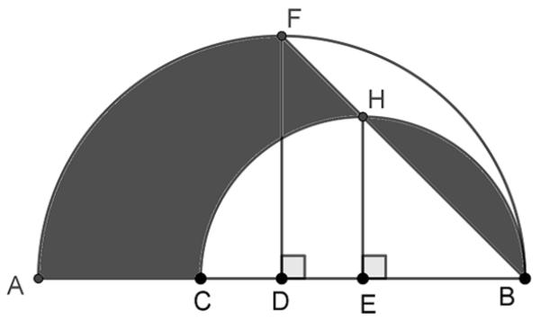
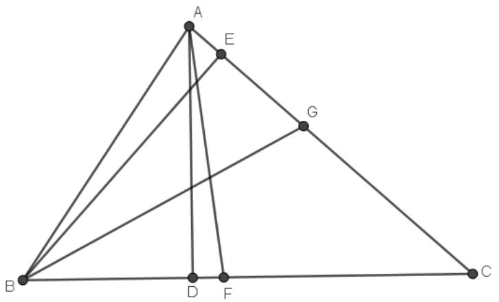
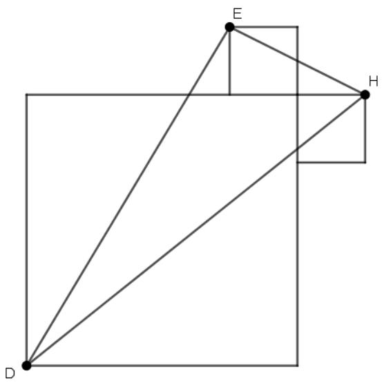

# Singapore International Math Olympiad Challenge 2019

# GRADE 6 (PRIMARY 6)

July 7, 2019 

Time: 1 hour 30 minutes 

NAME: 

GRADE: 

COUNTRY: 

## INSTRUCTIONS

1. Please DO NOT OPEN the contest booklet until the Proctor has given permission. 

2. There are 25 questions. 

Section A: Questions 1 to 15 score 2 points each, no points are deducted for unanswered question and 1 point is deducted for wrong answer. 

Section B: Questions 16 to 25 score 4 points each, no points are deducted for unanswered or wrong answer. 

3. Shade your answers neatly using a pencil in the Answer Entry Sheet. 

4. PROCTORING: No one may help any student in any way during the contest. 

5. No electronic devices capable of storing and displaying visual information is allowed during the course of the exam. Strictly No Calculators are allowed into the exam. 

6. Students must show detailed working and transfer answers to the Answer Entry Sheet. 

7. No exam papers and written notes can be taken out by any contestant. 

## Section A (Correct answer – 2 points| No answer – 0 points| Incorrect answer – minus 1 point)

## Question 1

What is the value of $\frac { 1 \times 2 \times 3 + 3 \times 6 \times 9 + 7 \times 1 4 \times 2 1 } { 1 \times 4 \times 5 + 3 \times 1 2 \times 1 5 + 7 \times 2 8 \times 3 5 } ?$ 

A. 2/5 

B. 3/7 

C. 2/3 

D. 3/10 

E. None of the above 

## Question 2

What is the last digit of the sum $7 6 ^ { 2 0 1 9 } + 2 5 ^ { 2 0 1 9 } ?$ 

A. 1 

B. 5 

D. 11 

E. None of the Above 

## Question 3

It takes 8 persons 3 days to finish baking 144 cookies. At the same rate, how many cookies can 12 persons bake in 6 days? 

A. 12 

B. 324 

C. 432 

D. 500 

E. None of the Above 

## Question 4

Allan, Bob and Charles were comparing the number of marbles they had. Allan had $\frac { 2 } { 3 }$ the combined number of marbles that Bob and Charles have. Bob had $\frac { 2 } { 5 }$ of the combined number of marbles that Allan and Charles have. What fraction of the combined number of Allan’s and Bob’s marbles did Charles have? 

A. 

B. 

C. $\frac { 1 } { 2 }$ 

D. $\frac { \mathbf { \bar { 4 } } } { 1 5 }$ 

E. None of the Above 

## Question 5

We define the least common multiple (LCM) of two fractions, $\frac { a } { b }$ and $\frac { c } { d } ,$ to be the least fraction $\frac { x } { y }$ such that ${ \frac { x } { y } } \div { \frac { a } { b } }$ and ${ \frac { x } { y } } \div { \frac { c } { d } }$ are both integers. For example, $\begin{array} { r } { L C M \left( \frac { 1 } { 2 } , \frac { 2 } { 3 } \right) = \frac { 2 } { 1 } , } \end{array}$ since ${ \frac { 2 } { 1 } } \div { \frac { 1 } { 2 } } = 4$ and ${ \frac { 2 } { 1 } } \div { \frac { 2 } { 3 } } = 3$ , and $\frac { 2 } { 1 }$ is the least fraction with this property. Find the $L C M \left( \textstyle { \frac { 1 5 } { 4 9 } } , \textstyle { \frac { 5 } { 2 1 } } , \textstyle { \frac { 2 5 } { 1 4 } } \right)$ . 

A. $\frac { 7 5 } { 7 }$ 

B. $\frac { \dot { 7 } 5 } { 1 4 }$ 14 

C. $\frac { \bar { 3 } \bar { 0 } } { 7 }$ 7 

D. $\frac { 1 5 0 } { 7 }$ 

E. None of the Above 

## Question 6

Find the smallest whole number that we must add to 

$$
2 + 2 ^ {2} + 2 ^ {3} + \dots + 2 ^ {1 0}
$$

for it to be divisible by 10. 

A. 2 

B. 4 

C. 6 

E. None of the above 

## Question 7

How many numbers between 1 and 202 are multiples of 3 or 4 but not 12? 

A. 67 

B. 117 

C. 101 

D. 133 

E. None of the above 

## Question 8

The ratios of the volume of a rectangular box to its length, width and height are 5: 1, 1: 3 and 5: 3, respectively. Find the surface area of the box. 

A. 7 

B. 8.6 

C. 14 

D. 17.2 

E. None of the Above 

## Question 9

JustRunLah! had a race with 6 runners, among them Alice and Bob. If Alice finished ahead of Bob, how many possible outcomes are there for the final rankings of the runners? 

A. 24 

B. 120 

C. 240 

D. 360 

E. None of the Above 

## Question 10

Jerry walked into a computer store having $2000. He bought a laptop with a 20% discount. To recover his expense, he sold the laptop for 50% more than the price he purchased it. If he had $2720 at the end, how much was the cost of the laptop without the discount? 

A. $1500 

B. $1600 

C. $1700 

D. $1800 

E. None of the Above 

## Question 11

When is the first time after 4:00 AM that the minute hand is exactly 2 minutes past the hour hand? 

A. 4:20 AM 

B. 4:24 AM 

C. 4:30 AM 

D. 4:36 AM 

E. None of the above 

## Question 12

Peter brought some apples, oranges and kiwis to the local market to sell. After he sold 4 apples, he was left with 3 oranges for each remaining apple. He then sold 7 oranges and was left with 3 kiwis for each remaining orange. Finally, he sold 27 kiwis and was left with 3 kiwis for each remaining apple. How many kiwis did Peter bring to the local market? 

A. 24 

B. 51 

D. 68 

E. None of the Above 

## Question 13

The long road along Orchard Street is being repaired. When 10% of the road was successfully repaired, the road management team decided to buy new equipment to speed up the road repair. As a result, the rate at which the road was being repaired increased by 20% and the time to complete the road repair decreased by 15% (compared to the original). In total, it took 144.5 days to repair the road. How long, in days, was the original plan to finish the road repair? 

A. 170 

B. 180 

C. 190 

D. 200 

E. None of the Above 

## Question 14

The fractions $\frac { a } { 3 }$ and $\frac { b } { 7 }$ are proper fractions. If the value of ${ \frac { a } { 3 } } + { \frac { b } { 7 } }$ is between 1.38 and 1.39, find ????????. 

A. 6 

B. 8 

C. 10 

D. 12 

E. None of the above 

## Question 15

Find the value of 

$$
\frac {2 0 1 9 ^ {2}}{2 0 1 9} - \frac {2 0 1 8 ^ {2}}{2 0 1 9} + \frac {2 0 1 7 ^ {2}}{2 0 1 9} - \frac {2 0 1 6 ^ {2}}{2 0 1 9} + \dots - \frac {4 ^ {2}}{2 0 1 9} + \frac {3 ^ {2}}{2 0 1 9} - \frac {2 ^ {2}}{2 0 1 9} + \frac {1 ^ {2}}{2 0 1 9}
$$

A. 1010 

B. 2019 

C. 2020 

D. 20192 

E. None of the Above 

## Section B (Correct answer – 4 points| Incorrect or No answer – 0 points)

When the answer is a 1-digit number, shade $\ " 0 \prime \prime$ for the tens, hundreds and thousands place. 

Example: if the answer is $\nearrow ,$ then shade $o o o 7$ 

When the answer is a 2-digit number, shade $\ " 0 \prime \prime$ for the hundreds and thousands place. 

Example: if the answer is 23, then shade $0 0 2 3$ 

When the answer is a 3-digit number, shade $\ " 0 \prime \prime$ for the thousands place. 

Example: if the answer is 785, then shade $\scriptscriptstyle { O 7 8 5 }$ 

When the answer is a 4-digit number, shade as it is. 

Example: if the answer is 4196, then shade 4196 

## Question 16

Let the operations $\Delta$ and ∎ be defined for all numbers ???? and as follows: 

$$
a \Delta b = a + 3 \times b
$$

$$
a \blacksquare b = a + 4 \times b
$$

For example, 

$$
4 \Delta 7 = 4 + 3 \times 7 = 2 5
$$

$$
9 \blacksquare 2 = 9 + 4 \times 2 = 1 7
$$

If $4 \Delta ( 5 \times y ) = ( 5 \times y ) \equiv 4$ , what is the value of $1 5 \times y ?$ 

## Question 17

A terminating fraction is a fraction that has a terminating decimal representation. For example, $\frac { 3 1 } { 4 0 }$ is a terminating fraction since $\textstyle { \frac { 3 1 } { 4 0 } } = 0 . 7 7 5$ while $\frac 1 3$ is NOT since $\textstyle { \frac { 1 } { 3 } } = 0 . 3 3 3 3$ …. 

The fraction $\frac { 1 } { 2 0 2 0 }$ is not terminating. Find the least positive integer to be multiplied to $\frac { 1 } { 2 0 2 0 }$ to make it a terminating fraction. 

## Question 18

Two cars, A and B, on opposite sides of a long road, are traveling towards each other. Car A is traveling at a rate of 56 km/h while Car B is traveling at a rate of 48 km/h. Cars A and B meet for the first time when Car A has traveled 32 kilometers past midway. How long is the road in kilometres? 

## Question 19

Simon and Peter are brothers. Working alone, Simon can paint a room 2 times as fast as his brother Peter. But when they work together, they horseplay and as a result, each of their working rates decreases by half. Last weekend, the two boys painted the room together for 20 minutes. After which, Peter left, leaving Simon alone to finish painting the room. Simon took another 25 additional minutes to finish the job. How long, in minutes, did it take Simon to paint the room alone? 

## Question 20

Larry tells Mary and Jerry that he is thinking of two consecutive integers from 1 to 10. He tells Mary one of the numbers, and he tells Jerry the other number. Then the following conversation occurs between Mary and Jerry: 

I don't know your number. 

don't know your number, either. 

Ah, now I know your number. 

Assuming both Mary and Jerry used correct logic, what is the sum of the possible numbers Mary could have? 

## Question 21

Refer to the figure below. The bigger semicircle is centered at D and has a radius of 9 cm. The smaller semicircle is centered at E and has a radius of 6 cm. Also, FD and HE are perpendicular to DB and EB, respectively. Find the area of the shaded region (Rounded off your answer to the nearest whole number and use ???? = 3.14.) 

## Question 22

At the most how many numbers can you choose from 1000 to 1550 so that the sum of any three numbers is divisible by 3? 

## Question 23

Define $n ! = n \times ( n - 1 ) \times ( n - 2 ) \times \ldots \times 2 \times 1 { \mathrm { ~ a n d ~ } } 0 !$ = 1. 

Find the number ???? where $k = m ^ { n }$ such that ${ \frac { 2 0 0 0 ! } { 1 0 0 0 ! } } = { k } \times ( 1 \times 3 \times 5 \times 7 \times \cdots \times 1 9 9 7 \times$ 1999). Find the value of $m + n$ . 

## Question 24

In triangle ABC, points D and E are on sides BC and AC such that AD and BE are perpendicular to BC and AC, respectively. Points F and G are on sides BC and AC such that AF and BG divide angles BAC and ABC into two equal parts, respectively. If $\angle D A F = 7 ^ { \circ }$ and $\angle E B G = 2 0 ^ { \circ }$ . Find the measure of $\angle C$ . 

## Question 25

A large square and two congruent smaller squares share a vertex. The large square touches the other two squares as shown. The areas of the three squares are 320, 20 and 20 cm2, and points D, E, and H are three of the vertices of the three squares as shown. Find the area of triangle EDH. 

