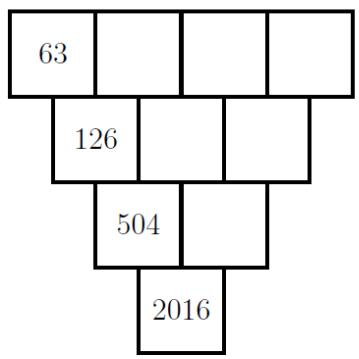
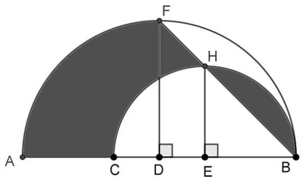
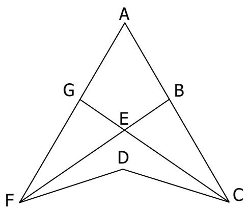
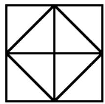
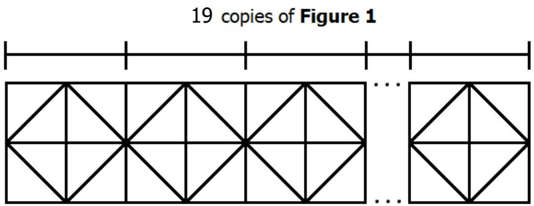

## Section A (Correct answer – 2 points| No answer – 0 points| Incorrect answer – minus 1 point)

## Question 1

Find the value of 

$$
\frac {1}{1} + \frac {1}{1 + 2} + \frac {1}{1 + 2 + 3} + \frac {1}{1 + 2 + 3 + 4} + \frac {1}{1 + 2 + 3 + 4 + 5}
$$

A. 

B. 3 

C. 

D. 

E. None of the Above 

## Question 2

The operator  acts on two numbers to give the following outcomes: 

$$
4 \bullet 8 = 4 8
$$

$$
8 \bullet 9 = 1 7 2
$$

$$
6 \bullet 9 = 3 1 8
$$

$$
1 5 \bullet 2 0 = 5 6 0
$$

What is the value of 19  19? 

A. 190 

B. 1919 

C. 2019 

D. 3600 

E. None of the Above 

## Question 3

A circle is drawn on a rectangular (with different dimensions) piece of paper. What is the largest possible number of regions can be formed? 

A. 2 

B. 3 

C. 4 

D. 5 

E. None of the above 

## Question 4

A number is written on the board. It starts with one digit “1”, two digits “2”, three digits “3”, …, nine digits “9”, ten digits “0”, eleven digits “1”, twelve digits “2”, etc. In other words, the number is as follow: 

$$
1 2 2 3 3 3 4 4 4 4 5 5 5 5 5 \ldots \underbrace {9 9 9 9 9 9 9 9 9} _ {9 d i g i t s} \underbrace {0 0 0 0 0 0 0 0 0} _ {1 0 d i g i t s} \underbrace {1 1 1 \ldots 1 1 1} _ {1 1 d i g i t s} \underbrace {2 2 2 \ldots 2 2 2} _ {1 2 d i g i t s} \ldots
$$

What is the 2019th digit of this number? 

A. 2 

B. 4 

C. 6 

D. 8 

E. None of the above 

## Question 5

The letters “A”, “C”, “L” and “O” are rearranged to form all four-letter words. The list of words is then arranged in dictionary order. For example, the first word is ACLO and the last word is OLCA. What is the order of ‘COLA’ in the list? 

A. 10 

B. 11 

C. 12 

D. 13 

E. None of the above 

## Question 6

A group of teachers attended a conference hosted by the Wonderland’s Ministry of Education. Before the conference starts, every teacher shook hands with each other. After all the teachers shook hands with one another, the Minister and his secretary entered the conference room. They shook hands with some of the teachers, so that no teacher shook hands with both of them. Given that there were 2019 handshakes made, how many teachers attended the conference? 

A. 62 

B. 63 

C. 64 

D. 65 

E. None of the above 

## Question 7

The following calculations lead to $2 0 1 9 = - 2 0 1 9$ : 

We write 2019 as √20192. (1) 

Since $2 0 1 9 ^ { 2 } = ( - 2 0 1 9 ) ^ { 2 }$ , we further rewrite 2019 as $\sqrt { ( - 2 0 1 9 ) ^ { 2 } }$ . (2) 

${ \mathsf { T h e } } \exp \mathsf { r e s s i o n ~ i s ~ s i m p l i f i e d ~ t o } \sqrt { ( - 2 0 1 9 ) ^ { 2 } } = - 2 0 1 9 .$ (3) 

Hence, 2019 = −2019. (4) 

Which step is the first one that contains errors? 

A. (1) 

B. (2) 

C. (3) 

D. (4) 

E. The proof is correct; 2019 is equal to -2019. 

## Question 6

In the following diagram, each number in a box is the least common multiple of the two numbers in the boxes that it touches above it. Given the configuration shown below, what is the smallest possible number that could be in the top rightmost box? 

A. 2 

B. 4 

C. 16 

D. 32 

E. None of the above 

## Question 9

In the SIMOC Kingdom, only coins of value 19 dollars and 20 dollars are circulated. Which of the following amount of money cannot be paid exactly in this Kingdom? 

A. 40 

B. 140 

C. 727 

D. 2019 

E. None of the above 

## Question 10

Five empty bottles of lemonade can be exchanged for 1 new bottle of coke. Four empty bottles of coke can be exchanged for 1 new bottle of milk. If Sarah initially buys 5 dozen of lemonade bottles, what is the greatest number of bottles of any beverages can she drink? (1 dozen is 12 pieces) 

A. 25 

B. 50 

C. 75 

D. 100 

E. None of the above 

## Question 11

Which option below is an odd term in the following sequence? 

11, 13, 24, 37, 61,98, 159, … 

A. $5 1 ^ { \mathrm { t h } }$ 

B. $5 7 ^ { \mathrm { t h } }$ 

C. $7 5 ^ { \mathrm { t h } }$ 

D. $1 0 0 ^ { \mathrm { t h } }$ 

E. $1 0 2 ^ { \mathrm { t h } }$ 

## Question 12

Abel and Amenadial start on opposite ends of a pool and start swimming towards each other. Abel’s speed is 3 m/s and Amenadial’s speed is 1.8 m/s. Each time they reach the opposite end of the pool, they turn around and continue swimming. Swimming 1 lap means swimming from one end of the pool to the opposite end. What is the smallest number of laps that Abel needs to swim before they meet each other at the middle of the pool? 

A. 2 

B. 3 

C. 4 

D. 5 

E. None of the above 

## Question 13

Refer to the figure below. The bigger semicircle is centered at D and has a radius of 9cm. The smaller semicircle is centered at E and has a radius of 6 cm. Also, FD and HE are perpendicular to DB and EB respectively. Find the area of the shaded region. 

A. $1 6 \pi + 2 { \mathrm { c m } } ^ { 2 }$ 

B. ${ \frac { 9 } { 4 } } \pi + { \frac { 9 } { 2 } } \ \mathrm { c m } ^ { 2 }$ + cm2 

C. $\textstyle { \frac { 7 } { 2 } } \pi + { \frac { 1 } { 4 } } \ c m ^ { 2 }$ 2 

D. $\textstyle { \frac { 1 1 } { 2 } } \pi + { \frac { 1 6 } { 3 } } \ c \ m ^ { 2 }$ cm2 

E. None of the above 

## Question 14

Which of the following options below is divisible by 3? 

A. $1 ^ { 1 1 }$ 

B. $2 ^ { 1 3 } - 1$ 

C. $3 ^ { 4 2 8 } - 1$ 

D. $4 ^ { 9 9 9 } - 1$ 

E. None of the above 

## Question 15

Information about four students: Amy, Hannah, Rebecca and Yuki are as stated below. 

1. Each of the student has a different nationality and come from among Bulgaria, China, Japan or Philippines. 

2. Their ages are 17, 18, 19 or 20; each of them do not share the same age. 

3. Each of them plays a different musical instrument which could be a clarinet, guitar, piano or violin. 

4. Hannah is younger than Amy. 

5. The student playing the piano is not a Japanese, and is younger than Rebecca. 

6. The 20-year-old student is not a Chinese, and does not play the piano. 

7. Yuki is older than Rebecca. 

8. The student playing the clarinet is not a Japanese, and is not 19 years old. 

9. Rebecca is not 17 years old, and does not play the guitar or violin. 

10.Amy is from Bulgaria, and she does not play the clarinet or guitar. 

Who plays the violin? 

A. Amy 

B. Hannah 

C. Rebecca 

D. Yuki 

E. Not enough information 

## Section B (Correct answer – 4 points| Incorrect or No answer – 0 points)

When the answer is a 1-digit number, shade “0” for the tens, hundreds and thousands place. 

Example: if the answer is 7, then shade 0007 

When the answer is a 2-digit number, shade “0” for the hundreds and thousands place. 

Example: if the answer is 23, then shade 0023 

When the answer is a 3-digit number, shade “0” for the thousands place. 

Example: if the answer is 785, then shade 0785 

When the answer is a 4-digit number, shade as it is. 

Example: if the answer is 4196, then shade 4196 

## Question 16

Positive integers are written in the infinite table as follow. 

<table><tr><td></td><td>...</td><td>Column -2</td><td>Column -1</td><td>Column 0</td><td>Column 1</td><td>Column 2</td><td>...</td></tr><tr><td>...</td><td></td><td></td><td>...</td><td>4</td><td>...</td><td></td><td></td></tr><tr><td>Row 2</td><td></td><td>...</td><td>4</td><td>3</td><td>4</td><td>...</td><td></td></tr><tr><td>Row 1</td><td>...</td><td>4</td><td>3</td><td>2</td><td>3</td><td>4</td><td>...</td></tr><tr><td>Row 0</td><td>4</td><td>3</td><td>2</td><td>1</td><td>2</td><td>3</td><td>4</td></tr><tr><td>Row -1</td><td>...</td><td>4</td><td>3</td><td>2</td><td>3</td><td>4</td><td>...</td></tr><tr><td>Row -2</td><td></td><td>...</td><td>4</td><td>3</td><td>4</td><td>...</td><td></td></tr><tr><td>...</td><td></td><td></td><td>...</td><td>4</td><td>...</td><td></td><td></td></tr></table>

What number is written on the cell of row 2019 and column 2019? 

## Question 17

William writes on the board all integers from 1 to 100. He then erases all the numbers with digit(s) “3” or divisible by 3. How many numbers are left on the board? 

## Question 18

In the following cryptarithm, all the different letters stand for different digits. What is the sum of the digits in the 6-digit number DURIAN? 

<table><tr><td></td><td></td><td>A</td><td>P</td><td>P</td><td>L</td><td>E</td></tr><tr><td>+</td><td>B</td><td>A</td><td>N</td><td>A</td><td>N</td><td>A</td></tr><tr><td></td><td>D</td><td>U</td><td>R</td><td>I</td><td>A</td><td>N</td></tr></table>

## Question 19

What is the largest positive integer ???? such that $n ^ { 2 } + 5 0$ is divisible by $n + 2 ?$ 

## Question 20

In the Star Event, the Lucky Award is awarded to a couple of opposite gender with the same zodiac signs. It also awards a group of at least 5 people with the same gender and zodiac signs. For instance, 2 couples where each couple has opposite gender and same zodiac signs will get 1 Prize each. Given that there are 12 zodiac signs, at least how many people should the event organiser invite to ensure at least one Lucky Award will be given? 

## Question 21

The lines BF and GC bisect ∠GFD and ∠DCB respectively, and the meet at point E. Given that $\angle G \mathsf { E B } = 1 0 0 ^ { \circ }$ and $\angle \mathsf { F D C } = 1 4 0 ^ { \circ }$ , find $\angle F A C$ . 

## Question 22

Yvonne and Zavier can complete painting a house in 12 days. Whereas, Xander and Yvonne can complete painting the same house in 6 days. When Xander and Zavier work together, they will take 10 days to complete it. If all 3 of them work together but Zavier only comes for 1 day to help out, it will take them $\frac { x } { y }$ days to complete painting the house. Suppose $\frac { x } { y }$ is in simplest form, what is value of $x + y ?$ 

## Question 23

You are given an empty 5 litre jug and 7 litre jug. You can perform any of the following steps: 

1) Fill a jug completely with water. 

2) Completely empty a jug. 

3) Pour water from one jug another until of the jugs is either empty or full. 

What is the minimum number of steps required to obtain exactly 1 litre of water in one of the jugs? 

## Question 24

Given that $a _ { 1 } + a _ { 2 } + a _ { 3 } + \cdots + a _ { n - 1 } + a _ { n } = n ^ { 2 }$ for any positive integer ????. Find the value of $x + y ,$ where 

$$
{\frac {1}{a _ {1} + 1}} + {\frac {1}{a _ {2} + 1}} + {\frac {1}{a _ {3} + 1}} + {\frac {1}{a _ {4} + 1}} + {\frac {1}{a _ {5} + 1}} = {\frac {x}{y}}
$$

## Question 25

Nineteen Figure 1s are drawn side-by-side to form Figure 2. How many triangles are there in Figure 2? 

Figure 1

Figure 2
