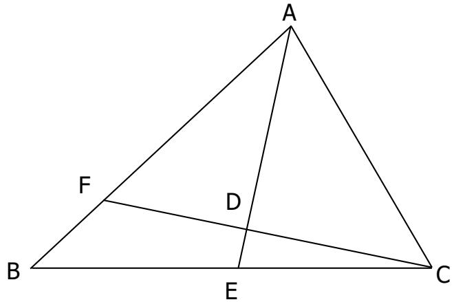
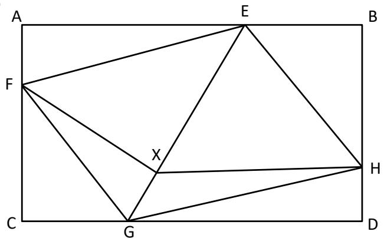
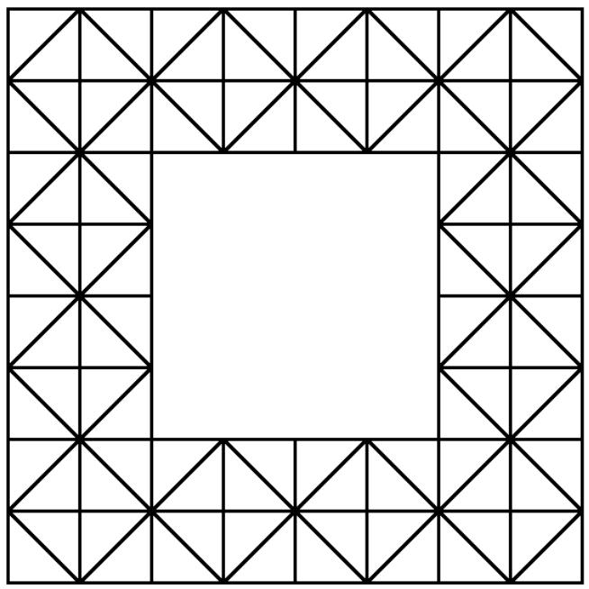

## Section A (Correct answer – 2 points| No answer – 0 points| Incorrect answer – minus 1 point)

## Question 1

Find the value of 

$$
\frac {1}{\sqrt {1 ^ {3}}} + \frac {1}{\sqrt {1 ^ {3} + 2 ^ {3}}} + \frac {1}{\sqrt {1 ^ {3} + 2 ^ {3} + 3 ^ {3}}} + \frac {1}{\sqrt {1 ^ {3} + 2 ^ {3} + 3 ^ {3} + 4 ^ {3}}}
$$

A. $\frac { 1 } { 1 5 }$ 

B. $\frac { 2 } { 1 5 }$ 

C. $\frac { 8 } { 5 }$ 

D. $\frac { \hat { 1 } 7 } { 3 }$ 

E. None of the Above 

## Question 2

A triangle is drawn on a rectangular piece of paper. What is the greatest number of regions that can be formed? 

A. 2 

B. 3 

C. 4 

D. 5 

E. None of the above 

## Question 3

What is the value of $\left( { \sqrt { 5 + 2 { \sqrt { 6 } } } } + { \sqrt { 5 - 2 { \sqrt { 6 } } } } \right) ^ { 2 } ?$ 

A. 2 

B. 3 

C. 8 

D. 9 

E. None of the above 

## Question 4

Fermat proved that an odd prime number can be written as a sum of two perfect squares if the odd number gives a remainder of 1, 5 or 9 when divided by 12. Given that all the following choices are prime numbers, which of them can be written as a sum of two perfect squares? 

A. 54324223 

B. 66843247 

C. 73831151 

D. 92138363 

E. None of the above 

## Question 5

Four empty bottles of fruit juice can be exchanged for 1 new bottle of milk. Five empty bottles of soda can be exchanged for 1 new bottle of fruit juice. If Sheryl initially buys 5 dozen of soda bottles, what is the greatest number of bottles of any beverage that she can drink? 

A. 6 

B. 36 

C. 56 

D. 75 

E. None of the above 

## Question 6

What is the largest amount of money that cannot be obtained using only $3 and $8 denominations? 

A. $13 

B. $23 

C. $67 

D. $97 

E. $100 

## Question 7

One hundred and fifty students are selected to participate in a survey. The report states that 120 students have played League of Legends, 75 students have played Piano Tiles and 50 students have played Battleground. What is the largest possible number of students who have played both Piano Tiles and Battleground but have never tried League of Legends? 

A. 15 

B. 20 

C. 25 

D. 30 

E. None of the above 

## Question 8

The letters “S”, “T”, “A”, “L” and “L” are rearranged to form all five-letter words. The list of words is then arranged in dictionary order. For example, the first word is ALLST and the last word is TSLLA. What is the order of ‘STALL’ in the list? 

A. 45 

B. 46 

C. 92 

D. 600 

E. None of the above 

## Question 9

Some married couples participate in the Indoor Dancing Competition. Before the competition starts, every person shakes hands with each other except for his/her spouse. The organiser and his wife then enter the competition venue. They select some couples, and for each selected couple, the organiser shakes hand with the lady while his wife shakes hand with the gentleman. Given that there have been 2018 handshakes so far, how many couples are selected to shake hands with the organiser and his wife? 

A. 15 

B. 16 

C. 17 

D. 18 

E. None of the above 

## Question 10

A number is written on the board. It starts with one digit “1”, three digits “2”, five digits “3”, …, 17 digits “9”, 19 digits “0”, 21 digits “1”, 23 digits “2” and so on. In other words, the number is as follows: 

$$
1 2 2 2 3 3 3 3 3 \ldots \underbrace {9 9 9 \ldots 9 9 9} _ {1 7 d i g i t s} \underbrace {0 0 0 \ldots 0 0 0} _ {1 9 d i g i t s} \underbrace {1 1 1 \ldots 1 1 1} _ {2 1 d i g i t s} \underbrace {2 2 2 \ldots 2 2 2} _ {2 3 d i g i t s} \ldots
$$

What is the 2019th digit of the number? 

A. 2 

B. 3 

C. 4 

D. 5 

E. 6 

## Question 11

In the Star Event, the Lucky Award is awarded to a couple of opposite gender with the same zodiac signs. It also awards a group of at least 5 people with the same gender and zodiac signs. For instance, 2 couples where each pair has the opposite gender and same zodiac signs will get 1 Prize each. Given that there are 12 zodiac signs, at least how many people should the event organiser invite to ensure at least one Lucky Award will be given out? 

A. 4 

B. 13 

C. 49 

D. 50 

E. None of the above 

## Question 12

In the diagram below, the lines CF and AE meet at point D and the line AD bisects ∠BAC. If ∠ADC = 90°, which of the following options below is true? 

A. ∠ABC > ∠ACD 

B. ∠ACD > ∠ABC 

C. ∠BCF > ∠AFC 

D. ∠ACF > ∠AFC 

E. None of the above 

## Question 13

Six performances are to be included in the Singapore International Discrete Mathematics Challenge Prize Ceremony. All the performances have different durations. The third performance must be longer than the first, while the fourth performance must be longer than the second and so on. How many ways can the organiser arrange the performances? 

A. 6 

B. 18 

C. 20 

D. 120 

E. None of the above 

## Question 14

In the diagram below, ABDC is a rectangle with dimensions 6 cm by 4 cm and EFGH is a parallelogram. It is given that CG = EB = 2 cm, CF = BH = 3 cm and $\mathsf { C F } \mathsf { X G } = 5 \mathsf { c m } ^ { 2 }$ . Find the area of the quadrilateral BEXH. 

A. 5 

B. 8 

C. 11 

D. 14 

E. None of the above 

## Question 15

Information about four students: Elizabeth, Miyuki, Stephanie and Tracy are as stated below. 

1. Each of the student has a different nationality and come from Thailand, India, Singapore and Uzbekistan. 

2. Their ages are 21, 24, 26 and 30; each of them do not share the same age. 

3. Each of them plays a different musical instrument which could be a cello, drums, saxophone and horn. 

4. Stephanie is not 21 years old. 

Elizabeth is from Thailand. 

6. The student playing the saxophone is not 30 years old. 

7. Stephanie does not play the horn. 

The student playing the cello is not Singaporean. 

9. Miyuki is younger than Elizabeth. 

10. Stephanie is older than the student playing the saxophone. 

11. The student playing the cello is not 26 years old. 

12. The 30-year-old student is not Indian. 

13. Tracy is older than Stephanie. 

14. Elizabeth does not play the cello or drums. 

15. The student playing the saxophone is not Singaporean. 

16. Stephanie does not play the drums. 

Who plays the drums? 

A. Elizabeth 

B. Miyuki 

C. Stephanie 

D. Tracy 

E. Not enough information 

## Section B (Correct answer – 4 points| Incorrect or No answer – 0 points)

When the answer is a 1-digit number, shade “0” for the tens, hundreds and thousands place. 

Example: if the answer is 7, then shade 0007 

When the answer is a 2-digit number, shade “0” for the hundreds and thousands place. 

Example: if the answer is 23, then shade 0023 

When the answer is a 3-digit number, shade “0” for the thousands place. 

Example: if the answer is 785, then shade 0785 

When the answer is a 4-digit number, shade as it is. 

Example: if the answer is 4196, then shade 4196 

## Question 16

The operator  acts on two numbers to give the following outcomes: 

<table><tr><td>14 ● 89 = 0</td><td>59 ● 04 = 1</td><td>38 ● 00 = 0</td></tr><tr><td>82 ● 54 = 0</td><td>36 ● 00 = 1</td><td>43 ● 00 = 0</td></tr><tr><td>48 ● 78 = 0</td><td>42 ● 96 = 1</td><td>21 ● 72 = 1</td></tr><tr><td>91 ● 29 = 0</td><td>76 ● 00 = 1</td><td>64 ● 56 = 1</td></tr></table>

The operator only returns “0” or “1”. What is the value of $2 0 \bullet 0 0 ?$ 

## Question 17

Find the positive integer value of ???? such that $\sqrt { x ^ { 2 } - 3 6 } + \sqrt { x ^ { 2 } + 2 3 x - 1 7 4 }$ is minimum. 

## Question 18

Given that $x ^ { 2 } - 3 x + 1 = 0$ , what is the value of $\textstyle x ^ { 3 } + { \frac { 1 } { x ^ { 3 } } } ?$ 

## Question 19

There are 2019 consecutive positive integers such that $a _ { 1 } < a _ { 2 } < \cdots < a _ { 2 0 1 9 }$ . Given that $a _ { 2 0 2 n - 2 } + a _ { 2 0 2 n - 1 } + a _ { 2 0 2 n } + a _ { 2 0 2 n + 1 } + a _ { 2 0 2 n + 2 }$ is a perfect cube and $a _ { 2 0 2 n - 1 } +$ $a _ { 2 0 2 n } + a _ { 2 0 2 n + 1 }$ is a perfect square for some positive integer ???? where $1 \leq n < 1 0$ . What is the smallest possible value of $a _ { n } ?$ 

## Question 20

Only one button of a calculator is working. If x is the number displayed, it returns the value x x (2 + ) . Initially, the number 1 is displayed. The number that is shown on the calculator when it is pressed 25 times is of the form $a ^ { b ^ { c } } + d$ . 

Find the value of $a + b + c + d ,$ . 

## Question 21

How many triangles are there in the figure below? 

## Question 22

If ????(????) is a non-zero polynomial with all integer coefficients and has the root: 

$$
x = 2 0 1 9 + \sqrt {2} + \sqrt {3}
$$

What is the minimum degree of $P ( x ) ?$ 

## Question 23

You are given an empty 3 litres and 7 litres jug. You can perform any of the following steps: 

• Fill a jug completely with water. 

• Completely empty a jug. 

• Pour water from one jug to another until either of the jugs is empty or full. 

What is the minimum number of steps required to obtain exactly 1 litre of water in one of the jugs? 

## Question 24

How many positive integers ???? satisfy all the criteria below? 

• $n ^ { 2 } - 3 n + 2$ is divisible by 24 

• $n ^ { 2 } + 5 n + 6$ is divisible by 7 

• $n \leq 2 0 0$ 

## Question 25

Republic of SIMOC territory consists of 2019 islands. The government wants to build some bridges between the islands. A bridge is a two-way connection between two and exactly two islands. Due to lack of financial assistance, the government decides to build as few bridges as possible while still ensuring the connectivity between any two islands. Assume the bridge construction is optimal, what is the minimum number of bridges that must be crossed between any 2 islands? 