## TAI LIEU LUU HANH NOI BO

## Su dung cho Vong loai quoc gia & Vong chung ket quoc gia

## OLYMPIC TOAN HOC QUOC TE

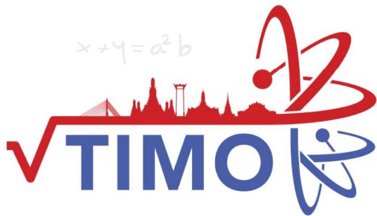

## Thailand International Mathematical Olympiad

KHOI1 

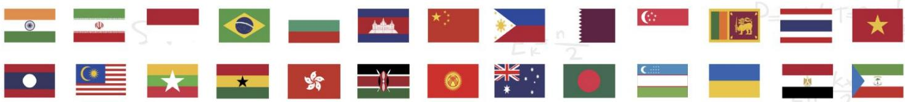

## MỤC LỤC

Giới thiệu Kỳ thi Olympic Toán học quốc tế TIMO . 

Danh sách các trường tham gia tích cực và đạt thành tích cao tại các kỳ TIMO .. 

Một số hình ảnh tiêu biểu của Kỳ thi Olympic Toán học quốc tế TIMO tại Việt Nam .......9 

Syllabus/ Khung chƣơng trình... .12 

Đề thi Đáp án 

## PRELIMINARY ROUND / VÒNG LOẠI QUỐC GIA

Đề số 1... .. 13 ..........53 

Đề số 2... .. 17 ..........54 

Đề số 3.... ... 22 ..........55 

Đề số 4.... .. 26 ..........56 

Đề số 5.... .. 30 ..........57 

## HEAT ROUND / VÒNG CHUNG KẾT QUỐC GIA

Đề số 1... ... 35 ..........58 

Đề số 2.... .. 39 ..........59 

Đề số 3.... .. 43 ..........60 

Đề số 5... . 50 ..........62 

Heat Round Answer Sheet/ Phiếu Trả Lời Vòng Chung Kết Quốc Gia.. ..63 

Một số kỳ thi Olympic quốc tế tiêu biểu khác . ..64 

Thông tin liên hệ ... ...68 

# GIỚI THIỆU KỲ THI OLYMPIC TOÁN HỌC QUỐC TẾ TIMO

Kỳ thi Olympic Toán học quốc tế TIMO (Thailand International Mathematical Olympiad) được tổ chức hàng năm bởi Trung tâm Giáo dục Vô địch Olympiad Hong Kong (Olympiad Champion Education Centre from Hong Kong) hợp tác cùng Tổ chức Du lịch Thái Lan (Tourism Authority of Thailand) nhằm tạo cơ hội cho tất cả học sinh các khối lớp từ mẫu giáo đến trung học phổ thông có sở thích về Toán học tham gia, mục đích kích thích và nuôi dưỡng niềm yêu thích toán học của giới trẻ, tăng cường khả năng tư duy sáng tạo của học sinh, mở rộng mối quan hệ giao lưu văn hóa quốc tế. Với các thí sinh tham dự kỳ thi TIMO và đạt huy chương Vàng tại vòng Chung kết quốc tế sẽ được tham dự vòng Chung kết kỳ thi Olympic Toán học Thế giới WIMO vào tháng 1 hàng năm. 

Trong mỗi lần tổ chức, Kỳ thi Olympic Toán học quốc tế TIMO đã thu hút hàng trăm nghìn thí sinh tham dự đến từ nhiều quốc gia và vùng lãnh thổ khác nhau trên thế giới như: Australia, Brazil, Bulgaria, Cambodia, England, France, Georgia, Ghana, Hong Kong, Indonesia, India, Iran, Kazakhstan, Kyrgyzstan, Malaysia, Myanmar, Philippines, Singapore, Sri Lanka, Switzerland, Taiwan, Turkey, Thailand, Vietnam, ... 

Năm học 2021-2022 là lần thứ ba Kỳ thi được tổ chức tại Việt Nam. Trong lần thứ hai tham dự, tại Vòng Chung kết quốc gia, các thí sinh Việt Nam đã rất xuất sắc với 74% đạt giải trong đó 1 Cúp Vô địch, 2 Cúp Á quân 1, 3 Cúp Á quân 2; 7% Huy chương Vàng, 19% Huy chương Bạc, 38% Huy chương Đồng và 10% giải Khuyến khích. Đặc biệt, trong vòng Chung kết quốc tế, đội tuyển Việt Nam đã xuất sắc đạt thành tích cao bao gồm 36 giải Vàng, 87 giải Bạc, 163 giải Đồng, trong đó có 1 Cúp Ngôi sao thế giới dành cho thí sinh cao điểm nhất Việt Nam, 1 Cúp Vô địch dành cho thí sinh cao điểm nhất toàn cầu và 1 Cúp Á quân 2 dành cho thí sinh cao điểm thứ 3 toàn cầu tại mỗi khối lớp. 

Với mong muốn góp phần tạo dựng thêm sân chơi giao lưu quốc tế dành cho học sinh Việt Nam, đồng thời góp phần nâng cao trình độ và cơ hội hợp tác cho giáo viên và cán bộ giáo dục, tiếp cận các nền giáo dục tiên tiến trên thế giới, Ban Tổ chức kỳ thi mong muốn nhận được sự ủng hộ, hỗ trợ và tham gia của các Sở, Phòng Giáo dục và Đào tạo, nhà trường, phụ huynh và các em học sinh để các kỳ thi quốc tế tại Việt Nam đạt được hiệu quả cao nhất. 

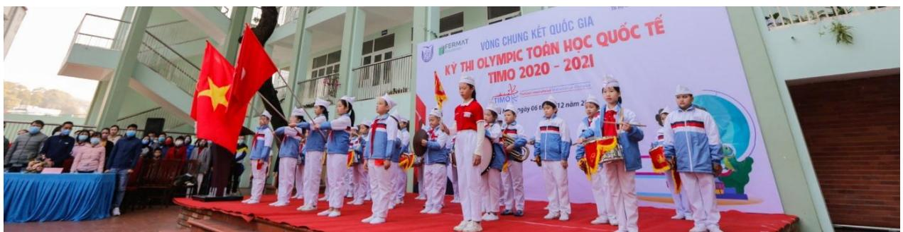

Hội đồng thi trường TH Hạ Long, Quảng Ninh tại Vòng Chung kết quốc gia TIMO 2020 - 2021

## Thông tin chi tiết về Kỳ thi Olympic Toán học quốc tế TIMO

## 1. Quy định về độ tuổi, cấu trúc đề thi

## a. Về độ tuổi

Tất cả các học sinh yêu thích môn Toán từ Lớp mẫu giáo tới Lớp 12 trung học phổ thông. 

## b. Về cấu trúc đề thi

<table><tr><td colspan="2">Vòng thi</td><td>Vòng loại quốc gia</td><td>Vòng Chung kết quốc gia</td><td>Vòng Chung kết quốc tế</td></tr><tr><td colspan="2">Số câu hỏi</td><td>25</td><td>25</td><td>30</td></tr><tr><td colspan="2">Điểm mỗi câu hỏi</td><td>4</td><td>4</td><td>5</td></tr><tr><td colspan="2">Tổng điểm</td><td>100</td><td>100</td><td>150</td></tr><tr><td rowspan="5">Chủ đề</td><td>Tự duy lôgic</td><td>5</td><td>5</td><td>6</td></tr><tr><td>Số học/Đại số</td><td>5</td><td>5</td><td>6</td></tr><tr><td>Lý thuyết số</td><td>5</td><td>5</td><td>6</td></tr><tr><td>Hình học</td><td>5</td><td>5</td><td>6</td></tr><tr><td>Tổ hợp</td><td>5</td><td>5</td><td>6</td></tr><tr><td colspan="2">Thời gian</td><td>60 phút</td><td>90 phút</td><td>120 phút</td></tr><tr><td colspan="2">Dạng đề thi</td><td>Trắc nghiệm</td><td>Điền đáp án</td><td>Điền đáp án</td></tr><tr><td colspan="2">Ngôn ngữ</td><td>Song ngữ Anh – Việt</td><td>Tiếng Anh (có trích dẫn thuật ngữ tiếng Việt)</td><td>Tiếng Anh</td></tr></table>

## 2. Cơ cấu giải thưởng

## a. Giải thƣởng của Ban Tổ chức quốc tế

<table><tr><td rowspan="2">Huy chương</td><td colspan="2">Điều kiện xét giải</td><td rowspan="2">Giải thường</td></tr><tr><td>Vòng Chung kết quốc gia</td><td>Vòng Chung kết quốc tế</td></tr><tr><td>Ngôi sao thế giới (World Star)</td><td></td><td>Thí sinh cao điểm nhất mỗi khu vực.</td><td>- Cúp Ngôi sao thế giới;- Miễn lệ phí tham dự Vòng Chung kết quốc tế.</td></tr><tr><td>Giải Xuất sắc (Champion 1stRunner-up 2ndRunner-up)</td><td>03 thí sinh cao điểm nhất mỗi khối thi.</td><td>03 thí sinh điểm cao nhất mỗi khởi thi.</td><td>- Cúp Vô dịch;- Cúp Á quân 1;- Cúp Á quân 2.</td></tr><tr><td>Giải Vàng (Gold Award)</td><td>Thí sinh chiến thắng đạt từ 80 điểm trở lên.</td><td>Thí sinh chiến thắng đạt từ 120 điểm trở lên.</td><td>Huy chương và Giấy chứng nhận.</td></tr><tr><td>Giải Bạc (Silver Award)</td><td>Thí sinh chiến thắng đạt từ 60 điểm trở lên.</td><td>Thí sinh chiến thắng đạt từ 90 điểm trở lên.</td><td>Huy chương và Giấy chứng nhận.</td></tr><tr><td>Giải Đồng (Bronze Award)</td><td>Thí sinh chiến thắng đạt từ 40 điểm trở lên.</td><td>Thí sinh chiến thắng đạt từ 60 điểm trở lên.</td><td>Huy chương và Giấy chứng nhận.</td></tr><tr><td>Giải Khuyến khích (Merit)</td><td>Thí sinh chiến thắng đạt từ 20 điểm trở lên.</td><td>Thí sinh chiến thắng đạt từ 30 điểm trở lên.</td><td>Giấy chứng nhận.</td></tr></table>

Đặc biệt, các thí sinh đạt Huy chương Vàng Vòng Chung kết quốc tế TIMO được tham dự (miễn lệ phí thi) Vòng Chung kết Kỳ thi Olympic Toán thế giới WIMO vào tháng 1 năm tới. 

## Lưu ý:

- Vòng loại quốc gia không xếp giải. Khoảng 70% thí sinh có điểm cao nhất của Vòng loại quốc gia được đăng ký tham gia Vòng Chung kết quốc gia. 

- Ban Tổ chức sắp xếp kết quả giảm dần dựa trên điểm thi và ngày sinh. Do đó, các thí sinh bằng điểm có thể nhận hai giải khác nhau. Nếu một giải thưởng đã đủ chỉ tiêu, thí sinh tiếp theo sẽ nhận giải thưởng mức liền kề phía dưới. 

- Các mốc điểm đạt giải có thể thay đổi dựa trên kết quả thi thực tế của tất cả thí sinh. 

## b. Giải thƣởng của Ban Tổ chức Việt Nam

* Đối với thí sinh: 

- Thí sinh cao điểm nhất Vòng Chung kết quốc gia được giải thưởng tiền mặt 5.000.000 đồng (năm triệu đồng). 

- Với mỗi khối có từ 100 thí sinh tham dự Vòng loại quốc gia, thí sinh cao điểm nhất khối thi Vòng Chung kết quốc gia được giải thưởng tiền mặt 2.000.000 đồng (hai triệu đồng); 

Với các giải thưởng tiền mặt phía trên, nếu có nhiều hơn một thí sinh đạt giải, số tiền thưởng được chia đều cho các thí sinh đạt giải. 

- Thí sinh đạt huy chương Vàng vòng Chung kết quốc gia và đạt giải Vòng Chung kết quốc tế TIMO được đặc cách miễn Vòng loại quốc gia các kỳ thi HKIMO, BBB cùng năm học và các tặng thưởng lệ phí khi tham gia các kỳ thi có trong Thông báo của mỗi kỳ thi. 

* Đối với Trường có học sinh tham dự: 

- Trường có từ 300 học sinh tham gia Kỳ thi sẽ được tặng Giấy khen, Kỷ niệm chương và quảng bá logo của trường trên tất cả các ấn phẩm truyền thông các Kỳ thi của Ban Tổ chức. 

- Trường có từ 150 học sinh tham gia Kỳ thi sẽ được tặng Giấy khen, Kỷ niệm chương và quảng bá logo của trường trên tất cả các ấn phẩm truyền thông về Kỳ thi. 

- Trường có từ 50 học sinh tham gia Kỳ thi sẽ được tặng Giấy khen tham dự tích cực trong Kỳ thi quốc tế. 

## Danh sách các trường tham gia tích cực và đạt thành tích cao tại các kỳ TIMO

1. TH Điện Biên 1, Thanh Hóa 

2. TH Nguyễn Văn Trỗi, Thanh Hóa 

3. TH Lê Mao, Nghệ An 

4. TH Xuân La, Hà Nội 

5. TH Cầu Giát, Nghệ An 

6. TH Cầu Diễn, Hà Nội 

7. IQ School , Hà Nội 

8. TH Chu Văn An, Hà Nội 

9. TH Nghĩa Tân, Hà Nội 

10. TH Lê Ngọc Hân, Hà Nội 

11. TH Xuân Đỉnh, Hà Nội 

12. TH,THCS,THPT Đông Bắc Ga, Thanh Hóa 

13. THCS Lê Lợi, Hà Nội 

14. TH I-sắc Niu-tơn, Hà Nội 

15. TH Đông Thái, Hà Nội 

16. TH Nam Thành Công, Hà Nội 

17. TH Đội Cung, Nghệ An 

18. TH Thị trấn Phùng, Hà Nội 

19. TH Đông Ngạc B, Hà Nội 

20. THCS Chu Văn An, Hà Nội 

21. TH Cao Bá Quát, Hà Nội 

22. TH, THCS & THPT Vinschool, Hồ Chí Minh 

23. TH Hưng Dũng 1, Nghệ An 

24. TH Tây Sơn, Hà Nội 

25. TH,THCS&THPT Nobel school, Thanh Hóa 

26. TH Đồng Mỹ, Quảng Bình 

27. TH NEWTON GOLDMARK, Hà Nội 

28. THCS Thị Trấn Nghĩa Đàn, Nghệ An 

29. TH Ba Trại A, Hà Nội 

30. TH Quảng An, Hà Nội 

31. TH Nhật Tân, Hà Nội 

32. TH Gia Thượng, Hà Nội 

33. TH Thượng Sơn, Nghệ An 

34. TH Lam Sơn 3, Thanh Hóa 

35. TH Thanh Trì, Hà Nội 

36. TH Dương Xá, Hà Nội 

37. THCS Xuân Diệu, Hà Tĩnh 

38. TH Tây Tựu B, Hà Nội 

39. TH Chu Văn An, Nam Định 

40. TH Giáp Bát, Hà Nội 

41. TH Hà Huy Tập 2, Nghệ An 

42. TH Minh Khai A, Hà Nội 

43. TH Lê Lợi, Nghệ An 

44. IQ School, Ninh Bình 

45. TH Ba Trại B, Hà Nội 

46. TH Phương Canh, Hà Nội 

47. TH Mỹ Đình 2, Hà Nội 

48. THCS Đông Thái, Hà Nội 

49. TH Phú Phương, Hà Nội 

50. TH Vạn Thắng, Hà Nội 

51. TH Hải Cường, Nam Định 

52. THCS Thái Thịnh, Hà Nội 

53. Hanoi Academy, Hà Nội 

54. TH Phúc Diễn, Hà Nội 

55. THCS Bạch Liêu, Nghệ An 

56. THCS Phú Diễn, Hà Nội 

57. TH Lưu Sơn, Nghệ An 

58. THCS Cao Bá Quát, Hà Nội 

59. TH Bến Thủy, Nghệ An 

60. THCS & THPT Lê Quý Đôn, Hà Nội 

61. THCS Minh Khai, Hà Nội 

62. THCS Trần Phú, Thanh Hóa 

63. THCS Văn Đức, Hà Nội 

64. TH Lê Ngọc Hân, Hà Nội 

65. TH Ngô Đức Kế, Hà Tĩnh 

66. THCS Xuân Đỉnh, Hà Nội 

67. THCS Trung Lương, Hà Tĩnh 

68. TH Hưng Dũng 2, Nghệ An 

69. TH An Dương, Hà Nội 

70. TH Đô Thị Việt Hưng, Hà Nội 

71. TH Thịnh Sơn, Nghệ An 

72. TH Quang Trung, Hà Nội 

73. THCS - THPT Newton, Hà Nội 

74. THCS Ngô Gia Tự, Hà Nội 

75. THCS Xuân La, Hà Nội 

76. THCS Hà Huy Tập, Hà Nội 

77. TH Tòng Bạt, Hà Nội 

78. TH&THCS NEWTON 5, Hà Nội 

79. TH Cổ Nhuế 2B, Hà Nội 

80. TH Hòa Hiếu I, Nghệ An 

81. THCS Đông Ngạc, Hà Nội 

82. TH Đồng Nhân, Hà Nội 

83. THCS Nguyễn Trường Tộ, Hà Nội 

84. THCS Ninh Hiệp, Hà Nội 

85. TH Vật Lại, Hà Nội 

86. TH Tây Đằng A, Hà Nội 

87. THCS Thượng Cát, Hà Nội 

88. TH Đại Từ, Hà Nội 

89. TH Quang Tiến, Nghệ An 

90. TH Đức Thắng, Hà Nội 

91. TH Thuận Sơn, Nghệ An 

92. TH và THCS Fansipan, Thanh Hóa 

93. THCS Vĩnh Quỳnh, Hà Nội 

94. TH Phú Châu, Hà Nội 

95. TH Quỳnh Hồng, Nghệ An 

96. THCS Tứ Hiệp, Hà Nội 

97. THCS Phan Đăng Lưu, Nghệ An 

98. TH Ngô Đức Kế, Hà Tĩnh 

99. THCS Hồ Xuân Hương, Nghệ An 

100. Trường Quốc tế song ngữ UK Academy, Quảng Ngãi 

101. TH Nguyễn Thị Minh Khai, Hải Phòng 

102. TH Gia Khánh A, Vĩnh Phúc 

## Một số hình ảnh tiêu biểu của Kỳ thi Olympic Toán học quốc tế TIMO tại Việt Nam

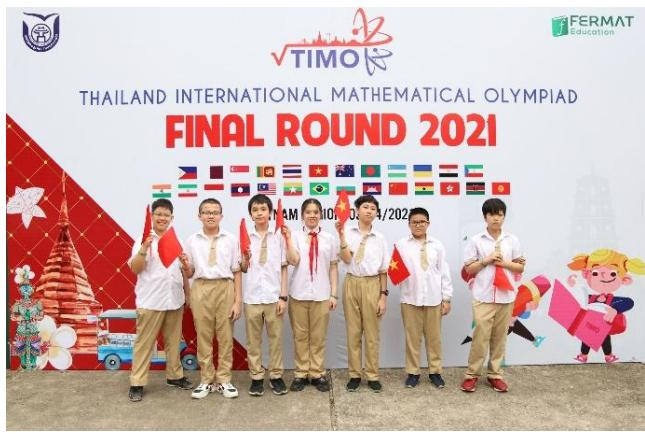

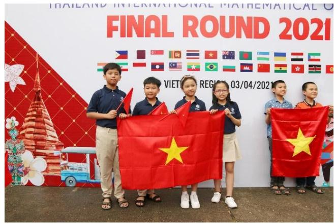

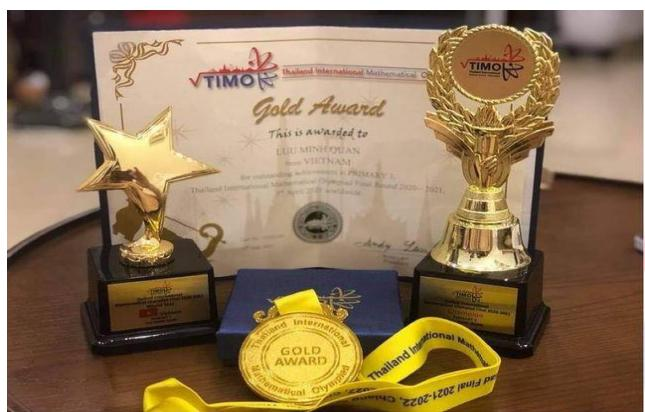

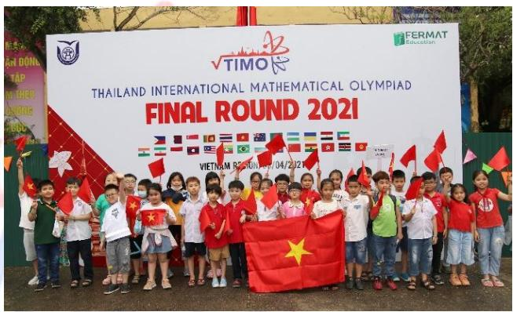

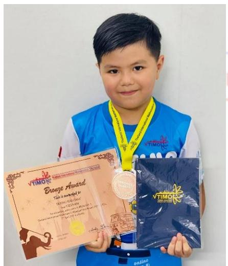

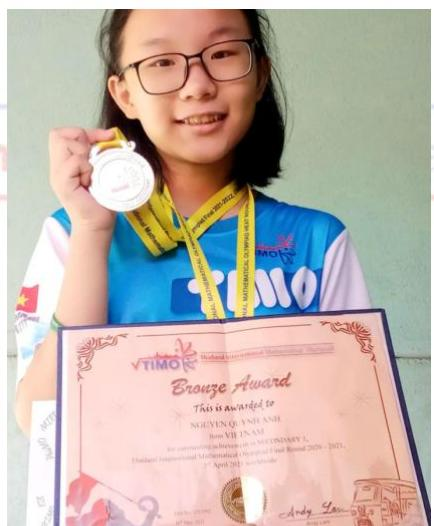

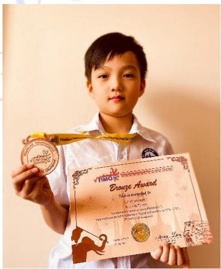

Vòng Chung kết quốc tế TIMO 2020 - 2021 

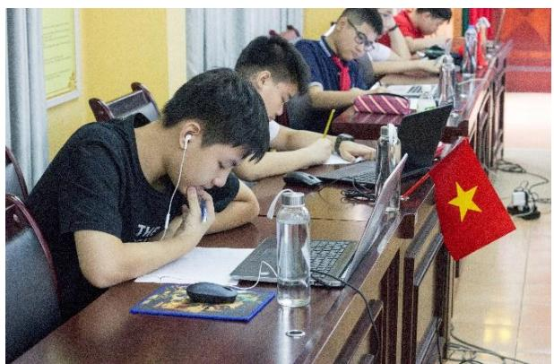

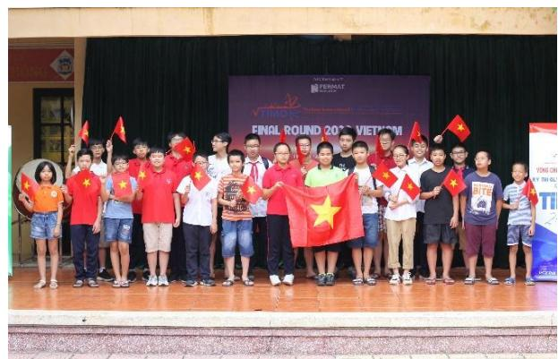

Hội đồng thi trường THCS Thái Thịnh, Đống Đa, Hà Nội năm học 2019 - 2020

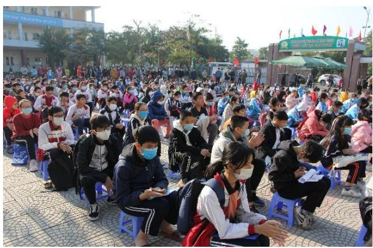

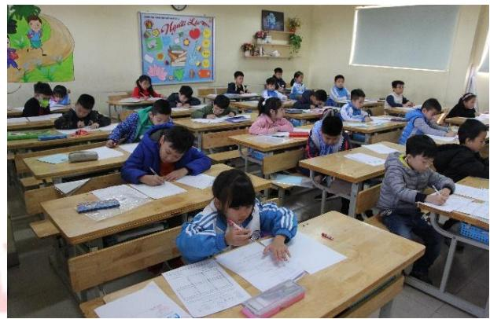

Hội đồng thi trường TH Cao Bá Quát, Gia Lâm, Hà Nội năm học 2020 - 2021

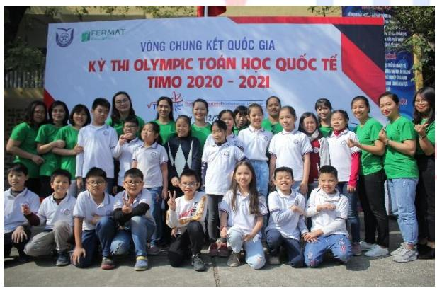

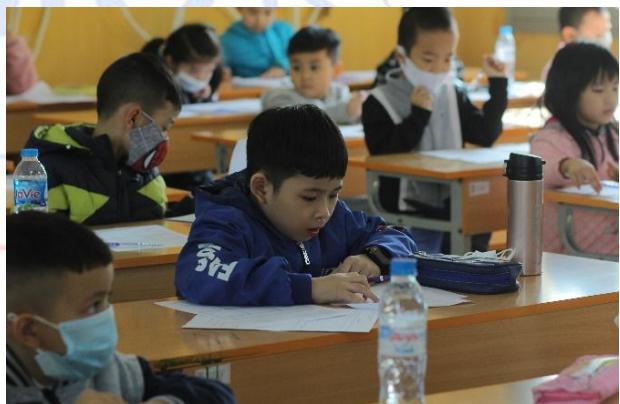

Hội đồng thi Trường Đại học Thủ Đô Hà Nội năm học 2020 - 2021

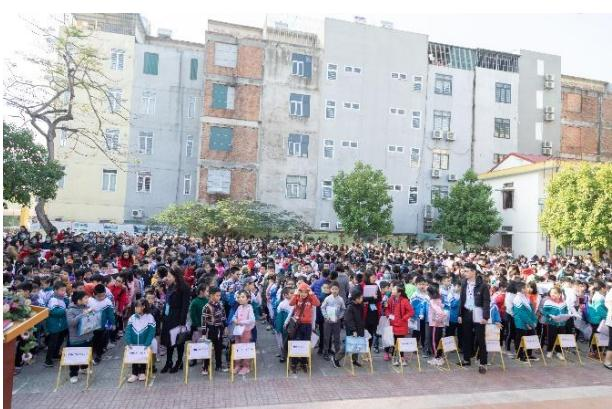

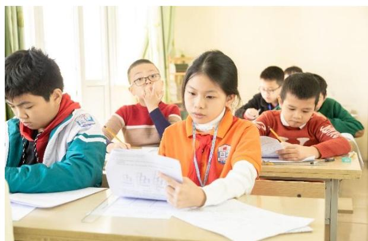

Hội đồng thi tỉnh Thanh Hóa năm học 2020 - 2021

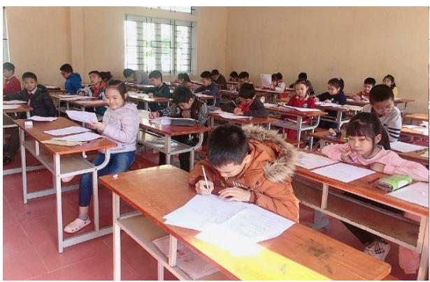

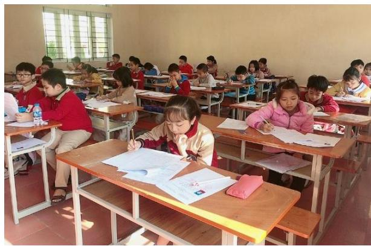

Hội đồng thi tỉnh Nam Định năm học 2020 - 2021

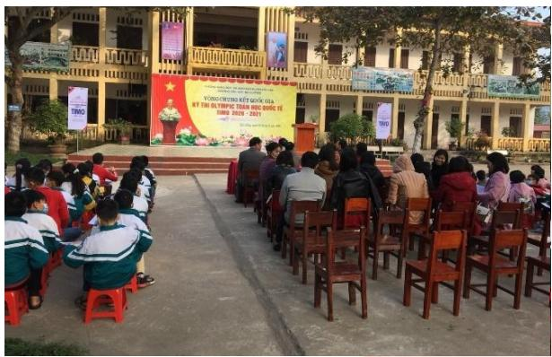

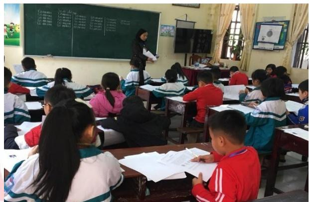

Hội đồng thi trường TH Hải Cường, Nam Định năm học 2020 - 2021

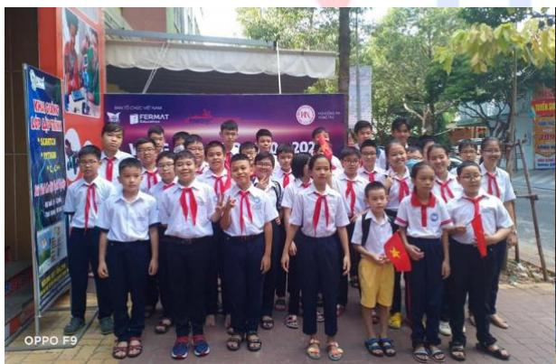

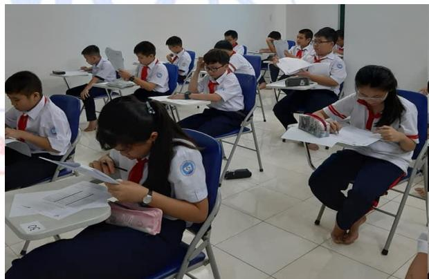

Hội đồng thi tỉnh Bà Rịa - Vũng Tàu năm học 2020 - 2021

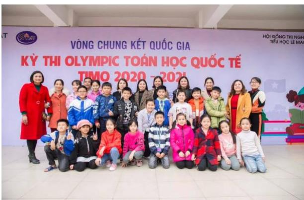

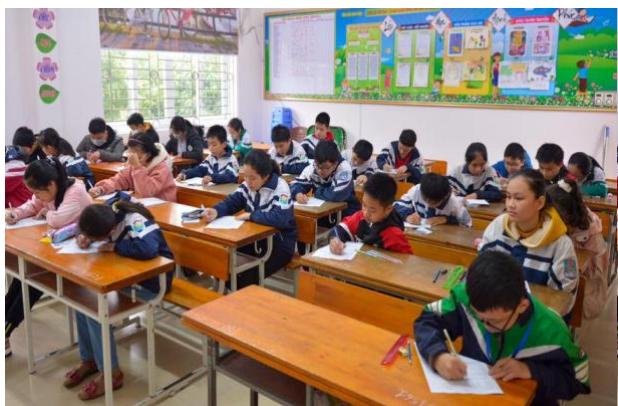

Hội đồng thi trường TH Lê Mao, Nghệ An năm học 2020 - 2021

## SYLLABUS / KHUNG CHƢƠNG TRÌNH

<table><tr><td>TopicsChủ đề</td><td>Primary 1 / Khối 1</td></tr><tr><td>Logical thinkingTư duy logic</td><td>Balance Problem / Bài toán cái cânBasic Number &amp; Figure Pattern Pattern / Dãy số và dãy hình cơ bản có quy luậtIQ Age Problem &amp; Date Problem / Tuổi và ngày thángBasic logical problems / Bài toán tư duy cơ bản</td></tr><tr><td>ArithmeticSố học</td><td>Addition or Subtraction on 1-digit numbers / Cộng trừ số có một chữ sốAddition or Subtraction on 2-digit numbers / Cộng trừ số có 2 chữ sốBalance on an equation / Cần bằng phép tính</td></tr><tr><td>Number theoryLý thuyết số</td><td>Introduction on Odd &amp; Even / Giới thiệu số chắn số lẻMathematical Leveling / Dạng toán chia đềuMatch Equation / Ghép thành phép tính đúngBasic Arithmetic Pattern / Quy luật dãy số cách đều</td></tr><tr><td>GeometryHình học</td><td>Counting on number of 2-D &amp; 3-D Figures / Đếm hình 2D hoặc 3DCounting on number of sides &amp; interior angles / Đếm số cạnh và số góc trongDistinction on 2-D Figures / Phân biệt các hình 2DBasic Figure Pattern / Dãy hình cơ bản</td></tr><tr><td>CombinatoricsDạng toán đếm</td><td>Arranging numbers in orders / Sắp xếp số theo thứ tựSimple Distribution / Chia đồ vật vào các nhómCounting on specific numbers / Đếm số đặc biệtFormation of a 3-digit number / Lập số có 3 chữ số</td></tr></table>

*Khung chương trình mang tính chất tham khảo. 

# PRELIMINARY ROUND / VÒNG LOẠI QUỐC GIA

# ĐỀ SỐ 1: Đề thi Vòng loại quốc gia năm học 2020 - 2021

# Logical thinking / Tƣ duy lô-gic

1. Given two balances below, find the heaviest type of fruit. Cho hai chiếc cân thăng bằng dưới đây, tìm loại quả nặng nhất. 

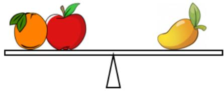

A. Apple Táo 

C. Mango Xoài 

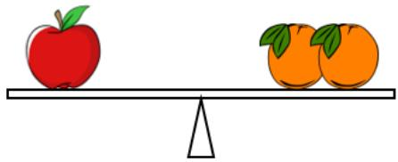

B. Orange (Cam) 

D. None of them Không có 

2. In the family, Mina has 3 sisters in total. How many children does Mina’s mother have? Mina có tất cả 3 người chị em gái. Hỏi mẹ của Mina có bao nhiêu người con? 

A. 2 

B. 3 

C. 4 

D. 5 

3. Mary looks at the calendar. Her birthday is 2 days after today and it is on Friday. Which day of the week is today? 

Mary nhìn vào quyển lịch. Còn 2 ngày nữa là đến sinh nhật của cô ấy và nó đúng vào ngày thứ Sáu. Hỏi hôm nay là thứ mấy? 

A. Wednesday Thứ Tư 

B. Thursday Thứ Năm 

C. Friday Thứ Sáu 

D. Tuesday Thứ Ba) 

4. By observing the pattern, what is the number in the space (‚…‛) provided? 

Quan sát quy luật, tìm số thích hợp để điền vào dấu ‚…‛ phía dưới. 

0, 5, 10, 15, … 

A. 20 

B. 16 

C. 19 

D. 17 

5. Ken is 15 years old and Ken’s sister is 5 years younger than him. How old is Ken’s sister now? 

Ken 15 tuổi và em gái của Ken ít hơn anh ấy 5 tuổi. Hỏi hiện nay em gái của Ken mấy tuổi? 

A. 20 

B. 10 

C. 5 

D. 15 

## Arithmetic / Số học

6. Find the value of 1 + 9 + 6 + 4 + 2. 

Tìm giá trị của 1 + 9 + 6 + 4 + 2. 

A. 12 

B. 20 

C. 21 

D. 22 

7. Find the value of 16 – 7 – 6. 

Tìm giá trị của 16 – 7 – 6. 

A. 15 

B. 3 

C. 4 

D. 2 

8. What is the value of A such that the equation below is correct? 

Giá trị của A là bao nhiêu để ta được phép tính dưới đây đúng? 

$$
1 9 - A = 8
$$

A. 12 

B. 9 

C. 10 

D. 11 

9. Calculate: 5 + 4 + 5 + 4 + 5. 

Tính: 5 + 4 + 5 + 4 + 5. 

A. 22 

B. 20 

C. 23 

D. 32 

10. Find the value of 11 + 22 + 33. 

Tìm giá trị của 11 + 22 + 33. 

A. 44 

B. 55 

C. 66 

D. 77 

## Number theory / Lý thuyết số

11. According to the pattern below, which number should be filled in the blank? 

Dựa vào quy luật dãy số dưới đây để tìm số thích hợp điền vào chỗ trống. 

20, 1, 19, 2, 18, 3, __ 

A. 17 

B. 4 

C. 14 

D. 7 

12. Find the smallest number with two identical digits. 

Tìm số nhỏ nhất có hai chữ số giống nhau. 

A. 10 

B. 11 

C. 99 

D. 98 

13. Fill the lines with ‚+‛ and ‚  ‛ to make the equation below correct. (The symbols are written in order from left to right). 

Điền dấu ‚+‛ và ‚  ‛ vào chỗ trống để được phép toán đúng. Các dấu được viết theo thứ tự từ trái sang phải). 

$$
7 \_ 4 \_ 3 = 6
$$

A. +, + 

B.  , 

C.   , 

D.  , 

14. Donald has 15 crayons. Minnie gives Donald 3 crayons. How many crayon(s) does Donald have now? 

Donald có 15 cây bút màu. Minnie cho Donald 3 cây bút màu. Hỏi lúc này Donald có mấy cây bút màu? 

A. 18 

B. 12 

C. 19 

D. 13 

15. What is the value of B such that the following equation is correct? 

Giá trị của B là bao nhiêu để được phép tính đúng dưới đây? 

$$
1 5 + \boxed {\mathrm{B}} = 1 1 + 8
$$

A. 8 

B. 4 

C. 5 

D. 6 

## Geometry / Hình học

16. How many squares are there in the following figure? 

Hỏi có bao nhiêu hình vuông trong hình dưới đây? 

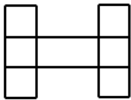

A. 5 

B. 6 

C. 7 

D. 8 

17. How many cubes are there in the solid below? 

Có bao nhiêu khối lập phương trong hình dưới đây? 

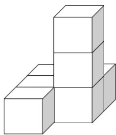

A. 4 

B. 6 

C. 7 

D. 8 

18. Refer to the pattern below. Find the suitable figure to fill in the blank. 

Theo quy luật dưới đây, tìm hình thích hợp để điền vào chỗ trống. 

A. 

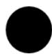

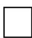

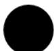

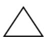

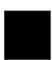

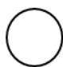

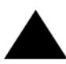

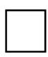

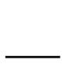

B. 

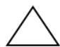

C. 

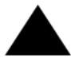

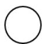

19. How many circles are there in the figure below? 

Có bao nhiêu hình tròn trong hình dưới đây? 

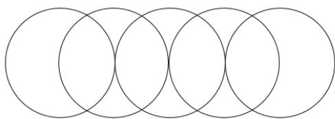

A. 4 

B. 5 

C. 6 

D. 12 

20. How many sides are there in the following figure? 

Hình dưới đây có bao nhiêu cạnh? 

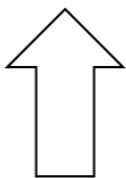

A. 5 

B. 7 

C. 8 

D. 9 

## Combinatorics / Tổ hợp

21. Separate the following stars into 2 equal groups. How many stars are there in each group? 

Chia các hình ngôi sao dưới đây thành 2 phần bằng nhau. Hỏi mỗi phần có bao nhiêu ngôi sao? 

## 

A. 6 

B. 5 

C. 4 

D. 3 

22. How many even numbers are there from 13 to 30? 

Hỏi có bao nhiêu số chẵn tính từ số 13 đến số 30? 

A. 9 

B. 17 

C. 16 

D. 8 

23. Adam has one $1 coin, one $2 coin and one $5 coin. At most how many toy car(s) can he buy, given that each toy car costs $2? 

Adam có một đồng xu 1 đô, một đồng xu 2 đô và một đồng xu 5 đô. Hỏi cậu bé có thể mua được nhiều nhất bao nhiêu chiếc xe ô tô đồ chơi, biết rằng mỗi chiếc xe trị giá 2 đô? 

A. 2 

B. 3 

C. 4 

D. 5 

24. How many 2-digit numbers can be formed by using digits 0, 1, 4 and 8? (Each digit can be repeated). 

Từ các chữ số 0, 1, 4 và 8, hỏi lập được bao nhiêu số có hai chữ số? Các chữ số có thể lặp lại). 

A. 9 

B. 16 

C. 11 

D. 12 

25. From the pattern below, find the most suitable figure for Figure 4. 

Dựa vào quy luật dưới đây, tìm đáp án thích hợp nhất cho hình số 4. 

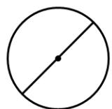

Figure 1

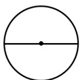

Figure 2

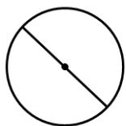

Figure 3

? 

Figure 4

A. 

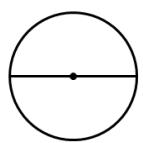

B. 

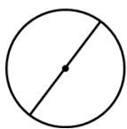

C. 

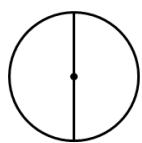

D. 

# ĐỀ SỐ 2

## Logical thinking / Tƣ duy lô-gic

1. 5 years later, Alice will be 12 years old. Alice’s father is 23 years elder than her. How old is Alice’s father now? 

5 năm nữa thì Alice 12 tuổi. Bố của Alice hơn cô bé 23 tuổi. Hỏi bây giờ bố của Alice bao nhiêu tuổi? 

A. 40 

B. 30 

C. 20 

D. 35 

2. By observing the pattern, what is the English letter in the space provided? 

Quan sát quy luật dưới đây để điền chữ cái Tiếng Anh thích hợp vào chỗ trống. 

$\mathrm { ~ C ~ } , \mathrm { ~ E ~ } , \mathrm { ~ G ~ } , \mathrm { ~ I ~ } , \mathrm { ~ \ s ~ } , \mathrm { ~ M ~ } , \mathrm { ~ O ~ }$ 

A. N 

B. J 

C. L 

D. K 

3. Observe the sequence below to replace the flag with a suitable number. 

Quan sát dãy số dưới đây để thay thế lá cờ bằng số thích hợp. 

3 , 4 , 6 , 9 , 13 ,  , … 

A. 18 

B. 17 

C. 14 

D. 15 

4. Refer to the figure below, how many circles are there in the 5th group? 

Dựa vào dãy hình dưới đây, hỏi có bao nhiêu hình tròn trong nhóm thứ 5? 

A. 4 

B. 8 

C. 12 

D. 16 

Students in a class form a line. Kim sees that there are 5 students in front of her and 3 students behind her. How many students are there in Kim’s class? 

Học sinh trong một lớp xếp thành một hàng dọc. Kim thấy rằng phía trước mình có 5 bạn và phía sau mình có 3 bạn. Hỏi lớp của Kim có bao nhiêu học sinh? 

A. 8 

B. 9 

C. 10 

## Arithmetic / Số học

6. Find the value of $0 + 2 + 4 + 6 + 8 + 1 0 .$ . 

Tìm giá trị của 0 + 2 + 4 + 6 + 8 + 10. 

A. 30 

B. 20 

C. 10 

D. 40 

7. By observing the equation, which number is being covered by the book? 

Quan sát phép tính dưới đây, hỏi số nào đang bị che bởi quyển sách? 

$$
1 9 - \text {   } = 6
$$

A. 13 

B. 16 

C. 3 

D. 14 

8. Find the value of $2 + 3 - 4 + 2 + 3 - 4 + 2 + 3 - 4 + 2 + 3 - 4 .$ . 

Tính giá trị của 2 + 3 – 4 + 2 + 3 – 4 + 2 + 3 – 4 + 2 + 3 – 4. 

A. 3 

B. 1 

C. 4 

D. 5 

9. What is the value of K if the equation below is correct? 

Tìm giá trị của K để được phép tính đúng dưới đây. 

$$
6 + K = 8 - 5 + 1 1
$$

A. 6 

B. 8 

C. 4 

D. 5 

10. If A and B represent different digits, what is the value of A so that the equation is correct? 

Biết A và B biểu diễn các chữ số khác nhau, hỏi giá trị của A là bao nhiêu để ta được phép tính đúng dưới đây? 

AB 

+B5 

80 

A. 5 

B. 2 

C. 3 

D. 4 

## Number theory / Lý thuyết số

11. Observe the following sequence and find the smallest even number. 

Quan sát dãy số dưới đây để tìm ra số chẵn nhỏ nhất. 

$$
3 8 \cdot 2 0 \cdot 1 8 \cdot 1 5 \cdot 4 9 \cdot 2 6 \cdot 7
$$

A. 7 

B. 15 

C. 18 

D. 20 

12. A box has balls with consecutive numbers from 0 to 50 (0, 1, 2, 3, 4, …, 50). How many balls are there in the box? 

Một hộp chứa các quả bóng được đánh số liên tiếp từ 0 đến 50 0, 1, 2, 3, 4, …, 50 . Hỏi có bao nhiêu quả bóng trong hộp đó? 

A. 40 

B. 51 

C. 25 

D. 50 

13. Find the 6th number in the arithmetic sequence below. 

Tìm số thứ 6 trong dãy số cách đều dưới đây. 

$$
3 1 \cdot 2 9 \cdot 2 7 \cdot 2 5 \cdot \dots
$$

A. 24 

B. 23 

C. 19 

D. 21 

14. Andy had 20 candies. Andy gave Betty 3 candies then Betty gave Cindy 4 candies so that 3 friends had the same number of candies. How many candies did Cindy have originally? 

Andy có 20 cái kẹo. Andy cho Betty 3 cái kẹo rồi Betty lại cho Cindy 4 cái kẹo. Khi đó 3 bạn có số kẹo bằng nhau. Hỏi lúc đầu Cindy có bao nhiêu cái kẹo? 

A. 19 

B. 21 

C. 18 

D. 13 

15. David has 3 cards. The total number of cards of David and his brother is the smallest 2- digit odd number. How many cards does David’s brother have? 

David có 3 lá bài. Tổng số lá bài của David và anh trai là số lẻ nhỏ nhất có 2 chữ số. Hỏi anh trai David có bao nhiêu lá bài? 

A. 10 

B. 9 

C. 8 

D. 7 

## Geometry / Hình học

16. How many squares are there in the figure below? 

Hỏi có bao nhiêu hình vuông trong hình dưới đây? 

A. 19 

B. 14 

C. 15 

D. 20 

17. At least how many cubes are there in the figure below? 

Hỏi có ít nhất bao nhiêu hình lập phương trong hình dưới đây? 

A. 12 

B. 11 

C. 13 

D. 10 

18. How many interior angles are there in the polygon below? 

Hỏi hình đa giác dưới đây có bao nhiêu góc trong? 

A. 13 

B. 14 

C. 15 

D. 16 

19. How many line segments are there in the figure below? 

Hỏi có bao nhiêu đoạn thẳng trong hình dưới đây? 

A. 18 

B. 20 

C. 16 

D. 14 

20. Refer to the beads below. How many white beads are there in the first 15 beads? 

Xét chuỗi hạt dưới đây. Hỏi có bao nhiêu hạt trắng trong 15 hạt đầu tiên? 

A. 15 

B. 7 

C. 8 

D. 6 

## Combinatorics / Tổ hợp

21. Which number below is the greatest number? 

Tìm số lớn nhất trong các số dưới đây? 

2102202 、 20022021 、 20102021 、 20102120 

A. 2102202 

B. 20022021 

C. 20102021 

D. 20102120 

22. Among the following numbers, how many odd numbers are there? 

Hỏi có bao nhiêu số lẻ trong các số dưới đây? 

21 , 32 , 444 , 101, 8 , 99 , 241 , 76 

A. 3 

B. 5 

C. 4 

D. 2 

23. Choose 2 digits, without repetition, from 0, 2, 4, 6 and 9 to form 2-digit even numbers. 

How many different numbers are there? 

Chọn 2 chữ số không lặp lại từ 0, 2, 4, 6 và 9 để lập thành số chẵn có 2 chữ số. Hỏi có thể lập được bao nhiêu số khác nhau như vậy? 

A. 16 

B. 13 

C. 14 

D. 15 

24. Amy, Billy, Celine and Dan donated 20 coats to the homeless. Given that each person must donate at least 2 coats and their numbers of coats must be different, at most how many coats can Dan donate? 

Amy, Billy, Celine và Dan quyên góp 20 chiếc áo ấm cho người vô gia cư. Biết rằng mỗi bạn cần quyên góp ít nhất 2 chiếc áo và số áo của mỗi bạn là khác nhau. Hỏi Dan có thể quyên góp nhiều nhất bao nhiêu chiếc áo? 

A. 6 

B. 14 

C. 11 

D. 20 

25. The 3 x 3 square on the right is called a ‚Magic square‛ with 9 consecutive numbers from 1 to 9 in each cell. The sum of numbers in each column or row is equal. Find the number that should be filled in the cell with question mark. 

Hình vuông 3 x 3 bên phải được gọi là ‚Hình vuông ma thuật‛ gồm 9 số liên tiếp từ 1 đến 9 được điền vào mỗi ô. Tổng các số ở mỗi hàng và mỗi cột là bằng nhau. Hãy tìm số thích hợp để điền vào ô có dấu hỏi chấm. 

<table><tr><td>?</td><td>7</td><td></td></tr><tr><td>9</td><td>5</td><td>1</td></tr><tr><td></td><td>3</td><td></td></tr></table>

A. 2 

B. 4 

C. 6 

D. 8 

# ĐỀ SỐ 3

# Logical Thinking / Tƣ duy lô-gic

1. If tomorrow will be Thursday, which day of the week will be 6 days later? 

Nếu ngày mai là thứ Năm, hỏi 6 ngày nữa là thứ mấy? 

A. Friday (Thứ Sáu) 

B. Wednesday (Thứ Tư 

C. Tuesday (Thứ Ba) 

D. Saturday (Thứ Bảy) 

2. Peter is the youngest boy in his family. Given that his father has 4 sons and Peter has 5 brother(s) and sister(s) in total. How many daughter(s) does Peter’s father have? 

Peter là cậu bé nhỏ tuổi nhất trong gia đình. Bố cậu ấy có 4 người con trai. Peter có tất cả 5 anh chị em. Vậy bố của Peter có bao nhiêu con gái? 

A. 1 

B. 2 

C. 3 

D. 4 

3. 20 children form a column. Alice is the 5th starting from the front. How many children behind her? 

20 bạn nhỏ xếp thành một hàng dọc. Alice là người thứ 5 tính từ đầu hàng. Hỏi có bao nhiêu người phía sau bạn ấy? 

A. 15 

B. 14 

C. 6 

D. 5 

4. From the pattern shown below, what is the number in the blank? 

Dựa vào quy luật dưới đây, tìm số thích hợp điền vào chỗ trống? 

9 、 17 、 25 、 33 、 41 、 49 、 __ 

A. 58 

B. 57 

C. 56 

D. 55 

5. Refer the pattern below, how many ◎are there in the 13th group? 

Dựa vào quy luật dưới đây, có bao nhiêu kí hiệu ◎trong hình thứ 13? 

1st Group Hinh 1 

2nd Group Hinh 2 

3rd Group Hinh 3 

4th Group Hinh 4 

A. 20 

B. 22 

C. 23 

D. 24 

## Arithmetic / Số học

6. Find the value of 2 + 28 + 6 + 14 + 17 + 13. 

Tìm giá trị của 2 + 28 + 6 + 14 + 17 + 13. 

A. 70 

B. 80 

C. 90 

D. 100 

7. Find the value of 13 + 17 – 21. 

Tìm giá trị của 13 + 17 – 21. 

A. 8 

B. 9 

C. 10 

D. 11 

8. Find the value of 9 + 8 + 7 + 6 – 5 – 4 – 3 – 2 + 1. 

Tìm giá trị của 9 + 8 + 7 + 6 – 5 – 4 – 3 – 2 + 1. 

A. 14 

B. 15 

C. 16 

D. 17 

9. Find the number that should be filled in the blank if this equation is correct. 

Tìm số thích hợp điền vào chỗ trống để được phép tính đúng. 

$$
4 2 - \_ = 2 2
$$

A. 20 

B. 19 

C. 18 

D. 21 

10. Refer to the puzzle, find the value of M. 

Tìm giá trị của M trong phép tính dưới đây. 

$$
2 7 - M - M = M
$$

A. 8 

B. 6 

C. 9 

D. 7 

## Number Theory / Lý thuyết số

11. Alice has 15 pencils and Peter has 7 pencils. How many pencils does Alice have to give Peter so that 2 friends have the same number of pencils? 

Alice có 15 chiếc bút chì và Peter có 7 chiếc bút chì. Hỏi Alice cần cho Peter mấy chiếc bút chì để hai bạn có số bút chì bằng nhau? 

A. 4 

B. 8 

C. 5 

D. 6 

12. Fill the lines with ‘ + ’ and ‘ – ’ to make the equation below correct. 

Điền dấu ‘ + ’ và ‘ – ’ vào chỗ trống để được phép tính đúng. 

$$
2 \_ 7 \_ 5 \_ 1 = 5
$$

A. 2 + 7 – 5 – 1 = 5 

B. 2 + 7 + 5 + 1 = 5 

C. 2 + 7 + 5 – 1 = 5 

D. 2 + 7 – 5 + 1 = 5 

13. Fill the lines with ‘ + ’ and ‘ – ’ to make the equation below correct. 

Điền dấu ‘ + ’ và ‘ – ’ vào chỗ trống để được phép tính đúng. 

$$
2 \_ 8 \_ 4 \_ 1 0 \_ 3 = 1 3
$$

A. 2 + 8 + 4 – 10 + 3 = 13 

B. 2 + 8 – 4 + 10 + 3 = 13 

C. 2 + 8 – 4 + 10 – 3 = 13 

D. 2 + 8 + 4 – 10 – 3 = 13 

14. The numbers below form an arithmetic sequence. What is the 7th number? 

Các số dưới đây tạo thành một dãy số cách đều. Hỏi số thứ 7 là bao nhiêu? 

58、51、44、37、30、… 

A. 19 

B. 18 

C. 17 

D. 16 

15. Determine the sum 1 + 3 + 5 + 7 + 9 + 11 is odd or even. 

Hỏi tổng 1 + 3 + 5 + 7 + 9 + 11 là số lẻ hay số chẵn? 

A. Even (Chẵn) 

B. Odd (Lẻ) 

C. Neither odd nor even (Không chẵn không lẻ) 

D. Both odd and even (Vừa chẵn vừa lẻ) 

## Geometry / Hình học

16. How many squares are there in the figure below? 

Có bao nhiêu hình vuông trong hình vẽ dưới đây? 

A. 10 

B. 11 

C. 12 

D. 13 

17. Candace places some cubes on top of each other to form the figure below. At least how many cubes does she use? 

Candace xếp các khối lập phương chồng lên nhau để được hình bên dưới. Hỏi cô ấy đã dùng ít nhất bao nhiêu khối lập phương? 

A. 6 

B. 7 

C. 8 

D. 9 

18. How many interior angles are there in the polygon below? 

Đa giác dưới đây có bao nhiêu góc trong? 

A. 16 

B. 17 

C. 18 

D. 19 

19. By observing the pattern from left to right, what is the missing figure? 

Quan sát quy luật từ trái sang phải, tìm hình bị thiếu. 

A. ■ 

B. ▲ 

C. ★ 

D. ◎ 

20. According to the pattern below, what is the figure in the space provided? 

Dựa vào quy luật dưới đây, tìm hình vẽ bị thiếu. 

A. ■ 

B. ▲ 

C. 

D. 

## Combinatorics / Tổ hợp

21. Which number below is the greatest? 

Số nào dưới đây là lớn nhất? 

20190513 、 20195479、 20189845 、 20196490 

A. 20190513 

B. 20195479 

C. 20189845 

D. 20196490 

22. Choose 2 digits, without repetition, from 5, 1, 0 and 3 to form 2-digit odd numbers. How many different numbers are there? 

Chọn 2 chữ số khác nhau từ các chữ số 5, 1, 0 và 3 để tạo thành số lẻ có 2 chữ số. Hỏi có thể tạo được bao nhiêu số khác nhau? 

A. 6 

B. 5 

C. 4 

D. 3 

23. According to the following numbers, what is the difference between the number of odd number(s) and even number(s)? 

Quan sát các số dưới đây, tìm hiệu giữa số lượng số lẻ và số lượng số chẵn. 

1, 7, 13, 14, 21, 27, 30, 45 

A. 1 

B. 2 

C. 3 

D. 4 

24. What is the largest 3-digit even number formed by choosing 3 digits from 0, 5, 1 and 3? 

Số chẵn lớn nhất có 3 chữ số có thể tạo được từ 3 trong 5 chữ số 0, 5, 1 và 3 là số nào? 

A. 531 

B. 530 

C. 103 

D. 105 

25. Andy, Bella and Charles make 7 cakes in total. Given that each person makes at least one cake and their numbers of cake(s) must be different. Andy makes the most cakes. How many cakes does Andy make? 

Andy, Bella và Charles làm được tất cả 7 cái bánh. Mỗi người làm ít nhất một cái bánh và số bánh của các bạn là khác nhau. Andy làm được nhiều bánh nhất. Hỏi Andy làm được bao nhiêu cái bánh? 

A. 5 

B. 4 

C. 3 

D. 7 

## ĐỀ SỐ 4

## Logical Thinking / Tƣ duy lô-gic

1. Given that the day before yesterday was Saturday, which day of the week will it be tomorrow? 

Biết rằng ngày hôm kia là thứ Bảy, vậy ngày mai là thứ mấy? 

A. Friday (Thứ Sáu) 

B. Tuesday (Thứ Ba) 

C. Monday (Thứ Hai) 

D. Saturday (Thứ Bảy) 

2. What is the greatest possible number of Fridays during February? 

Trong tháng Hai có nhiều nhất bao nhiêu thứ Sáu? 

A. 2 

B. 3 

C. 4 

D. 5 

3. Tommy needs 5 minutes to cook a bowl of noodles. He can cook at most 2 bowls of noodles at the same time. At least how many minutes does he need to cook 3 bowls of noodles? 

Tommy cần 5 phút để nấu một bát mỳ. Bạn ấy có thể nấu nhiều nhất 2 bát mỳ cùng lúc. Hỏi Tommy cần ít nhất bao nhiêu phút để nấu 3 bát mỳ? 

A. 10 

B. 8 

C. 15 

D. 11 

4. According to the pattern shown below, what is the number in the blank (‚?‛)? 

Dựa vào quy luật dưới đây, tìm số thích hợp điền vào dấu ‚?‛. 

55 、 45 、 36 、 28 、 21 、 15 、? 

A. 8 

B. 9 

C. 10 

D. 11 

5. Consider the pattern below. How many  are there in the next group? 

Dựa vào quy luật dưới đây, hỏi có bao nhiêu dấu  trong hình tiếp theo? 

A. 8 

B. 9 

C. 10 

D. 11 

## Arithmetic / Số học

6. Find the value of 7 + 4 + 5 + 3 + 2 + 6 + 8. 

Tìm giá trị của 7 + 4 + 5 + 3 + 2 + 6 + 8. 

A. 33 

B. 34 

C. 35 

D. 36 

7. Find the value of 18 – 9 + 12. 

Tìm giá trị của 18 – 9 + 12. 

A. 20 

B. 21 

C. 18 

D. 17 

8. Find the value of 7 + 7 + 7 + 7 + 7 – 7 – 7 – 7 – 7. 

Tìm giá trị của 7 + 7 + 7 + 7 + 7 – 7 – 7 – 7 – 7. 

A. 0 

B. 5 

C. 6 

D. 7 

9. What is the number that should be filled in the blank? 

Tìm số thích hợp điền vào chỗ trống. 

$$
2 1 + \_ = 4 1
$$

A. 23 

B. 20 

C. 21 

D. 22 

10. What is the value of C if the equation below is correct? 

Tìm giá trị của C để được phép tính đúng dưới đây. 

$$
1 4 - \mathrm{C} = \mathrm{C}
$$

A. 9 

B. 8 

C. 7 

D. 6 

## Number Theory / Lý thuyết số

11. Amy has 17 apples and John has 9 apples. How many apples does Amy have to give to John to make them have the same number of apples? 

Amy có 17 quả táo, John có 9 quả táo. Hỏi Amy cần cho John bao nhiêu quả táo để hai người có số táo bằng nhau? 

A. 4 

B. 8 

C. 5 

D. 6 

12. Fill the lines with ‘ + ‘ and ‘ – ‘ to make the equation below correct. 

Điền dấu ‘ + ’ và ‘ – ’ vào chỗ trống để được phép tính đúng. 

$$
2 \_ 3 \_ 4 \_ 8 = 1
$$

A. 2 + 3 + 4 + 8 = 1 

B. 2 + 3 + 4 – 8 = 1 

C. 2 + 3 – 4 + 8 = 1 

D. 2 + 3 – 4 – 8 = 1 

13. Fill the lines with ‘ + ’ and ‘ – ’ to make the equation below correct. 

Điền dấu ‘ + ’ và ‘ – ’ vào chỗ trống để được phép tính đúng. 

$$
1 \_ 3 \_ 6 \_ 8 \_ 9 = 1 1
$$

A. 1 + 3 + 6 + 8 – 9 = 11 

B. 1 + 3 + 6 + 8 + 9 =11 

C. 1 + 3 – 6 + 8 + 9 = 11 

D. 1 + 3 + 6 – 8 + 9 = 11 

14. How many two-digit numbers having the unit digit 2 are there? 

Có bao nhiêu số có hai chữ số mà chữ số hàng đơn vị là 2? 

A. 9 

B. 10 

C. 6 

D. 8 

15. Determine 2 + 5 + 8 + 11 + 14 is odd or even. 

Hỏi 2 + 5 + 8 + 11 + 14 là số lẻ hay số chẵn? 

A. Even (Chẵn) 

B. Odd (Lẻ) 

C. Neither odd nor even (Không chẵn không lẻ) 

D. Both odd and even (Vừa chẵn vừa lẻ) 

## Geometry / Hình học

16. How many squares are there in the figure below? Có bao nhiêu hình vuông trong hình vẽ bên dưới? 

A. 8 

B. 9 

C. 10 

D. 11 

17. At least how many cubes are there in the figure below? Có ít nhất bao nhiêu khối lập phương trong hình dưới đây? 

A. 8 

C. 10 

D. 11 

18. How many sides are there in the polygon below? Đa giác dưới đây có bao nhiêu cạnh? 

A. 13 

B. 14 

C. 15 

D. 16 

19. According to the pattern shown below, what is the figure in the space (‚___‛) provided? Dựa vào quy luật dưới đây, tìm hình thích hợp để điền vào chỗ trống (‚___‛)? 

△ □ ○△ △ □ ○△ △ □ ○ ___ △… 

A. △ 

B. □ 

D. ▲ 

20. According to the pattern shown below, what is the figure in the space provided? Dựa vào quy luật dưới đây, tìm hình vẽ thích hợp để điền vào chỗ trống. 

A. 

B. ■ 

C. ▲ 

D. 

## Combinatorics / Tổ hợp

21. Which number below is the smallest? 

Số nào dưới đây là nhỏ nhất? 

20201110 、 20112010、 20211020 、 20101021 

A. 20201110 

B. 20112010 

C. 20211020 

D. 20101021 

22. Choose 2 digits, without repetition, from 1, 0, 3 and 9 to form two-digit numbers. How many different numbers are there? 

Chọn hai chữ số khác nhau từ các chữ số 1, 0, 3 và 9 để tạo thành số có hai chữ số. Hỏi có thể được bao nhiêu số khác nhau như vậy? 

A. 10 

B. 9 

C. 8 

D. 7 

23. According to the following numbers, how many even number(s) is / are there? 

Trong các số dưới đây có bao nhiêu số chẵn? 

1, 3, 4, 7, 11, 18, 29, 47 

A. 4 

B. 3 

C. 2 

D. 1 

24. What is the greatest 3-digit number formed by digits 2, 0, 4 and 8? (Each digit cannot be used more than once). 

Số lớn nhất có 3 chữ số được tạo bởi các chữ số 2, 0, 4 và 8 là số nào? (Mỗi chữ số không được dùng quá 1 lần). 

A. 284 

B. 208 

C. 842 

D. 840 

25. Mina would like to pick up all apples on the floor. What is the minimum distance in meter that he needs to travel? The distance between two adjacent apples is 1 meter and he can only go straight, turn left or turn right. 

Mina muốn lấy được tất cả số táo trên sàn. Hỏi bạn ấy cần đi quãng đường ngắn nhất là bao nhiêu mét? Biết rằng khoảng cách giữa hai quả táo liền kề nhau là 1 mét và bạn ấy chỉ có thể đi thẳng, rẽ trái hoặc rẽ phải. 

A. 15 

B. 14 

C. 17 

D. 16 

## ĐỀ SỐ 5

## Logical Thinking / Tƣ duy lô-gic

1. If the next month is August, find the last month. 

Nếu tháng sau là tháng Tám, hỏi tháng trước là tháng nào? 

A. June (Tháng Sáu) 

B. July (Tháng Bảy) 

C. August (Tháng Tám) 

D. December (Tháng Mười hai) 

2. From the pattern shown below, what is the animal figure in the blank? 

Dựa vào quy luật dưới đây, tìm hình con vật thích hợp để điền vào chỗ trống. 

3. Mr. David has a farm. His farm has 5 cows and 5 chickens. How many legs do these animals have in the farm in total? 

Bác David có một nông trại. Trong nông trại có 5 con bò và 5 con gà. Hỏi tổng số chân của những con vật trong nông trại là bao nhiêu? 

A. 29 

B. 30 

C. 31 

D. 32 

4. From the pattern shown below, what is the number in the blank? 

Dựa vào quy luật dưới đây, tìm số điền vào chỗ trống. 

12 、 13 、 11 、 14 、 10 、 15 、 __ 

A. 7 

B. 8 

C. 9 

D. 10 

5. From the pattern below, how many symbols  are there in the 5th group? 

Dựa theo quy luật, hỏi có bao nhiêu kí hiệu  trong nhóm thứ 5? 

A. 2 

B. 3 

C. 4 

D. 5 

## Arithmetic / Số học

6. Find the value of 2 + 4 + 6 + 8 + 10. 

Tìm giá trị của 2 + 4 + 6 + 8 + 10. 

A. 10 

B. 20 

C. 30 

D. 40 

7. Find the value of 10 – 8 + 6 – 4 + 2. 

Tìm giá trị của 10 – 8 + 6 – 4 + 2. 

A. 6 

B. 4 

C. 8 

D. 10 

8. Find the value of 9 + 2 + 1 + 8 + 3. 

Tìm giá trị của 9 + 2 + 1 + 8 + 3. 

A. 20 

B. 22 

C. 23 

D. 21 

9. What is the number that should be filled in the blank? 

Tìm số thích hợp để điền vào chỗ trống. 

$$
1 8 - \_ = 4
$$

A. 15 

B. 14 

C. 16 

D. 12 

10. What is the value of A + B if the equation below is correct? 

Tìm giá trị của A + B biết rằng phép tính dưới đây là đúng. 

$$
\begin{array}{c c} & \text {A} \\ + & \text {A} \\ & \text {A} \\ \hline \text {B A} \end{array}
$$

A. 1 

B. 4 

C. 5 

D. 6 

## Number Theory / Lý thuyết số

11. How many rabbits should be moved from left to right to get the same number of rabbits in both gardens? 

Cần chuyển bao nhiêu con thỏ từ bên trái sang bên phải để hai khu vườn có số thỏ bằng nhau? 

A. 1 

B. 2 

C. 3 

D. 4 

12. Fill the lines with ‘ + ‘ and ‘ – ‘ to make the equation below correct. 

Điền các dấu ‘ + ’ và ‘ – ’ vào chỗ trống để được phép tính đúng. 

$$
3 \_ 6 \_ 4 \_ 7 = 1 2
$$

A. 3 + 6 + 4 – 7 = 12 

B. 3 + 6 – 4 – 7 = 12 

C. 3 + 6 – 4 + 7 = 12 

D. 3 + 6 + 4 + 7 = 12 

13. Fill the lines with ‘ + ‘ and ‘ – ‘ to make the equation below correct. 

Điền các dấu ‘ + ’ và ‘ – ’ vào chỗ trống để được phép tính đúng. 

$$
2 \_ 5 \_ 6 \_ 1 \_ 3 = 1 5
$$

A. 2 + 5 – 6 + 1 – 3 = 15 

B. 2 + 5 + 6 – 1 – 3 = 15 

C. 2 + 5 + 6 – 1 + 3 = 15 

D. 2 + 5 – 6 + 1 + 3 = 15 

14. Four of five numbers 2, 4, 5, 6, 9 are written into four boxes so that the calculation below is correct. Which number was not used? 

Bốn trong năm số 2, 4, 5, 6, 9 được viết vào bốn ô dưới đây để được phép tính đúng. Hỏi số nào không được sử dụng? 

$$
\square + \square = \square + \square
$$

A. 4 

B. 5 

C. 6 

D. 9 

15. Determine the result of 8 + 5 + 6 – 4 – 3 + 2 – 7 is odd or even. 

Hỏi kết quả của phép tính 8 + 5 + 6 – 4 – 3 + 2 – 7 là số lẻ hay số chẵn? 

A. Even (Chẵn) 

B. Odd (Lẻ) 

C. Neither odd nor even (Không chẵn không lẻ) 

D. Both odd and even (Vừa chẵn vừa lẻ) 

## Geometry / Hình học

16. How many squares are there in the following figure? 

Có bao nhiêu hình vuông trong hình dưới đây? 

A. 12 

B. 16 

C. 17 

D. 18 

17. Some cubes are placed on top of each other. At least how many cubes are there in the figure below? 

Một số khối lập phương được xếp chồng lên nhau. Hỏi có ít nhất bao nhiêu khối lập phương trong hình bên dưới? 

A. 13 

B. 12 

C. 11 

D. 14 

18. How many sides are there in the polygon below? 

Đa giác dưới đây có bao nhiêu cạnh? 

A. 5 

B. 6 

C. 7 

D. 8 

19. According to the pattern shown below, what is the shape in the top of 4th figure? Theo quy luật dưới đây, khối nào nằm ở phía trên cùng trong hình thứ 4? 

20. According to the pattern shown below, what is the figure in the space? Dựa vào quy luật dưới đây, tìm hình vẽ thích hợp điền vào chỗ trống. 

## Combinatorics / Tổ hợp

21. Which number below is the smallest even number? 

Số nào sau đây là số chẵn nhỏ nhất? 

20203924 、 20110019、 20211014 、 20101030 

A. 20203924 

B. 20110019 

C. 20211014 

D. 20101030 

22. Forming 2-digit numbers using 0, 1, 2, 3. These numbers have to be greater than 11 and smaller than 30. Every number is made up of two different digits. How many different number(s) is / are there? 

Sử dụng các chữ số 0, 1, 2, 3 để tạo thành các số có 2 chữ số lớn hơn 11 và nhỏ hơn 30. Mỗi số đều gồm hai chữ số phân biệt. Hỏi có tất cả bao nhiêu số như vậy? 

A. 10 

B. 4 

C. 5 

D. 7 

23. Among the following numbers, how many odd number(s) is / are there? Trong các số dưới đây có bao nhiêu số lẻ? 

12, 45, 7, 16, 22, 15, 10, 68 

A. 1 

B. 2 

C. 3 

D. 4 

24. What is the smallest 3-digit number formed by digits 0, 2, 3 and 7? (Each digit cannot be used more than once). 

Số nhỏ nhất có 3 chữ số được tạo bởi các chữ số 0, 2, 3 và 7 là số nào? (Mỗi chữ số được sử dụng không quá 1 lần). 

A. 203 

B. 302 

C. 320 

D. 730 

## 25. Find the value of .

Tìm giá trị của . 

A. 4 

B. 6 

C. 5 

D. 3 

# HEAT ROUND / VÒNG CHUNG KẾT QUỐC GIA

# ĐỀ SỐ 1: Đề thi Vòng Chung kết quốc gia năm học 2020 – 2021

## Logical Thinking / Tƣ duy lô-gic

1. Edward is 18 years old now and Kenny will be 6 years old 4 years later. What is the difference between their ages? 

Now Hiện tại Later: Sau; Difference: Hiệu Age Tuổi. 

2. According to the pattern shown below, what is the English letter in the space (‚__‛) provided? 

Pattern: Quy luật; English letter: Chữ cái Tiếng Anh; Space: Chỗ trống. 

$$
\mathrm{J}, \ell , \mathrm{N}, \mathrm{p}, \mathrm{R}, \_, \dots
$$

3. If tomorrow will be Thursday, which day of the week will 11 days later be? 

Tomorrow: Ngày mai; Thursday: Thứ Năm Day of the week Thứ ater Sau. 

4. According to the pattern below, what is the number in the space? 

Pattern: Quy luật; Space: Chỗ trống. 

4, 12, 20, 28, 36, __ 

5. From the pattern below, how many ＃ is / are there in the 5th Group? 

Pattern: Quy luật. 

1st Group 

2nd Group 

<table><tr><td></td><td>#</td><td>#</td></tr><tr><td>#</td><td></td><td>#</td></tr><tr><td>#</td><td>#</td><td>#</td></tr></table>

3rd Group 

<table><tr><td></td><td>#</td><td>#</td><td>#</td></tr><tr><td>#</td><td></td><td></td><td>#</td></tr><tr><td>#</td><td></td><td></td><td>#</td></tr><tr><td>#</td><td>#</td><td>#</td><td>#</td></tr></table>

4h Group 

## Arithmetic / Số học

6. If A represents the same 1-digit number, what is the value of A if the equation is correct? 

Represent: Biểu diễn; 1-digit number: Số 1 chữ số; Equation: Phép tính. 

$$
\begin{array}{r} 1 \quad A \\ + \quad A \quad 6 \\ \hline 9 \quad 3 \end{array}
$$

7. Find the value of .48 6 11 29 12 14     

Value: Giá trị. 

8. B is a 1-digit number. What is the value of B if the equation below is correct? 

1-digit number: Số có 1 chữ số; Value: Giá trị; Equation: Phép tính. 

$$
5 \quad 2 \quad - \boxed {B} = 4 \quad 3
$$

9. Find the value of 4 + 4 + 4 + 4 + 4 + 4 – 6 – 6 – 6. 

Value: Giá trị. 

10. Find the value of 14 – 26 + 38. 

Value: Giá trị. 

## Number Theory / Lý thuyết số

11. A large package contains 8 eggs. A small package contains 3 eggs. Buying both large package and small package will attach 1 extra egg every time. If Mary buys 3 large and 5 small packages, how many egg(s) does she have? 

Contain: Chứa Both Tất cả Attach 1 extra egg Tặng kèm 1 quả trứng. 

12. The numbers below follow the arithmetic sequence, what is the 11th number? 

Arithmetic sequence: Dãy số cách đều; 11th number: Số thứ 11. 

118, 113, 108, 103, 98, … 

13. It is known that A is an odd number. Determine the result below is an odd or even number. 

Odd number: Số lẻ; Even number: Số chẵn Determine Xác định. 

$$
(A - 2) + (A - 1) + A + (A + 1) + (A + 2)
$$

14. Stephen has 24 apples and Charlie has 6 apples. How many apples does Stephen have to give Charlie to make them have the same number of apples? 

The same number of apples: Số quả táo bằng nhau. 

15. By observing the numbers, which even number is the greatest? 

Even number: Số chẵn; Greatest: Lớn nhất. 

$$
9 9 - 1 1, 9 9 + 2, 9 9 - 1 3, 9 9 + 4, 9 9 + 1 5, 9 9 + 1 6
$$

## Geometry / Hình học

16. How many cubes are there in figure 2 given that figure 2 is formed by some shapes as figure 1? 

Formed Được ghép bởi; Cube: Hình lập phương Figure Hình vẽ. 

17. How many triangle(s) is / are there in the figure below? 

Triangles Hình tam giác Figure Hình vẽ. 

18. How many side(s) is / are there in the polygon below? 

Side: Cạnh Polygon Hình đa giác. 

19. According to the pattern below, what is the figure in the space $( ^ { \prime \prime } { \_ } ) \underline { { \cdot } } ( \ ^ { \prime \prime } ) ?$ 

Pattern: Quy luật Figure Hình vẽ Space Chỗ trống. 

$\begin{array} { r }  \boxed  \begin{array} { r l }  \boxed { \begin{array} { r l } { \Omega \textrm { \textsf { O } } \textrm { \textsf { O } } \Delta \textrm { \textsf { U } } \textrm { \textsf { O } } \textrm { \textsf { O } } \Delta \textrm { \textsf { U } } \textrm { \textsf { O } } } } \\ { \end{array} } \qquad \left. \begin{array} { r l } { \Delta \textrm { \textsf { - } } \Delta \textrm { \textsf { - } } \Delta \textrm { \textsf { - } } \Delta \textrm { \textsf { - } } \left( \begin{array} { r l } { \Delta \textrm { \textsf { - } } \textrm { \textsf { c } } } & { \Delta \textrm { \textsf { - } }  } \end{array} \right. } \end{\right)array} \end{array} \end{array} \end{array}$ 

20. How many line segment(s) is / are there in the figure below? 

ine segments Đoạn thẳng; Figure Hình vẽ. 

## Combinatorics / Tổ hợp

21. According to the following answers, how many 2-digit numbers are there? 

Answers: Kết quả phép tính; 2-digit numbers: Số có 2 chữ số. 

$$
2 1 - 6, 6 + 5, 9 - 2, 1 0 0 - 5, 1 1 + 5, 4 + 7
$$

22. Which number below is the smallest? 

Smallest: Nhỏ nhất. 

20111111, 2011211, 2022222, 203333 

23. According to the following answers, how many number(s) is/are between 10 and 30? 

Answers: Kết quả phép tính; Between: Ở giữa. 

$$
1 1 + 8, 2 + 9, 3 + 4, 5 0 - 7, 4 0 - 7, 2 5 + 4, 3 0 - 2 1
$$

24. What is the smallest 3-digit even number by choosing 3 digits from 0, 1, 5, 7 and 9? (Each digit can only be used once). 

Smallest 3-digit even number: Số chẵn nhỏ nhất có 3 chữ số Digit chữ số Once Một lần. 

25. Choose 4 digits, without repetition, from 2, 3, 5, 7, 8 and 9 to form two 2-digit odd numbers and add them up. What is the maximum value of the sum? 

Digits: Chữ số; Without repetition: Không lặp lại; Two 2-digit odd numbers: Hai số lẻ có 2 chữ số; Add up: Cộng vào; Maximum value: Giá trị lớn nhất; Sum: Tổng. 

# ĐỀ SỐ 2: Đề thi Vòng Chung kết quốc gia năm học 2019 - 2020

## Logical Thinking / Tƣ duy lô-gic

1. 9 years ago, Peter was 24 years old. How old is he now? 

Ago Trước đây Now Hiện tại. 

2. According to the pattern shown below, what is the English letter in the space (‚__‛) provided? 

Pattern Quy luật English letter Chữ cái Tiếng Anh Space Chỗ trống. 

F, H, J, L, N,__, … 

3. If yesterday was Friday, which day of the week will 10 days later be? 

Yesterday Hôm qua Friday Thứ Sáu Day of the week Thứ ater Sau. 

4. According to the pattern below, what is the number in the space (‚__‛)? 

Pattern Quy luật Space Chỗ trống. 

13, 17, 21, 25, 29, __, … 

5. According to the pattern below, how many # are there in the 6th Group? 

Pattern: Quy luật 6th Group Nhóm thứ 6. 

1st Group

2nd Group

3rd Group

4th Group

## Arithmetic / Số học

6. What is the number should be in the blank if the equation is correct? 

Blank Chỗ trống Equation Phép tính Correct Đúng. 

$$
1 9 + \_ = 2 9
$$

7. Find the value of 11 +3 + 26 +19 + 4 + 27. 

Value Giá trị. 

8. If A represents the same 1-digit number, what is the value of A if the equation is correct? 

Represent: Biểu diễn; 1-digit number: Số có 1 chữ số; Equation: Phép tính. 

9. Find the value of 36 – 9 + 4. 

Value Giá trị. 

10. Find the value of 1 – 2 + 3 – 4 + 5 – 6 + 7. 

Value: Giá trị. 

## Number Theory / Lý thuyết số

11. By observing the numbers, which even number is the smallest? 

Even number Số chẵn Smallest Nhỏ nhất. 

38, 13, 57, 15, 25, 96, 16 

12. A is an odd number. Determine that 1 + 2 + 3 + 4 + 5 + 6 + 7 + 8 + 9 + A is odd or even number. 

Odd number Số lẻ Determine Xác định Odd ẻ Even Chẵn. 

13. Fill the lines with ‚ + ‛ and ‚ – ‛ to make the equation below correct. (Write down the complete equation on the answer sheet). 

ine Dòng kẻ Equation Phép tính ưu viết toàn bộ phép tính vào phiếu trả lời. 

$$
9 \_ 4 \_ 5 \_ 3 = 7
$$

14. Amy has 19 bananas and Bruce has 9 bananas. Amy gives Bruce some bananas. How many banana(s) does Amy have to give Bruce to make them to have the same number of bananas? 

The same number of bananas Số quả chuối bằng nhau. 

15. The numbers below follow the arithmetic sequence, what is the 7th number of the sequence? 

Arithmetic sequence Dãy số cách đều 7th number Số thứ 7 Sequence Dãy số. 

95, 84, 73, 62, 51, … 

## Geometry / Hình học

16. How many square(s) is / are there in the figure below? 

Square Hình vuông Figure Hình vẽ. 

17. How many side(s) is / are there in the polygon below? 

Side Cạnh Polygon Đa giác. 

18. It is known that figure 1 is formed by 6 cubes. How many cube(s) is / are there in figure 2 given that figure 2 is formed by some shapes as figure 1? 

Figure Hình vẽ Formed Được ghép bởi Cube Hình lập phương. 

Figure 1

Figure 2

19. How many line segment(s) is / are there in the figure below? 

ine segment Đoạn thẳng Figure Hình vẽ. 

20. How many interior angle(s) is / are there in the polygon below? 

Interior angle Góc bên trong Polygon Đa giác. 

## Combinatorics / Tổ hợp

21. Alice has five $5 coins. At most how many $2 coins can she exchange? 

Coin Đồng xu Maximum Nhiều nhất Exchange Đổi. 

22. What is the largest 3-digit even number by choosing 3 digits from 0, 6, 1 and 5? (Each digit can only be used once). 

Largest 3-digit even number: Số chẵn lớn nhất có 3 chữ số Digit Chữ số Once Một lần. 

23. Choose 4 digits, without repetition, from 1, 2, 5, 7 and 9 to form two 2-digit numbers and add them up. What is the minimum value of the sum? 

Digit Chữ số Without repetion Không lặp lại Form Ghép 2-digit numbers Số có 2 chữ số 

Add Cộng Minimum value Giá trị nhỏ nhất Sum Tổng. 

24. Among the following answers, how many 2-digit numbers are there? 

Answer Kết quả 2-digit number Số có 2 chữ số. 

$$
9 + 1 2, 1 5 - 9, 6 8 + 2 9, 8 4 + 2 9, 5 + 4, 1 2 - 2
$$

25. Which number below is the greatest? 

Greatest ớn nhất. 

20191982, 20192641, 2019845, 20099521 

# ĐỀ SỐ 3: Đề thi Vòng Chung kết quốc gia năm học 2018-2019

## Logical Thinking / Tƣ duy lô-gic

1. Jacob is the eldest boy in the family. He has 4 younger sisters and 3 younger brothers. How many child(ren) is / are there in Jacob’s family? 

Eldest ớn nhất Younger sister Em gái Younger brother Em trai. 

2. In year 2018, how many month(s) is / are there with exactly 30 days? 

Year Năm Month Tháng Exactly Chính xác Day Ngày. 

3. 4 years ago, Amy was 13 years old. How old will Amy be 3 years later? 

Ago Trước đây ater Sau này. 

4. According to the pattern shown below, what is the number in the space? 

Pattern Quy luật Space Chỗ trống. 

1, 7, 13, 19, 25, __ 

5. According to the pattern shown below, what is the English letter in the space (‚__‛)? 

Pattern Quy luật English letter Chữ cái tiếng Anh. 

A, D, G, J, M, _ 

Arithmetic / Số học 

6. Find the value of 2 + 3 + 5 + 6 + 8 + 9. 

Value Giá trị. 

7. Find the value of 27 + 18 – 17. 

Value Giá trị. 

8. A is a 1-digit number. What is the value of A if the equation below is correct? 

1-digit number Số có 1 chữ số Value Giá trị Equation Phép tính. 

$$
3 \times A = 3 + 3 + 3 + 3 + 3
$$

9. What is the number in the blank if the equation below is correct? 

Blank Chỗ trống Equation Phép tính Correct Đúng. 

$$
3 5 + \_ = 4 2
$$

10. If B represents the same 1-digit number, what is the value of B if the equation on the right is correct? 

Represent Biểu diễn 1-digit number Số có 1 chữ số Value Giá trị Equation 

Phép tính Correct Đúng. 

B 

## Number Theory / Lý thuyết số

11. Fill the lines with ‚ + ‛ and ‚ – ‛ to make the equation below correct. (Write down the complete equation on the answer sheet). 

ine Dòng kẻ Equation Phép tính ưu viết toàn bộ phép tính vào phiếu trả lời. 

$$
1 \_ 8 \_ 5 \_ 4 = 8
$$

12. Fill the lines with ‚ + ‛ and ‚ – ‛ to make the equation below correct. (Write down the complete equation on the answer sheet). 

ine Dòng kẻ Equation Phép tính ưu viết toàn bộ phép tính vào phiếu trả lời. 

$$
1 \_ 4 \_ 5 \_ 7 = 7
$$

13. Four students have 16 balloons in total and each of them have a different number of balloons. Know that Andy has the most balloons. At most how many balloon(s) does Andy have? 

Balloon: Bóng bay In total Tổng cộng Different Khác nhau Most Nhiều nhất. 

14. Determine the result of 2 + 5 + 8 + 11 + 14 + 17 + 20 + 232 is odd or even. 

Determine Xác định Result Kết quả Odd ẻ Even Chẵn. 

15. How many two-digit number(s) that have the unit digit 6 is / are there? 

Two-digit number Số có hai chữ số Unit digit Chữ số hàng đơn vị. 

## Geometry / Hình học

16. How many square(s) is / are there in the figure below? 

Square Hình vuông Figure Hình vẽ. 

17. At least how many cube(s) is / are there in the figure below? 

At least t nhất Cube Hình lập phương Figure Hình vẽ. 

18. How many triangle(s) is / are there in the figure below? 

Triangle Hình tam giác Figure Hình vẽ. 

19. According to the pattern below, what is the figure in the space (‚__‛)? 

Pattern Quy luật Figure Hình vẽ Space Chỗ trống. 

△ ○ □ △ ○ □ △ ○ □ △ __ □ … 

20. According to the pattern below, how many  are there in the 13th Group? 

Pattern Quy luật 13th Group Nhóm thứ 13. 

## Combinatorics / Tổ hợp

21. Separate 10 as the sum of two 1-digit numbers. How many way(s) is / are there? (Consider 5 + 6 and 6 + 5 as the same method). 

Separate Chia Sum Tổng 1-digit numbers Số có 1 chữ số The same method C ng một cách. 

22. Among the following answers, how many odd number(s) is / are there? 

Answer Kết quả Odd number Số lẻ. 

$$
1 + 3, 2 + 4, 3 + 5, 8 + 4, 2 + 5, 2 + 4
$$

23. Choose 4 digits, without repetition, from 1, 3, 4 and 7 to form two 2-digit numbers and add them up. What is the minimum value of the sum? 

Digit Chữ số Without repetition Không lặp lại Form Ghép 2-digit numbers: Số có 2 chữ số Add Cộng Minimum value Giá trị nhỏ nhất. 

24. Calculate the sum of the greatest 1-digit even number and the smallest 2-digit odd number. 

Calculate Tính Sum Tổng Greatest 1-digit even number Số chẵn lớn nhất có 1 chữ số Smallest 2-digit odd number Số lẻ nhỏ nhất có 2 chữ số. 

25. Peter has 12 $1 coins. How many $2 coin(s) can he exchange? 

Coin Đồng xu Exchange Đổi. 

# ĐỀ SỐ 4: Đề thi Vòng Chung kết quốc gia năm học 2017-2018

## Logical Thinking / Tƣ duy lô-gic

1. Amy’s father has five children. Two of them are sons. How many sister(s) does Amy have given that Amy is a girl? 

Son Con trai Sister Chị, em gái. 

2. What is the greatest possible number of consecutive day(s) that has exactly one Sunday? 

Greatest possible number Số lớn nhất có thể Consecutive iên tiếp Exactly Chính xác Sunday Chủ Nhật 

3. 5 years later, Amy will be 13 years old. How old was Amy 4 years ago? 

ater Sau Ago Trước đây. 

4. According to the pattern shown below, what is the number in the blank (‚__‛)? 

Pattern Quy luật Blank Chỗ trống. 

1, 5, 9, 13, 17, 21,__, … 

5. According to the pattern below, how many  are there in the 17th Group? 

Pattern Quy luật 17th group Nhóm thứ 17. 

## Arithmetic / Số học

6. Find the value of 1 + 2 + 4 + 5 + 6 + 7 + 9 + 10. 

Value Giá trị. 

7. Find the value of 26 + 19 – 6. 

Value Giá trị. 

8. A is a 1-digit number. What is the value of A if the equation below is correct? 

1-digit number Số có 1 chữ số Value Giá trị Equation Phép tính. 

$$
2 \times \boxed {A} = 1 6
$$

9. What is the number in the blank if the equation below is correct? 

Blank Chỗ trống Equation Phép tính Correct Đúng. 

$$
7 2 - \_ = 6 5
$$

10. B is a 1-digit number. What is the value of B if the equation below is correct? 

1-digit number Số có 1 chữ số Value Giá trị Equation Phép tính. 

$$
1 0 \quad - \boxed {B} = \boxed {B}
$$

## Number Theory / Lý thuyết số

11. Amy has 18 apples and John has 4 apples. How many apple(s) does Amy have to give John to make them to have the same number of apples? 

The same number of apples Số táo bằng nhau. 

12. Fill the lines with ‚ + ‛ and ‚ – ‛ to make the equation below correct. (Write down the complete equation in the answer sheet). 

ine Dòng kẻ Equation Phép tính ưu viết toàn bộ phép tính vào phiếu trả lời. 

$$
1 \_ 3 \_ 5 \_ 7 = 2
$$

13. 3 students have 17 balloons in total and each of them has a different number of balloons. Anna has the most balloons. At least how many balloon(s) does she have? 

Balloon Quả bóng bay In total Tổng cộng Different Khác nhau Most Nhiều nhất At least t nhất. 

14. How many two-digit number(s) that have the unit digit 5 is / are there? 

Two-digit number Số có hai chữ số Unit digit 5 Chữ số hàng đơn vị là 5. 

15. Determine the result of 1 + 2 + 3 + 4 + 5 + 6 + 7 + 8 + 9 + 10 is odd or even. 

Determine Xác định Result Kết quả Odd ẻ Even Chẵn. 

## Geometry / Hình học

16. How many square(s) is / are there in the figure below? 

Square Hình vuông Figure Hình vẽ. 

17. At least how many cube(s) is / are there in the figure below? 

At least t nhất Cube Hình lập phương Figure Hình vẽ. 

18. How many side(s) is / are there in the polygon below? 

Side Cạnh Polygon Đa giác. 

19. From the pattern below, what is the figure in the space (‚__‛)? 

Pattern Quy luật Figure Hình vẽ Space Chỗ trống. 

○ □ □△ ○ □ □ △○ □ __ △… 

20. How many interior angle(s) is / are there in the polygon below? 

Interior angle Góc trong Polygon Đa giác. 

## Combinatorics / Tổ hợp

21. Separate 28 candies into two equal groups, how many candy(ies) is / are there in each group? 

Separate Chia Equal groups Các nhóm bằng nhau. 

22. Choose 2 digits, without repetition, from 1, 2, 4 and 8 to form two-digit numbers. How many odd number(s) is / are there? 

Digit Chữ số Without repetition Không lặp lại Form Ghép Two-digit number Số có hai chữ số Odd number Số lẻ. 

23. There are 2 ways from the market to the train station and there are 2 ways from the train station to the cinema. How many different way(s) is / are there from the market to the cinema through the train station? 

Different way s Các đường khác nhau Through Đi qua. 

24. What is the smallest 3-digit number formed by choosing 3 digits from 3, 6, 1 and 8? (Each digit can only be used once). 

Smallest 3-digit number Số nhỏ nhất có 3 chữ số Formed Được ghép bởi Digit Chữ số Once Một lần. 

25. Peter has 4 $1 coins, 2 $5 coins and 1 $10 coin, what is the maximum number of the souvenir that he can buy if each souvenir costs $3? 

Coin Đồng xu Maximum number Số lượng lớn nhất Souvenir Đồ lưu niệm. 

# ĐỀ SỐ 5: Đề thi Vòng Chung kết quốc gia năm học 2016-2017

## Logical Thinking / Tƣ duy lô-gic

1. Mary has one brother and three sisters. How many sisters does Mary’s brother have given that Mary is a girl? 

Brother Anh, em trai Sister Chị, em gái. 

2. Three friends – Amy, Benny and Winnie, have one pet each – either a cat, a dog, or a bunny. Amy does not have a cat. Benny has a bunny. What kind of pet does Winnie have? Kind of pet oại vật nuôi. 

Andy needs to cut a cake. At least how many cuts are required so that he can cut the cake into 4 parts? 

Cut Cắt, nhát cắt At least t nhất Part Phần. 

4. John wrote a 2-digit number on a paper and asked Peter to guess it. 

Peter asked: ‚Is the number 16?‛ 

John replied: ‚One digit is correct, but the position of that digit is wrong.‛ 

Peter asked again: ‚Is the number 67?‛ 

John said: ‚One digit is correct, but the position of that digit is wrong.‛ 

What is the number written by John? 

2-digit number Số có 2 chữ số Guess Đoán Digit Chữ số Correct Đúng Position Vị trí Wrong: Sai. 

5. According to the pattern shown below, how many circles are there in the fourth group? 

Pattern: Quy luật Circle Hình tròn Fourth group Nhóm thứ tư. 

## Arithmetic / Số học

6. Find the value of 3 + 3 + 3 + 3 + 3 + 3 + 3 + 3 + 3 + 3. 

Value Giá trị. 

7. Find the value of 82 + 19 – 42. 

Value Giá trị. 

8. What is the number in the blank so that the equation below is correct? 

Blank Chỗ trống Equation Phép tính Correct Đúng. 

$$
2 2 + \_ = 3 0
$$

9. Find the value of 1 + 2 + 3 + 4 + 5 + 6 + 7 + 8 + 9 + 10 + 11. 

Value Giá trị. 

10. A and B are both 1-digit number. What is the value of A in the equation below if it is correct? 

1-digit number Số có 1 chữ số Value Giá trị Equation Phép tính. 

$$
1 \quad 8 \quad - \boxed {A} = \boxed {B}
$$

## Number Theory / Lý thuyết số

11. Amy has 10 apples and John has 4 apples. How many apples does Amy have to give John to make them to have the same number of apples? 

The same number of apples Số quả táo bằng nhau. 

12. Fill the lines with ‚ + ‛ and ‚ – ‛ to make the equation below correct. (Write down the complete equation on the answer sheet). 

ine Dòng kẻ Equation Phép tính ưu viết toàn bộ phép tính vào phiếu trả lời. 

$$
1 \_ 3 \_ 5 \_ 7 = 6
$$

13. Four children have 11 balloons in total and each of them have a different number of balloons. Given that every child has at least one balloon and Jimmy has the most balloons. How many balloons does he have? 

Balloon Quả bóng bay In total Tổng cộng Different number Số lượng khác nhau Most Nhiều nhất At least t nhất. 

14. How many two-digit numbers are there that the unit digit is 0? 

Two-digit number Số có hai chữ số Unit digit Chữ số hàng đơn vị. 

15. According to the following pattern, find the value of the next term. 

Pattern Quy luật Value Giá trị Term Số hạng. 

1, 4, 7, 10, 13, … 

## Geometry / Hình học

16. How many squares are there in the figure below? 

Square Hình vuông Figure Hình vẽ. 

<table><tr><td></td><td></td><td></td></tr><tr><td></td><td></td><td></td></tr><tr><td></td><td></td><td></td></tr></table>

17. How many cubes are there in the figure below? 

Cube Hình lập phương Figure Hình vẽ. 

18. How many triangles are there in the figure below? 

Triangle Hình tam giác Figure Hình vẽ. 

19. Which polygon below has the most sides? 

Polygon Đa giác Most Nhiều nhất; Sides: Cạnh. 

（A)

(E)

20. According to the pattern below, what is the figure in the space (‚__‛) provided? 

Pattern Quy luật Figure Hình vẽ Space Chỗ trống. 

## Combinatorics / Tổ hợp

21. 8 candies are split into 2 equal groups, how many candy(ies) is/ are there in each group? 

Split into Chia Equal groups Các nhóm bằng nhau. 

22. Choose 2 numbers, without repetition, from 1, 3, 5, 8 to form a two-digit number. How many odd numbers are there? 

Without repetition Không lặp lại Form Ghép thành Two-digit number Số có hai chữ số Odd number Số lẻ. 

23. There are 3 ways from school to train station and there are 2 ways from the train station to the library. How many different ways from school to the library through the train station? 

Different ways Các cách khác nhau Through Đi qua. 

24. What is the smallest 4-digit number by using 3, 6, 1 and 8? (Each digit can be used once). 

Smallest 4-digit number Số nhỏ nhất có 4 chữ số Digit Chữ số Once Một lần. 

25. Choose 2 numbers, without repetition, from 0, 3, 5, 6, 9 to form a 2-digit number. How many multiples of 5 are there? 

Without repetition Không lặp lại Form Ghép 2-digit number Số có 2 chữ số Multiple Bội. 

## ĐÁP ÁN THAM KHẢO

## PRELIMINARY ROUND / VÒNG LOẠI QUỐC GIA

ĐỀ SỐ 1: Đề thi Vòng loại quốc gia năm học 2020 - 2021 

<table><tr><td colspan="3">Logical Thinking</td><td colspan="3">Number Theory</td><td colspan="3">Combinatorics</td></tr><tr><td>4</td><td>1)C</td><td>4</td><td>4</td><td>11)A</td><td>4</td><td>4</td><td>21)C</td><td>4</td></tr><tr><td>4</td><td>2)C</td><td>4</td><td>4</td><td>12)B</td><td>4</td><td>4</td><td>22)A</td><td>4</td></tr><tr><td>4</td><td>3)A</td><td>4</td><td>4</td><td>13)D</td><td>4</td><td>4</td><td>23)C</td><td>4</td></tr><tr><td>4</td><td>4)A</td><td>4</td><td>4</td><td>14)A</td><td>4</td><td>4</td><td>24)D</td><td>4</td></tr><tr><td>4</td><td>5)B</td><td>4</td><td>4</td><td>15)B</td><td>4</td><td>4</td><td>25)C</td><td>4</td></tr><tr><td colspan="3">Arithmetic</td><td colspan="3">Geometry</td><td colspan="3"></td></tr><tr><td>4</td><td>6)D</td><td>4</td><td>4</td><td>16)B</td><td>4</td><td colspan="3" rowspan="5"></td></tr><tr><td>4</td><td>7)B</td><td>4</td><td>4</td><td>17)C</td><td>4</td></tr><tr><td>4</td><td>8)D</td><td>4</td><td>4</td><td>18)A</td><td>4</td></tr><tr><td>4</td><td>9)C</td><td>4</td><td>4</td><td>19)B</td><td>4</td></tr><tr><td>4</td><td>10)C</td><td>4</td><td>4</td><td>20)B</td><td>4</td></tr><tr><td>4</td><td>1)B</td><td>4</td><td>4</td><td>11)C</td><td>4</td><td>4</td><td>21)D</td><td>4</td></tr><tr><td>4</td><td>2)D</td><td>4</td><td>4</td><td>12)B</td><td>4</td><td>4</td><td>22)C</td><td>4</td></tr><tr><td>4</td><td>3)A</td><td>4</td><td>4</td><td>13)D</td><td>4</td><td>4</td><td>23)B</td><td>4</td></tr><tr><td>4</td><td>4)C</td><td>4</td><td>4</td><td>14)D</td><td>4</td><td>4</td><td>24)C</td><td>4</td></tr><tr><td>4</td><td>5)B</td><td>4</td><td>4</td><td>15)C</td><td>4</td><td>4</td><td>25)A</td><td>4</td></tr><tr><td colspan="3">Arithmetic</td><td colspan="3">Geometry</td><td colspan="3"></td></tr><tr><td>4</td><td>6)A</td><td>4</td><td>4</td><td>16)A</td><td>4</td><td colspan="3" rowspan="5"></td></tr><tr><td>4</td><td>7)A</td><td>4</td><td>4</td><td>17)A</td><td>4</td></tr><tr><td>4</td><td>8)C</td><td>4</td><td>4</td><td>18)D</td><td>4</td></tr><tr><td>4</td><td>9)B</td><td>4</td><td>4</td><td>19)B</td><td>4</td></tr><tr><td>4</td><td>10)B</td><td>4</td><td>4</td><td>20)B</td><td>4</td></tr><tr><td>4</td><td>1)C</td><td>4</td><td>4</td><td>11)A</td><td>4</td><td>4</td><td>21)D</td><td>4</td></tr><tr><td>4</td><td>2)B</td><td>4</td><td>4</td><td>12)D</td><td>4</td><td>4</td><td>22)A</td><td>4</td></tr><tr><td>4</td><td>3)A</td><td>4</td><td>4</td><td>13)C</td><td>4</td><td>4</td><td>23)D</td><td>4</td></tr><tr><td>4</td><td>4)B</td><td>4</td><td>4</td><td>14)D</td><td>4</td><td>4</td><td>24)B</td><td>4</td></tr><tr><td>4</td><td>5)D</td><td>4</td><td>4</td><td>15)A</td><td>4</td><td>4</td><td>25)B</td><td>4</td></tr><tr><td colspan="3">Arithmetic</td><td colspan="3">Geometry</td><td colspan="3"></td></tr><tr><td>4</td><td>6)B</td><td>4</td><td>4</td><td>16)C</td><td>4</td><td colspan="3" rowspan="5"></td></tr><tr><td>4</td><td>7)B</td><td>4</td><td>4</td><td>17)D</td><td>4</td></tr><tr><td>4</td><td>8)D</td><td>4</td><td>4</td><td>18)B</td><td>4</td></tr><tr><td>4</td><td>9)A</td><td>4</td><td>4</td><td>19)B</td><td>4</td></tr><tr><td>4</td><td>10)C</td><td>4</td><td>4</td><td>20)C</td><td>4</td></tr><tr><td>4</td><td>1)B</td><td>4</td><td>4</td><td>11)A</td><td>4</td><td>4</td><td>21)D</td><td>4</td></tr><tr><td>4</td><td>2)D</td><td>4</td><td>4</td><td>12)B</td><td>4</td><td>4</td><td>22)B</td><td>4</td></tr><tr><td>4</td><td>3)A</td><td>4</td><td>4</td><td>13)D</td><td>4</td><td>4</td><td>23)C</td><td>4</td></tr><tr><td>4</td><td>4)C</td><td>4</td><td>4</td><td>14)A</td><td>4</td><td>4</td><td>24)C</td><td>4</td></tr><tr><td>4</td><td>5)B</td><td>4</td><td>4</td><td>15)A</td><td>4</td><td>4</td><td>25)A</td><td>4</td></tr><tr><td colspan="3">Arithmetic</td><td colspan="3">Geometry</td><td colspan="3"></td></tr><tr><td>4</td><td>6)C</td><td>4</td><td>4</td><td>16)C</td><td>4</td><td colspan="3" rowspan="5"></td></tr><tr><td>4</td><td>7)B</td><td>4</td><td>4</td><td>17)C</td><td>4</td></tr><tr><td>4</td><td>8)D</td><td>4</td><td>4</td><td>18)B</td><td>4</td></tr><tr><td>4</td><td>9)B</td><td>4</td><td>4</td><td>19)A</td><td>4</td></tr><tr><td>4</td><td>10)C</td><td>4</td><td>4</td><td>20)D</td><td>4</td></tr><tr><td>4</td><td>1)A</td><td>4</td><td>4</td><td>11)B</td><td>4</td><td>4</td><td>21)D</td><td>4</td></tr><tr><td>4</td><td>2)B</td><td>4</td><td>4</td><td>12)C</td><td>4</td><td>4</td><td>22)C</td><td>4</td></tr><tr><td>4</td><td>3)B</td><td>4</td><td>4</td><td>13)C</td><td>4</td><td>4</td><td>23)C</td><td>4</td></tr><tr><td>4</td><td>4)C</td><td>4</td><td>4</td><td>14)A</td><td>4</td><td>4</td><td>24)A</td><td>4</td></tr><tr><td>4</td><td>5)D</td><td>4</td><td>4</td><td>15)B</td><td>4</td><td>4</td><td>25)D</td><td>4</td></tr><tr><td colspan="3">Arithmetic</td><td colspan="3">Geometry</td><td colspan="3"></td></tr><tr><td>4</td><td>6)C</td><td>4</td><td>4</td><td>16)C</td><td>4</td><td colspan="3" rowspan="5"></td></tr><tr><td>4</td><td>7)A</td><td>4</td><td>4</td><td>17)A</td><td>4</td></tr><tr><td>4</td><td>8)C</td><td>4</td><td>4</td><td>18)B</td><td>4</td></tr><tr><td>4</td><td>9)B</td><td>4</td><td>4</td><td>19)D</td><td>4</td></tr><tr><td>4</td><td>10)D</td><td>4</td><td>4</td><td>20)B</td><td>4</td></tr></table>

## HEAT ROUND / VÒNG CHUNG KẾT QUỐC GIA

ĐỀ SỐ 1: Đề thi Vòng Chung kết quốc gia năm học 2020 – 2021

<table><tr><td colspan="3">Logical Thinking</td><td colspan="3">Number Theory</td><td colspan="3">Combinatorics</td></tr><tr><td>4</td><td>1) 16</td><td>4</td><td>4</td><td>11) 42</td><td>4</td><td>4</td><td>21) 5</td><td>4</td></tr><tr><td>4</td><td>2) t</td><td>4</td><td>4</td><td>12) 68</td><td>4</td><td>4</td><td>22) 203333</td><td>4</td></tr><tr><td>4</td><td>3) Sunday</td><td>4</td><td>4</td><td>13) Odd</td><td>4</td><td>4</td><td>23) 3</td><td>4</td></tr><tr><td>4</td><td>4) 44</td><td>4</td><td>4</td><td>14) 9</td><td>4</td><td>4</td><td>24) 150</td><td>4</td></tr><tr><td>4</td><td>5) 15</td><td>4</td><td>4</td><td>15) 114</td><td>4</td><td>4</td><td>25) 182</td><td>4</td></tr><tr><td colspan="3">Arithmetic</td><td colspan="3">Geometry</td><td colspan="3"></td></tr><tr><td>4</td><td>6) 7</td><td>4</td><td>4</td><td>16) 20</td><td>4</td><td rowspan="5" colspan="3"></td></tr><tr><td>4</td><td>7) 120</td><td>4</td><td>4</td><td>17) 12</td><td>4</td></tr><tr><td>4</td><td>8) 9</td><td>4</td><td>4</td><td>18) 18</td><td>4</td></tr><tr><td>4</td><td>9) 6</td><td>4</td><td>4</td><td>19) ○</td><td>4</td></tr><tr><td>4</td><td>10) 26</td><td>4</td><td>4</td><td>20) 12</td><td>4</td></tr></table>

ĐỀ SỐ 2: Đề thi Vòng Chung kết quốc gia năm học 2019 – 2020

<table><tr><td colspan="3">Logical Thinking</td><td colspan="3">Number Theory</td><td colspan="3">Combinatorics</td></tr><tr><td>4</td><td>1)33</td><td>4</td><td>4</td><td>11)16</td><td>4</td><td>4</td><td>21)12</td><td>4</td></tr><tr><td>4</td><td>2)P</td><td>4</td><td>4</td><td>12)Even</td><td>4</td><td>4</td><td>22)650</td><td>4</td></tr><tr><td>4</td><td>3)Tuesday</td><td>4</td><td>4</td><td>13)<eq>9 - 4 + 5 - 3 = 7</eq></td><td>4</td><td>4</td><td>23)42</td><td>4</td></tr><tr><td>4</td><td>4)33</td><td>4</td><td>4</td><td>14)5</td><td>4</td><td>4</td><td>24)3</td><td>4</td></tr><tr><td>4</td><td>5)20</td><td>4</td><td>4</td><td>15)29</td><td>4</td><td>4</td><td>25)20192641</td><td>4</td></tr><tr><td colspan="3">Arithmetic</td><td colspan="3">Geometry</td><td colspan="3"></td></tr><tr><td>4</td><td>6)10</td><td>4</td><td>4</td><td>16)13</td><td>4</td><td rowspan="5" colspan="3"></td></tr><tr><td>4</td><td>7)90</td><td>4</td><td>4</td><td>17)9</td><td>4</td></tr><tr><td>4</td><td>8)9</td><td>4</td><td>4</td><td>18)24</td><td>4</td></tr><tr><td>4</td><td>9)31</td><td>4</td><td>4</td><td>19)12</td><td>4</td></tr><tr><td>4</td><td>10)4</td><td>4</td><td>4</td><td>20)11</td><td>4</td></tr></table>

ĐỀ SỐ 3: Đề thi Vòng Chung kết quốc gia năm học 2018 – 2019

<table><tr><td colspan="3">Logical Thinking</td><td colspan="3">Number Theory</td><td colspan="3">Combinatorics</td></tr><tr><td>4</td><td>1)8</td><td>4</td><td>4</td><td>11)<eq>1 + 8 - 5 + 4 = 8</eq></td><td>4</td><td>4</td><td>21)5</td><td>4</td></tr><tr><td>4</td><td>2)4</td><td>4</td><td>4</td><td>12)<eq>1 + 4 - 5 + 7 = 7</eq></td><td>4</td><td>4</td><td>22)1</td><td>4</td></tr><tr><td>4</td><td>3)20</td><td>4</td><td>4</td><td>13)10</td><td>4</td><td>4</td><td>23)51</td><td>4</td></tr><tr><td>4</td><td>4)31</td><td>4</td><td>4</td><td>14)Odd</td><td>4</td><td>4</td><td>24)19</td><td>4</td></tr><tr><td>4</td><td>5)P</td><td>4</td><td>4</td><td>15)9</td><td>4</td><td>4</td><td>25)6</td><td>4</td></tr><tr><td colspan="3">Arithmetic</td><td colspan="3">Geometry</td><td colspan="3"></td></tr><tr><td>4</td><td>6)33</td><td>4</td><td>4</td><td>16)8</td><td>4</td><td rowspan="5" colspan="3"></td></tr><tr><td>4</td><td>7)28</td><td>4</td><td>4</td><td>17)13</td><td>4</td></tr><tr><td>4</td><td>8)5</td><td>4</td><td>4</td><td>18)6</td><td>4</td></tr><tr><td>4</td><td>9)7</td><td>4</td><td>4</td><td>19)○</td><td>4</td></tr><tr><td>4</td><td>10)6</td><td>4</td><td>4</td><td>20)91</td><td>4</td></tr></table>

ĐỀ SỐ 4: Đề thi Vòng Chung kết quốc gia năm học 2017 – 2018

<table><tr><td colspan="3">Logical Thinking</td><td colspan="3">Number Theory</td><td colspan="3">Combinatorics</td></tr><tr><td>4</td><td>1)2</td><td>4</td><td>4</td><td>11)7</td><td>4</td><td>4</td><td>21)14</td><td>4</td></tr><tr><td>4</td><td>2)13</td><td>4</td><td>4</td><td>12)<eq>1 + 3 + 5 - 7 = 2</eq></td><td>4</td><td>4</td><td>22)3</td><td>4</td></tr><tr><td>4</td><td>3)4</td><td>4</td><td>4</td><td>13)7</td><td>4</td><td>4</td><td>23)4</td><td>4</td></tr><tr><td>4</td><td>4)25</td><td>4</td><td>4</td><td>14)9</td><td>4</td><td>4</td><td>24)136</td><td>4</td></tr><tr><td>4</td><td>5)33</td><td>4</td><td>4</td><td>15)Odd</td><td>4</td><td>4</td><td>25)8</td><td>4</td></tr><tr><td colspan="3">Arithmetic</td><td colspan="3">Geometry</td><td colspan="3"></td></tr><tr><td>4</td><td>6)44</td><td>4</td><td>4</td><td>16)10</td><td>4</td><td rowspan="5" colspan="3"></td></tr><tr><td>4</td><td>7)39</td><td>4</td><td>4</td><td>17)9</td><td>4</td></tr><tr><td>4</td><td>8)8</td><td>4</td><td>4</td><td>18)11</td><td>4</td></tr><tr><td>4</td><td>9)7</td><td>4</td><td>4</td><td>19)□</td><td>4</td></tr><tr><td>4</td><td>10)5</td><td>4</td><td>4</td><td>20)11</td><td>4</td></tr></table>

ĐỀ SỐ 5: Đề thi Vòng Chung kết quốc gia năm học 2016 – 2017

<table><tr><td colspan="3">Logical Thinking</td><td colspan="3">Number Theory</td><td colspan="3">Combinatorics</td></tr><tr><td>4</td><td>1)4</td><td>4</td><td>4</td><td>11)3</td><td>4</td><td>4</td><td>21)4</td><td>4</td></tr><tr><td>4</td><td>2)Cat</td><td>4</td><td>4</td><td>12)<eq>1 + 3 - 5 + 7 = 6</eq></td><td>4</td><td>4</td><td>22)9</td><td>4</td></tr><tr><td>4</td><td>3)2</td><td>4</td><td>4</td><td>13)5</td><td>4</td><td>4</td><td>23)6</td><td>4</td></tr><tr><td>4</td><td>4)71</td><td>4</td><td>4</td><td>14)9</td><td>4</td><td>4</td><td>24)1368</td><td>4</td></tr><tr><td>4</td><td>5)10</td><td>4</td><td>4</td><td>15)16</td><td>4</td><td>4</td><td>25)7</td><td>4</td></tr><tr><td colspan="3">Arithmetic</td><td colspan="3">Geometry</td><td colspan="3"></td></tr><tr><td>4</td><td>6)30</td><td>4</td><td>4</td><td>16)14</td><td>4</td><td rowspan="5" colspan="3"></td></tr><tr><td>4</td><td>7)59</td><td>4</td><td>4</td><td>17)6</td><td>4</td></tr><tr><td>4</td><td>8)8</td><td>4</td><td>4</td><td>18)13</td><td>4</td></tr><tr><td>4</td><td>9)66</td><td>4</td><td>4</td><td>19)C</td><td>4</td></tr><tr><td>4</td><td>10)9</td><td>4</td><td>4</td><td>20)○</td><td>4</td></tr></table>

# HEAT ROUND ANSWER SHEET

# MẪU PHIẾU TRẢ LỜI VÒNG CHUNG KẾT QUỐC GIA

<table><tr><td>Admission ID:Số báo danh:</td><td></td><td></td><td></td><td></td><td></td><td></td><td></td><td></td><td></td><td></td><td>Centre No:Số phòng thi:</td><td></td></tr><tr><td>Contestant Name:Họ tên thí sinh:</td><td colspan="12"></td></tr><tr><td>Date of Birth:Ngày sinh:</td><td colspan="10"></td><td>Contestant Grade:Khối thi:</td><td></td></tr><tr><td>School Name:Tên trường:</td><td colspan="10"></td><td>City / Province:Thành phố / Tỉnh:</td><td></td></tr></table>

Fill all the information above in BLOCK LETTER. 

Điền đầy đủ thông tin, trong đó mỗi ô của số báo danh điền đúng 1 chữ số hoặc 1 chữ cái. 

<table><tr><td colspan="3">Logical Thinking</td><td colspan="3">Number Theory</td><td colspan="3">Combinatorics</td></tr><tr><td>4</td><td>1)</td><td>4</td><td>4</td><td>11)</td><td>4</td><td>4</td><td>21)</td><td>4</td></tr><tr><td>4</td><td>2)</td><td>4</td><td>4</td><td>12)</td><td>4</td><td>4</td><td>22)</td><td>4</td></tr><tr><td>4</td><td>3)</td><td>4</td><td>4</td><td>13)</td><td>4</td><td>4</td><td>23)</td><td>4</td></tr><tr><td>4</td><td>4)</td><td>4</td><td>4</td><td>14)</td><td>4</td><td>4</td><td>24)</td><td>4</td></tr><tr><td>4</td><td>5)</td><td>4</td><td>4</td><td>15)</td><td>4</td><td>4</td><td>25)</td><td>4</td></tr><tr><td colspan="3">Arithmetic / Algebra</td><td colspan="3">Geometry</td><td colspan="3"></td></tr><tr><td>4</td><td>6)</td><td>4</td><td>4</td><td>16)</td><td>4</td><td rowspan="5" colspan="3"></td></tr><tr><td>4</td><td>7)</td><td>4</td><td>4</td><td>17)</td><td>4</td></tr><tr><td>4</td><td>8)</td><td>4</td><td>4</td><td>18)</td><td>4</td></tr><tr><td>4</td><td>9)</td><td>4</td><td>4</td><td>19)</td><td>4</td></tr><tr><td>4</td><td>10)</td><td>4</td><td>4</td><td>20)</td><td>4</td></tr></table>

## Proctor’s Signature

Cán bộ coi thi kí và ghi rõ họ tên 

## Contestant’s Signature

Thí sinh kí và ghi rõ họ tên 

## MỘT SỐ CÁC KỲ THI OLYMPIC QUỐC TẾ TIÊU BIỂU KHÁC

Đón đầu xu thế hội nhập và hợp tác quốc tế trong lĩnh vực giáo dục và đào tạo, tiếp cận cuộc cách mạng công nghiệp 4.0, đến nay Công ty Cổ phần Giáo dục FERMAT đã chứng tỏ được năng lực làm việc với các tổ chức giáo dục có uy tín trên thế giới và được tin tưởng ủy quyền triển khai, tổ chức và phối hợp tổ chức cùng các đơn vị giáo dục Việt Nam nhiều kỳ thi Olympic về Toán, Tin, Khoa học và tiếng Anh. 

Các kỳ thi tổ chức tại nhiều hội đồng thi trên khắp cả nước, với đông đảo học sinh từ mẫu giáo cho đến lớp 12 tại hàng trăm trường học tham dự. 

Lễ khai mạc Vòng Chung kết quốc gia HKIMO 2021 tại trường THCS Lê Lợi, Hà Đông, Hà Nội

Đoàn học sinh check-in tại Vòng loại quốc gia HIPPO 2021

Đoàn trường TH Hạ Long, Quảng Ninh tham gia Vòng Chug kết quốc tế TIMO 2021

## 1. Các Kỳ thi Olympic Toán quốc tế

## 2. Các Kỳ thi Olympic Tiếng Anh và Ngôn ngữ quốc tế

HIPPO

## EURASIAN SPELLINGBEE

Lexical Skills Competition 

KGL CONTEST

## Willkommen

## ELPC

## 3. Các Kỳ thi Olympic Khoa học, Tin học, Nghệ Thuật

4. Một số hình ảnh, khoảnh khắc đẹp qua các mùa thi 

a. Hình ảnh thí sinh tham gia dự thi 

b. Hình ảnh Huy chương, Giấy chứng nhận

## THÔNG TIN LIÊN HỆ

Để biết thêm thông tin cập nhật về các kỳ thi Olympic, quý lãnh đạo, quý thầy cô, quý phụ huynh và các em học sinh vui lòng truy cập các địa chỉ dưới đây: 

- Fanpage: Tổng hợp các Kỳ thi Olympic Quốc tế - Olympic Việt Nam - https://www.facebook.com/Olympic.FERMAT/ 

- Website: http://olympic.fermat.edu.vn/ 

## Ban Tổ chức các Kỳ thi Olympic

Công ty Cổ phần Giáo dục FERMAT 

1. Địa chỉ: Số 6A1, Tiểu khu Ngọc Khánh, Ba Đình, Hà Nội. 

2. Qua email: Olympic.FERMAT@gmail.com 

3. Qua số điện thoạ 

## TAI LIEU LUU HANH NOI BO Su dung cho Vong loai quoc gia & Vong chung ket quoc gia

Cuon sach Cüng cδva On luyén Toan la mot tai lieu dé ren luyén va nang cao nang lucva pham chat hoc sinh do tac gia Lé Duc Thuan lam Tong Chu bien. Noi dung cuon säch gom cac chuong,bai bam sat Chuong trinh va SGK mon Toan hien hanh.Trong moi bai,sau phan tom tat Iy thuyet la he thong cac cau höi,bai tap dugcda duqcphan dang tuong minh,dugc lua chon ki cang,bao gombon muc do biet,hieu, van dung va van dung cao.Voi dac diem nhu vay,hoc sinh có thé vua truc tiep thuc hanh tim toi, kham pha cac tri thuc toan hoc an chua trong moi bai tap,vua luyen tap van dung cac kien thuc, ky näng toan hoc vao cac tinh huong  cac muc do khac nhau. 

Bo sach Cüng cova On luyen 3 mon Toan-Van- Anh dang dugc ban rong rai tai tat cacac nha sach tren toan quoc 