## TAI LIEU LUU HANH NOI BO

## Su dung cho Vong loai quoc gia & Vong chung ket quoc gia

## OLYMPIC TOAN HQC QUOC TE

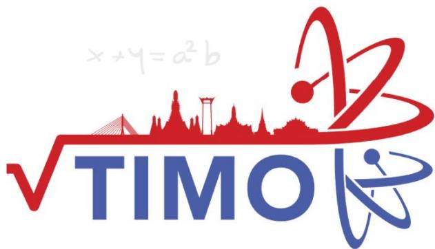

## Thailand International Mathematical Olympiad

KHOI2 

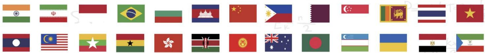

## MỤC LỤC

Giới thiệu Kỳ thi Olympic Toán học quốc tế TIMO . 

Danh sách các trường tham gia tích cực và đạt thành tích cao tại các kỳ TIMO .. ..6 

Một số hình ảnh tiêu biểu của Kỳ thi Olympic Toán học quốc tế TIMO tại Việt Nam .......8 

Syllabus/ Khung chƣơng trình... .11 

Đề thi Đáp án 

## PRELIMINARY ROUND / VÒNG LOẠI QUỐC GIA

Đề số 1... .. 12 ..........50 

Đề số 2... .. 16 ..........51 

Đề số 3.... .. 21 ..........52 

Đề số 4.... .. 25 ..........53 

Đề số 5.... ... 29 ..........54 

## HEAT ROUND / VÒNG CHUNG KẾT QUỐC GIA

Đề số 1... .. 33 ..........55 

Đề số 2.... . 37 ..........56 

Đề số 3..................................................... .......................... 41 ..........57 

Đề số 4..... 

Đề số 5.... ... 47 ..........59 

Heat Round Answer Sheet/ Phiếu Trả Lời Vòng Chung Kết Quốc Gia..... ...60 

Một số kỳ thi Olympic quốc tế tiêu biểu khác . ..61 

Thông tin liên hệ .... ...65 

# GIỚI THIỆU KỲ THI OLYMPIC TOÁN HỌC QUỐC TẾ TIMO

Kỳ thi Olympic Toán học quốc tế TIMO (Thailand International Mathematical Olympiad) được tổ chức hàng năm bởi Trung tâm Giáo dục Vô địch Olympiad Hong Kong (Olympiad Champion Education Centre from Hong Kong) hợp tác cùng Tổ chức Du lịch Thái Lan (Tourism Authority of Thailand) nhằm tạo cơ hội cho tất cả học sinh các khối lớp từ mẫu giáo đến trung học phổ thông có sở thích về Toán học tham gia, mục đích kích thích và nuôi dưỡng niềm yêu thích toán học của giới trẻ, tăng cường khả năng tư duy sáng tạo của học sinh, mở rộng mối quan hệ giao lưu văn hóa quốc tế. Với các thí sinh tham dự kỳ thi TIMO và đạt huy chương Vàng tại vòng Chung kết quốc tế sẽ được tham dự vòng Chung kết kỳ thi Olympic Toán học Thế giới WIMO vào tháng hàng năm. 

Trong mỗi lần tổ chức, Kỳ thi Olympic Toán học quốc tế TIMO đã thu hút hàng trăm nghìn thí sinh tham dự đến từ nhiều quốc gia và vùng lãnh thổ khác nhau trên thế giới như: Australia, Brazil, Bulgaria, Cambodia, England, France, Georgia, Ghana, Hong Kong, Indonesia, India, Iran, Kazakhstan, Kyrgyzstan, Malaysia, Myanmar, Philippines, Singapore, Sri Lanka, Switzerland, Taiwan, Turkey, Thailand, Vietnam, ... 

Năm học 2021-2022 là lần thứ ba Kỳ thi được tổ chức tại Việt Nam. Trong lần thứ hai tham dự, tại Vòng Chung kết quốc gia, các thí sinh Việt Nam đã rất xuất sắc với 74% đạt giải trong đó Cúp Vô địch, 2 Cúp Á quân , 3 Cúp [ quân 2; 7% Huy chương Vàng, 9% Huy chương Bạc, 38% Huy chương Đồng và 10% giải Khuyến khích. Đặc biệt, trong vòng Chung kết quốc tế, đội tuyển Việt Nam đã xuất sắc đạt thành tích cao bao gồm 36 giải Vàng, 87 giải Bạc, 163 giải Đồng, trong đó có 1 Cúp Ngôi sao thế giới dành cho thí sinh cao điểm nhất Việt Nam, Cúp Vô địch dành cho thí sinh cao điểm nhất toàn cầu và 1 Cúp Á quân 2 dành cho thí sinh cao điểm thứ 3 toàn cầu tại mỗi khối lớp. 

Với mong muốn góp phần tạo dựng thêm sân chơi giao lưu quốc tế dành cho học sinh Việt Nam, đồng thời góp phần nâng cao trình độ và cơ hội hợp tác cho giáo viên và cán bộ giáo dục, tiếp cận các nền giáo dục tiên tiến trên thế giới, Ban Tổ chức kỳ thi mong muốn nhận được sự ủng hộ, hỗ trợ và tham gia của các Sở, Phòng Giáo dục và Đào tạo, nhà trường, phụ huynh và các em học sinh để các kỳ thi quốc tế tại Việt Nam đạt được hiệu quả cao nhất. 

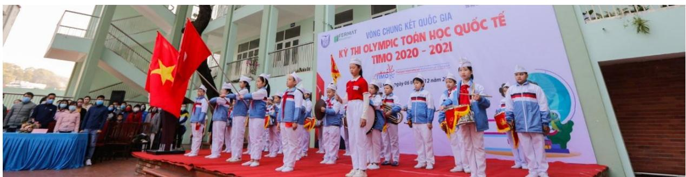

Hội đồng thi trường TH Hạ Long, Quảng Ninh tại Vòng Chung kết quốc gia TIMO 2020 - 2021

## Thông tin chi tiết về Kỳ thi Olympic Toán học quốc tế TIMO

## 1. Quy định về độ tuổi, cấu trúc đề thi

## a. Về độ tuổi

Tất cả các học sinh yêu thích môn Toán từ Lớp mẫu giáo tới Lớp 12 trung học phổ thông. 

## b. Về cấu trúc đề thi

<table><tr><td colspan="2">Vòng thi</td><td>Vòng loại quốc gia</td><td>Vòng Chung kết quốc gia</td><td>Vòng Chung kết quốc tế</td></tr><tr><td colspan="2">Số câu hỏi</td><td>25</td><td>25</td><td>30</td></tr><tr><td colspan="2">Điểm mỗi câu hỏi</td><td>4</td><td>4</td><td>5</td></tr><tr><td colspan="2">Tổng điểm</td><td>100</td><td>100</td><td>150</td></tr><tr><td rowspan="5">Chủ đề</td><td>Tư duy lôgic</td><td>5</td><td>5</td><td>6</td></tr><tr><td>Số học/Đại số</td><td>5</td><td>5</td><td>6</td></tr><tr><td>Lý thuyết số</td><td>5</td><td>5</td><td>6</td></tr><tr><td>Hình học</td><td>5</td><td>5</td><td>6</td></tr><tr><td>Tổ hợp</td><td>5</td><td>5</td><td>6</td></tr><tr><td colspan="2">Thời gian</td><td>60 phút</td><td>90 phút</td><td>120 phút</td></tr><tr><td colspan="2">Dạng đề thi</td><td>Trắc nghiệm</td><td>Điền đáp án</td><td>Điền đáp án</td></tr><tr><td colspan="2">Ngôn ngữ</td><td>Song ngữ Anh – Việt</td><td>Tiếng Anh (có trích dẫn thuật ngữ tiếng Việt)</td><td>Tiếng Anh</td></tr></table>

## 2. Cơ cấu giải thưởng

## a. Giải thƣởng của Ban Tổ chức quốc tế

<table><tr><td rowspan="2">Huy chương</td><td colspan="2">Điều kiện xét giải</td><td rowspan="2">Giải thường</td></tr><tr><td>Vòng Chung kết quốc gia</td><td>Vòng Chung kết quốc tế</td></tr><tr><td>Ngôi sao thế giới (World Star)</td><td></td><td>Thí sinh cao điểm nhất mỗi khu vực.</td><td>- Cúp Ngôi sao thế giới;- Miễn lệ phí tham dự Vòng Chung kết quốc tế.</td></tr><tr><td>Giải Xuất sắc (Champion 1stRunner-up 2ndRunner-up)</td><td>03 thí sinh cao điểm nhất mỗi khối thi.</td><td>03 thí sinh điểm cao nhất mỗi khởi thi.</td><td>- Cúp Vô dịch;- Cúp Á quân 1;- Cúp Á quân 2.</td></tr><tr><td>Giải Vàng (Gold Award)</td><td>Thí sinh chiến thắng đạt từ 80 điểm trở lên.</td><td>Thí sinh chiến thắng đạt từ 120 điểm trở lên.</td><td>Huy chương và Giấy chứng nhận.</td></tr><tr><td>Giải Bạc (Silver Award)</td><td>Thí sinh chiến thắng đạt từ 60 điểm trở lên.</td><td>Thí sinh chiến thắng đạt từ 90 điểm trở lên.</td><td>Huy chương và Giấy chứng nhận.</td></tr><tr><td>Giải Đồng (Bronze Award)</td><td>Thí sinh chiến thắng đạt từ 40 điểm trở lên.</td><td>Thí sinh chiến thắng đạt từ 60 điểm trở lên.</td><td>Huy chương và Giấy chứng nhận.</td></tr><tr><td>Giải Khuyến khích (Merit)</td><td>Thí sinh chiến thắng đạt từ 20 điểm trở lên.</td><td>Thí sinh chiến thắng đạt từ 30 điểm trở lên.</td><td>Giấy chứng nhận.</td></tr></table>

Đặc biệt, các thí sinh đạt Huy chương Vàng Vòng Chung kết quốc tế TIMO được tham dự (miễn lệ phí thi) Vòng Chung kết Kỳ thi Olympic Toán thế giới WIMO vào tháng 1 năm tới. 

## Lưu ý:

- Vòng loại quốc gia không xếp giải. Khoảng 70% thí sinh có điểm cao nhất của Vòng loại quốc gia được đăng ký tham gia Vòng Chung kết quốc gia. 

- Ban Tổ chức sắp xếp kết quả giảm dần dựa trên điểm thi và ngày sinh. Do đó, các thí sinh bằng điểm có thể nhận hai giải khác nhau. Nếu một giải thưởng đã đủ chỉ tiêu, thí sinh tiếp theo sẽ nhận giải thưởng mức liền kề phía dưới. 

- Các mốc điểm đạt giải có thể thay đổi dựa trên kết quả thi thực tế của tất cả thí sinh. 

## b. Giải thƣởng của Ban Tổ chức Việt Nam

* Đối với thí sinh: 

- Thí sinh cao điểm nhất Vòng Chung kết quốc gia được giải thưởng tiền mặt 5.000.000 đồng (năm triệu đồng). 

- Với mỗi khối có từ 100 thí sinh tham dự Vòng loại quốc gia, thí sinh cao điểm nhất khối thi Vòng Chung kết quốc gia được giải thưởng tiền mặt 2.000.000 đồng (hai triệu đồng); 

Với các giải thưởng tiền mặt phía trên, nếu có nhiều hơn một thí sinh đạt giải, số tiền thưởng được chia đều cho các thí sinh đạt giải. 

- Thí sinh đạt huy chương Vàng vòng Chung kết quốc gia và đạt giải Vòng Chung kết quốc tế TIMO được đặc cách miễn Vòng loại quốc gia các kỳ thi HKIMO, BBB cùng năm học và các tặng thưởng lệ phí khi tham gia các kỳ thi có trong Thông báo của mỗi kỳ thi. 

* Đối với Trường có học sinh tham dự: 

- Trường có từ 300 học sinh tham gia Kỳ thi sẽ được tặng Giấy khen, Kỷ niệm chương và quảng bá logo của trường trên tất cả các ấn phẩm truyền thông các Kỳ thi của Ban Tổ chức. 

- Trường có từ 150 học sinh tham gia Kỳ thi sẽ được tặng Giấy khen, Kỷ niệm chương và quảng bá logo của trường trên tất cả các ấn phẩm truyền thông về Kỳ thi. 

- Trường có từ 50 học sinh tham gia Kỳ thi sẽ được tặng Giấy khen tham dự tích cực trong Kỳ thi quốc tế. 

## Danh sách các trường tham gia tích cực và đạt thành tích cao tại các kỳ TIMO

. TH Điện Biên , Thanh Hóa 

2. TH Nguyễn Văn Trỗi, Thanh Hóa 

3. TH Lê Mao, Nghệ An 

4. TH Xuân La, Hà Nội 

5. TH Cầu Giát, Nghệ An 

6. TH Cầu Diễn, Hà Nội 

7. IQ School , Hà Nội 

8. TH Chu Văn An, Hà Nội 

9. TH Nghĩa Tân, Hà Nội 

0. TH Lê Ngọc Hân, Hà Nội 

. TH Xuân Đỉnh, Hà Nội 

12. TH,THCS,THPT Đông Bắc Ga, Thanh Hóa 

3. THCS Lê Lợi, Hà Nội 

14. TH I-sắc Niu-tơn, Hà Nội 

15. TH Đông Thái, Hà Nội 

6. TH Nam Thành Công, Hà Nội 

7. TH Đội Cung, Nghệ An 

8. TH Thị trấn Phùng, Hà Nội 

9. TH Đông Ngạc B, Hà Nội 

20. THCS Chu Văn An, Hà Nội 

2 . TH Cao Bá Quát, Hà Nội 

22. TH, THCS & THPT Vinschool, Hồ Chí Minh 

23. TH Hưng Dũng , Nghệ An 

24. TH Tây Sơn, Hà Nội 

25. TH,THCS&THPT Nobel school, Thanh Hóa 

26. TH Đồng Mỹ, Quảng Bình 

27. TH NEWTON GOLDMARK, Hà Nội 

28. THCS Thị Trấn Nghĩa Đàn, Nghệ An 

29. TH Ba Trại A, Hà Nội 

30. TH Quảng An, Hà Nội 

3 . TH Nhật Tân, Hà Nội 

32. TH Gia Thượng, Hà Nội 

33. TH Thượng Sơn, Nghệ An 

34. TH Lam Sơn 3, Thanh Hóa 

35. TH Thanh Trì, Hà Nội 

36. TH Dương Xá, Hà Nội 

37. THCS Xuân Diệu, Hà Tĩnh 

38. TH Tây Tựu B, Hà Nội 

39. TH Chu Văn An, Nam Định 

40. TH Giáp Bát, Hà Nội 

4 . TH Hà Huy Tập 2, Nghệ An 

42. TH Minh Khai A, Hà Nội 

43. TH Lê Lợi, Nghệ An 

44. IQ School, Ninh Bình 

45. TH Ba Trại B, Hà Nội 

46. TH Phương Canh, Hà Nội 

47. TH Mỹ Đình 2, Hà Nội 

48. THCS Đông Thái, Hà Nội 

49. TH Phú Phương, Hà Nội 

50. TH Vạn Thắng, Hà Nội 

5 . TH Hải Cường, Nam Định 

52. THCS Thái Thịnh, Hà Nội 

53. Hanoi Academy, Hà Nội 

54. TH Phúc Diễn, Hà Nội 

55. THCS Bạch Liêu, Nghệ An 

56. THCS Phú Diễn, Hà Nội 

57. TH Lưu Sơn, Nghệ An 

58. THCS Cao Bá Quát, Hà Nội 

59. TH Bến Thủy, Nghệ An 

60. THCS & THPT Lê Quý Đôn, Hà Nội 

6 . THCS Minh Khai, Hà Nội 

62. THCS Trần Phú, Thanh Hóa 

63. THCS Văn Đức, Hà Nội 

64. TH Lê Ngọc Hân, Hà Nội 

65. TH Ngô Đức Kế, Hà Tĩnh 

66. THCS Xuân Đỉnh, Hà Nội 

67. THCS Trung Lương, Hà Tĩnh 

68. TH Hưng Dũng 2, Nghệ An 

69. TH An Dương, Hà Nội 

70. TH Đô Thị Việt Hưng, Hà Nội 

7 . TH Thịnh Sơn, Nghệ An 

72. TH Quang Trung, Hà Nội 

73. THCS - THPT Newton, Hà Nội 

74. THCS Ngô Gia Tự, Hà Nội 

75. THCS Xuân La, Hà Nội 

76. THCS Hà Huy Tập, Hà Nội 

77. TH Tòng Bạt, Hà Nội 

78. TH&THCS NEWTON 5, Hà Nội 

79. TH Cổ Nhuế 2B, Hà Nội 

80. TH Hòa Hiếu I, Nghệ An 

8 . THCS Đông Ngạc, Hà Nội 

82. TH Đồng Nhân, Hà Nội 

83. THCS Nguyễn Trường Tộ, Hà Nội 

84. THCS Ninh Hiệp, Hà Nội 

85. TH Vật Lại, Hà Nội 

86. TH Tây Đằng A, Hà Nội 

87. THCS Thượng Cát, Hà Nội 

88. TH Đại Từ, Hà Nội 

89. TH Quang Tiến, Nghệ An 

90. TH Đức Thắng, Hà Nội 

9 . TH Thuận Sơn, Nghệ An 

92. TH và THCS Fansipan, Thanh Hóa 

93. THCS Vĩnh Quỳnh, Hà Nội 

94. TH Phú Châu, Hà Nội 

95. TH Quỳnh Hồng, Nghệ An 

96. THCS Tứ Hiệp, Hà Nội 

97. THCS Phan Đăng Lưu, Nghệ An 

98. TH Ngô Đức Kế, Hà Tĩnh 

99. THCS Hồ Xuân Hương, Nghệ An 

00. Trường Quốc tế song ngữ UK Academy, Quảng Ngãi 

0 . TH Nguyễn Thị Minh Khai, Hải Phòng 

02. TH Gia Khánh A, Vĩnh Phúc 

## Một số hình ảnh tiêu biểu của Kỳ thi Olympic Toán học quốc tế TIMO tại Việt Nam

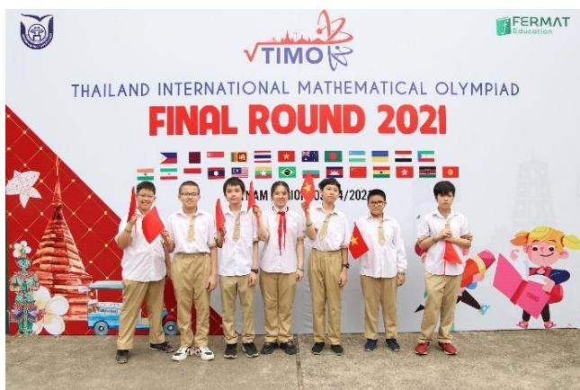

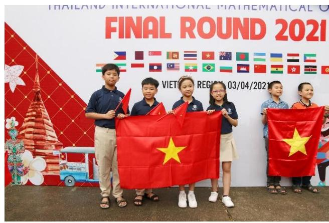

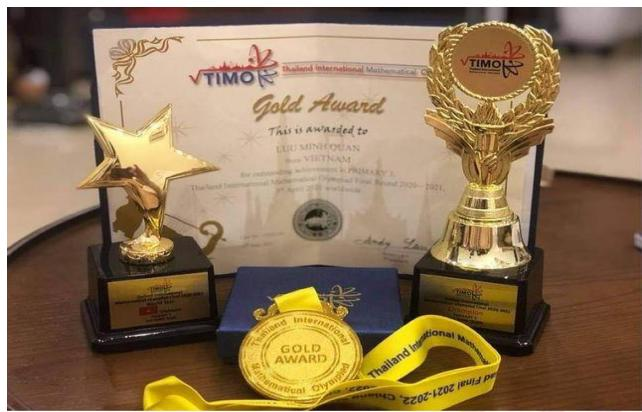

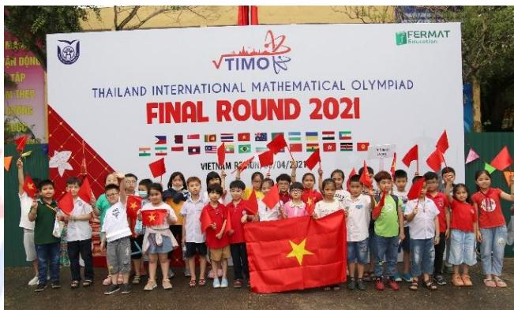

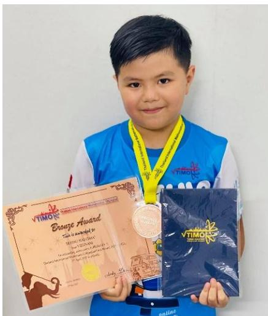

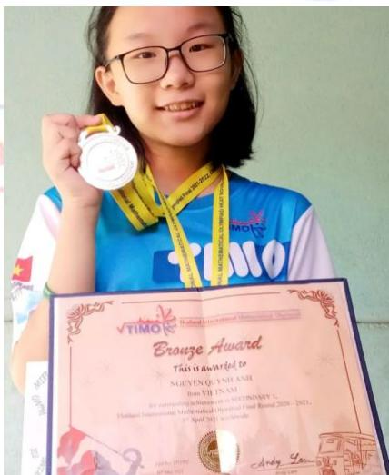

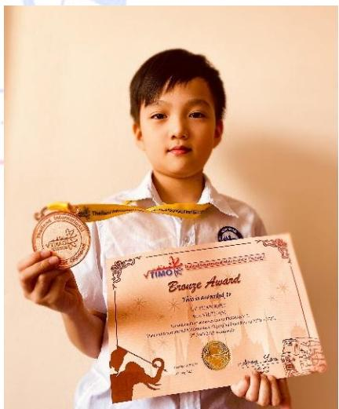

Vòng Chung kết quốc tế TIMO 2020 - 2021 

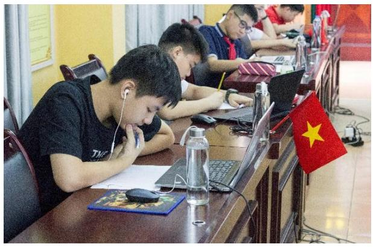

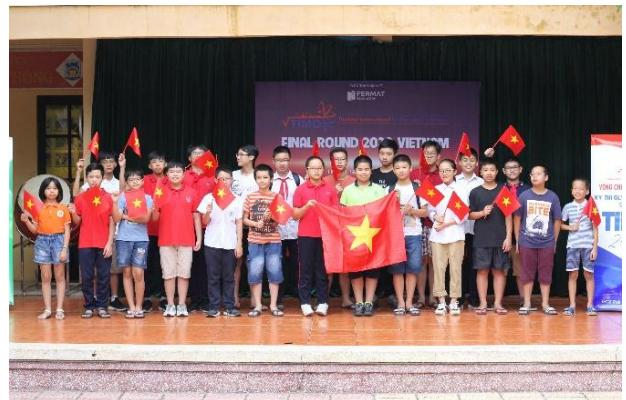

Hội đồng thi trường THCS Thái Thịnh, Đống Đa, Hà Nội năm học 2019 - 2020

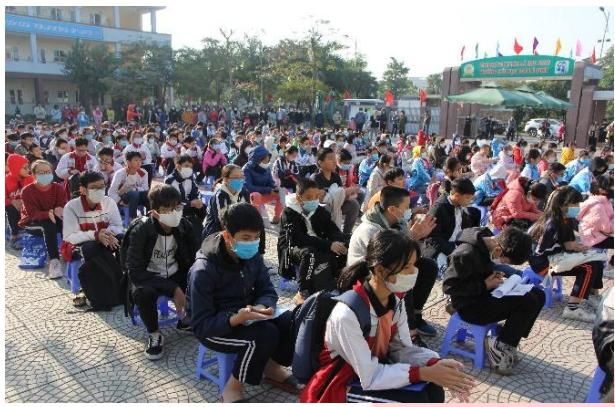

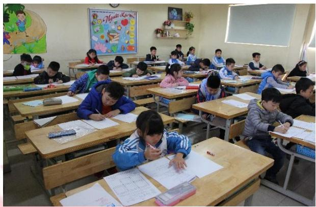

Hội đồng thi trường TH Cao Bá Quát, Gia Lâm, Hà Nội năm học 2020 - 2021

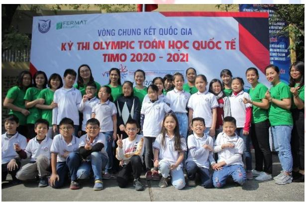

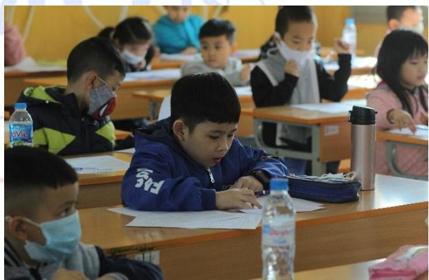

Hội đồng thi Trường Đại học Thủ Đô Hà Nội năm học 2020 - 2021

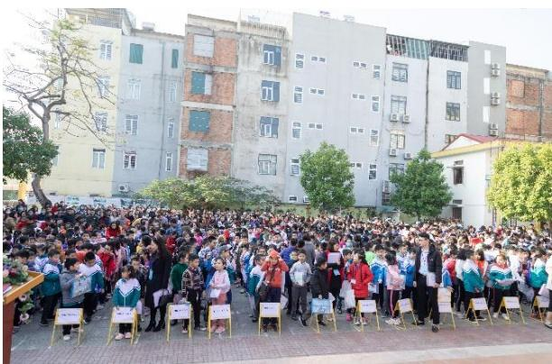

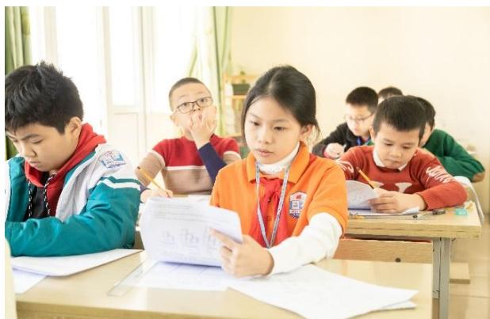

Hội đồng thi tỉnh Thanh Hóa năm học 2020 - 2021

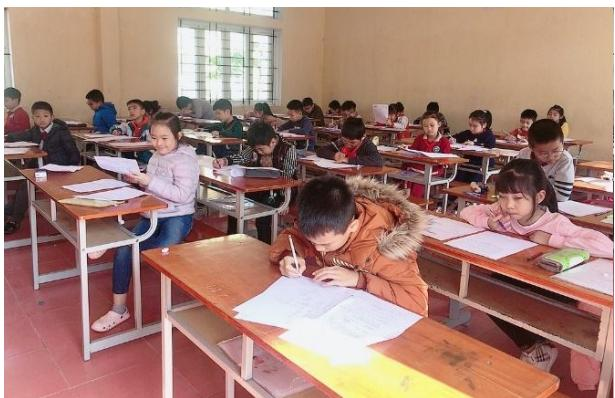

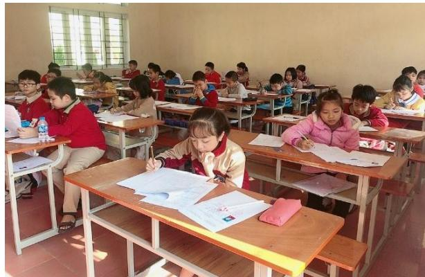

Hội đồng thi tỉnh Nam Định năm học 2020 - 2021

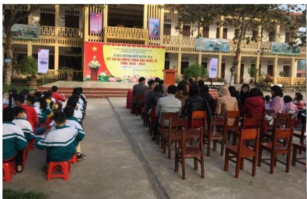

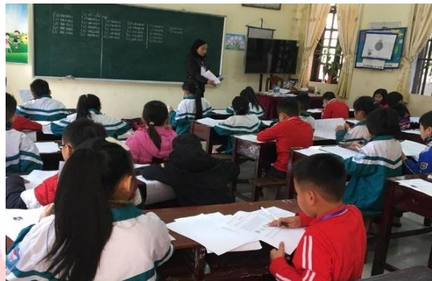

Hội đồng thi trường TH Hải Cường, Nam Định năm học 2020 - 2021

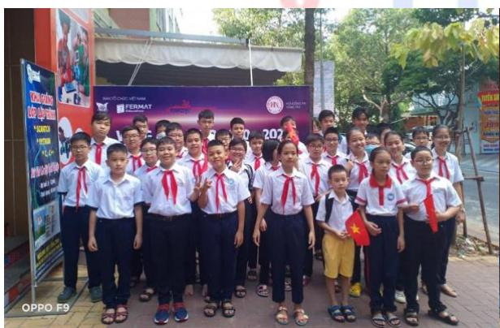

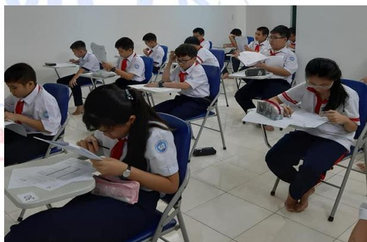

Hội đồng thi tỉnh Bà Rịa - Vũng Tàu năm học 2020 - 2021

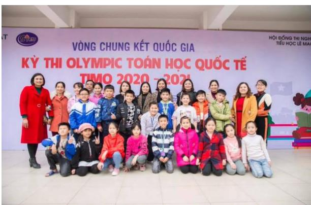

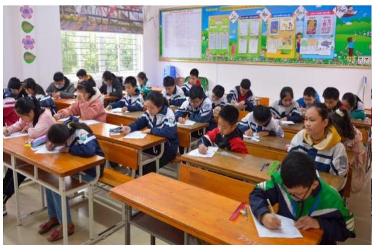

Hội đồng thi trường TH Lê Mao, Nghệ An năm học 2020 - 2021

SYLLABUS / KHUNG CHƢƠNG TRÌNH

<table><tr><td>TopicsChủ đề</td><td>Grade 2 / Khối 2</td></tr><tr><td>Logical thinkingTư duy logic</td><td>Balance Problem / Bài toán cái cânBasic Number &amp; Figure Pattern / Dãy số và dãy hình có quy luật đơn giảnIQ Age Problem &amp; Date Problem / Tuổi và ngày thángBasic logical problems / Bài toán tư duy cơ bản</td></tr><tr><td>ArithmeticSố học</td><td>Addition or Subtraction on 2-digit numbers / Cộng trừ số có một chữ sốAddition or Subtraction on 3-digit numbers / Cộng trừ số có 2 chữ sốBalance on an equation / Cân bằng phép tínhSimple multiplication (for heat round) / Pháp nhân cơ bản (vòng quốc gia)</td></tr><tr><td>Number theoryLý thuyết số</td><td>Introduction on Odd &amp; Even / Giới thiệu số chắn số lẻMathematical Leveling / Dạng toán chia đềuMatch Equation / Ghép thành phép tính đúngBasic Arithmetic Pattern / Quy luật dãy số cách đều</td></tr><tr><td>GeometryHình học</td><td>Counting on number of 2-D &amp; 3-D Figures / Đếm hình 2D hoặc 3DObservations of 3-D figures / Quan sát hình 3DBasic Figure Pattern / Dãy hình có quy luật đơn giản</td></tr><tr><td>CombinatoricsTổ hợp</td><td>Simple Distribution / Chia đồ vật vào các nhómCounting on specific numbers or cases / Đếm các số hoặc các trường hợp đặc biệtFormation of numbers / Thành lập số</td></tr></table>

*Khung chương trình mang tính chất tham khảo. 

# PRELIMINARY ROUND / VÒNG LOẠI QUỐC GIA

# ĐỀ SỐ 1: Đề thi Vòng loại quốc gia năm học 2020 - 2021

## Logical thinking / Tƣ duy lô-gic

1. Michael’s class has 5 boys and 6 girls. How many classmates does he have? Lớp của Michael có 5 bạn trai và 6 bạn gái. Hỏi Michael có bao nhiêu bạn cùng lớp? 

A. 11 

B. 10 

C. 12 

D. 9 

2. If today is Wednesday and also the first day of March. Which day of the week is 9th March? Nếu hôm nay là thứ Tư và cũng là ngày đầu tiên của tháng 3. Vậy ngày 9 tháng 3 là ngày thứ mấy? 

A. Wednesday (Thứ Tư) 

B. Saturday (Thứ Bảy) 

C. Friday (Thứ Sáu) 

D. Thursday (Thứ Năm) 

3. According to the pattern below, find the 15th figure counting from the left. Dựa vào quy luật dưới đây, tìm hình thứ 15 tính từ bên trái. 

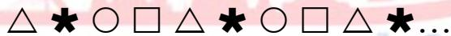

A.  

B.  

C. △ 

D.  

4. Dan celebrated his 6th birthday 3 years ago. How old will he be 2 years later? Dan tổ chức sinh nhật lần thứ 6 vào 3 năm trước. Hỏi 2 năm nữa anh ấy mấy tuổi? 

A. 1 

B. 11 

C. 7 

D. 5 

5. According to the pattern below, what is the value of the next number? 

Dựa vào quy luật của dãy số sau, giá trị của số tiếp theo là số nào? 

50, 3, 45, 6, 40, 9, 35, 2, < 

A. 13 

B. 15 

C. 25 

D. 30 

## Arithmetic / Số học

6. Find the value of 5 + 6 + 7 + 8 + 9 + 10. 

Tìm giá trị của 5 + 6 + 7 + 8 + 9 + 10. 

A. 50 

B. 55 

C. 40 

D. 45 

7. Calculate 13 – 11 + 9 – 7 + 5 – 3 + 1. 

Tính 13 – 11 + 9 – 7 + 5 – 3 + 1. 

A. 14 

B. 6 

C. 7 

D. 10 

Gordon thinks of a number. He adds 38 then subtracts 42 to get the smallest 2-digit odd number. Find Gordon’s number. 

Gordon nghĩ ra một số. Anh ấy lấy số đó cộng thêm 38 rồi trừ đi 42 thì được số lẻ nhỏ nhất có hai chữ số. Tìm số đó. 

A. 15 

B. 25 

C. 14 

D. 7 

9. Let X and Y be different 1-digit numbers. If the equation below is correct, find the value of Y. 

Cho X và Y là các số có một chữ số khác nhau. Biết rằng phép toán dưới đây là đúng, tìm giá trị của Y. 

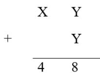

A. 4 

B. 8 

C. 9 

D. 7 

10. According to the pattern of the following sequence, find the sum of the first eight numbers. 

Dựa vào quy luật dãy số dưới đây, hãy tìm tổng của 8 số đầu tiên. 

, , 2, 3, 5, 8, < 

A. 21 

B. 54 

C. 44 

D. 34 

## Number theory / Lý thuyết số

11. According to the pattern below, find the value of the 7th number in the sequence. 

Dựa vào quy luật dưới đây, tìm giá trị của số thứ 7 trong dãy. 

3, 7, , 5, < 

A. 18 

B. 19 

C. 23 

D. 27 

12. From 7 to 23, how many 2-digit numbers are there? 

Trong các số từ 7 đến 23, hỏi có bao nhiêu số có hai chữ số? 

A. 13 

B. 14 

C. 15 

D. 16 

13. Cara has 40 candies and Jolie has 20 candies. How many candies does Cara have to give Jolie to make them have the same number of candies? 

Cara có 40 cái kẹo và Jolie có 20 cái kẹo. Hỏi Cara phải cho Jolie bao nhiêu cái kẹo để hai bạn có số kẹo bằng nhau? 

A. 20 

B. 15 

C. 10 

D. 5 

14. Refer to these numbers, how many odd numbers greater than 39 are there? 

Trong các số dưới đây, hỏi có bao nhiêu số lẻ lớn hơn 39? 

12, 15, 28, 93, 35, 41, 90 

A. 3 

B. 2 

C. 4 

D. 1 

15. Fill in the blank to get a correct equation. 

Điền số thích hợp vào chỗ trống để được phép toán đúng. 

$$
\_ + 2 7 = 1 9 + 4 8 - 2 3
$$

A. 17 

B. 27 

C. 61 

D. 71 

## Geometry / Hình học

16. At least how many cubes are there in the figure below? 

Hình dưới đây có ít nhất bao nhiêu khối lập phương? 

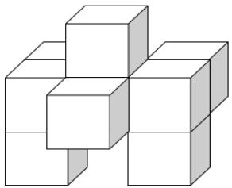

A. 8 

B. 7 

C. 6 

D. 9 

17. At least how many squares can be seen if viewing the figure from top? 

Nếu nhìn hình dưới đây từ trên xuống thì có thể thấy được ít nhất bao nhiêu hình vuông? 

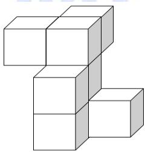

A. 3 

B. 4 

C. 6 

D. 5 

18. How many triangles are there in the figure below? 

Hình dưới đây có bao nhiêu hình tam giác? 

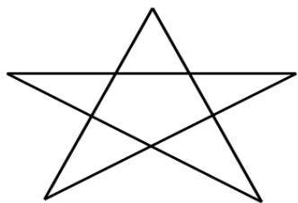

A. 5 

B. 8 

C. 10 

D. 12 

19. Daniel draws 6 lines on a sheet of paper. At most how many squares can be formed by Daniel? 

Daniel vẽ 6 đường thẳng trên một tờ giấy. Hỏi anh ấy có thể tạo ra nhiều nhất bao nhiêu hình vuông? 

A. 1 

B. 4 

C. 5 

D. 6 

20. According to the pattern shown below, how many circles are there in the first 20 figures? Dựa vào quy luật dưới đây, hỏi có bao nhiêu hình tròn trong 20 hình đầu tiên? 

▲ ▲ ▲ < 

A. 6 

B. 8 

C. 10 

D. 12 

## Combinatorics / Tổ hợp

21. Separate the following stars into 3 equal groups. How many stars are there in the first 2 groups? 

Chia các hình ngôi sao dưới đây thành 3 nhóm bằng nhau. Hỏi có bao nhiêu hình ngôi sao trong 2 nhóm đầu tiên? 

A. 3 

B. 4 

C. 6 

D. 9 

22. Arrange these numbers in descending order to find the 4th largest number. Sắp xếp các số sau từ lớn đến bé để tìm số lớn thứ tư. 

23, 91, 73, 39, 46, 82, 50 

A. 39 

B. 50 

C. 46 

D. 73 

23. Tom chooses 2 different digits from 1, 4 and 7 to form 2-digit numbers. Among those numbers, how many odd numbers are there? 

Tom chọn 2 chữ số khác nhau từ 1, 4 và 7 để lập thành các số có hai chữ số. Hỏi trong số đó có bao nhiêu số lẻ? 

A. 3 

B. 4 

C. 5 

D. 6 

24. In how many ways can we distribute 6 identical flowers into 3 different vases given that no vases are empty? 

Hỏi có bao nhiêu cách để cắm 6 bông hoa giống nhau vào 3 lọ hoa khác nhau sao cho lọ nào cũng có hoa? 

A. 2 

B. 9 

C. 10 

D. 18 

25. Kesha has 2 different T-shirts and 3 different pants. Each day, she mixes a shirt with a pant to make a set of clothes. At most how many different sets of clothes can she mix? 

Kesha có 2 chiếc áo phông khác nhau và 3 chiếc quần khác nhau. Mỗi ngày, cô bé phối 1 chiếc áo với 1 chiếc quần để có một bộ quần áo. Hỏi cô bé có thể phối nhiều nhất bao nhiêu bộ quần áo khác nhau? 

A. 6 

B. 3 

C. 5 

D. 8 

## ĐỀ SỐ 2

## Logical thinking / Tƣ duy lô-gic

1. If last month was April, which month will it be 16 months later? 

Biết tháng trước là tháng 4, hỏi 16 tháng nữa là tháng mấy? 

A. May (Tháng 5) 

B. September (Tháng 9) 

C. August (Tháng 8) 

D. December (Tháng 12) 

2. By observing the pattern, what is the English letter in the space (‚__‛) provided? 

Quan sát quy luật dưới đây để điền chữ cái Tiếng Anh thích hợp vào chỗ trống (‚__‛). 

A , Z , B , __ , C , X , D , W , < 

A. E 

B. S 

C. U 

D. Y 

3. Observe the sequence below to replace the music note with a suitable number. 

Quan sát dãy số dưới đây để thay thế nốt nhạc bằng số thích hợp. 

50 , 49 , 47 , 44 , 40 , , < 

A. 35 

B. 39 

C. 30 

D. 36 

4. Refer to the pattern below, how many arrows are there in the 5th Group? 

Dựa vào quy luật dưới đây, hỏi sẽ có bao nhiêu mũi tên trong nhóm thứ 5? 

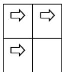

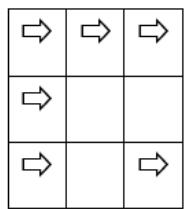

1st Group 

2nd Group 

3rd Group 

<table><tr><td></td><td></td><td></td><td></td></tr><tr><td></td><td></td><td></td><td></td></tr><tr><td></td><td></td><td></td><td></td></tr><tr><td></td><td></td><td></td><td></td></tr><tr><td></td><td></td><td></td><td></td></tr></table>

4th Group 

A. 15 

B. 20 

C. 21 

D. 16 

5. Each cupcake costs $2. Alice had $23 and she bought 7 cupcakes. How much money did she have left? 

Mỗi cái bánh có giá 2 đô. Alice có 23 đô và cô bé mua 7 cái bánh. Hỏi khi đó cô bé còn lại bao nhiêu tiền? 

A. $14 

B. $9 

C. $21 

D. $8 

## Arithmetic / Số học

6. Find the value of 28 + 43 + 72 + 29 + 11+ 37. 

Tìm giá trị của 28 + 43 + 72 + 29 + 11+ 37. 

A. 220 

B. 200 

C. 210 

D. 230 

7. Which number should the flower be replaced by to get a correct equation? Hỏi cần thay thế bông hoa dưới đây bởi số nào để được phép tính đúng? 

$$
flour + flour - 2 2 = flour + 2 4
$$

A. 23 

B. 46 

C. 2 

D. 40 

8. Find the value of 2 + 4 + 6 + < + 6 + 8. 

Tính giá trị của 2 + 4 + 6 + < + 16 + 18. 

A. 100 

B. 80 

C. 90 

D. 180 

9. Calculate: 7 2 11 2 2 3 2 9       . 

Tính: 7 2 11 2 2 3 2 9       . 

A. 60 

B. 50 

C. 40 

D. 70 

10. A and B represent different 1-digit numbers. What is the value of B if the equation is correct? 

Biết A và B biểu diễn các số có 1 chữ số khác nhau, hỏi giá trị của B là bao nhiêu để ta được phép tính đúng dưới đây? 

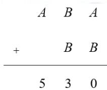

A. 5 

B. 6 

C. 3 

D. 4 

## Number theory / Lý thuyết số

11. Determine whether the sum + 2 + 3 + 4 + < + 9 is odd or even. 

Tổng 1 + 2 + 3 + < + 9 là số lẻ hay số chẵn? 

A. Odd (Số lẻ) 

B. Even (Sỗ chẵn) 

C. Both odd and even (Vừa chẵn vừa lẻ) 

D. Neither odd nor even (Không lẻ không chẵn) 

12. A box has balls with consecutive even numbers from 10 to 40. How many balls are there in the box? 

Một hộp chứa các quả bóng được đánh số chẵn liên tiếp từ 10 đến 40. Hỏi có bao nhiêu quả bóng trong hộp đó? 

A. 15 

B. 16 

C. 31 

D. 40 

13. Find the next number in the arithmetic sequence below. 

Tìm số tiếp theo trong dãy số cách đều dưới đây. 

A. 355 

B. 314 

C. 335 

D. 345 

14. Andy gave Betty 27 marbles and Betty gave Charlie 13 marbles so that they have the same number of marbles. How many marbles does Andy have more than Charlie originally? 

Andy cho Betty 27 viên bi và Betty cho Charlie 13 viên bi thì ba bạn có số bi bằng nhau. Hỏi lúc đầu Andy có nhiều hơn Charlie bao nhiêu viên bi? 

A. 27 

B. 41 

C. 14 

D. 40 

15. David collected 19 stamps. His brother collected 12 stamps. One page of the collection can contain no more than 9 stamps. At least how many pages are required to present all stamps of 2 brothers? 

David sưu tầm được 19 cái tem. Anh trai David sưu tầm được 12 cái tem. Mỗi trang của bộ sưu tập không chứa được nhiều hơn 9 cái tem. Hỏi cần ít nhất bao nhiêu trang để trưng bày được toàn bộ số tem của hai anh em? 

A. 2 

B. 3 

C. 4 

D. 5 

## Geometry / Hình học

16. How many squares are there in the figure below? 

Hỏi có bao nhiêu hình vuông trong hình dưới đây? 

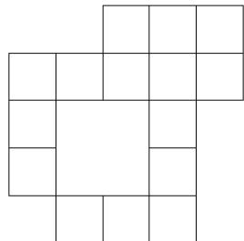

A. 21 

B. 22 

C. 16 

D. 19 

17. At least how many unit squares are seen if viewing the figure below from the right? 

Hỏi có thể nhìn thấy ít nhất bao nhiêu hình vuông đơn vị nếu nhìn hình dưới đây từ phía bên phải? 

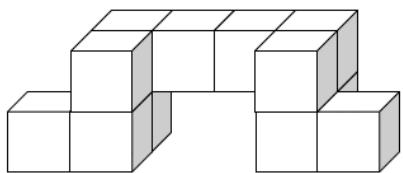

A. 4 

B. 3 

C. 7 

D. 6 

18. How many edges does a cube have? 

Hỏi một hình lập phương có bao nhiêu cạnh? 

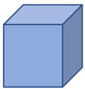

A. 16 

B. 12 

C. 9 

D. 8 

19. How many line segments are there in the figure below? 

Hỏi có bao nhiêu đoạn thẳng trong hình dưới đây? 

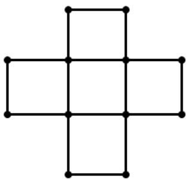

A. 18 

B. 24 

C. 16 

D. 28 

20. Refer to the figure sequence below. How many triangles are there in the first 23 symbols counting from the left? 

Xét dãy hình dưới đây. Hỏi có bao nhiêu hình tam giác trong 23 hình đầu tiên tính từ phía bên trái? 

A. 9 

B. 10 

C. 8 

D. 6 

## Combinatorics / Tổ hợp

21. A 4-digit number is formed by choosing 4 numbers without repetition from 0, 1, 3, 7 and 9. What is the difference between the largest and the smallest value? 

Một số có 4 chữ số được tạo ra bằng cách chọn 4 số không lặp lại từ 0, 1, 3, 7 và 9. Tìm hiệu giữa giá trị lớn nhất và giá trị nhỏ nhất có thể chọn được. 

A. 9594 

B. 8999 

C. 8352 

D. 8694 

22. The librarian needs to move some books so that 3 shelves below have the same number of books. At least how many books does she have to move? 

Thủ thư cần di chuyển một số sách để cả 3 ngăn có số sách bằng nhau. Hỏi cô ấy cần di chuyển ít nhất bao nhiêu quyển sách? 

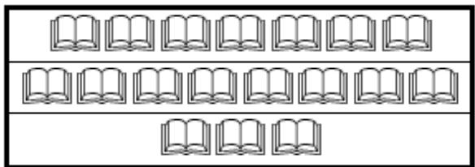

A. 5 

B. 6 

C. 3 

D. 2 

23. Choose 3 digits, can have repetition, from 0, 1, 3, 6 and 9 to form 3-digit even numbers. How many different numbers can be formed? 

Chọn 3 chữ số (có thể được chọn lặp lại) từ 0, 1, 3, 6 và 9 để lập thành các số chẵn có 3 chữ số. Hỏi có thể lập được bao nhiêu số khác nhau như vậy? 

A. 40 

B. 20 

C. 24 

D. 30 

24. For every 4 pens, the store gives each customer 2 erasers for free. If Fred buys 15 pens, how many erasers can he get? 

Cứ mua 4 chiếc bút thì khách hàng được tặng 2 cục tẩy miễn phí. Nếu Fred mua 15 chiếc bút thì anh ấy nhận được bao nhiêu cục tẩy? 

A. 7 

B. 3 

C. 8 

D. 6 

25. The 3 x 3 square below contains 9 consecutive numbers from 1 to 9 in each cell and the sum of numbers in each column or row is equal. Find the number that should be filled in cell A. 

Hình vuông 3 x 3 dưới đây gồm 9 số liên tiếp từ 1 đến 9 được điền vào mỗi ô. Tổng các số ở mỗi hàng và mỗi cột là bằng nhau. Hãy tìm số thích hợp để điền vào ô A. 

<table><tr><td>A</td><td>1</td><td>B</td></tr><tr><td>3</td><td>C</td><td>7</td></tr><tr><td>D</td><td>9</td><td>E</td></tr></table>

A. 2 

B. 4 

C. 6 

D. 8 

## ĐỀ SỐ 3

## Logical Thinking / Tƣ duy lô-gic

1. If the day before yesterday was Tuesday, which day of the week will 4 days later be? Nếu ngày trước ngày hôm qua là thứ Ba, hỏi 4 ngày nữa là thứ mấy trong tuần? 

A. Monday (Thứ Hai) 

B. Tuesday (Thứ Ba) 

C. Wednesday (Thứ Tư) 

D. Thursday (Thứ Năm) 

2. 17 children form a line. There are 9 people in front of Amy. What is her position counting form behind? 

17 đứa trẻ tạo thành một hàng. Có 9 người ở phía trước Amy. Hỏi vị trí của cô ấy đếm từ phía sau là thứ mấy? 

A. 6 

B. 7 

C. 8 

D. 9 

3. According to the pattern shown below, what is the number in the blank? Dựa vào quy luật dưới đây, số ở chỗ trống là số nào? 

2 、 6 、 12 、 20 、 30 、 42 、 __ 

A. 55 

B. 56 

C. 57 

D. 58 

4. John goes to school by bus and he needs to pay $5 each time. How much does he have to pay if he goes to school and goes back home during a week by bus? John đi đến trường bằng xe buýt và anh ấy cần trả $5 mỗi lần. Hỏi anh ấy phải trả bao nhiêu tiền nếu anh ấy đi đến trường và đi về nhà trong một tuần bằng xe buýt? 

A. $30 

B. $35 

C. $65 

D. $70 

5. According to the pattern shown below, how many  are there in the 13th group? Dựa vào quy luật dưới đây, có bao nhiêu trong nhóm thứ 13? 

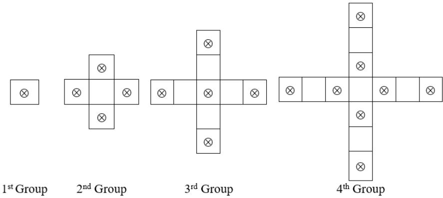

A. 23 

B. 24 

C. 25 

D. 26 

## Arithmetic / Số học

6. Find the value of 3 13 23 33 7 17 27 37       . 

Tìm giá trị của 3 13 23 33 7 17 27 37       . 

A. 160 

B. 161 

C. 162 

D. 163 

7. Find the value of 45 6 27 6   . 

Tìm giá trị của  45 6 27 6    . 

A. 60 

B. 72 

C. 78 

D. 66 

8. Find the value of 1 4 7 10 13 16 19 18 15 12 9 6 3             . 

Tìm giá trị của 1 4 7 10 13 16 19 18 15 12 9 6 3             . 

A. 5 

B. 6 

C. 7 

D. 8 

9. What is the number that should be filled in the blank if the equation below is correct? 

Số nào nên được điền vào chỗ trống nếu phép tính dưới đây đúng? 

$$
\_ \div 7 = 1 4
$$

A. 2 

B. 3 

C. 96 

D. 98 

10. If A and B are different 1-digit numbers, what is the value of B if the equation is correct? 

Nếu A và B là các số có 1 chữ số khác nhau, giá trị của B là bao nhiêu nếu phép tính sau đúng? 

$$
\mathrm{A} \quad \mathrm{B} \quad - \quad \mathrm{A} = 4 7
$$

A. 3 

B. 2 

C. 4 

D. 5 

## Number Theory / Lý thuyết số

11. Amy has 28 apples and John has 82 apples. How many apples does John have to give Amy to make them have the same number of apples? 

Amy có 28 quả táo và John có 82 quả táo. Hỏi John phải đưa cho Amy bao nhiêu quả táo để họ có số táo bằng nhau? 

A. 25 

B. 26 

C. 27 

D. 28 

12. 4 children have odd number of balloons in total. Two children have odd numbers of balloons and one child has even number of balloons. Determine the number of balloons of the remaining child is odd or even. 

4 bạn nhỏ có tổng số bóng bay là số lẻ. 2 bạn có số bóng bay là lẻ và 1 bạn có số bóng bay là chẵn. 

Xác định số bóng bay của bạn còn lại là lẻ hay chẵn. 

A. Odd (Số lẻ) 

B. Even (Số chẵn) 

C. Both odd and even (Vừa chẵn vừa lẻ) 

D. Neither odd nor even (Không lẻ không chẵn) 

13. The numbers below follow the arithmetic sequence. What is the 13th number? 

Các số dưới đây là một dãy số cách đều. Số thứ 13 là số nào? 

$$
1 2 3 \cdot 1 2 0 \cdot 1 1 7 \cdot 1 1 4 \cdot 1 1 1 \cdot \dots
$$

A. 87 

B. 88 

C. 89 

D. 90 

14. How many 2-digit numbers having the units digit that is smaller than 2 are there? Có bao nhiêu số có 2 chữ số có chữ số hàng đơn vị nhỏ hơn 2? 

A. 17 

B. 18 

C. 19 

D. 20 

15. Fill the lines with ‘ + ‘ and ‘ ‘ to make the equation below correct. Điền vào dòng kẻ với ‘+’ và ‘×’ để tạo thành phép tính đúng. 

$$
1 \_ 1 \_ 2 \_ 3 \_ 4 = 1 2
$$

A. 1 1 2 3 4 12     

B. 1 1 2 3 4 12     

C. 1 1 2 3 4 12     

D. 1 1 2 3 4 12     

## Geometry / Hình học

16. How many squares are there in the figure below? Có bao nhiêu hình vuông trong hình dưới đây? 

<table><tr><td></td><td></td><td></td><td></td><td></td><td></td></tr></table>

A. 12 

B. 14 

C. 15 

D. 17 

17. How many sides does a rectangle have? Một hình chữ nhật có bao nhiêu cạnh? 

A. 3 

B. 6 

C. 4 

D. 5 

18. According to the pattern shown below, what is the figure in the space (‚__‛) provided? Dựa vào quy luật dưới đây, hình điền vào chỗ trống (‚__‛) là hình gì? 

$$
\Delta \square \circ \circ \Delta \Delta \square \circ \circ \Delta \Delta \square \circ \circ \_ \Delta ..
$$

A. □ 

B. ○ 

C. △ 

D. ◎ 

19. At least how many squares can be seen if viewing the figure below from top? Có ít nhất bao nhiêu hình vuông có thể thấy nếu nhìn hình dưới đây từ trên xuống? 

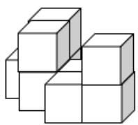

A. 5 

B. 6 

C. 7 

D. 8 

20. At most how many lines can be formed by using 4 points on a plane? Có nhiều nhất bao nhiêu đường thẳng có thể tạo thành từ 4 điểm trên một mặt phẳng? 

A. 3 

B. 4 

C. 5 

D. 6 

## Combinatorics / Tổ hợp

21. Amy, Andy and Johnny have some candies. After Amy gives 6 candies to Andy and 4 candies to Johnny, they have equal numbers of candies. How many candys did Amy have more than Johnny originally? 

Amy, Andy và Johnny có một số cái kẹo. Sau khi Amy cho Andy 6 cái kẹo và cho Johnny 4 cái kẹo, thì họ có số kẹo bằng nhau. Hỏi lúc đầu Amy có nhiều hơn Johnny bao nhiêu cái kẹo? 

A. 15 

B. 16 

C. 12 

D. 14 

22. What is the smallest 4-digit number by using 3, 5, 7 and 0? (Each digit can only be used once). 

Số nhỏ nhất có 4 chữ số tạo bởi các chữ số 3, 5, 7 và 0 là số nào? (Mỗi chữ số chỉ có thể dùng một lần). 

A. 3057 

B. 0357 

C. 3750 

D. 3507 

23. Pick 2 from 5 children to take part in mathematics competition. How many different combinations are there? 

Chọn 2 trong 5 học sinh để tham gia một cuộc thi toán. Hỏi có bao nhiêu cách chọn? 

A. 2 

B. 5 

C. 10 

D. 11 

24. How many even numbers are there in the first 26 numbers? 

Có bao nhiêu số chẵn trong 26 số đầu tiên? 

1, 5, 6, 11, 17, 28, < 

A. 8 

B. 9 

C. 10 

D. 11 

25. Jack has 4 $1 coins, 3 $2 coins and 2 $5 coins, how many different values of a product can he buy without any changes? 

Jack có 4 đồng $1, 3 đồng $2 và 2 đồng $5, hỏi có bao nhiêu giá trị khác nhau của một món hàng mà anh ấy có thể mua mà không có tiền thừa trả lại? 

A. 10 

B. 15 

C. 20 

D. 25 

# ĐỀ SỐ 4

## Logical Thinking / Tƣ duy lô-gic

1. According to the pattern shown below, what is the number in the blank (‚__‛)? 

Dựa vào quy luật dưới đây, số ở chỗ trống (‚__‛) là số nào? 

8 、 10 、 14 、 20 、 28 、 38 、 __ 、<. 

A. 48 

B. 49 

C. 50 

D. 51 

2. If the day after tomorrow will be Wednesday, which day of the week will 5 days later be? 

Nếu ngày sau ngày mai là thứ Tư, hỏi 5 ngày nữa là thứ mấy trong tuần? 

A. Saturday (Thứ Bảy) 

B. Tuesday (Thứ Ba) 

C. Wednesday (Thứ Tư) 

D. Thursday (Thứ Năm) 

3. 30 children form a row. Alice is the 11th starting from the front. What is her position counting form behind? 

30 đứa trẻ tạo thành một hàng. Alice ở vị trí thứ 11 tính từ phía trước. Hỏi vị trí của cô ấy khi đếm từ phía sau là bao nhiêu? 

A. 19 

B. 20 

C. 21 

D. 22 

4. Alice needs 10 minutes to finish a lap. Then she needs to rest 1 minute. How many minutes does she take to finish 10 laps if she continues her method? 

Alice cần 10 phút để hoàn thành một vòng dây. Sau đó cô ấy nghỉ 1 phút. Hỏi cô ấy mất bao nhiêu phút để hoàn thành 10 vòng dây nếu cô ấy cứ làm như vậy? 

A. 100 

B. 109 

C. 110 

D. 90 

5. According to the pattern shown below, how many ◎are there in the 9th group? 

Dựa vào quy luật dưới đây, có bao nhiêu ◎trong nhóm thứ 9? 

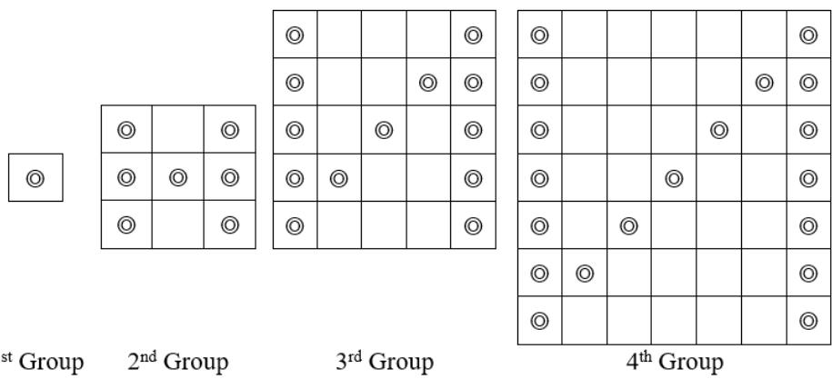

A. 46 

B. 47 

C. 48 

D. 49 

## Arithmetic / Số học

6. Find the value of 1 3 5 7 9 11 13 15       . 

Tìm giá trị của 1 3 5 7 9 11 13 15       . 

A. 64 

B. 65 

C. 66 

D. 67 

7. Find the value of $3 { \times } 3 + 6 { \times } 2 + 9 { \times } 1 + 1 8 { \times } 2$ . 

Tìm giá trị của 3 3 6 2 9 1 18 2        . 

A. 63 

B. 64 

C. 65 

D. 66 

8. Find the value of 7 4 5 3   . 

Tìm giá trị của  7 4 5 3    . 

A. 11 

B. 12 

C. 13 

D. 14 

9. What is the number that should be filled in the blank if the equation below is correct? 

Số được điền vào chỗ trống nếu phép tính dưới đây đúng là số nào? 

$$
\_ \div 3 + 1 3 = 2 8
$$

A. 15 

B. 75 

C. 17 

D. 45 

10. Refer to the puzzle on the right, find the value of B. 

Dựa vào phép tính bên phải, tìm giá trị của B. 

A 

A. 3 

B. 4 

C. 5 

D. 6 

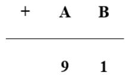

## Number Theory / Lý thuyết số

11. Alice has 31 pencils and Peter has 92 pencils. How many pencils does Alice have to ask Peter to give her to make Peter has 11 less pencils than Alice? 

Alice có 31 cái bút chì và Peter có 92 cái bút chì. Hỏi Alice cần xin Peter đưa cho bạn ấy bao nhiêu các bút chì để sau đó Peter có ít hơn Alice 11 cái bút chì? 

A. 32 

B. 34 

C. 36 

D. 38 

12. 15 students have even number of scores of mathematics test in total. 7 children have odd number of scores and 3 children has even number of scores. Determine the sum of scores of the remaining children is odd or even. 

15 học sinh có tổng số điểm của bài thi toán là số chẵn. 7 bạn có số điểm lẻ và 3 bạn có số điểm chẵn. Xác định tổng điểm của các bạn còn lại là lẻ hay chẵn. 

A. Odd (Số lẻ) 

B. Even (Số chẵn) 

C. Both odd and even (Vừa chẵn vừa lẻ) 

D. Neither odd nor even (Không lẻ không chẵn) 

13. The numbers below follow the arithmetic sequence. What is the 9th number? 

Các số dưới đây là một dãy cách đều. Hỏi số thứ 9 là số nào? 

$$
1 9 8 \cdot 1 8 7 \cdot 1 7 6 \cdot 1 6 5 \cdot 1 5 4 \cdot \dots
$$

A. 108 

B. 109 

C. 110 

D. 111 

14. How many 3-digit numbers having the units digit that is smaller than 5 are there? Có bao nhiêu số có 3 chữ số mà chữ số hàng đơn vị nhỏ hơn 5? 

A. 14 

B. 50 

C. 450 

D. 45 

15. Fill the lines with ‘ + ’ and ‘ ’ to make the equation below correct. Điền vào dòng kẻ với ‘+’ và ‘×’ để tạo thành một phép tính đúng. 

$$
1 \_ 1 \_ 4 \_ 4 \_ 5 = 2 3
$$

A. 1 1 4 4 5 23     

B. 1 1 4 4 5 23      

C. 1 1 4 4 5 23     

D. 1 1 4 4 5 23     

## Geometry / Hình học

16. How many squares are there in the figure below? Có bao nhiêu hình vuông trong hình dưới đây? 

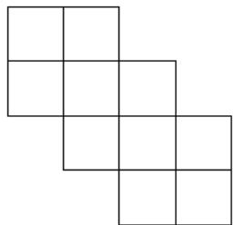

A. 10 

B. 11 

C. 12 

D. 13 

17. How many vertices do two distinct triangles have? Hai tam giác phân biệt có bao nhiêu đỉnh? 

A. 4 

B. 8 

C. 3 

D. 6 

18. By observing the pattern, what is the missing figure? Bằng cách quan sát quy luật, hình còn thiếu là hình gì? 

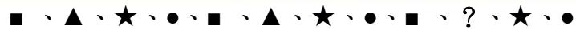

A. ★ 

B. ▲ 

C. ■ 

D. ● 

19. At least how many squares can be seen if viewing the figure below from the top? Có ít nhất bao nhiêu hình vuông có thể nhìn được nếu nhìn hình ở dưới từ phía trên? 

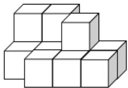

A. 6 

B. 7 

C. 8 

D. 9 

20. At most how many lines can be formed by using 6 points on a plane? Có nhiều nhất bao nhiêu đường thẳng được tạo bởi 6 điểm trên một mặt phẳng? 

A. 15 

B. 14 

C. 13 

D. 12 

## Combinatorics / Tổ hợp

21. After Alice gives 8 pencils to Peter and takes 6 pencils from Mary, they will have equal number of pencils. How many pencils did Mary have more than Peter originally? Sau khi Alice cho Peter 8 cái bút chì và lấy của Mary 6 cái bút chì, thì họ có số bút chì bằng nhau. Hỏi lúc đầu Mary có nhiều hơn Peter bao nhiêu cái bút chì? 

A. 14 

B. 13 

C. 12 

D. 11 

22. What is the greatest 4-digit number by using 2, 4, 6 and 8? (Each digit can only be used once). 

Số lớn nhất có 4 chữ số tạo bởi các chữ số 2, 4, 6 và 8? (Mỗi chữ số chỉ được dùng một lần). 

A. 8642 

B. 8624 

C. 6824 

D. 8462 

23. Pick 2 from 10 children to take part in interview. How many different ways are there? Chọn 2 trong 19 đứa trẻ để tham gia một cuộc phỏng vấn. Hỏi có bao nhiêu cách chọn khác nhau? 

A. 40 

B. 35 

C. 45 

D. 50 

24. How many odd numbers are there from the 4th to the 18th number? Có bao nhiêu số lẻ trong các số dưới đây tính từ số thứ 4 đến số thứ 18? 

, 2, 3, 5, 8, 3,< 

A. 11 

B. 12 

C. 10 

D. 13 

25. Alice has 5 $1 coins, 4 $2 coins and 5 $5 coins, how many values of a product can she buy without any changes? 

Alice có 5 đồng $1, 4 đồng $2 và 5 đồng $5, hỏi có bao nhiêu giá trị của một món hàng cô ấy có thể mua mà không có tiền thừa trả lại? 

A. 34 

B. 35 

C. 37 

D. 38 

## ĐỀ SỐ 5

## Logical Thinking / Tƣ duy lô-gic

1. If today is Saturday, which day of the week will 4 days later be? Nếu hôm nay là thứ Bảy, hỏi 4 ngày sau là thứ mấy trong tuần? 

A. Monday (Thứ Hai) 

B.Tuesday (Thứ Ba) 

C. Wednesday (Thứ Tư) 

D. Thursday (Thứ Năm) 

2. According to the pattern shown below, what is the number in the blank? 

Dựa vào quy luật dưới đây, số ở chỗ trống là số nào? 

2 、 6 、 10 、 14 、 18 、 22 、 

A. 26 

B. 24 

C. 27 

D. 28 

3. Class 2A has 34 students queuing up in a row. If there are 9 students behind Amy, how many students are in front of Amy? 

Lớp 2A có 34 học sinh xếp thành một hàng. Nếu có 9 học sinh phía sau Amy, hỏi có bao nhiêu học sinh đứng trước Amy? 

A. 25 

B. 24 

C. 23 

D. 22 

4. From the pattern shown below, how many  more than # is / are there in the 15th group? Dựa vào quy luật dưới đây,  nhiều hơn # bao nhiêu hình trong nhóm thứ 15? 

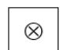

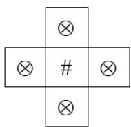

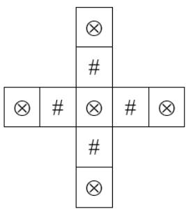

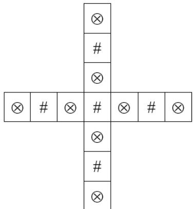

1st Group 

2nd Group 

3rd Group 

4h Group 

A. 0 

B. 1 

C. 2 

D. 3 

5. 3 years ago, Amy was 14 years old. How old is Amy now? 3 năm trước, Amy 14 tuổi. Hỏi Amy hiện tại bao nhiêu tuổi? 

A. 11 

B. 14 

C. 13 

D. 17 

## Arithmetic / Số học

6. Find the value of $7 + 1 7 + 2 7 + 3 7 + 4 7 + 3 + 3 + 3 + 3 + 3 + 3$ . Tìm giá trị của $7 + 1 7 + 2 7 + 3 7 + 4 7 + 3 + 3 + 3 + 3 + 3 + 3$ . 

A. 130 

B. 135 

C. 140 

D. 150 

7. Find the value of 15 : 3 + 25 : 5 – 30 : 5 . 

Tìm giá trị của 15 : 3 + 25 : 5 – 30 :5 . 

A. 3 

B. 4 

C. 5 

D. 6 

8. Find the value of 1 – 2 + 3 – 4 + 5 – 6 + 7 – 8 + 9. 

Tìm giá trị của 1 – 2 + 3 – 4 + 5 – 6 + 7 – 8 + 9. 

A. 3 

B. 7 

C. 5 

D. 9 

9. What is the number should be filled in the blank if the equation is correct? 

Số nên điền vào chỗ trống nếu phép tính dưới đây đúng là số nào? 

: 6 = 12 

A. 2 

B. 6 

C. 72 

D. 32 

10. Find the value of $1 0 \times 1 + 1 0 \times 2 + 1 0 \times 3 + 1 0 \times 4 .$ 

Tìm giá trị của 10 x 1 + 10 x 2 + 10 x 3 + 10 x 4. 

A. 80 

B. 90 

C. 100 

D. 110 

## Number Theory / Lý thuyết số

11. Amy has 23 apples and John has 11 apples. How many apples does John have to ask Amy to give him so that Amy has 2 more apples than John? 

Amy có 23 quả táo và John có 11 quả táo. Hỏi John cần xin Amy đưa cho bạn ấy bao nhiêu quả táo để Amy có nhiều hơn John 2 quả táo? 

A. 5 

B. 4 

C. 3 

D. 2 

12. The numbers below follow the arithmetic sequence, what is the 20th number? 

Các số dưới đây là một dãy số cách đều, số thứ 20 là số nào? 

101、103、105、107、109、< 

A. 138 

B. 139 

C. 140 

D. 141 

13. How many 2-digit numbers having the tens digit that is smaller than 3 are there? 

Có bao nhiêu số có 2 chữ số có chữ số hàng chục nhỏ hơn 3? 

A. 19 

B. 20 

C. 21 

D. 18 

14. Fill the lines with ‘ + ‘ and ‘– ’ to make the equation below correct. 

Điền vào dòng kẻ với ‘+’ và ‘–’ để tạo thành một phép tính đúng. 

1____3____5____7____11 = 11 

A. 1 3 5 7 11 11     

B. 1 3 5 7 11 11     

C. 1 3 5 7 11 11     

D. 1 3 5 7 11 11     

15. Determine the result of 1+ 2 + 3+ 4 + 5 + 6 + 7 +8 + 9 +10 +11+12 +13+14 is odd or even? Hãy xác định kết quả của 1+ 2 + 3 + 4 + 5 + 6 + 7 + 8 + 9 +10 +11+12 +13 +14 là lẻ hay chẵn. 

A. Odd (Số lẻ) 

B. Even (Số chẵn) 

C. Both odd and even (Vừa chẵn vừa lẻ) 

D. Neither odd nor even (Không chẵn không lẻ) 

## Geometry / Hình học

16. How many squares are there in the figure below? 

Có bao nhiêu hình vuông trong hình dưới đây? 

A. 9 

B. 10 

C. 11 

D. 12 

17. How many sides does a circle have? 

Một hình tròn có bao nhiêu cạnh? 

A. 0 

C. 2 

D. 3 

18. According to the pattern shown below, what is the figure in the space (‚?‛) provided? 

Dựa vào quy luật dưới đây, hình điền vào dấu ‚?‛ là hình gì? 

△ □ ○ ◊ △ △ □ ○ ◊ △△ ? ○ < 

A. △ 

B. ◊ 

D. □ 

19. At least how many squares can be seen if viewing the figure below from the side? 

Có ít nhất bao nhiêu hình vuông có thể nhìn thấy được nếu nhìn từ phía bên cạnh? 

A. 2 

B. 3 

C. 4 

D. 5 

20. At most how many lines can be formed by using 5 points on a plane? 

Có nhiều nhất bao nhiêu đường thẳng được tạo bởi 5 điểm trên một mặt phẳng? 

A. 6 

B. 8 

C. 9 

D. 10 

## Combinatorics / Tổ hợp

21. A restaurant has 2 types of appetizers, 3 types of main courses and 3 types of desserts. How manyways can a customer order an appetizer, a main course and a dessert? 

Một nhà hàng có 2 món khai vị, 3 món chính và 3 món tráng miệng. Hỏi có bao nhiêu cách một khách hàng có thể gọi 1 món khai vị, 1 món chính và 1 món tráng miệng? 

A. 18 

B. 6 

C. 9 

D. 8 

22. What is the smallest 4-digit number by using 3, 9, 4 and 0 that is divisible by 10? (Each digit can only be used once). 

Số nhỏ nhất có 4 chữ số tạo bởi các chữ số 3, 9, 4 và 0 mà chia hết cho 10 là số nào? (Mỗi chữ số chỉ dùng một lần). 

A. 3094 

B. 3049 

C. 3940 

D. 3490 

23. How many odd numbers are there in the first 30 numbers of the sequence? Có bao nhiêu số lẻ trong 30 số đầu tiên ở dãy dưới đây? 

2, 5, 8, , 4, 7, < 

A. 13 

B. 14 

C. 15 

D. 16 

24. Pick 2 from 6 children to take part in mathematics competition. How many different combinations are there? 

Chọn 2 trong 6 đứa trẻ để tham gia một cuộc thi toán. Hỏi có bao nhiêu cách chọn khác nhau? 

A. 15 

B. 17 

C. 18 

D. 20 

25. How many numbers contain the digit ‚0‛ from to 101? 

Có bao nhiêu số có chứa chữ số 0 từ số 1 đển 101? 

A. 8 

B. 9 

C. 10 

D. 11 

# HEAT ROUND / VÒNG CHUNG KẾT QUỐC GIA

# ĐỀ SỐ 1: Đề thi Vòng Chung kết quốc gia năm học 2020 – 2021

## Logical Thinking / Tƣ duy lô-gic

1. According to the pattern below, what is the English letter in the space? 

Pattern: Quy luật; English letter: Chữ cái Tiếng Anh; Space: Chỗ trống. 

B、D、G 、 I 、 L 、 N 、 __ 

2. 23 children form a column. There are 8 children behind Alice. How many child(ren) is / are in front of her? 

Column: Hàng dọc; Behind: Đằng sau; In front of: Đằng trước. 

3. When Edward was born, mum was 27 years old. Brother was born 1 year later. When mum is 46 years old, how old will brother be? 

Born: Sinh ra; Year old: Tuổi; Later: Sau. 

4. What is the value of the number to represent ‚?‛ in the following table? 

Value: Giá trị; Represent: Biểu diễn; Table: Bảng. 

<table><tr><td>1</td><td>2</td><td>2</td></tr><tr><td>3</td><td>4</td><td>12</td></tr><tr><td>5</td><td>6</td><td>30</td></tr><tr><td>7</td><td>8</td><td>?</td></tr></table>

5. According to the pattern below, how many ＃ is / are there in the $6 ^ { \mathrm { { t h } } }$ Group? 

Pattern: Quy luật; $6 ^ { t h }$ group: Nhóm thứ 6. 

<table><tr><td>#</td><td></td><td>#</td><td></td></tr><tr><td></td><td>#</td><td></td><td></td></tr><tr><td>#</td><td></td><td>#</td><td></td></tr><tr><td>#</td><td>#</td><td>#</td><td>#</td></tr></table>

<table><tr><td>#</td><td></td><td></td><td></td><td>#</td><td></td></tr><tr><td></td><td>#</td><td></td><td>#</td><td></td><td></td></tr><tr><td></td><td></td><td>#</td><td></td><td></td><td></td></tr><tr><td></td><td>#</td><td></td><td>#</td><td></td><td></td></tr><tr><td>#</td><td></td><td></td><td></td><td>#</td><td></td></tr><tr><td>#</td><td>#</td><td>#</td><td>#</td><td>#</td><td>#</td></tr></table>

<table><tr><td>#</td><td></td><td></td><td></td><td></td><td></td><td>#</td><td></td></tr><tr><td></td><td>#</td><td></td><td></td><td></td><td>#</td><td></td><td></td></tr><tr><td></td><td></td><td>#</td><td></td><td>#</td><td></td><td></td><td></td></tr><tr><td></td><td></td><td></td><td>#</td><td></td><td></td><td></td><td></td></tr><tr><td></td><td></td><td>#</td><td></td><td>#</td><td></td><td></td><td></td></tr><tr><td></td><td>#</td><td></td><td></td><td></td><td>#</td><td></td><td></td></tr><tr><td>#</td><td></td><td></td><td></td><td></td><td></td><td>#</td><td></td></tr><tr><td>#</td><td>#</td><td>#</td><td>#</td><td>#</td><td>#</td><td>#</td><td>#</td></tr></table>

Group 1 

Group 2 

Group 3 

Group 4 

## Arithmetic / Số học

6. Find the value of 28 11 23 39 32 17     . 

Value: Giá trị. 

7. Find the value of 6 23 6 38 6 56 6 18       . 

Value: Giá trị. 

8. Find the value of 11 13 15 17 19 21 23 25       . 

Value: Giá trị. 

9. Find the value of 12 5 9 5 17 5 3 5       . 

Value: Giá trị. 

10. Find the value of 12 5 5 15 2     . 

Value: Giá trị. 

## Number Theory / Lý thuyết số

11. The numbers below follow the arithmetic sequence, what is the sum of the 6th number and the 9th number? 

Arithmetic sequence: Dãy số cách đều; Sum: Tổng; 6th number: Số thứ 6; 9th number: Số thứ 9. 

$$
9 9 \text {、} 9 2 \text {、} 8 5 \text {、} 7 8 \text {、} 7 1 \text {、} \dots
$$

12. Fill the lines with ‘ + ’ and ‘ – ’ to make the equation below correct. (Write down the complete equation on the answer sheet). 

Lines: Dòng kẻ; Equation: Phép tính; Correct; Đúng. (Lưu ý viết toàn bộ phép tính vào phiếu trả lời). 

$$
2 3 \_ 7 \_ 1 1 \_ 3 = 2 2
$$

13. Determine the result of 7 8 8 9 9 10 1 1 2 2 3 3           is odd or even. 

Determine the result: Xác định kết quả; Odd:Lẻ; Even: Chẵn. 

14. What is the smallest 3-digit number that can be divisible by 7 and 4? 

The smallest 3-digit number: Số nhỏ nhất có 3 chữ số; Divisible by: Chia hết cho. 

15. If A, B and C are 1-digit numbers, find the value of  B C . 

1-digit numbers: Các số có 1 chữ số; Value: Giá trị. 

## Geometry / Hình học

16. How many line segments are there in the figure below? 

Line segment: Đoạn thẳng; Figure: Hình vẽ. 

17. A prism has 27 edges, how many faces does this prism have? 

Prism: Hình lăng trụ; Edge: Cạnh; Face: Mặt. 

18. How many square(s) is / are there in the figure below? 

Square: Hình vuông; Figure: Hình vẽ. 

19. At least how many squares can be seen if viewing the figure below from top? 

At least: Ít nhất; Square: Hình vuông; Figure: Hình vẽ; From top: Từ phía trên. 

20. At most how many different triangle(s) can be formed by having 4 straight lines cut a circle? 

At most: Nhiều nhất; Different triangles: Các hình tam giác khác nhau; Formed: Được tạo ra; Straight lines: Đường thẳng; Cut: Cắt; Circle: Hình tròn. 

## Combinatorics / Tổ hợp

21. How many 3-digit number(s) having the unit digit that is larger than the hundreds digit is / are there? 

3-digit numbers: Số có 3 chữ số; Unit digit: Chữ số hàng đơn vị; Larger than: Lớn hơn; Hundreds digit: Chữ số hàng trăm. 

22. According to the following answers, how many 2-digit numbers are there? 

Answers: Kết quả phép tính; 2-digit numbers: Số có 2 chữ số. 

$$
2 \times 4, 4 2 \div 7, 3 6 \div 3, 7 \times 2, 9 \times 9, 3 9 \div 3, 7 2 \div 9
$$

23. What is the greatest 4-digit odd number by using 0, 2, 4, 6 and 9? (Each digit can only be used once). 

The greatest 4-digit odd number: Số lẻ lớn nhất có 4 chữ số; Each digit can only be used once: Mỗi chữ số chỉ được dùng một lần. 

24. There are 4 different flavors of ice-cream. Now mixing 3 types to make a 3-ball ice-cream. How many different type(s) of ice-cream is / are there? (Strawberry - vanilla - chocolate will be counted the same as strawberry - chocolate - vanilla). 

Different flavors: Các vị khác nhau; Mixing: Kết hợp; Different types of ice-creams: Các loại kem khác nhau; Counted the same: Được tính là giống nhau 

25. Choose 4 digits, without repetition, from 0, 1, 4, 5, 6 and 7 to form two 2-digit even numbers. What is the minimum value of the difference? 

Digits: Chữ số; Without repetition: Không lặp lại; 2-digit even number: Số chẵn có 2 chữ số; Minimum value of the difference: Hiệu nhỏ nhất. 

# ĐỀ SỐ 2: Đề thi Vòng Chung kết quốc gia năm học 2019 - 2020

## Logical Thinking / Tƣ duy lô-gic

1. Alice wrote a 2-digit number on a piece of paper and asked Bobby to guess it. Bobby asked: $^ { \prime \prime } \mathrm { I s }$ the number 68?‛ 

Alice replied: ‚One of the digits is correct, the position of that digit is wrong.‛ Bobby asked again: ‚Is the number $1 7 ? ^ { \prime \prime }$ 

Alice replied: ‚One of the digits is correct, the position of that digit is wrong.‛ Bobby asked again: ‚Is the number $7 9 ? ^ { \prime \prime }$ 

Alice said: ‚One of the digits is correct, the position of that digit is correct.‛ What is the number written by Alice? 

2-digit number: Số có 2 chữ số; Digit: Chữ số; Number: Số; The position of that digit: Vị trí của chữ số đó; Correct: Đúng; Wrong: Sai. 

2. When Bruce was born, mum was 29 years old. When Bruce will be 28 years old, how old will mum be? 

Born: Sinh ra; Years old: Tuổi. 

3. According to the pattern shown below, what is the number in the blank? 

Pattern: Quy luật; Number: Số; Blank: Chỗ trống. 

$1 2 , 1 5 , 2 1 , 3 0 , 4 2 , 5 7 , $ 

4. According to the pattern below, what is the English letter in the space? 

Pattern: Quy luật; English letter: Chữ cái Tiếng Anh; Space: Chỗ trống. 

${ \textsc { P } } \cdot { \textsc { M } } \cdot { \textsc { J } } \cdot { \textsc { G } } \cdot$ __ 

5. According to the pattern below, how many ※is / are there in the 7th Group? 

Pattern: Quy luật; 7th Group: Nhóm thứ 7. 

1st Group 

2nd Group 

3rd Group 

4th Group 

6. Find the value of 37 13 68 13 51    . 

Value: Giá trị. 

7. Find the value of 24 62 16 29 8    . 

Value: Giá trị. 

8. Find the value of 1 113 2 113 3 113 4 113       . 

Value: Giá trị. 

9. If A and B are both 1-digit number, find the value of B . 

1-digit number: Số có 1 chữ số; Value: Giá trị. 

10. What is the number in the blank if the equation below is correct? 

Number: Số; Blank: Chỗ trống; Equation: Phép tính; Correct: Đúng. 

$$
\_ \div 2 + 9 = 1 9
$$

## Number Theory / Lý thuyết số

11. How many 2-digit even number(s) that is / are multiples of 3 is / are there? 

2-digit even number: Số chẵn có 2 chữ số; Multiple of 3: Bội của 3. 

12. Fill the lines with ‘ + ’ and ‘ – ’ to make the equation below correct. (Write down the complete equation on the answer sheet). 

Line: Dòng kẻ; Equation: Phép tính; Correct: Đúng; Write down the complete equation on the answer sheet: Viết phép tính hoàn chỉnh vào phiếu trả lời. 

$$
1 5 \_ 8 \_ 6 \_ 1 = 1 6
$$

13. Fill the lines with ‘ ’ and ‘ + ’ to make the equation below correct. (Write down the complete equation on the answer sheet). 

Line: Dòng kẻ; Equation: Phép tính; Correct: Đúng; Write down the complete equation on the answer sheet: Viết phép tính hoàn chỉnh vào phiếu trả lời. 

$$
6 \_ 4 \_ 3 \_ 2 = 2 9
$$

14. If A is odd number, the result of  A A A      1 2    is odd or even? 

Odd: Lẻ; Determine: Xác định; Result: Kết quả; Even: Chẵn. 

15. If A and B are both 1-digit numbers and $C \neq 0$ , find the value of A B . 1-digit number: Số có 1 chữ số; Value: Giá trị. 

## Geometry / Hình học

16. According to the pattern below, what is the figure in the space (‚__‛)? Pattern: Quy luật; Figure: Hình vẽ; Space: Chỗ trống. 

17. How many square(s) is / are there in the figure below? Square: Hình vuông; Figure: Hình vẽ. 

18. The lengths of two sides for a triangle are 6cm and 10cm respectively and all length are integers. Find the maximum length of the other length. Length: Độ dài; Side: Cạnh; Triangle: Hình tam giác; Integer: Số nguyên; Maximum length: Độ dài lớn nhất. 

19. At least how many squares can be seen if viewing the figure below from side? At least: Ít nhất; Square: Hình vuông; Figure: Hình vẽ; From side: Từ bên cạnh. 

20. At most how many pieces can be formed by using 4 lines to cut a circle? At most: Nhiều nhất; Pieces: Mảnh; Formed by: Tạo ra bởi; Line: Đường thẳng; Circle: Đường tròn. 

## Combinatorics / Tổ hợp

21. Choose 2 digits, without repetition, from 0, 3, 5, 7, 8 to form 2-digit numbers. Of these 2- digit numbers, how many of them are odd number? 

Digit: Chữ số; Without repetition: Không lặp lại; 2-digit number: Số có 2 chữ số; Odd number: Số lẻ. 

22. What is the greatest 4-digit even number by using 0, 3, 5, 7 and 8? (Each digit can only be used once). 

Greatest 4-digit even number: Số chẵn có 4 chữ số lớn nhất; Each digit can only be used once: Mỗi chữ số chỉ được dùng 1 lần. 

23. Pick 3 from 9 competitors to get gold, silver, bronze reward. How many different combination(s) is/are there? 

Competitor: Vận động viên, Reward: Giải thưởng; Different combinations: Sự lựa chọn khác nhau. 

24. Chris has ten $1 coins, nine $2 coins and three $5 coins, at most how many book(s) can he buy given that each book costs $4? 

Coin: Đồng xu; At most: Nhiều nhất. 

25. Which number below is the greatest? 

Number: Số; Greatest: Lớn nhất. 

20196951 、 20186421、 2020345 、 20198462 

# ĐỀ SỐ 3: Đề thi Vòng Chung kết quốc gia năm học 2018-2019

## Logical Thinking / Tƣ duy lô-gic

1. Amy’s father has 5 children, how many brothers and sisters does Amy have? 

Amy’s father: Bố của Amy; Brother: Anh/em trai; Sister: Chị/em gái. 

According to the pattern shown below, how many triangle(s) is / are there within the 26th symbol counting from the left? 

Pattern: Quy luật; Triangle: Hình tam giác; 26th symbol: Ký hiệu thứ 26; From the left: Từ bên trái. 

$\begin{array} { r } { { \mathrm { ~ \textsf ~ { ~ O ~ } ~ } } \triangle \ \mathrm { ~ \sqcap ~ { \mathrm { ~ O ~ } ~ } ~ } \triangle \ \mathrm { ~ \sqcap ~ { \mathrm { ~ O ~ } ~ } ~ } \triangle \ \mathrm { ~ \sqcap ~ { \cdots } ~ } } \end{array}$ 

When Amy was born, mum was 34 years old. When Amy will be 15 years old, how old will mum be? 

Born: Sinh ra; Years old: Tuổi. 

4. In year 2018, how many month(s) is / are there with 31 days? 

Year: Năm; Month: Tháng; Day: Ngày. 

5. According to the pattern below, what is the English letter in the space? 

Pattern: Quy luật; English letter: Chữ cái Tiếng Anh; Space: Chỗ trống. 

$\texttt { A } \cdot \texttt { E } \cdot \texttt { I } \cdot \texttt { M } \cdot$ __ 

## Arithmetic / Số học

6. Find the value of $2 + 4 + 6 + 8 + 1 0 + 1 2 + 1 4 + 1 6 .$ 

Value: Giá trị. 

7. Find the value of 17 11 17 3 17 4     . 

Value: Giá trị. 

8. Find the value of $2 - 5 + 8 - 1 1 + 1 4 - 1 7 + 2 0 - 2 3 + 2 6 .$ 

Value: Giá trị. 

9. Find the value of $1 + 2 + 3 + 4 + 5 + 6 + 5 + 4 + 3 + 2 + 1$ . 

Value: Giá trị. 

10. A and B are both 1-digit numbers and A < B. What is the value of A B ? 

1-digit number: Số có 1 chữ số; Value: Giá trị; Equation: Phép tính. 

## Number Theory / Lý thuyết số

11. Determine the result of  3 7 11 15 19 23 27 31        is odd or even. 

Determine: Xác định; Result: Kết quả; Odd: Lẻ; Even: Chẵn. 

12. Fill the lines with ‘   ’ and ‘ – ’ to make the equation below correct. (Write down the complete equation on the answer sheet). 

Line: Dòng kẻ; Equation: Phép tính; Correct: Đúng; Write down the complete equation on the answer sheet: Viết câu trả lời hoàn chỉnh vào phiếu trả lời. 

$$
7 \_ 4 \_ 5 \_ 3 = 1 3
$$

13. The numbers below follow the arithmetic sequence, what is the 9th number? 

9th number: Số thứ 9; Arithmetic sequence: Dãy số cách đều. 

12、21、30、39、48、< 

14. How many 2-digit odd number(s) that is / are multiples of 3 is / are there? 

2-digit odd number: Số lẻ có 2 chữ số; Multiple of 3: Bội của 3. 

15. What is the largest 2-digit number that can be divisible by 4 and 6? 

Largest 2-digit number: Số có 2 chữ số lớn nhất; Divisible by: Chia hết cho. 

## Geometry / Hình học

16. How many squares are there in the figure below? 

Square: Hình vuông; Figure: Hình vẽ. 

<table><tr><td></td><td></td><td></td><td></td><td></td></tr><tr><td></td><td></td><td></td><td></td><td></td></tr></table>

17. A prism has 8 vertices, how many face(s) does this prism have? 

Prism: Hình lăng trụ; Vertice: Đỉnh; Face: Mặt. 

18. It is known as the lengths of shorter sides for a right-angled triangle are 6cm and 8cm respectively. Find the length of the longest length. 

Length: Độ dài; Shorter side: Cạnh ngắn hơn; Right-angled triangle: Tam giác vuông; Longest length: Cạnh dài nhất. 

19. At least how many squares can be seen if viewing the figure below from side? 

At least: Ít nhất; Square: Hình vuông; Figure: Hình vẽ; From side: Từ bên cạnh. 

20. How many line segment(s) is / are there in the figure below? 

Line segment: Đoạn thẳng; Figure: Hình vẽ. 

## Combinatorics / Tổ hợp

21. According to the following answers, how many 2-digit numbers are there? 

Answer: Kết quả; 2-digit number: Số có 2 chữ số. 

$$
1 5 + 1 3, 1 9 - 7, 1 4 - 9, 5 + 9, 1 9 - 1 0, 1 1 - 8, 1 7 - 9, 3 + 7, 1 8 - 7
$$

22. Choose 2 digits, without repetition, from 0, 3, 4, 5, 7 to form 2-digit numbers. Of these 2- digit numbers, how many of them are odd numbers? 

Digit: Chữ số; Without repetition: Không lặp lại; 2-digit number: Số có 2 chữ số; Odd number: Số lẻ. 

23. There are 2 ways from the market to the train station. There are 4 ways from the train station to the cinema. There are 3 ways from the cinema to the library. How many different way(s) is / are from the market to the library through the train station and cinema respectively? 

Way: Cách. 

24. What is the smallest 4-digit number by using 0, 2, 4, 6 and 8? (Each digit can only be used once). 

Smallest 4-digit number: Số có 4 chữ số nhỏ nhất; Each digit can only be used once: Mỗi chữ số chỉ được sử dụng một lần. 

25. Peter has 6 $1 coins, 2 $2 coins and 4 $5 coins. At most how many souvenir(s) can he buy for a souvenir costed $6? 

Coin: Đồng xu; Souvenir: Quà lưu niệm; At most: Nhiều nhất. 

# ĐỀ SỐ 4: Đề thi Vòng Chung kết quốc gia năm học 2017-2018

## Logical Thinking / Tƣ duy lô-gic

1. Given Amy has 3 sisters and 2 brothers, how many child(ren) does Amy’s mother have? Sister: Chị/em gái; Brother: Anh/em trai; Children: Người con; Amy’s other: Mẹ của Amy. 

2. According to the pattern shown below, what is the 27th symbol counting from the left? Pattern: Quy luật; 27th symbol: Biểu tượng thứ 27; From the left: Từ bên trái. 

3. After 6 years, Amy will be 13 years old. How old was Amy 4 years ago? Year: Năm; Year old: Tuổi. 

4. John wrote a 2-digit number on a piece of paper and asked Peter to guess it. Peter asked: ‚Is the number 89?‛ 

John replied: ‚One of the digits is correct, the position of that digit is also correct.‛ Peter asked again: ‚Is the number 7?‛ 

John replied: ‚One of the digits is correct, the position of that digit is wrong.‛ Peter asked again: ‚Is the number 75?‛ 

John said: ‚One of the digits is correct, the position of that digit is correct.‛ What is the number written by John? 

2-digit number: Số có 2 chữ số; Number: Số; Digit: Chữ số; Correct: Đúng; Wrong: Sai; Position of that digit: Vị trí của chữ số đó. 

5. According to the pattern below, how many  is / are there in the 10th Group? Pattern: Quy luật, 10th Group: Nhóm thứ 10. 

## Arithmetic / Số học

6. Find the value of 1 3 5 7 9 11 13 15 17 19         . Value: Giá trị. 

7. Find the value of 15 12 15 3 15 5     . 

Value: Giá trị. 

8. Find the value of  2 4 6 8 10 12 14 16 18         . 

Value: Giá trị. 

9. What is the number that should be filled in the blank? 

Number: Số; Blank: Chỗ trống. 

$$
1 2 3 \times \_ = 8 6 1
$$

10. If A and B are both 1-digit numbers, what is the value of B? 

1-digit number: Số có 1 chữ số; Value: Giá trị. 

## Number Theory / Lý thuyết số

11. Amy has 118 apples and John has 22 apples. How many apple(s) does Amy have to give John to make them have the same number of apples? 

Give: Cho; The same number of: Số lượng bằng nhau. 

12. 4 students have 30 balloons in total and each of them has a different number of balloons. At least how many balloon(s) does the student with the most balloons have? 

In total: Tổng số; Different number of: Số lượng khác nhau; At least: Ít nhất; The most balloon: Nhiều bóng bay nhất. 

13. The numbers below follow the arithmetic sequence, what is the 10th number? 

Number: Số; Arithmetic sequence: Dãy số cách đều. 

$$
2 1 \cdot 3 3 \cdot 4 5 \cdot 5 7 \cdot 6 9 \cdot \dots
$$

14. How many 3-digit even number(s) that are multiples of 5 is / are there? 

3-digit even number: Số chẵn có 3 chữ số; Multiple of 5: Bội của 5. 

15. What is the largest 2-digit number that can be divisible by 3 and 5? 

Largest 2-digit number: Số có 2 chữ số lớn nhất; Divisible by: Chia hết cho. 

## Geometry / Hình học

16. How many square(s) is / are there in the figure below? 

Square: Hình vuông; Figure: Hình vẽ. 

<table><tr><td></td><td></td><td></td><td></td><td></td></tr><tr><td></td><td></td><td></td><td></td><td></td></tr><tr><td></td><td></td><td></td><td rowspan="2" colspan="2"></td></tr><tr><td></td><td></td><td></td></tr></table>

17. A prism has 7 faces, how many vertice(s) does this prism have? 

Prism: Hình lăng trụ; Face: Mặt; Vertice: Đỉnh. 

18. At most how many right angle(s) could a triangle contain? 

At most: Nhiều nhất; Right angle: Góc vuông; Triangle: Hình tam giác. 

19. At least how many squares can be seen if viewing the figure below from top? 

At least: Ít nhất; Square: Hình vuông; Figure: Hình vẽ; From top: Từ phía trên. 

20. At most how many triangles are there by drawing 4 straight lines on a plane? 

At most: Nhiều nhất; Triangle: Hình tam giác; Straight line: Đường thẳng; Plane: Mặt phẳng. 

## Combinatorics / Tổ hợp

21. Three people Amy, Andy and Johnny have somes apples. After Amy gives 4 apples to Andy and 5 apples to Johnny, they will have the same number of apples. How many apple(s) did Amy have more than Andy originally? 

The same number of: Số lượng bằng nhau; Give: Cho; More than: Nhiều hơn; Originally: Ban đầu. 

22. Choose 2 digits, without repetition, from 2, 3, 4, 5, 6 to form 2-digit numbers. How many even number(s) is / are there? 

Digit: Chữ số; Without repetition: Không lặp lại; 2-digit number: Số có 2 chữ số; Even number: Số chẵn. 

23. There are 2 ways from the market to the train station. There are 5 ways from the train station to the cinema. There are 4 ways from the cinema to the library. How many different way(s) is / are there from the market to the library through the train station and cinema? 

Way: Cách; Different: Khác nhau. 

24. What is the smallest 5-digit number by using 0, 1, 2, 3 and 4? (Each digit can only be used once). 

Smallest 5-digit number: Số có 5 chữ số nhỏ nhất; Each digit can only be used once: Mỗi chữ số chỉ dùng một lần. 

25. Peter has 7 $1 coins, 2 $2 coins and 1 $5 coin, how many way(s) can he buy for a souvenir costed $7 without any changes? 

Coin: Đồng xu; Way: Cách; Souvenir: Đồ lưu niệm; Without any changes: Không cần trả lại tiền. 

# ĐỀ SỐ 5: Đề thi Vòng Chung kết quốc gia năm học 2016-2017

## Logical Thinking / Tƣ duy lô-gic

1. John, Amy and Peter are good friends. One of them is a merchant. One of them is a student. One of them is a soldier. In addition, we know following situations: Peter’s age is larger than soldier’s. Student’s age is smaller than Amy’s. John’s age is different from that of student’s. Who is the student? 

Age: Tuổi; Larger than: Lớn hơn; Smaller than: Bé hơn; Different from: Khác. 

2. According to the pattern shown below, which symbol should be the 28th one starting from the left? 

Pattern: Quy luật; Symbol: Ký hiệu; From the left: Từ phía bên trái? 

$\texttt { O O A } \sqcap \texttt { O O O } \triangle \sqcap \texttt { O O } \triangle \texttt { O O } \triangle \sqcap \texttt { O . . . }$ 

3. Amy bought a pair of beautiful shoes. Her classmates never saw this pair of shoes before and they start guessing. Peter said that ‚Your shoes are not red.‛ John said that ‚Your shoes are either yellow or black.‛ Andy said that ‚Your shoes must be black.‛ Within the point of view of these 3 people, two of them are correct and one of them is wrong. What colour are Amy’s shoes? 

Guess: Đoán; Either yellow or black: Vàng hoặc đen; Point of view: Ý kiến; Two of them: Hai trong số họ; Correct: Đúng; Wrong: Sai; Color: Màu sắc. 

4. John wrote a 3-digit number on a piece of paper and asked Peter to guess it. 

Peter asked: ‚Is the number 892?‛ 

John replied: ‚One of the digits is correct, the position of that digit is also correct.‛ 

Peter asked again: ‚Is the number 78?‛ 

John replied: ‚Two digits are correct, but the positions of those digits are both wrong.‛ 

Peter asked again: ‚Is the number 785?‛ 

John said: ‚All three digits are correct, but the digits are all in the wrong places.‛ 

What is the number written by John? 

3-digit number: Số có 3 chữ số; Digit: Chữ số; Correct: Đúng; Wrong: Sai; The position of that digit: Vị trí của chữ số đó; Number: Số. 

5. According to the pattern below, how many circles are there in the 10th group? 

Pattern: Quy luật; Circle: Hình tròn; 10th Group: Nhóm thứ 10. 

## Arithmetic / Số học

6. Find the value of 366 978 166 22   . 

Value: Giá trị. 

7. Find the value of 13 14 15 16 17     . 

Value: Giá trị. 

8. Find the value of  2 4 6 8 10 12 14 16 18 20          . 

Value: Giá trị. 

9. Find the value of 1 2 3 4 5 6 7 8 9 10 11          . 

Value: Giá trị. 

10. If A and B are both 1-digit number, what is the value of A? 

1-digit number: Số có 1 chữ số; Value: Giá trị. 

$$
\boxed{A}\boxed{B} +\boxed{A} = 100
$$

## Number Theory / Lý thuyết số

11. Amy has 42 apples and John has 26 apples. How many apples does Amy have to give John to make them to have the same number of apples? 

Give: Cho; The same number of: Số lượng bằng nhau. 

12. Andy has 26 marbles. He divides them into 4 piles so that each pile has a different number of marbles. Find the smallest possible number of marbles in the biggest pile. 

Divide into: Chia ra; Different number of: Số lượng khác nhau; The smallest possible number of: Số lượng nhỏ nhất có thể. Biggest: Lớn nhất. 

13. John has a pack of marbles: 5 red, 5 blue and 6 brown. He wants to get 2 marbles of same colors without looking. What is the smallest number of marbles he needs to take out to make sure that he gets what he wants? 

Without looking: Không nhìn; Smallest number of: Số lượng nhỏ nhất; Take out: Lấy ra; Make sure: Chắc chắn. 

14. The numbers below follow the Fibonacci sequence, what is the next number? 

Number: Số; Fibonacci sequence: Dãy Fibonacci; The next number: Số tiếp theo. 

1、1、2、3、5、8、13、< 

15. What is the largest 2-digit number that can be divisible by 4 and 6? 

Largest 2-digit number: Số có 2 chữ số lớn nhất; Divisibile by: Chia hết cho. 

## Geometry / Hình học

16. How many obtuse angle(s) could a triangle contain? 

Obtuse angle: Góc tù; Triangle: Hình tam giác. 

17. How many cubes are there in the figure below? 

Cube: Hình lập phương; Figure: Hình vẽ. 

18. How many triangles are there in the figure below? 

Triangle: Hình tam giác; Figure: Hình vẽ. 

19. A prism has 23 faces, how many edges does it have? 

Prism: Hình lăng trụ; Face: Mặt; Edge: Cạnh. 

20. How many squares are there in the figure below? 

Square: Hình vuông; Figure: Hình vẽ. 

<table><tr><td></td><td></td><td></td><td></td><td></td></tr><tr><td></td><td></td><td></td><td></td><td></td></tr><tr><td></td><td></td><td></td><td></td><td></td></tr></table>

## Combinatorics / Tổ hợp

21. After Amy gives 4 apples to Andy, they have same number of apples. How many apples more did Amy have than that of Andy originally? 

Give: Cho; The same number of: Có cùng số lượng; More than: Nhiều hơn; Originally: Ban đầu. 

Choose 2 numbers, without repetition, from 1, 4, 5, 7, 8 to form a 2-digit number. How many even numbers are there? 

Number: Số; Without repetition: Không lặp lại; 2-digit number: Số có 2 chữ số; Even number: Số chẵn. 

23. There are 4 ways from school to train station and there are 5 ways from the train station to the library. How many different ways are there from school to the library through the train station? 

Way: Cách; Different: Khác nhau. 

24. What is the smallest 5-digit number by using 3, 7, 1, 8 and 9? (Each digit can be used once). 

The smallest 5-digit number: Số có 5 chữ số nhỏ nhất; Each digit can be used once: Mỗi chữ số chỉ được sử dụng một lần. 

25. Choose 2 numbers, without repetition, from 0, 3, 5, 6, 9 to form a two-digit number. How many numbers with a digit ‚6‛ are there? 

Number: Số; Without repetition: Không lặp lại; Two-digit number: Số có 2 chữ số; Digit: Chữ số. 

## ĐÁP ÁN THAM KHẢO

## PRELIMINARY ROUND / VÒNG LOẠI QUỐC GIA

ĐỀ SỐ 1: Đề thi Vòng loại quốc gia năm học 2020 - 2021 

<table><tr><td colspan="3">Logical Thinking</td><td colspan="3">Number Theory</td><td colspan="3">Combinatorics</td></tr><tr><td>4</td><td>1)B</td><td>4</td><td>4</td><td>11)D</td><td>4</td><td>4</td><td>21)C</td><td>4</td></tr><tr><td>4</td><td>2)D</td><td>4</td><td>4</td><td>12)B</td><td>4</td><td>4</td><td>22)B</td><td>4</td></tr><tr><td>4</td><td>3)A</td><td>4</td><td>4</td><td>13)C</td><td>4</td><td>4</td><td>23)B</td><td>4</td></tr><tr><td>4</td><td>4)B</td><td>4</td><td>4</td><td>14)B</td><td>4</td><td>4</td><td>24)C</td><td>4</td></tr><tr><td>4</td><td>5)D</td><td>4</td><td>4</td><td>15)A</td><td>4</td><td>4</td><td>25)A</td><td>4</td></tr><tr><td colspan="3">Arithmetic</td><td colspan="3">Geometry</td><td colspan="3"></td></tr><tr><td>4</td><td>6)D</td><td>4</td><td>4</td><td>16)A</td><td>4</td><td colspan="3" rowspan="5"></td></tr><tr><td>4</td><td>7)C</td><td>4</td><td>4</td><td>17)D</td><td>4</td></tr><tr><td>4</td><td>8)A</td><td>4</td><td>4</td><td>18)C</td><td>4</td></tr><tr><td>4</td><td>9)C</td><td>4</td><td>4</td><td>19)C</td><td>4</td></tr><tr><td>4</td><td>10)B</td><td>4</td><td>4</td><td>20)B</td><td>4</td></tr><tr><td>4</td><td>1)B</td><td>4</td><td>4</td><td>11)A</td><td>4</td><td>4</td><td>21)D</td><td>4</td></tr><tr><td>4</td><td>2)D</td><td>4</td><td>4</td><td>12)B</td><td>4</td><td>4</td><td>22)C</td><td>4</td></tr><tr><td>4</td><td>3)A</td><td>4</td><td>4</td><td>13)C</td><td>4</td><td>4</td><td>23)A</td><td>4</td></tr><tr><td>4</td><td>4)C</td><td>4</td><td>4</td><td>14)D</td><td>4</td><td>4</td><td>24)D</td><td>4</td></tr><tr><td>4</td><td>5)B</td><td>4</td><td>4</td><td>15)C</td><td>4</td><td>4</td><td>25)D</td><td>4</td></tr><tr><td colspan="3">Arithmetic</td><td colspan="3">Geometry</td><td colspan="3"></td></tr><tr><td>4</td><td>6)A</td><td>4</td><td>4</td><td>16)A</td><td>4</td><td colspan="3" rowspan="5"></td></tr><tr><td>4</td><td>7)B</td><td>4</td><td>4</td><td>17)A</td><td>4</td></tr><tr><td>4</td><td>8)C</td><td>4</td><td>4</td><td>18)B</td><td>4</td></tr><tr><td>4</td><td>9)A</td><td>4</td><td>4</td><td>19)D</td><td>4</td></tr><tr><td>4</td><td>10)B</td><td>4</td><td>4</td><td>20)A</td><td>4</td></tr><tr><td>4</td><td>1)A</td><td>4</td><td>4</td><td>11)C</td><td>4</td><td>4</td><td>21)D</td><td>4</td></tr><tr><td>4</td><td>2)C</td><td>4</td><td>4</td><td>12)A</td><td>4</td><td>4</td><td>22)A</td><td>4</td></tr><tr><td>4</td><td>3)B</td><td>4</td><td>4</td><td>13)A</td><td>4</td><td>4</td><td>23)C</td><td>4</td></tr><tr><td>4</td><td>4)D</td><td>4</td><td>4</td><td>14)B</td><td>4</td><td>4</td><td>24)A</td><td>4</td></tr><tr><td>4</td><td>5)C</td><td>4</td><td>4</td><td>15)A</td><td>4</td><td>4</td><td>25)C</td><td>4</td></tr><tr><td colspan="3">Arithmetic</td><td colspan="3">Geometry</td><td colspan="3"></td></tr><tr><td>4</td><td>6)A</td><td>4</td><td>4</td><td>16)D</td><td>4</td><td colspan="3" rowspan="5"></td></tr><tr><td>4</td><td>7)B</td><td>4</td><td>4</td><td>17)C</td><td>4</td></tr><tr><td>4</td><td>8)C</td><td>4</td><td>4</td><td>18)C</td><td>4</td></tr><tr><td>4</td><td>9)D</td><td>4</td><td>4</td><td>19)B</td><td>4</td></tr><tr><td>4</td><td>10)B</td><td>4</td><td>4</td><td>20)D</td><td>4</td></tr><tr><td>4</td><td>1)C</td><td>4</td><td>4</td><td>11)C</td><td>4</td><td>4</td><td>21)A</td><td>4</td></tr><tr><td>4</td><td>2)A</td><td>4</td><td>4</td><td>12)A</td><td>4</td><td>4</td><td>22)A</td><td>4</td></tr><tr><td>4</td><td>3)B</td><td>4</td><td>4</td><td>13)C</td><td>4</td><td>4</td><td>23)C</td><td>4</td></tr><tr><td>4</td><td>4)B</td><td>4</td><td>4</td><td>14)C</td><td>4</td><td>4</td><td>24)C</td><td>4</td></tr><tr><td>4</td><td>5)D</td><td>4</td><td>4</td><td>15)B</td><td>4</td><td>4</td><td>25)D</td><td>4</td></tr><tr><td colspan="3">Arithmetic</td><td colspan="3">Geometry</td><td colspan="3"></td></tr><tr><td>4</td><td>6)A</td><td>4</td><td>4</td><td>16)D</td><td>4</td><td colspan="3" rowspan="5"></td></tr><tr><td>4</td><td>7)D</td><td>4</td><td>4</td><td>17)D</td><td>4</td></tr><tr><td>4</td><td>8)C</td><td>4</td><td>4</td><td>18)B</td><td>4</td></tr><tr><td>4</td><td>9)D</td><td>4</td><td>4</td><td>19)D</td><td>4</td></tr><tr><td>4</td><td>10)A</td><td>4</td><td>4</td><td>20)A</td><td>4</td></tr><tr><td>4</td><td>1)C</td><td>4</td><td>4</td><td>11)A</td><td>4</td><td>4</td><td>21)A</td><td>4</td></tr><tr><td>4</td><td>2)A</td><td>4</td><td>4</td><td>12)B</td><td>4</td><td>4</td><td>22)D</td><td>4</td></tr><tr><td>4</td><td>3)B</td><td>4</td><td>4</td><td>13)B</td><td>4</td><td>4</td><td>23)C</td><td>4</td></tr><tr><td>4</td><td>4)B</td><td>4</td><td>4</td><td>14)A</td><td>4</td><td>4</td><td>24)A</td><td>4</td></tr><tr><td>4</td><td>5)D</td><td>4</td><td>4</td><td>15)A</td><td>4</td><td>4</td><td>25)D</td><td>4</td></tr><tr><td colspan="3">Arithmetic</td><td colspan="3">Geometry</td><td colspan="3"></td></tr><tr><td>4</td><td>6)D</td><td>4</td><td>4</td><td>16)C</td><td>4</td><td colspan="3" rowspan="5"></td></tr><tr><td>4</td><td>7)B</td><td>4</td><td>4</td><td>17)A</td><td>4</td></tr><tr><td>4</td><td>8)C</td><td>4</td><td>4</td><td>18)D</td><td>4</td></tr><tr><td>4</td><td>9)C</td><td>4</td><td>4</td><td>19)C</td><td>4</td></tr><tr><td>4</td><td>10)C</td><td>4</td><td>4</td><td>20)D</td><td>4</td></tr></table>

# HEAT ROUND / VÒNG CHUNG KẾT QUỐC GIA

ĐỀ SỐ 1: Đề thi Vòng Chung kết quốc gia năm học 2020 – 2021

<table><tr><td colspan="3">Logical Thinking</td><td colspan="3">Number Theory</td><td colspan="3">Combinatorics</td></tr><tr><td>4</td><td>1)Q</td><td>4</td><td>4</td><td>11)107</td><td>4</td><td>4</td><td>21)360</td><td>4</td></tr><tr><td>4</td><td>2)14</td><td>4</td><td>4</td><td>12)23+7-11+3=22</td><td>4</td><td>4</td><td>22)4</td><td>4</td></tr><tr><td>4</td><td>3)18</td><td>4</td><td>4</td><td>13)Even</td><td>4</td><td>4</td><td>23)6429</td><td>4</td></tr><tr><td>4</td><td>4)56</td><td>4</td><td>4</td><td>14)112</td><td>4</td><td>4</td><td>24)4</td><td>4</td></tr><tr><td>4</td><td>5)33</td><td>4</td><td>4</td><td>15)15</td><td>4</td><td>4</td><td>25)4</td><td>4</td></tr><tr><td colspan="3">Arithmetic</td><td colspan="3">Geometry</td><td colspan="3"></td></tr><tr><td>4</td><td>6)150</td><td>4</td><td>4</td><td>16)18</td><td>4</td><td rowspan="5" colspan="3"></td></tr><tr><td>4</td><td>7)594</td><td>4</td><td>4</td><td>17)11</td><td>4</td></tr><tr><td>4</td><td>8)144</td><td>4</td><td>4</td><td>18)16</td><td>4</td></tr><tr><td>4</td><td>9)7</td><td>4</td><td>4</td><td>19)9</td><td>4</td></tr><tr><td>4</td><td>10)9000</td><td>4</td><td>4</td><td>20)4</td><td>4</td></tr></table>

ĐỀ SỐ 2: Đề thi Vòng Chung kết quốc gia năm học 2019 – 2020

<table><tr><td colspan="3">Logical Thinking</td><td colspan="3">Number Theory</td><td colspan="3">Combinatorics</td></tr><tr><td>4</td><td>1)76</td><td>4</td><td>4</td><td>11)15</td><td>4</td><td>4</td><td>21)9</td><td>4</td></tr><tr><td>4</td><td>2)57</td><td>4</td><td>4</td><td>12)15+8-6-1=16</td><td>4</td><td>4</td><td>22)8750</td><td>4</td></tr><tr><td>4</td><td>3)75</td><td>4</td><td>4</td><td>13)6×4+3+2=29</td><td>4</td><td>4</td><td>23)504</td><td>4</td></tr><tr><td>4</td><td>4)D</td><td>4</td><td>4</td><td>14)Even</td><td>4</td><td>4</td><td>24)10</td><td>4</td></tr><tr><td>4</td><td>5)49</td><td>4</td><td>4</td><td>15)17</td><td>4</td><td>4</td><td>25)20198462</td><td>4</td></tr><tr><td colspan="3">Arithmetic</td><td colspan="3">Geometry</td><td colspan="3"></td></tr><tr><td>4</td><td>6)20</td><td>4</td><td>4</td><td>16)□</td><td>4</td><td rowspan="5" colspan="3"></td></tr><tr><td>4</td><td>7)139</td><td>4</td><td>4</td><td>17)15</td><td>4</td></tr><tr><td>4</td><td>8)1130</td><td>4</td><td>4</td><td>18)15</td><td>4</td></tr><tr><td>4</td><td>9)9</td><td>4</td><td>4</td><td>19)9</td><td>4</td></tr><tr><td>4</td><td>10)20</td><td>4</td><td>4</td><td>20)11</td><td>4</td></tr></table>

ĐỀ SỐ 3: Đề thi Vòng Chung kết quốc gia năm học 2018 – 2019

<table><tr><td colspan="3">Logical Thinking</td><td colspan="3">Number Theory</td><td colspan="3">Combinatorics</td></tr><tr><td>4</td><td>1) 4</td><td>4</td><td>4</td><td>11) Even</td><td>4</td><td>4</td><td>21) 5</td><td>4</td></tr><tr><td>4</td><td>2) 9</td><td>4</td><td>4</td><td>12) <eq>7 \times 4 - 5 \times 3 = 13</eq></td><td>4</td><td>4</td><td>22) 9</td><td>4</td></tr><tr><td>4</td><td>3) 49</td><td>4</td><td>4</td><td>13) 84</td><td>4</td><td>4</td><td>23) 24</td><td>4</td></tr><tr><td>4</td><td>4) 7</td><td>4</td><td>4</td><td>14) 15</td><td>4</td><td>4</td><td>24) 2046</td><td>4</td></tr><tr><td>4</td><td>5) Q</td><td>4</td><td>4</td><td>15) 96</td><td>4</td><td>4</td><td>25) 5</td><td>4</td></tr><tr><td colspan="3">Arithmetic</td><td colspan="3">Geometry</td><td colspan="3"></td></tr><tr><td>4</td><td>6) 72</td><td>4</td><td>4</td><td>16) 12</td><td>4</td><td rowspan="5" colspan="3"></td></tr><tr><td>4</td><td>7) 170</td><td>4</td><td>4</td><td>17) 6</td><td>4</td></tr><tr><td>4</td><td>8) 14</td><td>4</td><td>4</td><td>18) 10</td><td>4</td></tr><tr><td>4</td><td>9) 36</td><td>4</td><td>4</td><td>19) 4</td><td>4</td></tr><tr><td>4</td><td>10) 13</td><td>4</td><td>4</td><td>20) 9</td><td>4</td></tr></table>

ĐỀ SỐ 4: Đề thi Vòng Chung kết quốc gia năm học 2017 – 2018

<table><tr><td colspan="3">Logical Thinking</td><td colspan="3">Number Theory</td><td colspan="3">Combinatorics</td></tr><tr><td>4</td><td>1)6</td><td>4</td><td>4</td><td>11)48</td><td>4</td><td>4</td><td>21)13</td><td>4</td></tr><tr><td>4</td><td>2)□</td><td>4</td><td>4</td><td>12)9</td><td>4</td><td>4</td><td>22)12</td><td>4</td></tr><tr><td>4</td><td>3)3</td><td>4</td><td>4</td><td>13)129</td><td>4</td><td>4</td><td>23)40</td><td>4</td></tr><tr><td>4</td><td>4)79</td><td>4</td><td>4</td><td>14)90</td><td>4</td><td>4</td><td>24)10234</td><td>4</td></tr><tr><td>4</td><td>5)73</td><td>4</td><td>4</td><td>15)90</td><td>4</td><td>4</td><td>25)5</td><td>4</td></tr><tr><td colspan="3">Arithmetic</td><td colspan="3">Geometry</td><td colspan="3"></td></tr><tr><td>4</td><td>6)100</td><td>4</td><td>4</td><td>16)26</td><td>4</td><td rowspan="5" colspan="3"></td></tr><tr><td>4</td><td>7)150</td><td>4</td><td>4</td><td>17)10</td><td>4</td></tr><tr><td>4</td><td>8)10</td><td>4</td><td>4</td><td>18)1</td><td>4</td></tr><tr><td>4</td><td>9)7</td><td>4</td><td>4</td><td>19)5</td><td>4</td></tr><tr><td>4</td><td>10)6</td><td>4</td><td>4</td><td>20)4</td><td>4</td></tr></table>

ĐỀ SỐ 5: Đề thi Vòng Chung kết quốc gia năm học 2016 – 2017

<table><tr><td colspan="3">Logical Thinking</td><td colspan="3">Number Theory</td><td colspan="3">Combinatorics</td></tr><tr><td>4</td><td>1) Peter</td><td>4</td><td>4</td><td>11) 8</td><td>4</td><td>4</td><td>21) 8</td><td>4</td></tr><tr><td>4</td><td>2) ○</td><td>4</td><td>4</td><td>12) 8</td><td>4</td><td>4</td><td>22) 8</td><td>4</td></tr><tr><td>4</td><td>3) Yellow</td><td>4</td><td>4</td><td>13) 4</td><td>4</td><td>4</td><td>23) 20</td><td>4</td></tr><tr><td>4</td><td>4) 857</td><td>4</td><td>4</td><td>14) 21</td><td>4</td><td>4</td><td>24) 13789</td><td>4</td></tr><tr><td>4</td><td>5) 55</td><td>4</td><td>4</td><td>15) 96</td><td>4</td><td>4</td><td>25) 7</td><td>4</td></tr><tr><td colspan="3">Arithmetic</td><td colspan="3">Geometry</td><td colspan="3"></td></tr><tr><td>4</td><td>6) 1200</td><td>4</td><td>4</td><td>16) 1</td><td>4</td><td rowspan="5" colspan="3"></td></tr><tr><td>4</td><td>7) 75</td><td>4</td><td>4</td><td>17) 8</td><td>4</td></tr><tr><td>4</td><td>8) 110</td><td>4</td><td>4</td><td>18) 27</td><td>4</td></tr><tr><td>4</td><td>9) 6</td><td>4</td><td>4</td><td>19) 63</td><td>4</td></tr><tr><td>4</td><td>10) 9</td><td>4</td><td>4</td><td>20) 26</td><td>4</td></tr></table>

# HEAT ROUND ANSWER SHEET

# MẪU PHIẾU TRẢ LỜI VÒNG CHUNG KẾT QUỐC GIA

<table><tr><td>Admission ID:Số báo danh:</td><td></td><td></td><td></td><td></td><td></td><td></td><td></td><td></td><td></td><td></td><td>Centre No:Số phòng thi:</td><td></td></tr><tr><td>Contestant Name:Họ tên thí sinh:</td><td colspan="12"></td></tr><tr><td>Date of Birth:Ngày sinh:</td><td colspan="10"></td><td>Contestant Grade:Khối thi:</td><td></td></tr><tr><td>School Name:Tên trường:</td><td colspan="10"></td><td>City / Province:Thành phố / Tỉnh:</td><td></td></tr></table>

Fill all the information above in BLOCK LETTER. 

Điền đầy đủ thông tin, trong đó mỗi ô của số báo danh điền đúng 1 chữ số hoặc 1 chữ cái. 

<table><tr><td colspan="3">Logical Thinking</td><td colspan="3">Number Theory</td><td colspan="3">Combinatorics</td></tr><tr><td>4</td><td>1)</td><td>4</td><td>4</td><td>11)</td><td>4</td><td>4</td><td>21)</td><td>4</td></tr><tr><td>4</td><td>2)</td><td>4</td><td>4</td><td>12)</td><td>4</td><td>4</td><td>22)</td><td>4</td></tr><tr><td>4</td><td>3)</td><td>4</td><td>4</td><td>13)</td><td>4</td><td>4</td><td>23)</td><td>4</td></tr><tr><td>4</td><td>4)</td><td>4</td><td>4</td><td>14)</td><td>4</td><td>4</td><td>24)</td><td>4</td></tr><tr><td>4</td><td>5)</td><td>4</td><td>4</td><td>15)</td><td>4</td><td>4</td><td>25)</td><td>4</td></tr><tr><td colspan="3">Arithmetic / Algebra</td><td colspan="3">Geometry</td><td rowspan="6" colspan="3"></td></tr><tr><td>4</td><td>6)</td><td>4</td><td>4</td><td>16)</td><td>4</td></tr><tr><td>4</td><td>7)</td><td>4</td><td>4</td><td>17)</td><td>4</td></tr><tr><td>4</td><td>8)</td><td>4</td><td>4</td><td>18)</td><td>4</td></tr><tr><td>4</td><td>9)</td><td>4</td><td>4</td><td>19)</td><td>4</td></tr><tr><td>4</td><td>10)</td><td>4</td><td>4</td><td>20)</td><td>4</td></tr></table>

## Proctor’s Signature

Cán bộ coi thi kí và ghi rõ họ tên 

## Contestant’s Signature

Thí sinh kí và ghi rõ họ tên 

## MỘT SỐ CÁC KỲ THI OLYMPIC QUỐC TẾ TIÊU BIỂU KHÁC

Đón đầu xu thế hội nhập và hợp tác quốc tế trong lĩnh vực giáo dục và đào tạo, tiếp cận cuộc cách mạng công nghiệp 4.0, đến nay Công ty Cổ phần Giáo dục FERMAT đã chứng tỏ được năng lực làm việc với các tổ chức giáo dục có uy tín trên thế giới và được tin tưởng ủy quyền triển khai, tổ chức và phối hợp tổ chức cùng các đơn vị giáo dục Việt Nam nhiều kỳ thi Olympic về Toán, Tin, Khoa học và tiếng Anh. 

Các kỳ thi tổ chức tại nhiều hội đồng thi trên khắp cả nước, với đông đảo học sinh từ mẫu giáo cho đến lớp 12 tại hàng trăm trường học tham dự. 

Lễ khai mạc Vòng Chung kết quốc gia HKIMO 2021 tại trường THCS Lê Lợi, Hà Đông, Hà Nội

Đoàn học sinh check-in tại Vòng loại quốc gia HIPPO 2021

Đoàn trường TH Hạ Long, Quảng Ninh tham gia Vòng Chug kết quốc tế TIMO 2021

1. Các Kỳ thi Olympic Toán quốc tế

2. Các Kỳ thi Olympic Tiếng Anh và Ngôn ngữ quốc tế

HIPPO

## EURASIAN SPELLINGBE

Lexical Skills Competition 

## KGL

## CONTEST

## Willkommen

## ELPC

3. Các Kỳ thi Olympic Khoa học, Tin học, Nghệ Thuật

4. Một số hình ảnh, khoảnh khắc đẹp qua các mùa thi a. Hình ảnh thí sinh tham gia dự thi 

b. Hình ảnh Huy chương, Giấy chứng nhận

## THÔNG TIN LIÊN HỆ

Để biết thêm thông tin cập nhật về các kỳ thi Olympic, quý lãnh đạo, quý thầy cô, quý phụ huynh và các em học sinh vui lòng truy cập các địa chỉ dưới đây: 

- Fanpage: Tổng hợp các Kỳ thi Olympic Quốc tế - Olympic Việt Nam - https://www.facebook.com/Olympic.FERMAT/ 

- Website: http://olympic.fermat.edu.vn/ 

## Ban Tổ chức các Kỳ thi Olympic

Công ty Cổ phần Giáo dục FERMAT 

. Địa chỉ: Số 6A1, Tiểu khu Ngọc Khánh, Ba Đình, Hà Nội. 

2. Qua email: Olympic.FERMAT@gmail.com 

3. Qua số điện thoạ 

## TAI LIEU LUU HANH NOI BO Su dung cho Vong loai quoc gia & Vong chung ket quoc gia

Cuon sach Cung co va On luyen Toan la mot tai lieudé ren luyén va nang cao nang luc va pham chat hoc sinh do tac gia Le Duc Thuan lam Tong Chu bien. Noi dung cuon sach gom cac chuong, bai bam sat Chuong trinh va SGK mon Toan hien hanh.Trong moi bai,sau phan tom tat ly thuyet la he thong cac cau höi,bai tap dugc da duoc phan dang tuong minh,duoc lua chon ki cang,bao gom bon muc do biet, hieu, van dung va van dung cao.Voi dac diem nhu vay, hoc sinh co thé vua truc tiep thuc hanh tim toi, kham pha cac tri thuc toan hocän chua trong moi bai tap, vua luyen tap van dung cac kien thuc, ky näng toan hoc vao cac tinh huong ó cac muc do khac nhau. 

B@ sach Cung co va On luyen 3 mon Toan- Van-Anh dang duqc ban rong rai tai tat ca cac nha säch tren toan quoc 