## TAI LIEU LUU HANH NOI BQ

Su dung cho Vong loai quoc gia & Vong chung ket quoc gia 

## OLYMPIC TOAN HOC QUOC TE

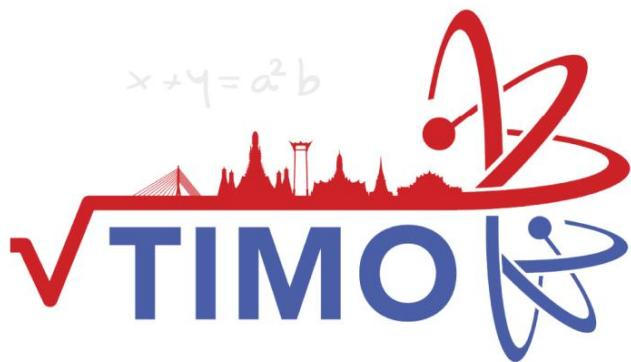

## Thailand International Mathematical Olympiad

KHOI3 

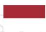

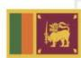

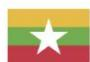

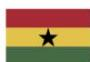

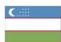

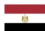

## MỤC LỤC

Giới thiệu Kỳ thi Olympic Toán học quốc tế TIMO . 

Danh sách các trường tham gia tích cực và đạt thành tích cao tại các kỳ TIMO .. .6 

Một số hình ảnh tiêu biểu của Kỳ thi Olympic Toán học quốc tế TIMO tại Việt Nam .......8 

Syllabus/ Khung chƣơng trình.. 

Đề thi Đáp án 

## PRELIMINARY ROUND / VÒNG LOẠI QUỐC GIA

Đề số 1.... ... 12 ..........51 

Đề số 2... ... 16 ..........52 

Đề số 3..... ...... 21 ..........53 

Đề số 4.... .. 25 ..........54 

Đề số 5..... .......... ..... 29 ..........55 

## HEAT ROUND / VÒNG CHUNG KẾT QUỐC GIA

Đề số 1.... ... 33 ..........56 

Đề số 2.... ................... 37 ..........57 

Đề số 3.... .. 41 ..........58 

Đề số 4............................... ................. 44 ..........59 

Đề số 5... 

Heat Round Answer Sheet/ Phiếu Trả Lời Vòng Chung Kết Quốc Gia. ..61 

Một số kỳ thi Olympic quốc tế tiêu biểu khác . ..62 

Thông tin liên hệ .. ..66 

# GIỚI THIỆU KỲ THI OLYMPIC TOÁN HỌC QUỐC TẾ TIMO

Kỳ thi Olympic Toán học quốc tế TIMO (Thailand International Mathematical Olympiad) được tổ chức h|ng năm bởi Trung t}m Gi{o dục Vô địch Olympiad Hong Kong (Olympiad Champion Education Centre from Hong Kong) hợp t{c cùng Tổ chức Du lịch Th{i Lan (Tourism Authority of Thailand) nhằm tạo cơ hội cho tất cả học sinh c{c khối lớp từ mẫu gi{o đến trung học phổ thông có sở thích về To{n học tham gia, mục đích kích thích v| nuôi dưỡng niềm yêu thích to{n học của giới trẻ, tăng cường khả năng tư duy s{ng tạo của học sinh, mở rộng mối quan hệ giao lưu văn hóa quốc tế. Với các thí sinh tham dự kỳ thi TIMO v| đạt huy chương V|ng tại vòng Chung kết quốc tế sẽ được tham dự vòng Chung kết kỳ thi Olympic To{n học Thế giới WIMO v|o th{ng h|ng năm. 

Trong mỗi lần tổ chức, Kỳ thi Olympic Toán học quốc tế TIMO đã thu hút h|ng trăm nghìn thí sinh tham dự đến từ nhiều quốc gia và vùng lãnh thổ khác nhau trên thế giới như: Australia, Brazil, Bulgaria, Cambodia, England, France, Georgia, Ghana, Hong Kong, Indonesia, India, Iran, Kazakhstan, Kyrgyzstan, Malaysia, Myanmar, Philippines, Singapore, Sri Lanka, Switzerland, Taiwan, Turkey, Thailand, Vietnam, ... 

Năm học 2021-2022 là lần thứ ba Kỳ thi được tổ chức tại Việt Nam. Trong lần thứ hai tham dự, tại Vòng Chung kết quốc gia, các thí sinh Việt Nam đã rất xuất sắc với 74% đạt giải trong đó Cúp Vô địch, 2 Cúp Á qu}n , 3 Cúp Á qu}n 2; 7% Huy chương V|ng, 9% Huy chương Bạc, 38% Huy chương Đồng và 10% giải Khuyến khích. Đặc biệt, trong vòng Chung kết quốc tế, đội tuyển Việt Nam đã xuất sắc đạt thành tích cao bao gồm 36 giải Vàng, 87 giải Bạc, 163 giải Đồng, trong đó có Cúp Ngôi sao thế giới dành cho thí sinh cao điểm nhất Việt Nam, Cúp Vô địch d|nh cho thí sinh cao điểm nhất toàn cầu và 1 Cúp Á qu}n 2 d|nh cho thí sinh cao điểm thứ 3 toàn cầu tại mỗi khối lớp. 

Với mong muốn góp phần tạo dựng thêm s}n chơi giao lưu quốc tế dành cho học sinh Việt Nam, đồng thời góp phần n}ng cao trình độ v| cơ hội hợp tác cho giáo viên và cán bộ giáo dục, tiếp cận các nền giáo dục tiên tiến trên thế giới, Ban Tổ chức kỳ thi mong muốn nhận được sự ủng hộ, hỗ trợ và tham gia của các Sở, Phòng Giáo dục v| Đ|o tạo, nh| trường, phụ huynh và các em học sinh để các kỳ thi quốc tế tại Việt Nam đạt được hiệu quả cao nhất. 

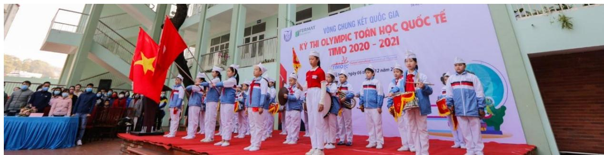

Hội đồng thi trường TH Hạ Long, Quảng Ninh tại Vòng Chung kết quốc gia TIMO 2020 - 2021

# Thông tin chi tiết về Kỳ thi Olympic Toán học quốc tế TIMO

1. Quy định về độ tuổi, cấu trúc đề thi 

a. Về độ tuổi 

Tất cả các học sinh yêu thích môn Toán từ Lớp mẫu giáo tới Lớp 12 trung học phổ thông. 

b. Về cấu trúc đề thi 

<table><tr><td colspan="2">Vòng thi</td><td>Vòng loại quốc gia</td><td>Vòng Chung kết quốc gia</td><td>Vòng Chung kết quốc tế</td></tr><tr><td colspan="2">Số câu hỏi</td><td>25</td><td>25</td><td>30</td></tr><tr><td colspan="2">Điểm mỗi câu hỏi</td><td>4</td><td>4</td><td>5</td></tr><tr><td colspan="2">Tổng điểm</td><td>100</td><td>100</td><td>150</td></tr><tr><td rowspan="5">Chủ đề</td><td>Tự duy lògic</td><td>5</td><td>5</td><td>6</td></tr><tr><td>Số học/Đại số</td><td>5</td><td>5</td><td>6</td></tr><tr><td>Lý thuyết số</td><td>5</td><td>5</td><td>6</td></tr><tr><td>Hình học</td><td>5</td><td>5</td><td>6</td></tr><tr><td>Tổ hợp</td><td>5</td><td>5</td><td>6</td></tr><tr><td colspan="2">Thời gian</td><td>60 phút</td><td>90 phút</td><td>120 phút</td></tr><tr><td colspan="2">Dạng đề thi</td><td>Trắc nghiệm</td><td>Điền đáp án</td><td>Điền đáp án</td></tr><tr><td colspan="2">Ngôn ngữ</td><td>Song ngữ Anh – Việt</td><td>Tiếng Anh (có trích dẫn thuật ngữ tiếng Việt)</td><td>Tiếng Anh</td></tr></table>

2. Cơ cấu giải thưởng 

a. Giải thƣởng của Ban Tổ chức quốc tế 

<table><tr><td rowspan="2">Huy chương</td><td colspan="2">Điều kiện xét giải</td><td rowspan="2">Giải thuống</td></tr><tr><td>Vòng Chung kết quốc gia</td><td>Vòng Chung kết quốc tế</td></tr><tr><td>Ngôi sao thế giới (World Star)</td><td></td><td>Thí sinh cao điểm nhất mỗi khu vực.</td><td>- Cúp Ngôi sao thế giới;- Miễn lệ phí tham dự Vòng Chung kết quốc tế.</td></tr><tr><td rowspan="2">Huy chương</td><td colspan="2">Điều kiện xét giải</td><td rowspan="2">Giải thường</td></tr><tr><td>Vòng Chung kết quốc gia</td><td>Vòng Chung kết quốc tế</td></tr><tr><td>Giải Xuất sắc (Champion 1stRunner-up 2ndRunner-up)</td><td>03 thí sinh cao điểm nhất mỗi khối thi.</td><td>03 thí sinh điểm cao nhất mỗi khởi thi.</td><td>- Cúp Vô dịch;- Cúp Á quân 1;- Cúp Á quân 2.</td></tr><tr><td>Giải Vàng (Gold Award)</td><td>Thí sinh chiến thắng đạt từ 80 điểm trở lên.</td><td>Thí sinh chiến thắng đạt từ 120 điểm trở lên.</td><td>Huy chương và Giấy chứng nhận.</td></tr><tr><td>Giải Bạc (Silver Award)</td><td>Thí sinh chiến thắng đạt từ 60 điểm trở lên.</td><td>Thí sinh chiến thắng đạt từ 90 điểm trở lên.</td><td>Huy chương và Giấy chứng nhận.</td></tr><tr><td>Giải Đồng (Bronze Award)</td><td>Thí sinh chiến thắng đạt từ 40 điểm trở lên.</td><td>Thí sinh chiến thắng đạt từ 60 điểm trở lên.</td><td>Huy chương và Giấy chứng nhận.</td></tr><tr><td>Giải Khuyến khích (Merit)</td><td>Thí sinh chiến thắng đạt từ 20 điểm trở lên.</td><td>Thí sinh chiến thắng đạt từ 30 điểm trở lên.</td><td>Giấy chứng nhận.</td></tr></table>

Đặc biệt, c{c thí sinh đạt Huy chương V|ng Vòng Chung kết quốc tế TIMO được tham dự (miễn lệ phí thi) Vòng Chung kết Kỳ thi Olympic Toán thế giới WIMO vào tháng 1 năm tới. 

## Lưu ý:

- Vòng loại quốc gia không xếp giải. Khoảng 70% thí sinh có điểm cao nhất của Vòng loại quốc gia được đăng ký tham gia Vòng Chung kết quốc gia. 

- Ban Tổ chức sắp xếp kết quả giảm dần dựa trên điểm thi v| ng|y sinh. Do đó, c{c thí sinh bằng điểm có thể nhận hai giải khác nhau. Nếu một giải thưởng đã đủ chỉ tiêu, thí sinh tiếp theo sẽ nhận giải thưởng mức liền kề phía dưới. 

- Các mốc điểm đạt giải có thể thay đổi dựa trên kết quả thi thực tế của tất cả thí sinh. 

## b. Giải thƣởng của Ban Tổ chức Việt Nam

* Đối với thí sinh: 

- Thí sinh cao điểm nhất Vòng Chung kết quốc gia được giải thưởng tiền mặt 5.000.000 đồng (năm triệu đồng). 

- Với mỗi khối có từ 100 thí sinh tham dự Vòng loại quốc gia, thí sinh cao điểm nhất khối thi Vòng Chung kết quốc gia được giải thưởng tiền mặt 2.000.000 đồng (hai triệu đồng); 

Với các giải thưởng tiền mặt phía trên, nếu có nhiều hơn một thí sinh đạt giải, số tiền thưởng được chia đều cho c{c thí sinh đạt giải. 

- Thí sinh đạt huy chương V|ng vòng Chung kết quốc gia v| đạt giải Vòng Chung kết quốc tế TIMO được đặc cách miễn Vòng loại quốc gia các kỳ thi HKIMO, BBB cùng năm học và các tặng thưởng lệ phí khi tham gia các kỳ thi có trong Thông báo của mỗi kỳ thi. 

* Đối với Trường có học sinh tham dự: 

- Trường có từ 300 học sinh tham gia Kỳ thi sẽ được tặng Giấy khen, Kỷ niệm chương và quảng bá logo của trường trên tất cả các ấn phẩm truyền thông các Kỳ thi của Ban Tổ chức. 

- Trường có từ 150 học sinh tham gia Kỳ thi sẽ được tặng Giấy khen, Kỷ niệm chương và quảng bá logo của trường trên tất cả các ấn phẩm truyền thông về Kỳ thi. 

- Trường có từ 50 học sinh tham gia Kỳ thi sẽ được tặng Giấy khen tham dự tích cực trong Kỳ thi quốc tế. 

## Danh sách các trường tham gia tích cực và đạt thành tích cao tại các kỳ TIMO

. TH Điện Biên , Thanh Hóa 

2. TH Nguyễn Văn Trỗi, Thanh Hóa 

3. TH Lê Mao, Nghệ An 

4. TH Xu}n La, H| Nội 

5. TH Cầu Gi{t, Nghệ An 

6. TH Cầu Diễn, H| Nội 

7. IQ School , H| Nội 

8. TH Chu Văn An, H| Nội 

9. TH Nghĩa T}n, H| Nội 

0. TH Lê Ngọc H}n, H| Nội 

. TH Xu}n Đỉnh, H| Nội 

12. TH,THCS,THPT Đông Bắc Ga, Thanh Hóa 

3. THCS Lê Lợi, H| Nội 

14. TH I-sắc Niu-tơn, H| Nội 

5. TH Đông Th{i, H| Nội 

6. TH Nam Th|nh Công, H| Nội 

7. TH Đội Cung, Nghệ An 

8. TH Thị trấn Phùng, H| Nội 

9. TH Đông Ngạc B, H| Nội 

20. THCS Chu Văn An, H| Nội 

2 . TH Cao B{ Qu{t, H| Nội 

22. TH, THCS & THPT Vinschool, Hồ Chí Minh 

23. TH Hưng Dũng , Nghệ An 

24. TH T}y Sơn, H| Nội 

25. TH,THCS&THPT Nobel school, Thanh Hóa 

26. TH Đồng Mỹ, Quảng Bình 

27. TH NEWTON GOLDMARK, H| Nội 

28. THCS Thị Trấn Nghĩa Đ|n, Nghệ An 

29. TH Ba Trại A, H| Nội 

30. TH Quảng An, H| Nội 

3 . TH Nhật T}n, H| Nội 

32. TH Gia Thượng, H| Nội 

33. TH Thượng Sơn, Nghệ An 

34. TH Lam Sơn 3, Thanh Hóa 

35. TH Thanh Trì, H| Nội 

36. TH Dương X{, H| Nội 

37. THCS Xu}n Diệu, H| Tĩnh 

38. TH T}y Tựu B, H| Nội 

39. TH Chu Văn An, Nam Định 

40. TH Gi{p B{t, H| Nội 

4 . TH H| Huy Tập 2, Nghệ An 

42. TH Minh Khai A, H| Nội 

43. TH Lê Lợi, Nghệ An 

44. IQ School, Ninh Bình 

45. TH Ba Trại B, H| Nội 

46. TH Phương Canh, H| Nội 

47. TH Mỹ Đình 2, H| Nội 

48. THCS Đông Th{i, H| Nội 

49. TH Phú Phương, H| Nội 

50. TH Vạn Thắng, H| Nội 

5 . TH Hải Cường, Nam Định 

52. THCS Th{i Thịnh, H| Nội 

53. Hanoi Academy, H| Nội 

54. TH Phúc Diễn, H| Nội 

55. THCS Bạch Liêu, Nghệ An 

56. THCS Phú Diễn, H| Nội 

57. TH Lưu Sơn, Nghệ An 

58. THCS Cao B{ Qu{t, H| Nội 

59. TH Bến Thủy, Nghệ An 

60. THCS & THPT Lê Quý Đôn, H| Nội 

6 . THCS Minh Khai, H| Nội 

62. THCS Trần Phú, Thanh Hóa 

63. THCS Văn Đức, H| Nội 

64. TH Lê Ngọc H}n, H| Nội 

65. TH Ngô Đức Kế, H| Tĩnh 

66. THCS Xu}n Đỉnh, H| Nội 

67. THCS Trung Lương, H| Tĩnh 

68. TH Hưng Dũng 2, Nghệ An 

69. TH An Dương, H| Nội 

70. TH Đô Thị Việt Hưng, H| Nội 

7 . TH Thịnh Sơn, Nghệ An 

72. TH Quang Trung, H| Nội 

73. THCS - THPT Newton, H| Nội 

74. THCS Ngô Gia Tự, H| Nội 

75. THCS Xu}n La, H| Nội 

76. THCS Hà Huy Tập, H| Nội 

77. TH Tòng Bạt, H| Nội 

78. TH&THCS NEWTON 5, H| Nội 

79. TH Cổ Nhuế 2B, H| Nội 

80. TH Hòa Hiếu I, Nghệ An 

8 . THCS Đông Ngạc, H| Nội 

82. TH Đồng Nh}n, H| Nội 

83. THCS Nguyễn Trường Tộ, H| Nội 

84. THCS Ninh Hiệp, H| Nội 

85. TH Vật Lại, H| Nội 

86. TH T}y Đằng A, H| Nội 

87. THCS Thượng C{t, H| Nội 

88. TH Đại Từ, H| Nội 

89. TH Quang Tiến, Nghệ An 

90. TH Đức Thắng, H| Nội 

9 . TH Thuận Sơn, Nghệ An 

92. TH và THCS Fansipan, Thanh Hóa 

93. THCS Vĩnh Quỳnh, H| Nội 

94. TH Phú Ch}u, H| Nội 

95. TH Quỳnh Hồng, Nghệ An 

96. THCS Tứ Hiệp, H| Nội 

97. THCS Phan Đăng Lưu, Nghệ An 

98. TH Ngô Đức Kế, H| Tĩnh 

99. THCS Hồ Xu}n Hương, Nghệ An 

00. Trường Quốc tế song ngữ UK Academy, Quảng Ngãi 

0 . TH Nguyễn Thị Minh Khai, Hải Phòng 

02. TH Gia Kh{nh A, Vĩnh Phúc 

## Một số hình ảnh tiêu biểu của Kỳ thi Olympic Toán học quốc tế TIMO tại Việt Nam

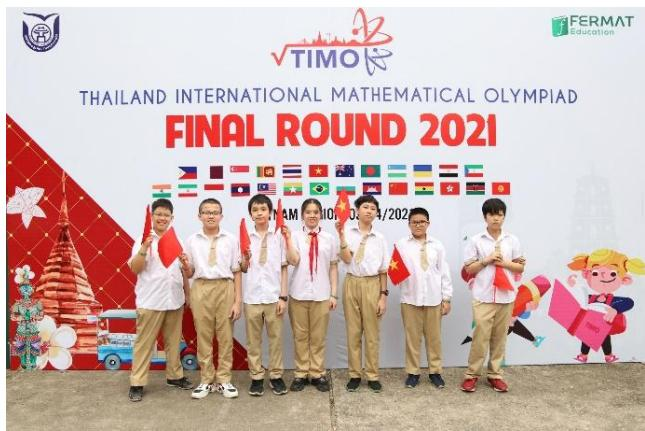

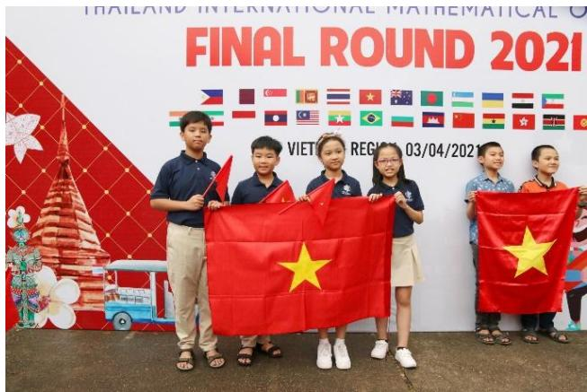

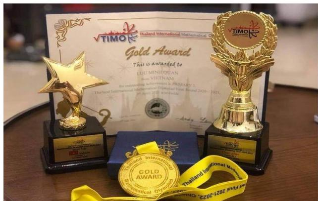

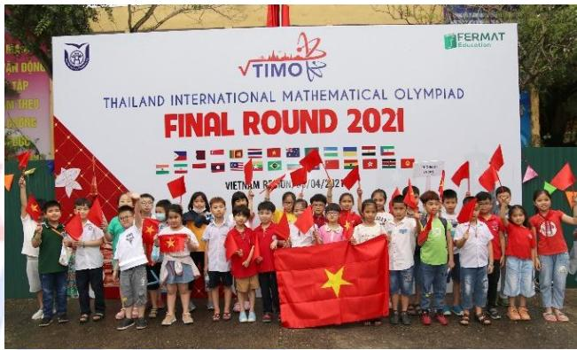

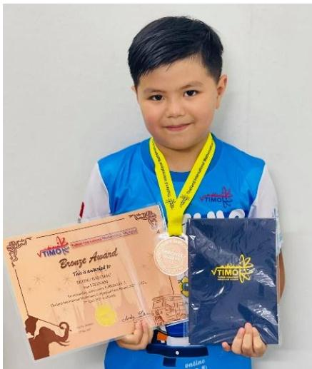

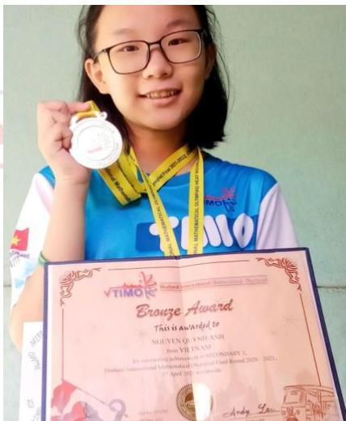

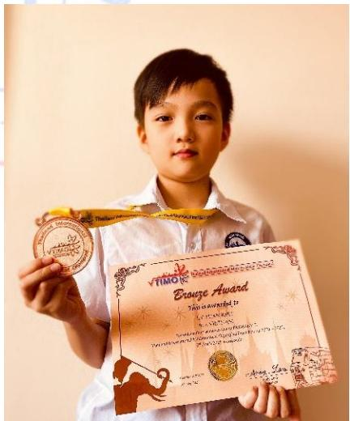

Vòng Chung kết quốc tế TIMO 2020 - 2021 

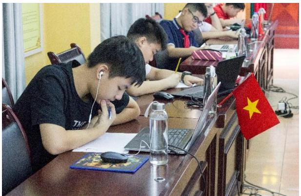

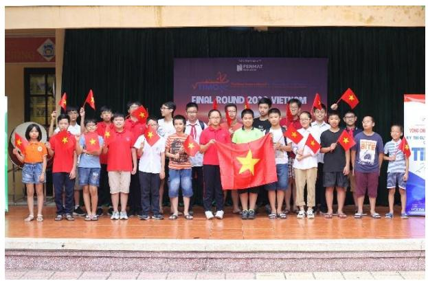

Hội đồng thi trường THCS Thái Thịnh, Đống Đa, Hà Nội năm học 2019 - 2020

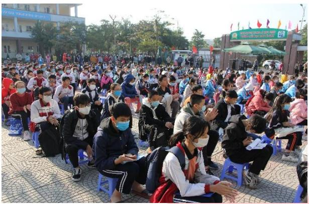

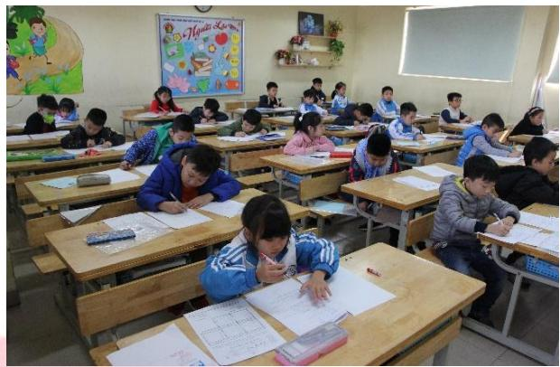

Hội đồng thi trường TH Cao Bá Quát, Gia Lâm, Hà Nội năm học 2020 - 2021

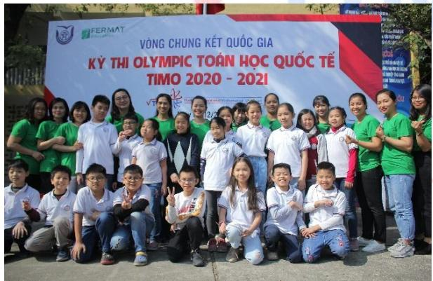

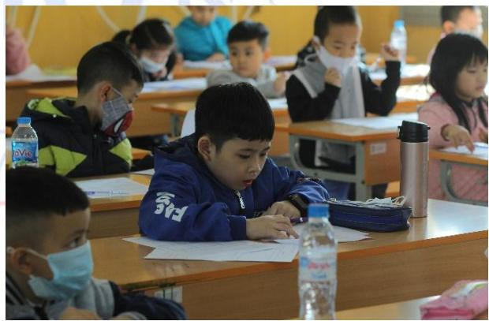

Hội đồng thi Trường Đại học Thủ Đô Hà Nội năm học 2020 - 2021

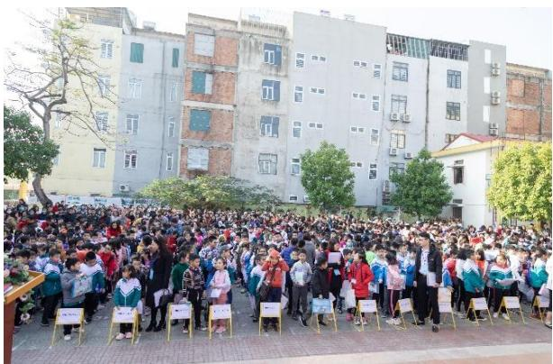

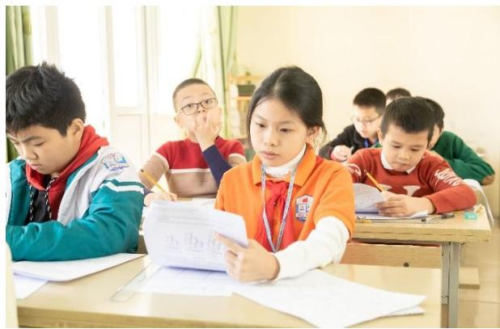

Hội đồng thi tỉnh Thanh Hóa năm học 2020 - 2021

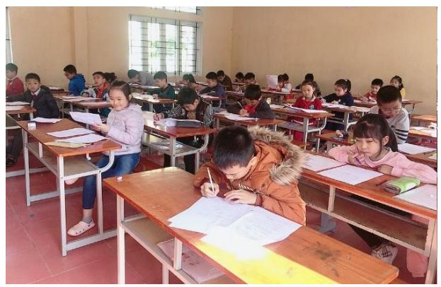

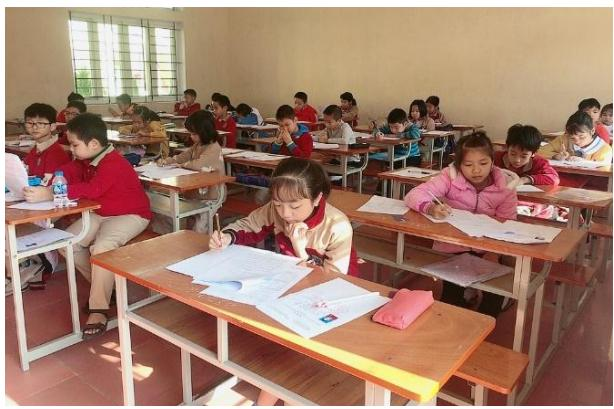

Hội đồng thi tỉnh Nam Định năm học 2020 - 2021

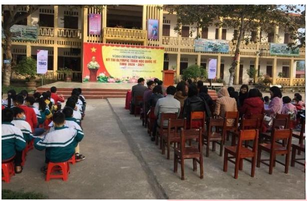

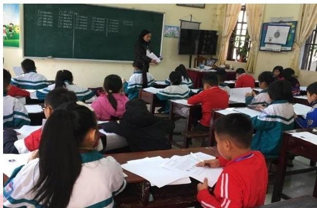

Hội đồng thi trường TH Hải Cường, Nam Định năm học 2020 - 2021

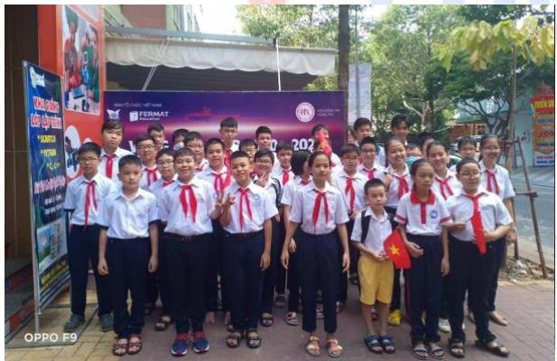

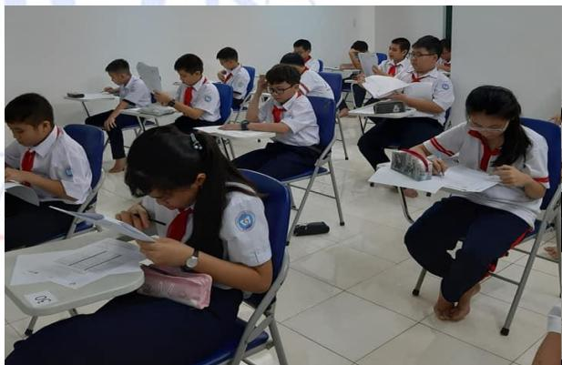

Hội đồng thi tỉnh Bà Rịa - Vũng Tàu năm học 2020 - 2021

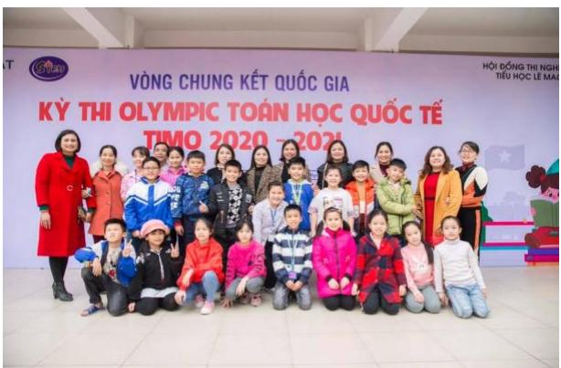

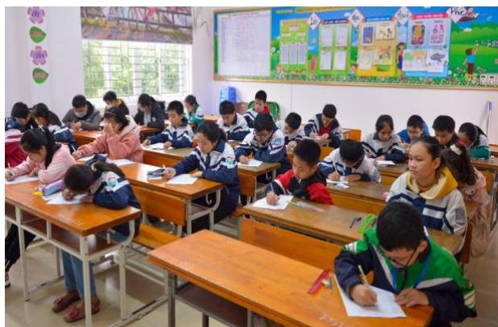

Hội đồng thi trường TH Lê Mao, Nghệ An năm học 2020 - 2021

SYLLABUS / KHUNG CHƢƠNG TRÌNH

<table><tr><td>TopicsChủ đề</td><td>Grade 3 / Khối 3</td></tr><tr><td>Logical thinkingTư duy logic</td><td>➢ Number &amp; Figure Pattern / Dãy số và dãy hình có quy luật➢ IQ Age Problem &amp; Date Problem / Tuổi và ngày tháng➢ Basic logical problems / Bài toán tư duy cơ bản➢ Guess on 2-digit numbers / Đoàn số có 2 chữ số</td></tr><tr><td>ArithmeticSố học</td><td>➢ Smart addition and subtraction / Tính nhanh các phép cộng trừ➢ Distribution property for multiplication and division / Tính chất phân phối với phép nhân và phép chia➢ Arithmetic sequence and geometric sequence / Dãy số cách đều và dãy số nhân</td></tr><tr><td>Number theoryLý thuyết số</td><td>➢ Divisibility / Tính chia hết➢ New operation symbol / Định nghĩa phép toán mới➢ Find two numbers given sum and ratio, difference and ratio / Tìm hai số biết tổng tỉ, hiệu tỉ➢ Number Pattern / Dãy số có quy luật</td></tr><tr><td>GeometryHình học</td><td>➢ Counting on number of 2-D &amp; 3-D Figures / Đếm hình 2D hoặc 3D➢ Observations of 3-D figures / Quan sát hình 3D➢ Perimeter and area / Chu vi và diện tích➢ Figure Pattern / Dãy hình có quy luật</td></tr><tr><td>CombinatoricsTổ hợp</td><td>➢ Routing problem / Bài toán đếm đường đi➢ Counting on specific numbers or cases / Đếm các số hoặc các trường hợp đặc biệt➢ Worst case scenario / Dạng toán trường hợp xấu nhất➢ Formation of numbers / Thành lập số</td></tr></table>

*Khung chương trình mang tính chất tham khảo. 

# PRELIMINARY ROUND / VÒNG LOẠI QUỐC GIA

# ĐỀ SỐ 1: Đề thi Vòng loại quốc gia năm học 2020 - 2021

## Logical thinking / Tƣ duy lô-gic

1. The age of Ashley 5 years ago is equal to the age of Amy 4 years later. When Ashley is 20 years old, how old is Amy? 

Tuổi của Ashley 5 năm trước bằng đúng tuổi của Amy 4 năm nữa. Hỏi khi Ashley 20 tuổi thì Amy bao nhiêu tuổi? 

A. 11 

B. 29 

D. 21 

Today is 3rd April, Monday. Which day of the week will it be on the last day of this month? 

Hôm nay là thứ Hai, ngày 3 tháng Tư. Hỏi ngày cuối cùng của tháng này là thứ mấy? 

A. Monday / Thứ Hai 

B. Saturday / Thứ Bảy 

C. Tuesday / Thứ Ba 

D. Sunday / Chủ Nhật 

3. According to the pattern below, how many squares are there in the first 28 figures counting from the left? 

Dựa vào quy luật dưới đây, hỏi có bao nhiêu hình vuông trong 28 hình đầu tiên tính từ phía bên trái? 

< 

A. 15 

B. 14 

C. 8 

D. 9 

4. Consider the pattern below, find the sum of the first 6 numbers in the sequence? 

Dựa vào quy luật dưới đây, tìm tổng của 6 số đầu tiên trong dãy. 

, 3, 9, 27, < 

A. 365 

B. 360 

C. 362 

D. 364 

5. Thor wrote a 2-digit number on a piece of paper and asked Loki to guess it. 

Loki asked: “Is the number 72?” 

Thor replied: “One of the digits is correct. The position of that digit is wrong.” 

Loki asked again: “Is the number 42?” 

Thor replied: “One of the digits is correct. The position of that digit is correct.” 

Given two digits in the number are different, find the number written by Thor. 

Thor viết một số có 2 chữ số lên một mảnh giấy và đố Loki đoán xem đó là số nào. 

Loki hỏi: “Số đó có phải số 72 không?” 

Thor trả lời: “Một trong hai chữ số giống với số trên mảnh giấy. Nhưng vị trí của chữ số đó lại sai.” 

Loki hỏi: “Số đó có phải số 42 không?” 

Thor trả lời: “Một trong hai chữ số giống với số trên mảnh giấy. Vị trí của chữ số đó cũng đúng.” 

Biết rằng số cần tìm có hai chữ số khác nhau, tìm số mà Thor đã viết. 

A. 74 

B. 22 

C. 47 

D. 27 

## Arithmetic / Số học

6. Calculate 327 169 132 173 669     . 

Tính 327 169 132 173 669    . 

A. 868 

B. 968 

C. 869 

D. 768 

7. Find the sum of 10 consecutive natural numbers from 11 to 20. 

Tính tổng của 10 số tự nhiên liên tiếp từ 11 đến 20. 

A. 105 

B. 300 

C. 310 

D. 155 

8. Calculate 36 42 4 9 17 15 36      . 

Tính 36 42 4 9 17 15 36      . 

A. 360 

B. 3600 

C . 180 

D. 350 

9. Find the value of 1001 123  . 

Tìm giá trị của 1001 123 . 

A. 123321 

B. 123123 

C. 321123 

D. 321321 

10. Find the value of 1 2 4 8 16 32 64 128        . 

Tìm giá trị của 1 2 4 8 16 32 64 128        . 

A. 255 

B. 256 

C. 254 

D. 257 

## Number theory / Lý thuyết số

11. How many 2-digit even numbers are there? 

Hỏi có bao nhiêu số chẵn có 2 chữ số? 

A. 50 

B. 45 

C. 44 

D. 49 

12. The sum of A and B is 60. A is 2 times of B. Find the value of B. 

Tổng của A và B là 60. A gấp 2 lần B. Tìm giá trị của B. 

A. 30 

B. 40 

C. 10 

D. 20 

13. According to the following pattern, find the value of the next term. 

Dựa vào quy luật dưới đây, tìm giá trị của số hạng tiếp theo. 

, 6, 6, 3 , 5 , 76, 06, < 

A. 111 

B. 121 

C. 131 

D. 141 

14. Phineas and Ferb took a test and received the results. The sum of their marks is 162 and Phineas got 22 marks higher than Ferb did. How many marks did Phineas receive? 

Hai bạn Phineas và Ferb nhận kết quả của bài kiểm tra. Tổng số điểm của hai bạn là 162 điểm và Phineas cao hơn Ferb 22 điểm. Hỏi số điểm Phineas nhận được là bao nhiêu? 

A. 70 

B. 90 

C. 92 

D. 72 

15. Define the operation symbol $a \oplus b = a \times b - b$ . Find the value of  (5 7)  . 

Định nghĩa phép toán như sau: $a \oplus b = a \times b - b$ . Tính giá trị của (5 7)  . 

A. 28 

B. 30 

C. 1 2 

D. 35 

## Geometry / Hình học

16. How many line segments are there in the figure below? Hỏi có bao nhiêu đoạn thẳng trong hình dưới đây? 

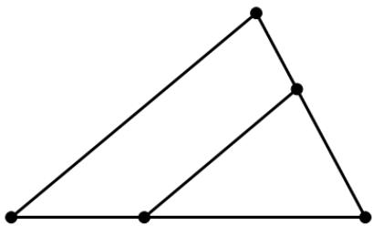

A. 4 

B. 6 

C. 8 

17. How many squares are there in the figure below? Hỏi có bao nhiêu hình vuông trong hình dưới đây? 

<table><tr><td></td><td></td><td></td></tr><tr><td></td><td></td><td></td></tr><tr><td></td><td></td><td></td></tr></table>

A. 4 

B. 5 

6 

D. 10 

18. A parking lot has the dimension as the figure below. Find its perimeter in meter. Một bãi đỗ xe có kích thước như hình dưới. Tìm chu vi của bãi đỗ xe theo đơn vị mét. 

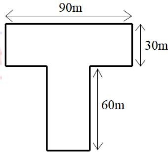

A. 360 

B. 280 

D. 450 

19. A box in the figure below has 8 vertices. How many sides does it have? Chiếc hộp dưới đây có 8 đỉnh. Hỏi hộp đó có bao nhiêu cạnh? 

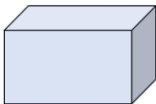

A. 6 

B. 8 

20. In the middle of a square garden with perimeter 80m, they built a square pool with perimeter 32m as the figure below. What is the area value of the shaded region in m2? 

Ở chính giữa một mảnh vườn hình vuông chu vi 80m, người ta xây một hồ bơi hình vuông chu vi 32m như hình dưới đây. Hỏi diện tích của phần được tô đậm là bao nhiêu mét vuông? 

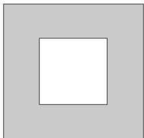

A. 336 

B. 48 

C. 400 

D. 144 

## Combinatorics / Tổ hợp

21. How many 2-digit numbers without digit 0 are there? 

Hỏi có bao nhiêu số có hai chữ số mà không có chữ số 0? 

A. 90 

B. 80 

C. 81 

D. 91 

22. After Candace gave 4 pens to Phineas, they had an equal number of pens. How many pens did Candace have originally, given that their sum of pens is 18? 

Candace cho Phineas 4 cái bút thì họ có số bút bằng nhau. Hỏi lúc đầu Candace có bao nhiêu cái bút, biết rằng tổng số bút của hai bạn là 18 cái? 

A. 14 

B. 11 

C. 13 

D. 22 

23. How many ways are there from A to B given that each step you can only move up or move right along the lines? 

Hỏi có bao nhiêu cách đi từ điểm A đến điểm B biết rằng bạn chỉ có thể đi lên trên hoặc đi sang phải theo các đường thẳng? 

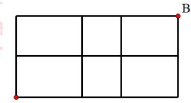

A. 11 

B. 8 

C. 9 

D. 10 

24. Sam has 6 candies. Each day she can only eat 1 candy or 2 candies. In how many ways can she eat all those candies? 

Sam có 6 chiếc kẹo. Mỗi ngày cô bé có thể ăn 1 chiếc kẹo hoặc 2 chiếc kẹo. Hỏi cô bé có bao nhiêu cách để ăn hết chỗ kẹo đó? 

A. 2 

B. 10 

C. 13 

D. 9 

25. Choose 2 digits, without repetition, from 0, 2, 4, 6 to form 2-digit numbers. How many even numbers are there? 

Lấy 2 chữ số từ các chữ số 0, 2, 4, 6 sao cho không chữ số nào bị lặp lại để lập các số có hai chữ số. Hỏi trong đó có bao nhiêu số chẵn? 

A. 8 

B. 9 

6 

D. 12 

## ĐỀ SỐ 2

## Logical thinking / Tƣ duy lô-gic

1. If tomorrow will be Monday, which day of the week was 123 days ago? 

Biết ngày mai là thứ Hai, hỏi 123 ngày trước là thứ mấy? 

A. Sunday / Chủ Nhật 

B. Wednesday / Thứ Tư 

C. Thursday / Thứ Năm 

D. Tuesday / Thứ Ba 

2. By observing the pattern, what is the English letter in the space provided? 

Quan sát quy luật dưới đây để điền chữ cái Tiếng Anh thích hợp vào chỗ trống. 

C , m , D , n , E , o , F , p , G , ___ 

A. Q 

B. H 

C. h 

D. q 

3. What is the suitable number to replace the star below? 

Cần thay thế ngôi sao dưới đây bằng số nào? 

12 , 20 , 30 , 42 , 56 , , < 

A. 72 

B. 58 

C. 66 

D. 70 

4. Refer to the pattern below, how many  are there in the 5th group? 

Dựa vào quy luật dưới đây, hỏi có bao nhiêu hình  trong hình thứ 5? 

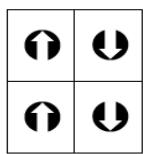

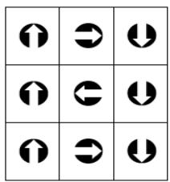

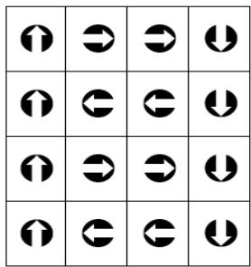

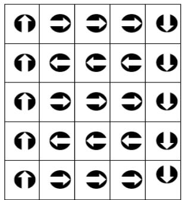

A. 15 

B. 20 

D. 16 

5. Find the missing number in the table on the right. 

Tìm số còn thiếu trong bảng ở bên phải. 

A. 2 

B. 3 

C. 5 

D. 4 

<table><tr><td>2</td><td>5</td><td>1</td><td>0</td></tr><tr><td>3</td><td>6</td><td>1</td><td>8</td></tr><tr><td>4</td><td>7</td><td>2</td><td>8</td></tr><tr><td>5</td><td>8</td><td>?</td><td>0</td></tr></table>

## Arithmetic / Số học

6. Find the value of 142 – 454 + 158 + 700 + 554. 

Tìm giá trị của 142 – 454 + 158 + 700 + 554. 

A. 1100 

B. 1000 

1200 

D. 1010 

7. Find the value of $3 6 0 \div 2 + 3 6 0 \div 3 + 3 6 0 \div 5 + 3 6 0 \div 8 + 3 6 0 \div 1 2$ . 

Tìm giá trị của $3 6 0 \div 2 + 3 6 0 \div 3 + 3 6 0 \div 5 + 3 6 0 \div 8 + 3 6 0 \div 1 2 ?$ 

A. 360 

B. 447 

C. 1 2 

D. 417 

8. Find the value of $1 5 { \times } 2 1 + 1 6 { \times } 3 0 + 7 { \times } 1 5$ . 

Tính giá trị của $1 5 { \times } 2 1 + 1 6 { \times } 3 0 + 7 { \times } 1 5$ 

A. 1000 

B. 660 

C. 900 

D. 1 500 

9. Let A and B represent 1-digit numbers. What is the value of A + B if the equation below is correct? 

Biết A và B biểu diễn các số có 1 chữ số, hỏi giá trị của A + B là bao nhiêu nếu phép tính dưới đây là đúng? 

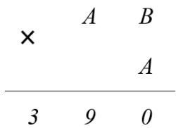

A. 10 

B. 11 

C. 12 

D. 13 

10. What is the value of K if the equation below is correct? 

Tìm giá trị của K để được phép tính đúng dưới đây. 

$$
K \times 4 \div 3 - 2 + 1 = 1 5
$$

A. 9 

B. 12 

C. 15 

D. 18 

## Number theory / Lý thuyết số

11. M is the sum of the largest 2-digit even number and the smallest 3-digit odd number. Find the value of M. 

M là tổng của số chẵn lớn nhất có 2 chữ số và số lẻ nhỏ nhất có 3 chữ số. Tìm giá trị của M. 

A. 199 

B. 3 

C. 200 

D. 1097 

12. A is 9 times B and the difference between A and B is 360. Find A. 

Biết A gấp 9 lần B và hiệu của A và B là 360. Tìm giá trị của A. 

A. 45 

B. 320 

C. 405 

D. 324 

13. Observe the pattern and find the difference between the 54th number and the 55th number in the following sequence. 

Quan sát quy luật để tìm hiệu của số thứ 54 và số thứ 55 trong dãy dưới đây? 

$$
1 、 3 、 7 、 1 3 、 2 1 \dots
$$

A. 114 

B. 112 

C. 110 

D. 108 

14. Define the new operation symbol $a \otimes b = ( 2 \times b - a ) \times \left( a + 3 \times b \right)$ , find the value of  (7 5)  . 

Định nghĩa kí hiệu phép toán mới như sau: $a \otimes b = ( 2 \times b - a ) \times \left( a + 3 \times b \right)$ , tính (7 5)  . 

A. 51 

B. 66 

C. 198 

D. 87 

15. There are 123 consecutive numbers from 1 to 123 written on the board. Tracy erases 2 random numbers and replaces them by their sum. Tracy does that until there is only 1 number left on the board. What is the last number? 

Có 123 số tự nhiên liên tiếp (từ 1 đến 123) được viết trên bảng. Tracy xóa đi 2 số bất kì và thay thế bằng tổng của 2 số vừa xóa. Tracy cứ làm như vậy đến khi chỉ còn lại 1 số duy nhất trên bảng. Hỏi số đó là bao nhiêu? 

A. 7262 

B. 15252 

C. 7626 

D. 123 

## Geometry / Hình học

16. How many squares are there in the figure below? 

Hỏi có bao nhiêu hình vuông trong hình dưới đây? 

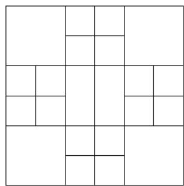

A. 32 

B. 30 

C. 28 

D. 34 

17. They want to paint all surface of the 3D figure on the right. At least how many squares do they have to paint over? 

Người ta muốn sơn toàn bộ bề mặt của hình 3D ở bên phải. Hỏi họ cần sơn ít nhất bao nhiêu hình vuông? 

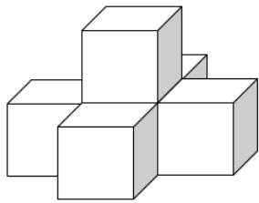

A. 26 

B. 12 

C. 13 

D. 24 

18. How many rectangles containing the star are there in the figure below? 

Hỏi có bao nhiêu hình chữ nhật chứa ngôi sao trong hình dưới đây? 

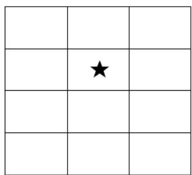

A. 12 

B. 18 

C. 36 

D. 24 

19. Candace uses 3 squares and 1 rectangle to form a bigger square on the right. If the perimeter of the smallest square is 12cm, find the perimeter of the shaded rectangle in cm. 

Candace dùng 3 hình vuông và 1 hình chữ nhật để ghép thành một hình vuông lớn ở bên phải. Biết chu vi của một hình vuông nhỏ nhất là 12cm. Hỏi chu vi của hình chữ nhật được tô đậm là bao nhiêu cm? 

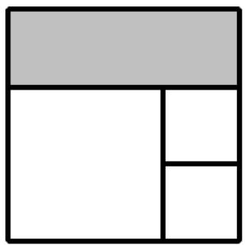

A. 18 

B. 24 

C. 36 

D. 40 

20. Refer to the pattern below. How many circles are there in the first 123 symbols? Xét quy luật dưới đây. Hỏi có bao nhiêu hình tròn trong 123 hình đầu tiên? 

 

A. 46 

51 

C. 50 

D. 25 

## Combinatorics / Tổ hợp

21. The map from Trisha’s school to her home is given as follows. How many different ways are there for Trisha to go from school to home? 

Dưới đây là bản đồ từ trường về nhà của Trisha. Hỏi có bao nhiêu cách khác nhau để Trisha đi từ trường về nhà? 

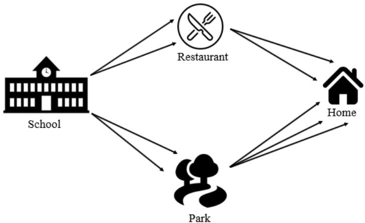

A. 5 

B. 9 

C. 1 2 

D. 10 

22. Candy has five coins worth 50 cents each, three $1 notes and two $2 notes. In how many different ways can she pay for a toy worth $3 without receiving change, given that $1 = 100 cents? 

Candy có năm xu 50 cent, ba tờ 1 đô và hai tờ 2 đô. Hỏi cô bé có bao nhiêu cách khác nhau để trả cho một món đồ chơi giá 3 đô mà không cần tiền trả lại, biết rằng 1 đô bằng 100 cents? 

A. 

B. 4 

C. 5 

D. 6 

23. Choose 8 digits, without repetition, from 0 to 7 to form two 4-digit numbers. (E.g: 2357 and 4016). Find the smallest possible difference between two formed numbers. 

Chọn 8 chữ số (không lặp lại) từ số 0 đến số 7 để lập thành hai số có 4 chữ số (Ví dụ: chọn số 2357 và 4016). Tìm hiệu nhỏ nhất có thể của hai số đó. 

A. 247 

B. 3544 

C. 25 

D. 136 

24. Use 4 distinct digits from 0, 2, 4, 5, 6, 7 to form 4-digit even numbers. How many different numbers can be formed? 

Chọn 4 chữ số khác nhau từ các số 0, 2, 4, 5, 6, 7 để lập thành số chẵn có 4 chữ số. Hỏi có thể tạo được bao nhiêu số như vậy? 

A. 240 

B. 144 

C. 204 

25. Six distinct digits are filled in six boxes below. Numbers in adjacent cells are added and the sum is placed in the cell above them. How many ways are there to complete the given diagram? 

Sáu chữ số khác nhau được điền vào sáu ô trống dưới đây sao cho hai ô kề nhau cộng lại thì bằng ô ở bên trên. Hỏi có bao nhiêu cách khác nhau để điền vào biểu đồ đã cho? 

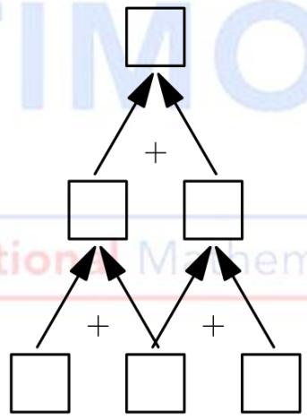

A. 2 

B. 4 

C. 6 

D. 8 

## ĐỀ SỐ 3

## Logical Thinking / Tƣ duy lô-gic

1. According to the pattern shown below, what is the number in the blank? 

Theo quy luật dưới đây, hãy điền số vào chỗ trống. 

1 、 2 、 3 、 6 、 11 、 20 、 __ 

A. 29 

B. 31 

37 

D. 40 

2. Yesterday was Tuesday. Which day of the week will 124 days later be? 

Ngày hôm qua là thứ Ba. Hỏi 124 ngày nữa là thứ mấy? 

A. Monday / Thứ Hai 

B. Tuesday / Thứ Ba 

C. Saturday / Thứ Bảy 

D. Sunday / Chủ Nhật 

3. The age of Sammy 3 years later is equal to the age of Joseph 6 years ago. How old is Sammy when Joseph is 18 years old? 

Tuổi của Sammy 3 năm sau bằng tuổi của Joseph 6 năm trước. Hỏi khi Joseph 18 tuổi thì Sammy bao nhiêu tuổi? 

A. 6 

B. 9 

C. 15 

D. 21 

4. A tree is planted every 25m in a street from one end. There are 15 trees on the street. How long in meter is the street? 

Cứ 25m thì một cái cây được trồng, tính từ đầu con đường. Có 15 cái cây được trồng trên đường. Hỏi con đường dài bao nhiêu mét? 

A. 325 

B. 350 

C. 375 

5. According to the pattern shown below, how many  is / are there in the 9th Group? 

Theo quy luật dưới đây, có bao nhiêu hình  ở hình thứ 9? 

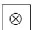

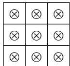

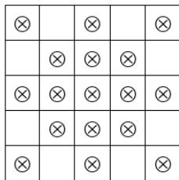

1st Group 

2nd Group 

3rd Group 

4th Group 

A. 62 

B. 64 

C. 65 

D. 72 

## Arithmetic / Số học

6. Find the value of 11 24 17 26 29 13     . 

Tính giá trị của 11 24 17 26 29 13     . 

A. 115 

B. 117 

C. 118 

D. 120 

7. Find the value of 17 44 56 17   . 

Tính giá trị của $1 7 \times 4 4 + 5 6 \times 1 7$ . 

A. 1 700 

B. 170 

C. 1750 

D. 175 

8. Find the value of 2 4 8 625 25    . 

Tính giá trị của 2 4 8 625 25    . 

A. 160 

B. 16000 

C. 1600 

D. 40000 

9. Find the value of 1 2 3 4 5 6 7 8 9 10 11 12 13            . 

Tính giá trị của 1 2 3 4 5 6 7 8 9 10 11 12 13            . 

A. 6 

B. 9 

C. 8 

D. 7 

10. Find the value of 2023 7 777 7   . 

Tính giá trị của  2023 7 777 7    . 

A. 400 

B. 389 

C. 178 

D. 405 

## Number Theory / Lý thuyết số

11. Define operation symbol  a b b a a b      3 , find the value of  (8 13)  . 

Định nghĩa kí hiệu phép tính  a b b a a b       3 , tính giá trị của  (8 13)  . 

A. 31 

B. 96 

C. 106 

D. 184 

12. Amy and John have 125 peanuts in total. John has 37 peanuts more than Amy. How many peanuts does Amy have? 

Amy và John có tất cả 125 củ lạc. John có nhiều hơn Amy 37 củ lạc. Hỏi Amy có bao nhiêu củ lạc? 

A. 44 

B. 81 

C. 88 

D. 90 

13. The numbers below follow the arithmetic sequence, what is the sum of the 10th term and the 13th term? 

Các số dưới đây tạo thành một dãy số cách đều, tổng của số hạng thứ 10 và số hạng thứ 13 bằng bao nhiêu? 

14、19、24、29、34、< 

A. 128 

B. 143 

C. 133 

D. 138 

14. What is the difference of the largest and the smallest 3-digit multiple of 12? 

Hiệu của bội lớn nhất có 3 chữ số và bội nhỏ nhất có 3 chữ số của 12 bằng bao nhiêu? 

A. 876 

B. 888 

C. 900 

D. 912 

15. The sum of 3 consecutive even numbers is 30. Find the product of all the numbers. 

Tổng của 3 số chẵn liên tiếp bằng 30. Tính tích của tất cả các số đó. 

A. 420 

B. 990 

C . 1680 

D. 960 

## Geometry / Hình học

16. How many squares are there in the figure below? Hỏi có bao nhiêu hình vuông trong hình dưới đây? 

<table><tr><td></td><td></td><td></td><td></td></tr><tr><td></td><td></td><td></td><td></td></tr><tr><td></td><td></td><td></td><td></td></tr><tr><td></td><td></td><td></td><td></td></tr><tr><td></td><td></td><td></td><td></td></tr><tr><td></td><td></td><td></td><td></td></tr></table>

A. 24 

B. 48 

D. 52 

17. A pyramid has 34 vertices, how many faces does this pyramid have? 

Một hình chóp có 34 đỉnh, hỏi hình chóp đó có bao nhiêu mặt? 

A. 17 

B. 34 

C. 52 

D. 66 

18. A square whose sides are 24cm long is cut into 4 squares of side length 12cm. What is the difference between the sum of perimeters of 4 smaller squares and perimeter of the larger square in cm? 

Một hình vuông có cạnh 24cm được cắt thành 4 hình vuông có cạnh 12cm. Hỏi hiệu của tổng chu vi của 4 hình vuông đó với hình vuông lớn bằng bao nhiêu cm? 

A. 96 

B. 48 

C. 12 

D. 118 

19. At least how many squares can be seen if observing the figure from the right? Hỏi có thể thấy ít nhất bao nhiêu hình vuông nếu quan sát từ phía bên phải? 

A. 9 

B. 10 

C. 1 1 

D. 15 

20. At least how many pieces can we get if we cut a cake 4 times? Hỏi cắt được ít nhất bao nhiêu miếng bánh nếu ta cắt chiếc bánh 4 lần? 

A. 5 

B. 6 

C. 8 

D. 9 

## Combinatorics / Tổ hợp

21. After Amy gives 6 apples to Andy and Andy gives 8 apples to Johnny, they will have equal number of apples. How many apples did Amy have more than Johnny originally? 

Sau khi Amy cho Andy 6 quả táo và Andy cho Johnny 8 quả táo thì các bạn đều có số táo bằng nhau. Hỏi ban đầu Amy có nhiều hơn Johnny bao nhiêu quả táo? 

A. 2 

B. 14 

C. 20 

D. 22 

22. Choose 3 digits from 0, 2, 6, 8, 9 to form 3-digit numbers. How many numbers that can be divisible by 5 are there? (repetitions of digits are allowed). 

Chọn 3 chữ số từ 0, 2, 6, 8, 9 để tạo thành các số có 3 chữ số. Hỏi có thể tạo thành bao nhiêu số chia hết cho 5? (Các chữ số được phép lặp lại). 

A. 20 

B. 12 

23. Numbers are drawn from the 29 integers 1 to 29. At least how many numbers are drawn at random to ensure that there are two numbers which product is divisible by 2? 

Các số được bốc ra từ 29 số nguyên từ 1 đến 29. Hỏi cần chọn ngẫu nhiên bao nhiêu số để chắc chắn chọn được hai số có tích chia hết cho 2? 

A. 14 

B. 15 

C. 16 

D. 29 

24. Students in Fermat school are either wearing red, blue or white trousers. At least how many students are there to ensure there are 10 students wear the same color of trousers? 

Các học sinh của trường Fermat mặc quần có một trong các màu đỏ, xanh dương hoặc trắng. Hỏi có ít nhất bao nhiêu học sinh để chắc chắn rằng có 10 em mặc quần cùng một màu? 

A. 10 

B. 27 

C. 28 

D. 30 

25. If Andy goes from point A to point B, each step can only move up or move right. How many ways are there? 

Andy đi từ điểm A tới điểm B, mỗi bước chỉ có thể đi lên trên hoặc đi sang bên phải. Hỏi có bao nhiêu cách đi tất cả? 

A. 12 

B. 14 

15 

D. 16 

## ĐỀ SỐ 4

## Logical Thinking / Tƣ duy lô-gic

1. According to the pattern shown below, what is the number in the blank? 

Theo quy luật dưới đây, số nào điền vào chỗ trống? 

1 、 1 、 3 、 5 、 9 、 15 、 __ 

A. 24 

B. 25 

D. 32 

2. Yesterday was Thursday. Which day of the week will 87 days later be? 

Hôm qua là thứ Năm. Hỏi 87 ngày nữa là thứ mấy? 

A. Sunday / Chủ Nhật 

B. Monday / Thứ Hai 

C. Tuesday / Thứ Ba 

D. Wednesday / Thứ Tư 

The age of Alice 11 years later is equal to the age of Peter 5 years later. How old is Peter when Alice is 18 years old? 

Tuổi của Alice 11 năm nữa bằng tuổi của Peter 5 năm nữa. Hỏi khi Alice 18 tuổi thì Peter bao nhiêu tuổi? 

A. 10 

B. 12 

C. 24 

D. 35 

4. 37 students line up where Alice is the 18th starting from the front. How many students are behind her? 

37 học sinh xếp thành một hàng, Alice đứng thứ 18 tính từ trên xuống. Hỏi có bao nhiêu bạn đứng sau Alice? 

A. 19 

B. 18 

C. 17 

D. 20 

5. According to the pattern shown below, how many ◎are there in the 6th Group? 

Theo quy luật dưới đây, có bao nhiêu hình ◎ở Nhóm thứ 6? 

A. 60 

B. 64 

C. 69 

D. 72 

## Arithmetic / Số học

6. Find the value of 179 219 121 181 281 119     . 

Tính giá trị của 179 219 121 181 281 119     . 

A. 1100 

B. 1115 

C. 1200 

D. 1315 

7. Find the value of $1 7 { \times } 1 1 8 { \scriptstyle + } 3 1 { \times } 1 7 { \scriptstyle + } 1 7 { \times } 5 1$ . Tính giá trị của $1 7 { \times } 1 1 8 { \scriptstyle + } 3 1 { \times } 1 7 { \scriptstyle + } 1 7 { \times } 5 1$ . 

A. 3350 

B. 3383 

D. 3545 

8. Find the value of $5 0 0 \div 2 + 5 0 0 \div 4 + 5 0 0 \div 5 + 5 0 0 \div 1 0 + 5 0 0 \div 5 0$ . Tính giá trị của 500 2 500 4 500 5 500 10 500 50          . 

A. 7 

B. 15 

C. 515 

D. 535 

9. Find the value of 5 15 25 35 45 55     . Tính giá trị của 5 15 25 35 45 55     . 

A. 180 

B. 185 

C. 190 

D. 195 

10. Find the value of 1017 8 129 8    . Tính giá trị của 1017 8 129 8    . 

A. 109 

B. 110 

C. 112 

D. 111 

## Number Theory / Lý thuyết số

11. Define the operation symbol $a \otimes b = ( a + 2 ) \times ( b - 3 )$ , find the value of  2 5  . Định nghĩa phép toán  a b a b      ( 2) ( 3) , tính giá trị của  2 5  . 

A. 7 

B. 10 

C. 8 

D. 15 

12. Alice and Peter have 164 candies in total. Alice has 24 candies more than Peter. How many candies does Alice have? 

Alice và Peter có tất cả 164 viên kẹo. Alice có nhiều hơn Peter 24 viên kẹo. Hỏi Alice có bao nhiêu viên kẹo? 

A. 94 

B. 70 

C. 58 

D. 140 

13. The numbers below follow the arithmetic sequence, what is the sum of the 7th term and the 9th term? 

Các số dưới đây là một dãy số cách đều. Tính tổng của số thứ 7 và số thứ 9. 

$$
8 \cdot 1 4 \cdot 2 0 \cdot 2 6 \cdot 3 2 \cdot \dots
$$

A. 94 

B. 100 

106 

D. 112 

14. What is the sum of the largest and the smallest 3-digit multiple of 13? 

Tính tổng của bội có 3 chữ số lớn nhất và bội có 3 chữ số nhỏ nhất của 13. 

A. 1092 

B. 1105 

C. 1168 

D. 1181 

15. The sum of 3 consecutive odd numbers is 27. Find the product of all numbers. Tổng của 3 số lẻ liên tiếp là 27. Tính tích của tất cả các số đó. 

A. 315 

B. 504 

C. 693 

D. 720 

## Geometry / Hình học

16. How many squares are there in the figure below? 

Có bao nhiêu hình vuông trong hình dưới đây? 

<table><tr><td></td><td></td><td></td><td></td><td></td></tr><tr><td></td><td></td><td></td><td></td><td></td></tr><tr><td></td><td></td><td></td><td></td><td></td></tr></table>

A. 15 

B. 23 

C. 24 

D. 26 

17. A prism has 36 edges, how many faces does this prism have? 

Một hình lăng trụ có 36 cạnh, hỏi hình lăng trụ đó có bao nhiêu mặt? 

A. 12 

B. 14 

C. 34 

D. 36 

18. A square whose sides are 10cm long is cut into 25 small squares of side length 2cm. What is the difference in perimeters between 25 small squares and the larger square in centimeter? 

Một hình vuông có cạnh 10cm được cắt thành 25 hình vuông nhỏ cạnh 2cm. Hỏi hiệu chu vi của 25 hình vuông nhỏ và hình vuông lớn bằng bao nhiêu centimet? 

A. 32 

B. 50 

C . 96 

D. 160 

19. At least how many squares can be seen observing the figure from the right? 

Hỏi có thể thấy ít nhất bao nhiêu hình vuông nếu quan sát hình từ phía bên phải? 

A. 7 

B. 15 

C. 8 

D. 12 

20. By observing the pattern, what is the missing figure? 

Theo quy luật dưới đây, hình nào là hình còn thiếu? 

A. 

B. ▲ 

C. ★ 

D.  

## Combinatorics / Tổ hợp

21. After Alice takes 11 peanuts and 6 peanuts from Peter and Mary respectively, they will have equal number of peanuts. How many peanuts did Peter have more than Alice originally? 

Sau khi Alice lấy từ Peter và Mary lần lượt 11 củ lạc và 6 củ lạc thì các bạn có số lượng củ lạc bằng nhau. Hỏi ban đầu Peter có nhiều hơn Alice bao nhiêu củ lạc? 

A. 28 

B. 13 

C. 1 7 

D. 5 

22. Choose 3 digits from 2, 4, 6, 8, 9 to form 3-digit numbers. How many numbers that can be odd number greater than 300 are there? (Digits can be repeated). 

Chọn 3 chữ số từ 2, 4, 6, 8, 9 để tạo thành các số có 3 chữ số. Hỏi có thể tạo ra bao nhiêu số lẻ lớn hơn 300? (Các chữ số được lặp lại). 

A. 20 

B. 25 

C. 12 

D. 125 

23. Numbers are drawn from the 32 integers 10 to 41. At least how many numbers are drawn randomly to ensure there are 2 numbers with product divisible by 4? 

Các số được chọn từ 32 số nguyên từ 10 đến 41. Hỏi cần chọn ít nhất bao nhiêu số để chắc chắn rằng chọn được hai số có tích chia hết cho 4? 

A. 16 

B. 17 

C. 18 

D. 32 

24. Students in Fermat school are either wearing L, M or S size uniforms. At least how many students are there to ensure that there are 20 students wear the same size of uniforms? 

Học sinh của trường Fermat mặc đồng phục một trong các cỡ L, M hoặc S. Hỏi cần ít nhất bao nhiêu học sinh để chắc chắn rằng có 20 em mặc cùng một cỡ đồng phục? 

A. 20 

B. 22 

C. 57 

D. 58 

25. If Alice goes from point A to point B, each step can only move up or move right. How many ways are there? 

Alice đi từ điểm A đến điểm B, mỗi bước chỉ có thể đi lên trên hoặc đi sang phải. Hỏi có bao nhiêu cách đi tất cả? 

A. 9 

B. 10 

C. 11 

D. 12 

# ĐỀ SỐ 5

## Logical Thinking / Tƣ duy lô-gic

1. According to the pattern shown below, what is the number in the blank? 

Theo quy luật dưới đây, số nào điền vào chỗ trống? 

1 、 7 、 13 、 19 、 25 、 31 、 

A. 35 

B. 36 

C. 37 

D. 38 

2. Tomorrow will be Friday. Which day of the week will 20 days later be? 

Ngày mai là thứ Sáu. Hỏi 20 ngày sau là thứ mấy? 

A. Tuesday / Thứ Ba 

B. Wednesday / Thứ Tư 

C. Thursday / Thứ Năm 

D. Friday / Thứ Sáu 

3. The age of Sammy 5 years ago is equal to the age of Joseph 9 years ago. How old is Sammy when Joseph is 23 years old? 

Tuổi của Sammy 5 năm trước bằng tuổi của Joseph 9 năm sau. Hỏi khi Joseph 23 tuổi thì Sammy bao nhiêu tuổi? 

A. 19 

B. 27 

C. 37 

D. 9 

4. A tree is planted every 12m in a street from one end. There are 10 trees on the street on one side.How long in m is the street? 

Cứ mỗi 12m trên một phía của một con đường có một cái cây được trồng. Có 10 cây trên một phía của một con đường. Hỏi con đường đó dài bao nhiêu mét? 

A. 108 

B. 120 

C. 96 

D. 132 

5. According to the pattern shown below, how many   more than  is / are there in the 115th group? 

Dựa vào quy luật dưới đây, hỏi có bao nhiêu hình  nhiều hơn hình  trong nhóm thứ 115? 

A. 5 

B. 

C. 2 

D. 1 

## Arithmetic / Số học

6. Find the value of 13 15 17 19 45 21 23 25 27        . 

Tìm giá trị của 13 15 17 19 45 21 23 25 27        . 

A. 180 

B. 185 

C. 200 

D. 205 

7. Find the value of 29 33 67 29   . 

Tìm giá trị của 29 33 67 29   . 

A. 2842 

B. 2871 

C. 2900 

D. 2929 

8. Find the value of 2 5 4 25 1000    . 

Tìm giá trị của 2 5 4 25 1000    . 

A. 5 

B. 1 

C. 10 

D. 25 

9. Find the value of 240 8 320 4 400 10     . 

Tìm giá trị của 240 8 320 4 400 10     . 

A. 150 

B. 225 

250 

D. 300 

10. Find the value of 2 4 6 8 ... 24 26 28       . 

Tìm giá trị của 2 4 6 8 ... 24 26 28       . 

A. 210 

B. 420 

C. 200 

D. 400 

## Number Theory / Lý thuyết số

11. Define operation symbol a b a b a     2 , find the value of  (3 2) 4   . 

Định nghĩa phép toán  a b a b a     2 , tính giá trị của  (3 2) 4   . 

A. 9 

B. 37 

C. 24 

D. 21 

12. Amy and John have 100 peanuts in total. John has 22 peanuts more than Amy. How many peanuts does Amy have? 

Amy và John có tất cả 100 củ lạc. John có nhiều hơn Amy 22 củ lạc. Hỏi Amy có bao nhiêu củ lạc? 

A. 61 

B. 78 

C. 22 

D. 39 

13. The numbers below follow the arithmetic sequence, what is the value of the 100th term? 

Các số dưới đây tạo thành một dãy số cách đều, hỏi giá trị của số hạng thứ 100 là bao nhiêu? 

13, 

19, 

25, 

31, 

37 , ... 

A. 613 

B. 595 

C. 601 

D. 607 

14. The sum of 5 consecutive numbers is 50. Find the value of the smallest number among all the numbers. 

Tổng của 5 số liên tiếp bằng 50. Tìm số nhỏ nhất trong tất cả 5 số đó. 

A. 7 

B. 8 

C. 9 

D. 10 

15. Amy and John have 50 peanuts in total. John has 2 times as Amy’s. How many peanuts does John have? 

Amy và John có tất cả 150 củ lạc. John có số lạc gấp 2 lần Amy. Hỏi John có bao nhiêu củ lạc? 

A.50 

B. 75 

C. 1 00 

D. 125 

## Geometry / Hình học

16. How many squares are there in the figure below? 

Có bao nhiêu hình vuông trong hình dưới đây? 

A.11 

B. 12 

C. 13 

D. 14 

17. The side length of a square is 5. Find the perimeter of this square. 

Cạnh của một hình vuông bằng 5. Tính chu vi hình vuông đó. 

A.20 

B. 25 

C. 15 

D. 30 

18. At least how many squares can be seen if observing this figure from the side? 

Có thể nhìn thấy ít nhất bao nhiêu hình vuông nếu quan sát khối hình dưới đây từ phía bên cạnh? 

A.6 

B. 7 

8 

D. 9 

19. How many triangles are there in the figure below? 

Có bao nhiêu hình tam giác trong hình dưới đây? 

A.6 

B. 7 

8 

D. 9 

20. At most how many lines can be formed by using 6 points on a plane? Có nhiều nhất bao nhiêu đường thẳng có thể tạo bởi 6 điểm trên một mặt phẳng? 

A.10 

B. 11 

12 

D. 15 

## Combinatorics / Tổ hợp

21. A group of 15 students are taking photos 2 students at a time. Each student must take photo with each of their schoolmate. At least how many pictures are there to be taken? 

Một nhóm 15 học sinh đang chụp ảnh sao cho mỗi bức ảnh có 2 học sinh. Mỗi học sinh đều phải chụp ảnh với tất cả các bạn. Hỏi cần chụp ít nhất bao nhiêu bức ảnh? 

A.105 

B. 30 

C. 17 

D. 60 

22. Choose 3 digits, without repitition, from 1, 2, 3, 4, 5 to form 3-digit numbers. How many even numbers are there? 

Chọn 3 chữ số, không lặp lại, từ 1, 2, 3, 4, 5 để tạo thành các số có 3 chữ số. Hỏi có bao nhiêu số chẵn được tạo ra? 

A.12 

B. 18 

C. 24 

D. 27 

23. Choose 6 digits, without repetition, from 4, 1, 5, 7, 8 and 9 to form two 3-digit numbers. What is the least value of the sum of these 3-digit numbers? 

Chọn 6 chữ số, không lặp lại, từ 4, 1, 5, 7, 8 và 9 để tạo thành hai số có 3 chữ số. Hỏi tổng nhỏ nhất của hai số có 3 chữ số đó bằng bao nhiêu? 

A.943 

B. 637 

C. 646 

D. 1204 

24. Numbers are drawn from 48 integers 1 to 48. At least how many numbers are drawn at random to ensure that there are two numbers whose sum is 30? 

Các số được chọn ra từ 48 số nguyên từ 1 đến 48. Hỏi cần chọn ngẫu nhiên ít nhất bao nhiêu số để chắc chắn rằng có hai số mà tổng bằng 30? 

A. 48 

B. 30 

C. 

D. 24 

25. If Andy goes from the point B to A, each step can only move down or move left. How many ways are there? 

Nếu Andy đi từ điểm B tới điểm A, mỗi bước chỉ có thể đi xuống dưới hoặc đi sang trái. Hỏi có bao nhiêu cách đi? 

A. 11 

B. 12 

C. 8 

D. 9 

# HEAT ROUND / VÒNG CHUNG KẾT QUỐC GIA

# ĐỀ SỐ 1: Đề thi Vòng Chung kết quốc gia năm học 2020 – 2021

## Logical Thinking / Tƣ duy lô-gic

1. According to the pattern shown below, what is the number in the blank? 

Pattern: Quy luật; The blank: Chỗ trống. 

38 、 35 、 30 、 23 、 14 、 __ 

2. There are 27 transparent boxes, as shown in figure 1. Each layer contains 9 boxes as figure 2 showns. Some black marbles are inserted into the boxes and view from different directions, the images are shown in the diagram below. Find the number of black marbles inserted in these 27 boxes. 

Transparent boxes: Hộp trong suốt; Layer: Lớp hình; Contains: Chứa; 

Inserted: Được đặt vào; Images: Hình ảnh; Diagram: Sơ đồ; Figure: Hình; 

Top view: Nhìn từ trên xuống; Front view: Nhìn từ đằng trước; 

From the right: Nhìn từ phía bên phải. 

Figure 1

Figure 2

Top view

Front view

From the right

3. Today is Wednesday. Which day of the week was 25 days ago?

Wednesday: Thứ Tư; Ago: Trước.

4. What is the value of the number to represent “?” in the following table?

Value: Giá trị; Represent: Biểu diễn; Table: Bảng.

<table><tr><td>1</td><td>3</td><td>5</td><td>20</td></tr><tr><td>2</td><td>4</td><td>7</td><td>42</td></tr><tr><td>3</td><td>5</td><td>9</td><td>72</td></tr><tr><td>4</td><td>6</td><td>11</td><td>?</td></tr></table>

5. According to the pattern shown below, how many # are there in the 7th Group? 

Pattern: Quy luật; 7th Group: Nhóm thứ 7. 

<table><tr><td>#</td><td>#</td></tr><tr><td>#</td><td>#</td></tr></table>

<table><tr><td>#</td><td></td><td></td><td>#</td></tr><tr><td></td><td>#</td><td>#</td><td></td></tr><tr><td>#</td><td></td><td></td><td>#</td></tr><tr><td>#</td><td>#</td><td>#</td><td>#</td></tr></table>

1st Group 

2nd Group 

<table><tr><td>#</td><td></td><td></td><td></td><td></td><td>#</td></tr><tr><td></td><td>#</td><td></td><td></td><td>#</td><td></td></tr><tr><td></td><td></td><td>#</td><td>#</td><td></td><td></td></tr><tr><td></td><td>#</td><td></td><td></td><td>#</td><td></td></tr><tr><td>#</td><td></td><td></td><td></td><td></td><td>#</td></tr><tr><td>#</td><td>#</td><td>#</td><td>#</td><td>#</td><td>#</td></tr></table>

3rd Group 

<table><tr><td>#</td><td></td><td></td><td></td><td></td><td></td><td></td><td>#</td></tr><tr><td></td><td>#</td><td></td><td></td><td></td><td></td><td>#</td><td></td></tr><tr><td></td><td></td><td>#</td><td></td><td></td><td>#</td><td></td><td></td></tr><tr><td></td><td></td><td></td><td>#</td><td>#</td><td></td><td></td><td></td></tr><tr><td></td><td></td><td>#</td><td></td><td></td><td>#</td><td></td><td></td></tr><tr><td></td><td>#</td><td></td><td></td><td></td><td></td><td>#</td><td></td></tr><tr><td>#</td><td></td><td></td><td></td><td></td><td></td><td></td><td>#</td></tr><tr><td>#</td><td>#</td><td>#</td><td>#</td><td>#</td><td>#</td><td>#</td><td>#</td></tr></table>

4th Group 

## Arithmetic / Số học

6. Find the value of 217 642 513 727 138 633     . 

Value: Giá trị. 

7. Find the value of the following operation: 

Value: Giá trị; Operation: Phép tính. 

$$
1 2 8 \div 2 + 1 2 8 \div 4 + 1 2 8 \div 8 + 1 2 8 \div 1 6 - 1 2 8 \div 3 2 - 1 2 8 \div 6 4 - 1 2 8 \div 1 2 8.
$$

8. Find the value of 27 6 18 11 9 13 3 6       . 

Value: Giá trị. 

9. Find the value of 9 15 21 27 33 39 45 51 57        . 

Value: Giá trị. 

10. Find the value of  2 4 8 15 25 35      . 

Value: Giá trị. 

## Number Theory / Lý thuyết số

11. Define a b a a b b         3 3      . Find the value of  8 6   . 

Define: Định nghĩa; Value: Giá trị. 

12. Find the smallest 3-digit odd number that can both be divisible by 7 and 11. 

The smallest 3-digit odd number: Số lẻ nhỏ nhất có 3 chữ số; Divisible: Chia hết. 

13. Determine the result below is an odd or an even number. 

Determine: Xác định; Result: Kết quả; Odd: Số lẻ; Even: Số chẵn. 

$$
1 1 1 \times (2 1 3 + 1 5 1) + 2 2 2 \times (1 3 2 + 1 5 7) - 3 3 3 \times (1 2 + 1) + 4 4 4 \times (1 1 2 + 3 3 4)
$$

14. Jacky has 24 eggs and Emma has 16 eggs. How many egg(s) does Emma have to give Jacky to make the number of eggs of Jacky’s is 3 times of that of Emma’s? 

3 times of: Gấp 3 lần. 

15. The product of positive integers A and B is 693. The difference between A and B is 12. Given A is smaller than B, find the value of A. 

Product: Tích; Positive integers: Các số nguyên dương; Difference: Hiệu; Smaller than: Nhỏ hơn; Value: Giá trị. 

## Geometry / Hình học

16. How many square(s) is / are there in the figure below? 

Squares: Hình vuông; Figure: Hình. 

17. A pyramid has 200 vertices, how many edge(s) does this pyramid have? 

Pyramid: Hình chóp; Vertices: Đỉnh; Edges: Cạnh. 

18. 9 small squares whose perimeters are 36 each form a larger square. What is the perimeter of the larger square? 

Squares: Hình vuông; Perimeter: Chu vi; Form: Ghép thành. 

19. We place some identical cubes on top of each other. At least how many square(s) can be seen if observing the figure below from the right-hand side? 

At least: Ít nhất; Squares: Hình vuông; Observing: Quan sát; Figure: Hình; From the right-hand side: Từ phía bên phải. 

20. How many rectangle(s) is / are there in the figure below? 

Rectangles: Hình chữ nhật; Figure: Hình. 

## Combinatorics / Tổ hợp

21. After Peter takes 20 apples and 17 apples from Bobby and Charlie respectively, they will all have an equal number of apples. How many apple(s) did Bobby have more than Peter originally? 

Respectively: Lần lượt; Equal number of apples: Số táo bằng nhau; More than: Nhiều hơn; Originally: Lúc đầu. 

22. Counting from to 400, how many numbers are there that have exactly one digit “0” and one digit “3”? 

Counting: Đếm; Exactly: Chính xác; Digit: Chữ số. 

23. Numbers are drawn from the 30 integers 1 to 30. At least how many number(s) is / are drawn at random to ensure that there are two numbers whose sum is 38? 

Drawn: Chọn ra; Integers: Số nguyên; At least: Ít nhất; At random: Ngẫu nhiên; Ensure: Chắc chắn; Sum: Tổng. 

24. How many 4-digit number(s) less than 3333 can be formed by using 0, 1, 2, 3 and 4? (Each number can only be used once). 

4-digit number: Số có 4 chữ số; Less than: Nhỏ hơn; Formed: Được lập ra; Once: Một lần. 

25. A drink shop has 3 types of drinks and 7 types of toppings. How many way(s) can Peter buy 1 drink with 2 toppings? (Type of toppings cannot be repeated). 

Types: Loại; Cannot be repeated: Không được lặp lại. 

# ĐỀ SỐ 2: Đề thi Vòng Chung kết quốc gia năm học 2019 – 2020

## Logical Thinking / Tƣ duy lô-gic

1. 62 students line up where Alice is the 37th starting from the front. How many student(s) is / are behind her? 

Line up: Xếp hàng; 37th starting from the front: Thứ 37 tính từ đầu hàng; Behind: Đằng sau. 

2. According to the pattern shown below, what is the number in the blank? 

Pattern: Quy luật; The bank: Chỗ trống. 

$7 ~ { \cdot } ~ 2 1 ~ { \cdot } ~ 3 6 ~ { \cdot } ~ 5 2 ~ { \cdot } ~ \_$ 

3. Today is Friday. Which day of the week was 15 days ago? 

Friday: Thứ Sáu; Ago: Trước. 

The age of Bruce 9 years ago is equal to the age of Peter 3 years later. Given Bruce is 18 years old now, how old is Peter now? 

Ago: Trước; Later: Sau; Equal: Bằng; Now: Hiện tại. 

5. According to the pattern shown below, how many ※ are there in the 8th Group? 

Pattern: Quy luật; 8th Group: Nhóm thứ 8. 

<table><tr><td>※</td><td></td><td>※</td><td></td><td>※</td></tr><tr><td></td><td>※</td><td></td><td>※</td><td></td></tr><tr><td>※</td><td></td><td>※</td><td></td><td>※</td></tr><tr><td></td><td>※</td><td></td><td>※</td><td></td></tr><tr><td>※</td><td></td><td>※</td><td></td><td>※</td></tr></table>

<table><tr><td>※</td><td></td><td>※</td><td></td><td>※</td><td></td><td>※</td></tr><tr><td></td><td>※</td><td></td><td>※</td><td></td><td>※</td><td></td></tr><tr><td>※</td><td></td><td>※</td><td></td><td>※</td><td></td><td>※</td></tr><tr><td></td><td>※</td><td></td><td>※</td><td></td><td>※</td><td></td></tr><tr><td>※</td><td></td><td>※</td><td></td><td>※</td><td></td><td>※</td></tr><tr><td></td><td>※</td><td></td><td>※</td><td></td><td>※</td><td></td></tr><tr><td>※</td><td></td><td>※</td><td></td><td>※</td><td></td><td>※</td></tr></table>

1st Group 

2nd Group 

3rd Group 

4th Group 

## Arithmetic / Số học

6. Find the value of 1 9 17 25 33 41 49 57 65 73         . 

Value: Giá trị. 

7. Find the value of 149 264 358 492 181 376     . 

Value: Giá trị. 

8. Find the value of 39 6 78 3 39 2     . 

Value: Giá trị. 

9. Find the value of 999 888 . 

Value: Giá trị. 

10. Find the value of 360 6 360 15 360 120      . 

Value: Giá trị. 

## Number Theory / Lý thuyết số

11. What is the greatest 3-digit number that can both be divisible by 12 and 15? 

Greatest: Lớn nhất; 3-digit number: Số có 3 chữ số; Divisible: Chia hết. 

12. A 3-digit number is divided by 22 to get a remainder of 9. Find the minimum value of this 3-digit number. 

3-digit number: Số có 3 chữ số; Divided by: Chia cho; Remainder: Số dư; Minimum value: Giá trị nhỏ nhất. 

13. The sum of A and B is 256. A is 15 times of B. Find the value of A. 

Sum: Tổng; 15 times: 15 lần; Value: Giá trị. 

14. Define the operation symbol  a b a b a       ( 1) 2 and b  0 .Find the value of  (11 4)  

Define: Định nghĩa; Operation symbol: Kí hiệu phép toán; Value: Giá trị. 

15. The sum of 3 consecutive even numbers is 18. Find the L.C.M (Least Common Multiple) of all the numbers. 

Sum: Tổng; Consecutive even numbers: Các số chẵn liên tiếp; L.C.M (Least Common Multiple): Bội chung nhỏ nhất. 

## Geometry / Hình học

16. How many square(s) is / are there in the figure below? 

Square: Hình vuông; Figure: Hình. 

17. How many line segment(s) is / are there in the figure below? 

Line segment: Đoạn thẳng; Figure: Hình. 

18. A pyramid has 30 vertices, how many face(s) does this pyramid have? 

Pyramid: Hình chóp; Vertices: Đỉnh; Face: Mặt. 

19. At most how many part(s) can be formed by using 5 lines cutting a circle? 

At most: Nhiều nhất; Part: Phần; Line: Đường thẳng; Circle: Hình tròn. 

20. At least how many unit square(s) can be seen if observing the figure below from the right-hand side? 

At least: Ít nhất; Unit square: Hình vuông đơn vị; Observing: Quan sát; Figure: Hình; From the right-hand side: Từ phía bên phải. 

## Combinatorics / Tổ hợp

21. After Bruce takes 14 peanuts and 9 peanuts from Amy and Mary respectively, they will have equal number of peanuts. How many peanut(s) did Amy have more than Bruce originally? 

Respectively: Lần lượt; Equal number of peanuts: Số lạc bằng nhau; More than: Nhiều hơn; Originally: Lúc đầu. 

22. What is the greatest 5-digit even number by using 1, 3, 5, 7, 8 and 9? (Each number can only be used once). 

Greatest: Lớn nhất; 5-digit even number: Số chẵn có 5 chữ số; Once: Một lần. 

23. Numbers are drawn from the 80 integers 1 to 80. At least how many number(s) is / are drawn at random to ensure that there are two numbers whose difference is multiple of 9? 

Drawn: Chọn ra; Integers: Số nguyên; At least: Ít nhất; At random: Ngẫu nhiên; Ensure: Chắc chắn; Difference: Hiệu; Multiple: Bội. 

24. Chris has 30 $1 coins, 20 $2 coins and 60 $5 coins. Each book costs $22 and $3 discount for every 3 books. At most how many book(s) can he buy? 

Discount: Giảm giá; At most: Nhiều nhất. 

25. 16 students are either wearing L, M or S size uniforms. Given that the number of students wearing M size uniform is the largest. At least how many students wear M size uniform? 

Largest: Lớn nhất; At least: Ít nhất. 

# ĐỀ SỐ 3: Đề thi Vòng Chung kết quốc gia năm học 2018 – 2019

## Logical Thinking / Tƣ duy lô-gic

1. In year 2018, how many month(s) is / are there with dated 28th? Dated 28th: Ngày 28. 

2. According to the pattern shown below, how many circle(s) is / are there from the 1st to the 198th symbol counting from the left? 

Pattern: Quy luật; Circle: Hình tròn; 1st to the 198th symbol: Hình thứ 1 đến hình thứ 198; Counting from the left: Tính từ trái sang. 

$\begin{array} { r } { \textsf { O } \Delta \boxed { \textrm { O } } \Delta \supset \Delta \boxed { \textrm { O } } \Delta \boxed { \textrm { O } } \Delta \textsc { O } \Delta \boxed { \textrm { O } } \Delta \boxed { \textrm { O } } \Delta \dots } \end{array}$ 

3. The age of Samuel 4 years ago is equal to the age of Joseph 5 years ago. Given Samuel is 23 years old now, how old is Joseph now? 

Ago: Trước; Equal: Bằng; Now: Hiện tại. 

4. 14th October, 2018 is Sunday. Which day of the week will 29th December, 2018 be? 

October: Tháng Mười; Sunday: Chủ Nhật; December: Tháng Mười hai. 

5. Today is Saturday. Which day of the week was 101 days ago? 

Saturday: Thứ Bảy; Ago: Trước. 

## Arithmetic / Số học

6. Find the value of $1 2 4 + 8 6 5 + 5 1 2 + 6 2 9 + 9 9 9 + 3 7 1 + 4 8 8 + 1 3 5 + 8 7 6 .$ 

Value: Giá trị. 

7. Find the value of 23 13 46 20 47 23     . 

Value: Giá trị. 

8. Find the value of 1111 1111 . 

Value: Giá trị. 

9. Find the value of $2 + 4 + 6 + . . . + 1 6 + 1 8 + 2 0 + 1 8 + 1 6 + . . . + 6 + 4 + 2 .$ 

Value: Giá trị. 

10. Find the value of $2 \times 8 \times 3 2 \times 1 0 \times 5 \times 2 5 \times 6 2 5$ . 

Value: Giá trị. 

## Number Theory / Lý thuyết số

11. Define the operation symbol  a b a b a     2 , find the value of  (3 5)  . 

Define: Định nghĩa; Operation symbol: Kí hiệu phép toán; Value: Giá trị. 

12. The sum of A and B is 2017. The difference between A and B is 113. Given that A is smaller than B, find the value of A. 

Sum: Tổng; Difference: Hiệu: Smaller: Nhỏ hơn; Value: Giá trị. 

13. The numbers below follow the arithmetic sequence, what is the 99th number? 

Arithmetic Sequence: Dãy số cách đều; 99th number: Số thứ 99. 

$1 2 \cdot 2 0 \cdot 2 8 \cdot 3 6 \cdot 4 4 \cdot \ldots$ 

14. The sum of A and B is 1012. A is 22 times of B. Find the value of B. 

Sum: Tổng; 22 times of: Gấp 22 lần; Value: Giá trị. 

15. What is the smallest 3-digit number that can be divisible by 6 and 8? 

Smallest: Nhỏ nhất; 3-digit number: Số có 3 chữ số; Divisible: Chia hết. 

## Geometry / Hình học

16. How many square(s) is / are there in the figure below? 

Square: Hình vuông; Figure: Hình. 

17. 4 small squares whose perimeters are 24cm form a larger square. What is the perimeter of the larger square? 

Square: Hình vuông; Perimeters: Chu vi; Larger: Lớn hơn. 

18. It is known as the lengths of shorter sides for a right-angled triangle are 9cm and 12cm respectively. Find the length of the longest side in centimeter. 

Lengths: Độ dài; Shorter sides: Các cạnh ngắn hơn; Right-angled triangle: Tam giác vuông; Respectively: Lần lượt; Longest side: Cạnh dài nhất. 

19. A prism has 1014 vertices, how many edge(s) does this prism have? 

Prism: Hình lăng trụ; Vertices: Đỉnh; Edges: Cạnh. 

20. How many line segment(s) is / are there in the figure below? 

Line segments: Đoạn thẳng; Figure: Hình. 

## Combinatorics / Tổ hợp

21. Kaka and Kiki have a total of 40 matches. When Kaka gives 14 matches to Kiki, their number of matches will be the same. How many match(es) does Kaka have originally? 

Total: Tổng cộng; Same: Bằng nhau; Originally: Ban đầu. 

22. Choose 3 digits, without repetition, from 1, 3, 5, 7, 6 to construct 3-digit numbers. Among these 3-digit numbers, how many of them are odd numbers? 

Digits: Chữ số; Without Repetition: Không lặp lại; 3-digit numbers: Số 3 chữ số; Odd numbers: Số lẻ. 

23. What is the smallest 5-digit number by using 0, 2, 4, 6 and 8? (Each number can only be used once). 

Smallest 5-digit number: Số nhỏ nhất có 5 chữ số; Once: Một lần. 

24. Peter has 6 $10 notes, 4 $20 notes and 5 $100 notes. At most how many souvenir(s) can he buy for a souvenir costed $16? 

At most: Nhiều nhất; Costed: Giá. 

25. How many 2-digit number(s) is / are there such that the number contains digit “7” and no repeated digits are used? 

2-digit number: Số có 2 chữ số; Digit: Chữ số; No repeated digits: Không có chữ số bị lặp lại. 

# ĐỀ SỐ 4: Đề thi Vòng Chung kết quốc gia năm học 2017 – 2018

## Logical Thinking / Tƣ duy lô-gic

1. What is the value of the number to represent “?” in the following table? 

Value: Giá trị; Number: Số; Represent: Biểu diễn; Table: Bảng. 

<table><tr><td>1</td><td>1</td><td>1</td></tr><tr><td>2</td><td>4</td><td>8</td></tr><tr><td>3</td><td>9</td><td>27</td></tr><tr><td>4</td><td>16</td><td>64</td></tr><tr><td>5</td><td>25</td><td>?</td></tr></table>

According to the pattern shown below, how many circle(s) is / are there from the 1st to the 165th symbol counting from the left? 

Pattern: Quy luật; Circle: Hình tròn; 1st to the ${ } ^ { 1 6 5 t h }$ symbol: Hình thứ 1 đến hình thứ 165; Counting from the left: Tính từ trái sang. 

$\begin{array} { r } { \textsf { O } \Delta \boxed { \textrm { O O } } \Delta \Delta \boxed { \textrm { O } } \boxed { \textrm { O O O } } \Delta \Delta \Delta \Delta \boxed { \textrm { O } } \boxed { \textrm { \scriptsize { U } } } \boxed { \textrm { \scriptsize { \cdot , } } } } \end{array}$ 

3. The age of Samuel 6 years later is equal to the age of Joseph 4 years ago. Given that Samuel is 12 years old now, how old is Joseph now? 

Later: Sau; Equal: Bằng; Ago: Trước; Now: Hiện tại. 

4. John wrote a 3-digit number on a piece of paper and asked Peter to guess it. 

Peter asked: “Is the number 89?” 

John replied: “One of the digits is correct. The position of that digit is correct.” 

Peter asked again: “Is the number 72?” 

John replied: “One of the digits is correct. The position of that digit is wrong.” 

Peter asked again: “Is the number 975?” 

John said: “One of the digits is correct. The position of that digit is also correct.” 

Given all the digits in that 3-digit number are different, find the number written by John? 

3-digit number: Số có 3 chữ số; Correct: Đúng; Position: Vị trí; Wrong: sai; Different: Khác nhau. 

5. According to the pattern shown below, how many  are there in the $1 0 ^ { \mathrm { t h } }$ Group? 

Pattern: Quy luật; 10th group: Nhóm thứ 10. 

## Arithmetic / Số học

6. Find the value of: 1 2 3 ... 18 19 20      . Value: Giá trị. 

7. Find the value of 25 12 75 21 25 25     . Value: Giá trị. 

8. Find the value of 1221 121 . Value: Giá trị. 

9. Find the value of 123 234 345 456 567 678 789 890 901        . Value: Giá trị. 

10. Find the value of 2 4 8 16 5 25 125      . Value: Giá trị. 

## Number Theory / Lý thuyết số

11. Define the operation symbol  a b a b a     3, find the value of  (12 21)  . Define: Định nghĩa; Operation symbol: Kí hiệu phép toán; Value: Giá trị. 

12. The sum of A and B is 2017. The difference between A and B is 1221. Given A is larger than B, find the value of A. Sum: Tổng; Difference: Hiệu; Larger: Lớn hơn; Value: Giá trị. 

13. Find the sum of the 15th term and the 16th term in the arithmetic sequence below. Arithmetic sequence: Dãy số cách đều; Sum: Tổng; 15th term: Số thứ 15; 16th term: Số thứ 16. 21、33、45、57、69、< 

14. The sum of A and B is 1221. A is 10 times of B. Find the value of A. Sum: Tổng; 10 times of: Gấp 10 lần; Value: Giá trị. 

15. What is the smallest 3-digit number that can be divisible by 3 and 5? Smallest 3-digit number: Số nhỏ nhất có 3 chữ số; Divisible: Chia hết. 

## Geometry / Hình học

16. How many square(s) is / are there in the figure below? Squares: Hình vuông; Figure: Hình. 

17. A pyramid has 2017 faces, how many vertice(s) does this pyramid have? 

Pyramid: Hình chóp; Faces: Mặt; Vertices: Đỉnh. 

18. At most how many right angle(s) could a pentagon (5-sided polygon) contain? 

At most: Nhiều nhất; Right angle: Góc vuông; Pentagon: Ngũ giác. 

19. At least how many square(s) can be seen if observing the figure below from the right-hand side? 

At least: Ít nhất; Squares: Hình vuông; Observing: Quan sát; From the right-hand side: Từ phía tay phải. 

20. At most how many triangles are formed by drawing 5 straight lines on a plane? 

At most: Nhiều nhất; Triangles: Hình tam giác; Straight line: Đường thẳng; Plane: Mặt phẳng. 

## Combinatorics / Tổ hợp

21. Amy, Andy and Johnny have some apples. After Amy gives 4 apples to Andy and 15 apples to Johnny, they will have equal number of apples. How many apple(s) did Andy have more than Johnny originally? 

Equal number of apples: Số táo bằng nhau; Originally: Ban đầu. 

22. Choose 3 digits, without repetition, from 2, 3, 4, 5, 6 to form 3-digit numbers. How many even number(s) is / are there? 

Digits: Chữ số; Without repetition: Không lặp lại; 3-digit number: Số có 3 chữ số; Even number: Số chẵn. 

23. Numbers are drawn from the 30 integers 1 to 30. At least how many number(s) is / are drawn at random to ensure that there are two numbers whose difference is 10? 

Drawn: Chọn ra; Integers: Số nguyên; At least: Ít nhất; At random: Ngẫu nhiên; Ensure: Chắc chắn; Difference: Hiệu. 

24. M is the greatest 4-digit number which is multiple of 72 and no digits are repeated. Find the value of M. 

Greatest: Lớn nhất; 4-digit number: Số có 4 chữ số; Multiple: Bội; Repeat: Lặp lại; Value: Giá trị. 

25. If Andy goes from point A to point B, each step can only move up or move right. How many way(s) is / are there? 

Move up: Đi lên trên; Move right: Đi sang phải. 

# ĐỀ SỐ 5: Đề thi Vòng Chung kết quốc gia năm học 2016 – 2017

## Logical Thinking / Tƣ duy lô-gic

1. John, Amy and Peter are good friends. One of them is a merchant. One of them is a student. One of them is a soldier. Given that Amy is older than the soldier. Peter’s age is larger than the soldier’s. Student’s age is smaller than Amy’s. Who is the merchant? 

Merchant: Người buôn bán, Student: Học sinh, Soldier: Người lính; Larger: Lớn hơn; Smaller: Nhỏ hơn. 

2. According to the pattern shown below, counting from the left how many circles are there from the 1st to the 103rd one? 

Pattern: Quy luật; Counting from the left: Đếm từ trái sang; Circles: Hình tròn; From the 1st to the 103rd: Từ hình thứ nhất đến hình thứ 103. 

○ ○ ○ △ □ ○ ○ ○ ○ △ □ ○ ○ ○ ○ △ □ ○ ○< 

3. Amy bought a pair of beautiful shoes. Her classmates never saw this pair of shoes before. So, they start guessing. 

Peter said that “Your shoes are not red.” 

John said that “Your shoes are either blue or black.” 

Andy said that “Your shoes must be black.” 

Within the point of view of these 3 people, only one of them is wrong. 

What colour are Amy’s shoes? 

Red: Màu đỏ; Blue: Xanh dương; Black: Đen; Wrong: Sai. 

4. John wrote a 3-digit number on a piece of paper and asked Peter to guess it. 

Peter asked: “Is the number 23?” 

John replied: “One of the digits is correct. The position of that digit is correct.” 

Peter asked again: “Is the number 78?” 

John replied: “Two digits are correct. The positions of those digits are wrong.” 

Peter asked again: “Is the number 782?” 

John said: “All three digits are correct, but the digits are in the wrong places.” 

What is the number written by John? 

3-digit number: Số có 3 chữ số; Digit: Chữ số; Correct: Đúng; Position / Places: Vị trí; Wrong: Sai. 

5. According to the pattern shown on the right, how many circles are there in the 20th group? 

Pattern: Quy luật; Circles: Hình tròn; 20th group: Nhóm thứ 20. 

## Arithmetic / Số học

6. Find the value of 366 978 166 22 895 126 526 595        . Value: Giá trị. 

7. Find the value of 11111 11111 . Value: Giá trị. 

8. Find the value of 3 6 9 12 15 ... 27 30       . Value: Giá trị. 

9. Find the value of 1 2 3 4 5 6 7 8 9 ... 50 51           . Value: Giá trị. 

10. Find the value of 2018 121 1018 121   . Value: Giá trị. 

## Number Theory / Lý thuyết số

11. The numbers below follow the arithmetic sequence, what is the 19th number? Numbers: Các số; Arithmetic sequence: Dãy số cách đều; 19th number: Số thứ 19. 26、33、40、47、54、 

12. Define the operation symbol  a b a b a       2 3, find the value of  (12 16) 20   . Define: Định nghĩa; Operation symbol: Kí hiệu phép toán; Value: Giá trị. 

13. The sum of A and B is 144. The difference between A and B is 36. Given that A is larger than B, find the value of B. Sum: Tổng; Difference: Hiệu; Larger: Lớn hơn, Value: Giá trị. 

14. The sum of A and B is 84. A is 6 times of B. Find the value of A. Sum: Tổng; 6 times of: Gấp 6 lần; Value: Giá trị. 

15. What is the smallest 3-digit number that can be divisible by 4 and 6? Smallest 3-digit number: Số nhỏ nhất có 3 chữ số; Divisible: Chia hết. 

## Geometry / Hình học

16. The figure is formed by 3 squares with perimeters 24cm, 44cm and 24cm respectively. Find the area of the following figure. Figure: Hình; Squares: Hình vuông; Perimeters: Chu vi; Respectively: Lần lượt; Area: Diện tích. 

17. Candace stacks unit cubes to get the figure below. How many unit cubes are there? Stacks: Xếp chồng lên nhau; Unit cubes: Khối lập phương đơn vị; Figure: Hình. 

18. In the figure below, all the small triangles are equilateral triangles. If the perimeter of a small triangle is 15cm, what is the perimeter of the figure below? Figure: Hình; Triangles: Hình tam giác; Equilateral triangles: Tam giác đều; Perimeter: Chu vi. 

19. A prism has 150 edges, how many faces does it have? Prism: Hình lăng trụ; Edge: Cạnh; Face: Mặt. 

20. How many rectangles are there in the figure below? Rectangles: Hình chữ nhật; Figure: Hình. 

<table><tr><td></td><td></td><td></td></tr><tr><td></td><td></td><td></td></tr><tr><td></td><td></td><td></td></tr></table>

## Combinatorics / Tổ hợp

21. A flight of stairs has 6 steps. David can go up for 1 step or 2 steps at a time. How many ways are there for David to go up the stairs? Steps: Bậc; Go up: Đi lên; At a time: Trong một lần. 

22. Choose 3 numbers, without repetition, from 1, 4, 5, 7, 9 to form a 3-digit number. How many even numbers are there? Without repetition: Không lặp lại; 3-digit number: Số có 3 chữ số; Even numbers: Số chẵn. 

23. There are 1-dollar, 2-dollar, 5-dollar and 10-dollar coins and 1 for each type. How many different amounts can be formed? 

1 for each type: Mỗi loại một tờ; Different: Khác nhau; Amount: Số lượng. 

24. What is the smallest 5-digit even number by using 3, 0, 2, 8 and 9? (Each number can be used once). 

Smallest 5-digit even number: Số chẵn nhỏ nhất có 5 chữ số; Once: Một lần. 

25. Choose 2 numbers, without repetition, from 0, 3, 5, 6, 9 to form a 2-digit number. How many numbers with a digit “9” are there? 

Without repetition: Không lặp lại; 2-digit number: Số có 2 chữ số; Digit: Chữ số. 

## ĐÁP ÁN THAM KHẢO

## PRELIMINARY ROUND / VÒNG LOẠI QUỐC GIA

ĐỀ SỐ 1: Đề thi Vòng loại quốc gia năm học 2020 - 2021 

<table><tr><td colspan="3">Logical Thinking</td><td colspan="3">Number Theory</td><td colspan="3">Combinatorics</td></tr><tr><td>4</td><td>1)A</td><td>4</td><td>4</td><td>11)B</td><td>4</td><td>4</td><td>21)C</td><td>4</td></tr><tr><td>4</td><td>2)D</td><td>4</td><td>4</td><td>12)D</td><td>4</td><td>4</td><td>22)C</td><td>4</td></tr><tr><td>4</td><td>3)B</td><td>4</td><td>4</td><td>13)D</td><td>4</td><td>4</td><td>23)D</td><td>4</td></tr><tr><td>4</td><td>4)D</td><td>4</td><td>4</td><td>14)C</td><td>4</td><td>4</td><td>24)C</td><td>4</td></tr><tr><td>4</td><td>5)C</td><td>4</td><td>4</td><td>15)A</td><td>4</td><td>4</td><td>25)B</td><td>4</td></tr><tr><td colspan="3">Arithmetic</td><td colspan="3">Geometry</td><td colspan="3"></td></tr><tr><td>4</td><td>6)A</td><td>4</td><td>4</td><td>16)C</td><td>4</td><td rowspan="5" colspan="3"></td></tr><tr><td>4</td><td>7)D</td><td>4</td><td>4</td><td>17)D</td><td>4</td></tr><tr><td>4</td><td>8)A</td><td>4</td><td>4</td><td>18)A</td><td>4</td></tr><tr><td>4</td><td>9)B</td><td>4</td><td>4</td><td>19)D</td><td>4</td></tr><tr><td>4</td><td>10)A</td><td>4</td><td>4</td><td>20)A</td><td>4</td></tr></table>

ĐỀ SỐ 2

<table><tr><td colspan="3">Logical Thinking</td><td colspan="3">Number Theory</td><td colspan="3">Combinatorics</td></tr><tr><td>4</td><td>1)B</td><td>4</td><td>4</td><td>11)A</td><td>4</td><td>4</td><td>21)D</td><td>4</td></tr><tr><td>4</td><td>2)D</td><td>4</td><td>4</td><td>12)C</td><td>4</td><td>4</td><td>22)C</td><td>4</td></tr><tr><td>4</td><td>3)A</td><td>4</td><td>4</td><td>13)D</td><td>4</td><td>4</td><td>23)A</td><td>4</td></tr><tr><td>4</td><td>4)C</td><td>4</td><td>4</td><td>14)B</td><td>4</td><td>4</td><td>24)C</td><td>4</td></tr><tr><td>4</td><td>5)D</td><td>4</td><td>4</td><td>15)C</td><td>4</td><td>4</td><td>25)D</td><td>4</td></tr><tr><td colspan="3">Arithmetic</td><td colspan="3">Geometry</td><td colspan="3"></td></tr><tr><td>4</td><td>6)A</td><td>4</td><td>4</td><td>16)B</td><td>4</td><td rowspan="5" colspan="3"></td></tr><tr><td>4</td><td>7)B</td><td>4</td><td>4</td><td>17)A</td><td>4</td></tr><tr><td>4</td><td>8)C</td><td>4</td><td>4</td><td>18)D</td><td>4</td></tr><tr><td>4</td><td>9)B</td><td>4</td><td>4</td><td>19)B</td><td>4</td></tr><tr><td>4</td><td>10)B</td><td>4</td><td>4</td><td>20)A</td><td>4</td></tr></table>

ĐỀ SỐ 3

<table><tr><td colspan="3">Logical Thinking</td><td colspan="3">Number Theory</td><td colspan="3">Combinatorics</td></tr><tr><td>4</td><td>1)C</td><td>4</td><td>4</td><td>11)B</td><td>4</td><td>4</td><td>21)B</td><td>4</td></tr><tr><td>4</td><td>2)A</td><td>4</td><td>4</td><td>12)A</td><td>4</td><td>4</td><td>22)A</td><td>4</td></tr><tr><td>4</td><td>3)B</td><td>4</td><td>4</td><td>13)C</td><td>4</td><td>4</td><td>23)C</td><td>4</td></tr><tr><td>4</td><td>4)B</td><td>4</td><td>4</td><td>14)B</td><td>4</td><td>4</td><td>24)C</td><td>4</td></tr><tr><td>4</td><td>5)C</td><td>4</td><td>4</td><td>15)D</td><td>4</td><td>4</td><td>25)B</td><td>4</td></tr><tr><td colspan="3">Arithmetic</td><td colspan="3">Geometry</td><td colspan="3"></td></tr><tr><td>4</td><td>6)D</td><td>4</td><td>4</td><td>16)C</td><td>4</td><td rowspan="5" colspan="3"></td></tr><tr><td>4</td><td>7)A</td><td>4</td><td>4</td><td>17)B</td><td>4</td></tr><tr><td>4</td><td>8)C</td><td>4</td><td>4</td><td>18)A</td><td>4</td></tr><tr><td>4</td><td>9)D</td><td>4</td><td>4</td><td>19)C</td><td>4</td></tr><tr><td>4</td><td>10)A</td><td>4</td><td>4</td><td>20)A</td><td>4</td></tr></table>

ĐỀ SỐ 4

<table><tr><td colspan="3">Logical Thinking</td><td colspan="3">Number Theory</td><td colspan="3">Combinatorics</td></tr><tr><td>4</td><td>1)B</td><td>4</td><td>4</td><td>11)C</td><td>4</td><td>4</td><td>21)A</td><td>4</td></tr><tr><td>4</td><td>2)B</td><td>4</td><td>4</td><td>12)A</td><td>4</td><td>4</td><td>22)B</td><td>4</td></tr><tr><td>4</td><td>3)C</td><td>4</td><td>4</td><td>13)B</td><td>4</td><td>4</td><td>23)C</td><td>4</td></tr><tr><td>4</td><td>4)A</td><td>4</td><td>4</td><td>14)A</td><td>4</td><td>4</td><td>24)D</td><td>4</td></tr><tr><td>4</td><td>5)D</td><td>4</td><td>4</td><td>15)C</td><td>4</td><td>4</td><td>25)B</td><td>4</td></tr><tr><td colspan="3">Arithmetic</td><td colspan="3">Geometry</td><td colspan="3"></td></tr><tr><td>4</td><td>6)A</td><td>4</td><td>4</td><td>16)D</td><td>4</td><td rowspan="5" colspan="3"></td></tr><tr><td>4</td><td>7)C</td><td>4</td><td>4</td><td>17)B</td><td>4</td></tr><tr><td>4</td><td>8)D</td><td>4</td><td>4</td><td>18)D</td><td>4</td></tr><tr><td>4</td><td>9)A</td><td>4</td><td>4</td><td>19)C</td><td>4</td></tr><tr><td>4</td><td>10)D</td><td>4</td><td>4</td><td>20)B</td><td>4</td></tr></table>

ĐỀ SỐ 5

<table><tr><td colspan="3">Logical Thinking</td><td colspan="3">Number Theory</td><td colspan="3">Combinatorics</td></tr><tr><td>4</td><td>1)C</td><td>4</td><td>4</td><td>11)B</td><td>4</td><td>4</td><td>21)A</td><td>4</td></tr><tr><td>4</td><td>2)B</td><td>4</td><td>4</td><td>12)D</td><td>4</td><td>4</td><td>22)C</td><td>4</td></tr><tr><td>4</td><td>3)A</td><td>4</td><td>4</td><td>13)D</td><td>4</td><td>4</td><td>23)B</td><td>4</td></tr><tr><td>4</td><td>4)A</td><td>4</td><td>4</td><td>14)B</td><td>4</td><td>4</td><td>24)C</td><td>4</td></tr><tr><td>4</td><td>5)D</td><td>4</td><td>4</td><td>15)C</td><td>4</td><td>4</td><td>25)A</td><td>4</td></tr><tr><td colspan="3">Arithmetic</td><td colspan="3">Geometry</td><td colspan="3"></td></tr><tr><td>4</td><td>6)D</td><td>4</td><td>4</td><td>16)C</td><td>4</td><td rowspan="5" colspan="3"></td></tr><tr><td>4</td><td>7)C</td><td>4</td><td>4</td><td>17)A</td><td>4</td></tr><tr><td>4</td><td>8)B</td><td>4</td><td>4</td><td>18)C</td><td>4</td></tr><tr><td>4</td><td>9)A</td><td>4</td><td>4</td><td>19)B</td><td>4</td></tr><tr><td>4</td><td>10)A</td><td>4</td><td>4</td><td>20)D</td><td>4</td></tr></table>

# HEAT ROUND / VÒNG CHUNG KẾT QUỐC GIA

ĐỀ SỐ 1: Đề thi Vòng Chung kết quốc gia năm học 2020 – 2021

<table><tr><td colspan="3">Logical Thinking</td><td colspan="3">Number Theory</td><td colspan="3">Combinatorics</td></tr><tr><td>4</td><td>1)3</td><td>4</td><td>4</td><td>11)210</td><td>4</td><td>4</td><td>21)57</td><td>4</td></tr><tr><td>4</td><td>2)7</td><td>4</td><td>4</td><td>12)231</td><td>4</td><td>4</td><td>22)21</td><td>4</td></tr><tr><td>4</td><td>3)Saturday</td><td>4</td><td>4</td><td>13)Odd</td><td>4</td><td>4</td><td>23)20</td><td>4</td></tr><tr><td>4</td><td>4)110</td><td>4</td><td>4</td><td>14)6</td><td>4</td><td>4</td><td>24)66</td><td>4</td></tr><tr><td>4</td><td>5)40</td><td>4</td><td>4</td><td>15)21</td><td>4</td><td>4</td><td>25)63</td><td>4</td></tr><tr><td colspan="3">Arithmetic</td><td colspan="3">Geometry</td><td colspan="3"></td></tr><tr><td>4</td><td>6)2870</td><td>4</td><td>4</td><td>16)24</td><td>4</td><td rowspan="5" colspan="3"></td></tr><tr><td>4</td><td>7)113</td><td>4</td><td>4</td><td>17)398</td><td>4</td></tr><tr><td>4</td><td>8)225</td><td>4</td><td>4</td><td>18)108</td><td>4</td></tr><tr><td>4</td><td>9)297</td><td>4</td><td>4</td><td>19)8</td><td>4</td></tr><tr><td>4</td><td>10)840 000</td><td>4</td><td>4</td><td>20)24</td><td>4</td></tr></table>

ĐỀ SỐ 2: Đề thi Vòng Chung kết quốc gia năm học 2019 – 2020

<table><tr><td colspan="3">Logical Thinking</td><td colspan="3">Number Theory</td><td colspan="3">Combinatorics</td></tr><tr><td>4</td><td>1)25</td><td>4</td><td>4</td><td>11)960</td><td>4</td><td>4</td><td>21)37</td><td>4</td></tr><tr><td>4</td><td>2)69</td><td>4</td><td>4</td><td>12)119</td><td>4</td><td>4</td><td>22)97538</td><td>4</td></tr><tr><td>4</td><td>3)Thursday</td><td>4</td><td>4</td><td>13)240</td><td>4</td><td>4</td><td>23)10</td><td>4</td></tr><tr><td>4</td><td>4)6</td><td>4</td><td>4</td><td>14)25</td><td>4</td><td>4</td><td>24)17</td><td>4</td></tr><tr><td>4</td><td>5)113</td><td>4</td><td>4</td><td>15)24</td><td>4</td><td>4</td><td>25)6</td><td>4</td></tr><tr><td colspan="3">Arithmetic</td><td colspan="3">Geometry</td><td colspan="3"></td></tr><tr><td>4</td><td>6)370</td><td>4</td><td>4</td><td>16)22</td><td>4</td><td rowspan="5" colspan="3"></td></tr><tr><td>4</td><td>7)1820</td><td>4</td><td>4</td><td>17)32</td><td>4</td></tr><tr><td>4</td><td>8)390</td><td>4</td><td>4</td><td>18)30</td><td>4</td></tr><tr><td>4</td><td>9)887112</td><td>4</td><td>4</td><td>19)16</td><td>4</td></tr><tr><td>4</td><td>10)87</td><td>4</td><td>4</td><td>20)8</td><td>4</td></tr></table>

ĐỀ SỐ 3: Đề thi Vòng Chung kết quốc gia năm học 2018 – 2019

<table><tr><td colspan="3">Logical Thinking</td><td colspan="3">Number Theory</td><td colspan="3">Combinatorics</td></tr><tr><td>4</td><td>1) 12</td><td>4</td><td>4</td><td>11) 21</td><td>4</td><td>4</td><td>21) 34</td><td>4</td></tr><tr><td>4</td><td>2) 79</td><td>4</td><td>4</td><td>12) 952</td><td>4</td><td>4</td><td>22) 48</td><td>4</td></tr><tr><td>4</td><td>3) 24</td><td>4</td><td>4</td><td>13) 796</td><td>4</td><td>4</td><td>23) 20468</td><td>4</td></tr><tr><td>4</td><td>4) Saturday</td><td>4</td><td>4</td><td>14) 44</td><td>4</td><td>4</td><td>24) 40</td><td>4</td></tr><tr><td>4</td><td>5) Wednesday</td><td>4</td><td>4</td><td>15) 120</td><td>4</td><td>4</td><td>25) 17</td><td>4</td></tr><tr><td colspan="3">Arithmetic</td><td colspan="3">Geometry</td><td colspan="3"></td></tr><tr><td>4</td><td>6) 4999</td><td>4</td><td>4</td><td>16) 22</td><td>4</td><td rowspan="5" colspan="3"></td></tr><tr><td>4</td><td>7) 2300</td><td>4</td><td>4</td><td>17) 48</td><td>4</td></tr><tr><td>4</td><td>8) 1234321</td><td>4</td><td>4</td><td>18) 15</td><td>4</td></tr><tr><td>4</td><td>9) 200</td><td>4</td><td>4</td><td>19) 1521</td><td>4</td></tr><tr><td>4</td><td>10) 400 000 000</td><td>4</td><td>4</td><td>20) 15</td><td>4</td></tr></table>

ĐỀ SỐ 4: Đề thi Vòng Chung kết quốc gia năm học 2017 – 2018

<table><tr><td colspan="3">Logical Thinking</td><td colspan="3">Number Theory</td><td colspan="3">Combinatorics</td></tr><tr><td>4</td><td>1) 125</td><td>4</td><td>4</td><td>11) 256</td><td>4</td><td>4</td><td>21) 11</td><td>4</td></tr><tr><td>4</td><td>2) 55</td><td>4</td><td>4</td><td>12) 1619</td><td>4</td><td>4</td><td>22) 36</td><td>4</td></tr><tr><td>4</td><td>3) 22</td><td>4</td><td>4</td><td>13) 390</td><td>4</td><td>4</td><td>23) 21</td><td>4</td></tr><tr><td>4</td><td>4) 285</td><td>4</td><td>4</td><td>14) 1110</td><td>4</td><td>4</td><td>24) 9864</td><td>4</td></tr><tr><td>4</td><td>5) 105</td><td>4</td><td>4</td><td>15) 105</td><td>4</td><td>4</td><td>25) 10</td><td>4</td></tr><tr><td colspan="3">Arithmetic</td><td colspan="3">Geometry</td><td colspan="3"></td></tr><tr><td>4</td><td>6) 210</td><td>4</td><td>4</td><td>16) 47</td><td>4</td><td rowspan="5" colspan="3"></td></tr><tr><td>4</td><td>7) 2500</td><td>4</td><td>4</td><td>17) 2017</td><td>4</td></tr><tr><td>4</td><td>8) 147741</td><td>4</td><td>4</td><td>18) 3</td><td>4</td></tr><tr><td>4</td><td>9) 4983</td><td>4</td><td>4</td><td>19) 9</td><td>4</td></tr><tr><td>4</td><td>10) 16 000 000</td><td>4</td><td>4</td><td>20) 10</td><td>4</td></tr></table>

ĐỀ SỐ 5: Đề thi Vòng Chung kết quốc gia năm học 2016 – 2017

<table><tr><td colspan="3">Logical Thinking</td><td colspan="3">Number Theory</td><td colspan="3">Combinatorics</td></tr><tr><td>4</td><td>1) Amy</td><td>4</td><td>4</td><td>11) 152</td><td>4</td><td>4</td><td>21) 13</td><td>4</td></tr><tr><td>4</td><td>2) 69</td><td>4</td><td>4</td><td>12) 104</td><td>4</td><td>4</td><td>22) 12</td><td>4</td></tr><tr><td>4</td><td>3) Blue</td><td>4</td><td>4</td><td>13) 54</td><td>4</td><td>4</td><td>23) 15</td><td>4</td></tr><tr><td>4</td><td>4) 827</td><td>4</td><td>4</td><td>14) 72</td><td>4</td><td>4</td><td>24) 20398</td><td>4</td></tr><tr><td>4</td><td>5) 210</td><td>4</td><td>4</td><td>15) 108</td><td>4</td><td>4</td><td>25) 7</td><td>4</td></tr><tr><td colspan="3">Arithmetic</td><td colspan="3">Geometry</td><td colspan="3"></td></tr><tr><td>4</td><td>6) 1900</td><td>4</td><td>4</td><td>16) 193</td><td>4</td><td rowspan="5" colspan="3"></td></tr><tr><td>4</td><td>7) 123454321</td><td>4</td><td>4</td><td>17) 35</td><td>4</td></tr><tr><td>4</td><td>8) 165</td><td>4</td><td>4</td><td>18) 60</td><td>4</td></tr><tr><td>4</td><td>9) 26</td><td>4</td><td>4</td><td>19) 52</td><td>4</td></tr><tr><td>4</td><td>10) 121 000</td><td>4</td><td>4</td><td>20) 36</td><td>4</td></tr></table>

# HEAT ROUND ANSWER SHEET

# MẪU PHIẾU TRẢ LỜI VÒNG CHUNG KẾT QUỐC GIA

<table><tr><td>Admission ID: Số báo danh:</td><td></td><td></td><td></td><td></td><td></td><td></td><td></td><td></td><td></td><td></td><td>Centre No: Số phòng thi:</td><td></td></tr><tr><td>Contestant Name: Họ tên thí sinh:</td><td colspan="12"></td></tr><tr><td>Date of Birth: Ngày sinh:</td><td colspan="10"></td><td>Contestant Grade: Khối thi:</td><td></td></tr><tr><td>School Name: Tên trường:</td><td colspan="10"></td><td>City / Province: Thành phố / Tỉnh:</td><td></td></tr></table>

Fill all the information above in BLOCK LETTER. 

Điền đầy đủ thông tin, trong đó mỗi ô của số báo danh điền đúng 1 chữ số hoặc 1 chữ cái. 

<table><tr><td colspan="3">Logical Thinking</td><td colspan="3">Number Theory</td><td colspan="3">Combinatorics</td></tr><tr><td>4</td><td>1)</td><td>4</td><td>4</td><td>11)</td><td>4</td><td>4</td><td>21)</td><td>4</td></tr><tr><td>4</td><td>2)</td><td>4</td><td>4</td><td>12)</td><td>4</td><td>4</td><td>22)</td><td>4</td></tr><tr><td>4</td><td>3)</td><td>4</td><td>4</td><td>13)</td><td>4</td><td>4</td><td>23)</td><td>4</td></tr><tr><td>4</td><td>4)</td><td>4</td><td>4</td><td>14)</td><td>4</td><td>4</td><td>24)</td><td>4</td></tr><tr><td>4</td><td>5)</td><td>4</td><td>4</td><td>15)</td><td>4</td><td>4</td><td>25)</td><td>4</td></tr><tr><td colspan="3">Arithmetic / Algebra</td><td colspan="3">Geometry</td><td colspan="3"></td></tr><tr><td>4</td><td>6)</td><td>4</td><td>4</td><td>16)</td><td>4</td><td rowspan="5" colspan="3"></td></tr><tr><td>4</td><td>7)</td><td>4</td><td>4</td><td>17)</td><td>4</td></tr><tr><td>4</td><td>8)</td><td>4</td><td>4</td><td>18)</td><td>4</td></tr><tr><td>4</td><td>9)</td><td>4</td><td>4</td><td>19)</td><td>4</td></tr><tr><td>4</td><td>10)</td><td>4</td><td>4</td><td>20)</td><td>4</td></tr></table>

## Proctor’s Signature

Cán bộ coi thi kí và ghi rõ họ tên 

## Contestant’s Signature

Thí sinh kí và ghi rõ họ tên 

## MỘT SỐ CÁC KỲ THI OLYMPIC QUỐC TẾ TIÊU BIỂU KHÁC

Đón đầu xu thế hội nhập và hợp tác quốc tế trong lĩnh vực giáo dục v| đ|o tạo, tiếp cận cuộc cách mạng công nghiệp 4.0, đến nay Công ty Cổ phần Giáo dục FERMAT đã chứng tỏ được năng lực làm việc với các tổ chức giáo dục có uy tín trên thế giới v| được tin tưởng ủy quyền triển khai, tổ chức và phối hợp tổ chức cùng các đơn vị giáo dục Việt Nam nhiều kỳ thi Olympic về Toán, Tin, Khoa học và tiếng Anh. 

Các kỳ thi tổ chức tại nhiều hội đồng thi trên khắp cả nước, với đông đảo học sinh từ mẫu gi{o cho đến lớp 12 tại h|ng trăm trường học tham dự. 

Lễ khai mạc Vòng Chung kết quốc gia HKIMO 2021 tại trường THCS Lê Lợi, Hà Đông, Hà Noi

Đoàn học sinh check-in tại Vòng loại quốc gia HIPPO 2021

Đoàn trường TH Hạ Long, Quảng Ninh tham gia Vòng Chug kết quốc tế TIMO 2021

## 1. Các Kỳ thi Olympic Toán quốc tế

## 2. Các Kỳ thi Olympic Tiếng Anh và Ngôn ngữ quốc tế

## EURASIAN SPELLINGBE

Lexical Skills Competition 

## Willkommen

ELPC 

## 3. Các Kỳ thi Olympic Khoa học, Tin học, Nghệ Thuật

International Online STEMOlympiad 

4. Một số hình ảnh, khoảnh khắc đẹp qua các mùa thi a. Hình ảnh thí sinh tham gia dự thi 

## b. Hình ảnh Huy chương, Giấy chứng nhận

## THÔNG TIN LIÊN HỆ

Để biết thêm thông tin cập nhật về các kỳ thi Olympic, quý lãnh đạo, quý thầy cô, quý phụ huynh và các em học sinh vui lòng truy cập c{c địa chỉ dưới đ}y: 

- Fanpage: Tổng hợp các Kỳ thi Olympic Quốc tế - Olympic Việt Nam - https://www.facebook.com/Olympic.FERMAT/ 

- Website: http://olympic.fermat.edu.vn/ 

## Ban Tổ chức các Kỳ thi Olympic

Công ty Cổ phần Giáo dục FERMAT 

. Địa chỉ: Số 6A1, Tiểu khu Ngọc Kh{nh, Ba Đình, H| Nội. 

2. Qua email: Olympic.FERM 

3. Qua số điện thoạ 

## TAI LIEU LUU HANH NOI BO Su dung cho Vong loai quoc gia & Vong chung ket quoc gia

Cuon sach Cüng co va On luyén Toan la mot tai lieude ren luyén va nang cao nang luc va pham chat hoc sinh do tac gia Lé Duc Thuan lam Tong Chu bien.N@i dung cuon sach gom cacchuong,bai bam satChuong trinh va SGK mon Toan hien hanh.Trong mibai,sau phan tom tat ly thuyet la hé thong cac cau höi,bai tap duoc da duoc phan dang tuong minh,dugc luachon ki cang,bao gombon muc do biet,hieu,van dung va van dung cao.Voi dac diem nhu vay,hoc sinh co thé vua truc tiep thuc hanh tim toi, kham pha cac tri thuc toan hoc an chua trong mi bai tap,vua luyen tap van dung cac kien thuc, ky näng toan hoc vao cac tinh huong ó cac muc do khac nhau. 

B@ sach Cüng cδva On luyen 3 mon Toan - Van - Anh dang duoc ban rong rai tai tat ca cac nha sach tren toan quoc 

## CONG TY CO PHAN GIAO DUC FERMAT

Diachi:So6A1,Tieu khu Ngoc Khanh,BaDinh,Ha Noi-Dienthoai:0246 6572055/0917830 455 

Website: www.olympic.fermat.edu.vn-Fanpage:www.fb.com/fermateducation 