## TAI LIEU LUU HANH NQI BQ

## Su dung cho Vong loai quoc gia & Vong chung ket quoc gia

## OLYMPIC TOAN HQC QUOC TE

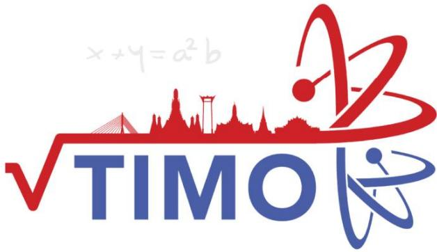

## Thailand International Mathematical Olympiad

KHOI4 

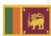

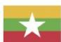

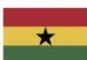

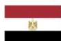

## MỤC LỤC

Giới thiệu Kỳ thi Olympic Toán học quốc tế TIMO . 

Danh sách các trường tham gia tích cực và đạt thành tích cao tại các kỳ TIMO .... ...6 

Một số hình ảnh tiêu biểu của Kỳ thi Olympic Toán học quốc tế TIMO tại Việt Nam .......8 

Syllabus/ Khung chƣơng trình... .11 

Đề thi Đáp án 

## PRELIMINARY ROUND / VÒNG LOẠI QUỐC GIA

Đề số 1... .. 12 ..........49 

Đề số 2... .. 16 ..........50 

Đề số 3... .. 20 ..........51 

Đề số 4.... .. 24 ..........52 

Đề số 5.... .. 28 ..........53 

## HEAT ROUND / VÒNG CHUNG KẾT QUỐC GIA

Đề số 1... .. 32 ..........54 

Đề số 2.... .. 36 ..........55 

Đề số 3.... .. 39 ..........56 

Đề số 4.... .. 42 ..........57 

Đề số 5.... .. 45 ..........58 

Heat Round Answer Sheet/ Phiếu Trả Lời Vòng Chung Kết Quốc Gia..... ..59 

Một số kỳ thi Olympic quốc tế tiêu biểu khác . ..60 

Thông tin liên hệ ... ...64 

# GIỚI THIỆU KỲ THI OLYMPIC TOÁN HỌC QUỐC TẾ TIMO

Kỳ thi Olympic Toán học quốc tế TIMO (Thailand International Mathematical Olympiad) được tổ chức h|ng năm bởi Trung t}m Gi{o dục Vô địch Olympiad Hong Kong (Olympiad Champion Education Centre from Hong Kong) hợp t{c cùng Tổ chức Du lịch Th{i Lan (Tourism Authority of Thailand) nhằm tạo cơ hội cho tất cả học sinh c{c khối lớp từ mẫu gi{o đến trung học phổ thông có sở thích về To{n học tham gia, mục đích kích thích v| nuôi dưỡng niềm yêu thích to{n học của giới trẻ, tăng cường khả năng tư duy s{ng tạo của học sinh, mở rộng mối quan hệ giao lưu văn hóa quốc tế. Với các thí sinh tham dự kỳ thi TIMO và đạt huy chương V|ng tại vòng Chung kết quốc tế sẽ được tham dự vòng Chung kết kỳ thi Olympic To{n học Thế giới WIMO v|o th{ng h|ng năm. 

Trong mỗi lần tổ chức, Kỳ thi Olympic Toán học quốc tế TIMO đã thu hút h|ng trăm nghìn thí sinh tham dự đến từ nhiều quốc gia và vùng lãnh thổ khác nhau trên thế giới như: Australia, Brazil, Bulgaria, Cambodia, England, France, Georgia, Ghana, Hong Kong, Indonesia, India, Iran, Kazakhstan, Kyrgyzstan, Malaysia, Myanmar, Philippines, Singapore, Sri Lanka, Switzerland, Taiwan, Turkey, Thailand, Vietnam, ... 

Năm học 2021-2022 là lần thứ ba Kỳ thi được tổ chức tại Việt Nam. Trong lần thứ hai tham dự, tại Vòng Chung kết quốc gia, các thí sinh Việt Nam đã rất xuất sắc với 74% đạt giải trong đó Cúp Vô địch, 2 Cúp Á qu}n , 3 Cúp Á qu}n 2; 7% Huy chương V|ng, 9% Huy chương Bạc, 38% Huy chương Đồng và 10% giải Khuyến khích. Đặc biệt, trong vòng Chung kết quốc tế, đội tuyển Việt Nam đã xuất sắc đạt thành tích cao bao gồm 36 giải Vàng, 87 giải Bạc, 163 giải Đồng, trong đó có Cúp Ngôi sao thế giới d|nh cho thí sinh cao điểm nhất Việt Nam, Cúp Vô địch d|nh cho thí sinh cao điểm nhất toàn cầu và 1 Cúp Á quân 2 dành cho thí sinh cao điểm thứ 3 toàn cầu tại mỗi khối lớp. 

Với mong muốn góp phần tạo dựng thêm s}n chơi giao lưu quốc tế dành cho học sinh Việt Nam, đồng thời góp phần n}ng cao trình độ v| cơ hội hợp tác cho giáo viên và cán bộ giáo dục, tiếp cận các nền giáo dục tiên tiến trên thế giới, Ban Tổ chức kỳ thi mong muốn nhận được sự ủng hộ, hỗ trợ và tham gia của các Sở, Phòng Giáo dục v| Đ|o tạo, nh| trường, phụ huynh và các em học sinh để các kỳ thi quốc tế tại Việt Nam đạt được hiệu quả cao nhất. 

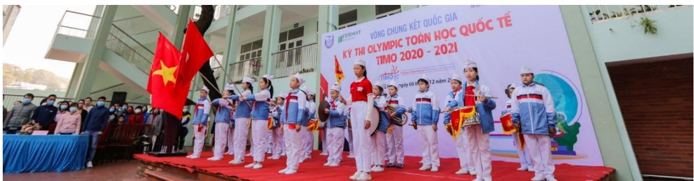

Hội đồng thi trường TH Hạ Long, Quảng Ninh tại Vòng Chung kết quốc gia TIMO 2020 - 2021

## Thông tin chi tiết về Kỳ thi Olympic Toán học quốc tế TIMO

## 1. Quy định về độ tuổi, cấu trúc đề thi

## a. Về độ tuổi

Tất cả các học sinh yêu thích môn Toán từ Lớp mẫu giáo tới Lớp 12 trung học phổ thông. 

## b. Về cấu trúc đề thi

<table><tr><td colspan="2">Vòng thi</td><td>Vòng loại quốc gia</td><td>Vòng Chung kết quốc gia</td><td>Vòng Chung kết quốc tế</td></tr><tr><td colspan="2">Số câu hỏi</td><td>25</td><td>25</td><td>30</td></tr><tr><td colspan="2">Điểm mỗi câu hỏi</td><td>4</td><td>4</td><td>5</td></tr><tr><td colspan="2">Tổng điểm</td><td>100</td><td>100</td><td>150</td></tr><tr><td rowspan="5">Chủ đề</td><td>Tự duy lôgic</td><td>5</td><td>5</td><td>6</td></tr><tr><td>Số học/Đại số</td><td>5</td><td>5</td><td>6</td></tr><tr><td>Lý thuyết số</td><td>5</td><td>5</td><td>6</td></tr><tr><td>Hình học</td><td>5</td><td>5</td><td>6</td></tr><tr><td>Tổ hợp</td><td>5</td><td>5</td><td>6</td></tr><tr><td colspan="2">Thời gian</td><td>60 phút</td><td>90 phút</td><td>120 phút</td></tr><tr><td colspan="2">Dạng đề thi</td><td>Trắc nghiệm</td><td>Điền đáp án</td><td>Điền đáp án</td></tr><tr><td colspan="2">Ngôn ngữ</td><td>Song ngữ Anh – Việt</td><td>Tiếng Anh (có trích dẫn thuật ngữ tiếng Việt)</td><td>Tiếng Anh</td></tr></table>

## 2. Cơ cấu giải thưởng

a. Giải thƣởng của Ban Tổ chức quốc tế 

<table><tr><td rowspan="2">Huy chương</td><td colspan="2">Điều kiện xét giải</td><td rowspan="2">Giải thường</td></tr><tr><td>Vòng Chung kết quốc gia</td><td>Vòng Chung kết quốc tế</td></tr><tr><td>Ngôi sao thế giới (World Star)</td><td></td><td>Thí sinh cao điểm nhất mỗi khu vực.</td><td>- Cúp Ngôi sao thế giới;- Miễn lệ phí tham dự Vòng Chung kết quốc tế.</td></tr><tr><td>Giải Xuất sắc (Champion 1stRunner-up 2ndRunner-up)</td><td>03 thí sinh cao điểm nhất mỗi khối thi.</td><td>03 thí sinh điểm cao nhất mỗi khởi thi.</td><td>- Cúp Vô dịch;- Cúp Á quân 1;- Cúp Á quân 2.</td></tr><tr><td>Giải Vàng (Gold Award)</td><td>Thí sinh chiến thắng đạt từ 80 điểm trở lên.</td><td>Thí sinh chiến thắng đạt từ 120 điểm trở lên.</td><td>Huy chương và Giấy chứng nhận.</td></tr><tr><td>Giải Bạc (Silver Award)</td><td>Thí sinh chiến thắng đạt từ 60 điểm trở lên.</td><td>Thí sinh chiến thắng đạt từ 90 điểm trở lên.</td><td>Huy chương và Giấy chứng nhận.</td></tr><tr><td>Giải Đồng (Bronze Award)</td><td>Thí sinh chiến thắng đạt từ 40 điểm trở lên.</td><td>Thí sinh chiến thắng đạt từ 60 điểm trở lên.</td><td>Huy chương và Giấy chứng nhận.</td></tr><tr><td>Giải Khuyến khích (Merit)</td><td>Thí sinh chiến thắng đạt từ 20 điểm trở lên.</td><td>Thí sinh chiến thắng đạt từ 30 điểm trở lên.</td><td>Giấy chứng nhận.</td></tr></table>

Đặc biệt, c{c thí sinh đạt Huy chương V|ng Vòng Chung kết quốc tế TIMO được tham dự (miễn lệ phí thi) Vòng Chung kết Kỳ thi Olympic Toán thế giới WIMO vào tháng 1 năm tới. 

## Lưu ý:

- Vòng loại quốc gia không xếp giải. Khoảng 70% thí sinh có điểm cao nhất của Vòng loại quốc gia được đăng ký tham gia Vòng Chung kết quốc gia. 

- Ban Tổ chức sắp xếp kết quả giảm dần dựa trên điểm thi v| ng|y sinh. Do đó, c{c thí sinh bằng điểm có thể nhận hai giải khác nhau. Nếu một giải thưởng đã đủ chỉ tiêu, thí sinh tiếp theo sẽ nhận giải thưởng mức liền kề phía dưới. 

- Các mốc điểm đạt giải có thể thay đổi dựa trên kết quả thi thực tế của tất cả thí sinh. 

## b. Giải thƣởng của Ban Tổ chức Việt Nam

* Đối với thí sinh: 

- Thí sinh cao điểm nhất Vòng Chung kết quốc gia được giải thưởng tiền mặt 5.000.000 đồng (năm triệu đồng). 

- Với mỗi khối có từ 100 thí sinh tham dự Vòng loại quốc gia, thí sinh cao điểm nhất khối thi Vòng Chung kết quốc gia được giải thưởng tiền mặt 2.000.000 đồng (hai triệu đồng); 

Với các giải thưởng tiền mặt phía trên, nếu có nhiều hơn một thí sinh đạt giải, số tiền thưởng được chia đều cho c{c thí sinh đạt giải. 

- Thí sinh đạt huy chương V|ng vòng Chung kết quốc gia v| đạt giải Vòng Chung kết quốc tế TIMO được đặc cách miễn Vòng loại quốc gia các kỳ thi HKIMO, BBB cùng năm học và các tặng thưởng lệ phí khi tham gia các kỳ thi có trong Thông báo của mỗi kỳ thi. 

* Đối với Trường có học sinh tham dự: 

- Trường có từ 300 học sinh tham gia Kỳ thi sẽ được tặng Giấy khen, Kỷ niệm chương và quảng bá logo của trường trên tất cả các ấn phẩm truyền thông các Kỳ thi của Ban Tổ chức. 

- Trường có từ 150 học sinh tham gia Kỳ thi sẽ được tặng Giấy khen, Kỷ niệm chương và quảng bá logo của trường trên tất cả các ấn phẩm truyền thông về Kỳ thi. 

- Trường có từ 50 học sinh tham gia Kỳ thi sẽ được tặng Giấy khen tham dự tích cực trong Kỳ thi quốc tế. 

. TH Điện Biên , Thanh Hóa 

2. TH Nguyễn Văn Trỗi, Thanh Hóa 

3. TH Lê Mao, Nghệ An 

4. TH Xu}n La, H| Nội 

5. TH Cầu Gi{t, Nghệ An 

6. TH Cầu Diễn, H| Nội 

7. IQ School , H| Nội 

8. TH Chu Văn An, H| Nội 

9. TH Nghĩa T}n, H| Nội 

0. TH Lê Ngọc H}n, H| Nội 

. TH Xu}n Đỉnh, H| Nội 

12. TH,THCS,THPT Đông Bắc Ga, Thanh Hóa 

3. THCS Lê Lợi, H| Nội 

14. TH I-sắc Niu-tơn, H| Nội 

5. TH Đông Th{i, H| Nội 

6. TH Nam Th|nh Công, H| Nội 

7. TH Đội Cung, Nghệ An 

8. TH Thị trấn Phùng, H| Nội 

9. TH Đông Ngạc B, H| Nội 

20. THCS Chu Văn An, H| Nội 

2 . TH Cao B{ Qu{t, H| Nội 

22. TH, THCS & THPT Vinschool, Hồ Chí Minh 

23. TH Hưng Dũng , Nghệ An 

24. TH T}y Sơn, H| Nội 

25. TH,THCS&THPT Nobel school, Thanh Hóa 

26. TH Đồng Mỹ, Quảng Bình 

27. TH NEWTON GOLDMARK, H| Nội 

28. THCS Thị Trấn Nghĩa Đ|n, Nghệ An 

29. TH Ba Trại A, H| Nội 

30. TH Quảng An, H| Nội 

3 . TH Nhật T}n, H| Nội 

32. TH Gia Thượng, H| Nội 

33. TH Thượng Sơn, Nghệ An 

34. TH Lam Sơn 3, Thanh Hóa 

35. TH Thanh Trì, H| Nội 

36. TH Dương X{, H| Nội 

37. THCS Xu}n Diệu, H| Tĩnh 

38. TH T}y Tựu B, H| Nội 

39. TH Chu Văn An, Nam Định 

40. TH Gi{p B{t, H| Nội 

4 . TH H| Huy Tập 2, Nghệ An 

42. TH Minh Khai A, H| Nội 

43. TH Lê Lợi, Nghệ An 

44. IQ School, Ninh Bình 

45. TH Ba Trại B, H| Nội 

46. TH Phương Canh, H| Nội 

47. TH Mỹ Đình 2, H| Nội 

48. THCS Đông Th{i, H| Nội 

49. TH Phú Phương, H| Nội 

50. TH Vạn Thắng, H| Nội 

5 . TH Hải Cường, Nam Định 

52. THCS Th{i Thịnh, H| Nội 

53. Hanoi Academy, H| Nội 

54. TH Phúc Diễn, H| Nội 

55. THCS Bạch Liêu, Nghệ An 

56. THCS Phú Diễn, H| Nội 

57. TH Lưu Sơn, Nghệ An 

58. THCS Cao B{ Qu{t, H| Nội 

59. TH Bến Thủy, Nghệ An 

60. THCS & THPT Lê Quý Đôn, H| Nội 

6 . THCS Minh Khai, H| Nội 

62. THCS Trần Phú, Thanh Hóa 

63. THCS Văn Đức, H| Nội 

64. TH Lê Ngọc H}n, H| Nội 

65. TH Ngô Đức Kế, H| Tĩnh 

66. THCS Xu}n Đỉnh, H| Nội 

67. THCS Trung Lương, H| Tĩnh 

68. TH Hưng Dũng 2, Nghệ An 

69. TH An Dương, H| Nội 

70. TH Đô Thị Việt Hưng, H| Nội 

7 . TH Thịnh Sơn, Nghệ An 

72. TH Quang Trung, H| Nội 

73. THCS - THPT Newton, H| Nội 

74. THCS Ngô Gia Tự, H| Nội 

75. THCS Xu}n La, H| Nội 

76. THCS Hà Huy Tập, H| Nội 

77. TH Tòng Bạt, H| Nội 

78. TH&THCS NEWTON 5, H| Nội 

79. TH Cổ Nhuế 2B, H| Nội 

80. TH Hòa Hiếu I, Nghệ An 

8 . THCS Đông Ngạc, H| Nội 

82. TH Đồng Nh}n, H| Nội 

83. THCS Nguyễn Trường Tộ, H| Nội 

84. THCS Ninh Hiệp, H| Nội 

85. TH Vật Lại, H| Nội 

86. TH T}y Đằng A, H| Nội 

87. THCS Thượng C{t, H| Nội 

88. TH Đại Từ, H| Nội 

89. TH Quang Tiến, Nghệ An 

90. TH Đức Thắng, H| Nội 

9 . TH Thuận Sơn, Nghệ An 

92. TH và THCS Fansipan, Thanh Hóa 

93. THCS Vĩnh Quỳnh, H| Nội 

94. TH Phú Ch}u, H| Nội 

95. TH Quỳnh Hồng, Nghệ An 

96. THCS Tứ Hiệp, H| Nội 

97. THCS Phan Đăng Lưu, Nghệ An 

98. TH Ngô Đức Kế, H| Tĩnh 

99. THCS Hồ Xu}n Hương, Nghệ An 

00. Trường Quốc tế song ngữ UK Academy, Quảng Ngãi 

0 . TH Nguyễn Thị Minh Khai, Hải Phòng 

02. TH Gia Kh{nh A, Vĩnh Phúc 

## Một số hình ảnh tiêu biểu của Kỳ thi Olympic Toán học quốc tế TIMO tại Việt Nam

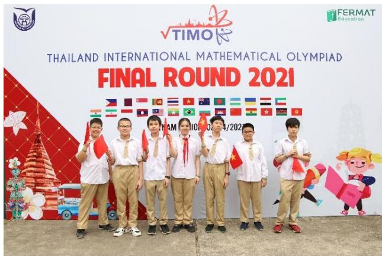

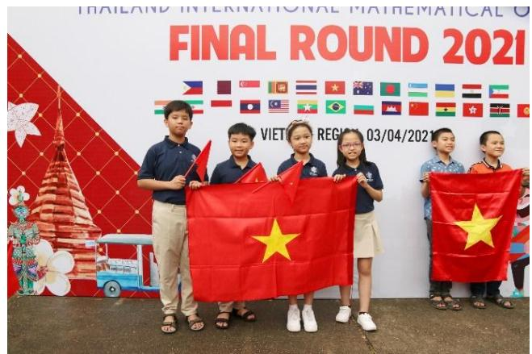

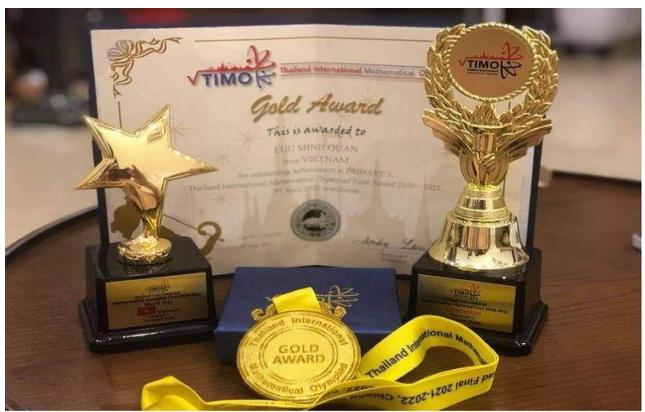

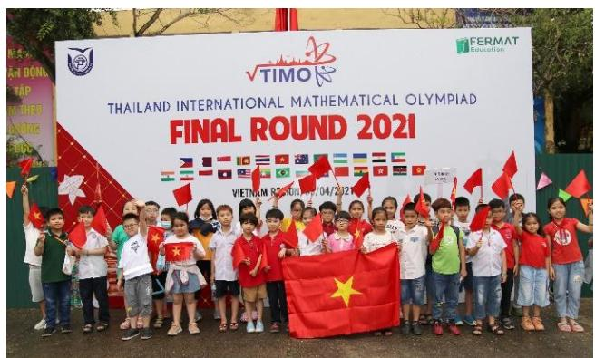

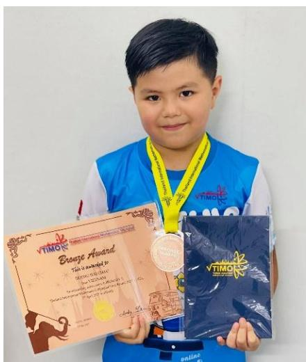

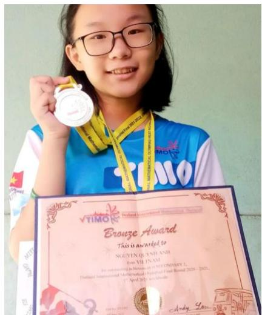

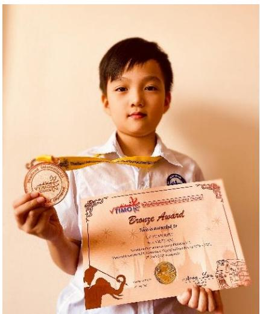

Vòng Chung kết quốc tế TIMO 2020 - 2021 

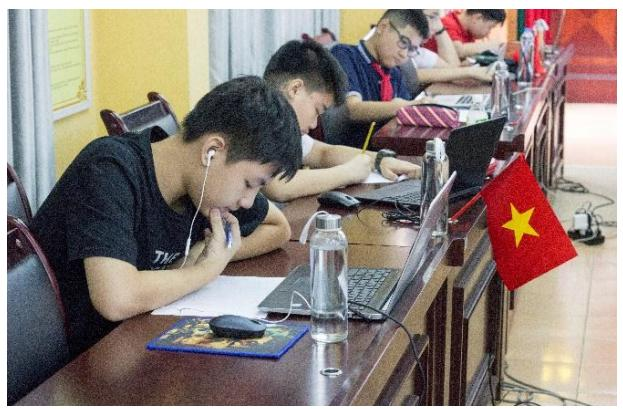

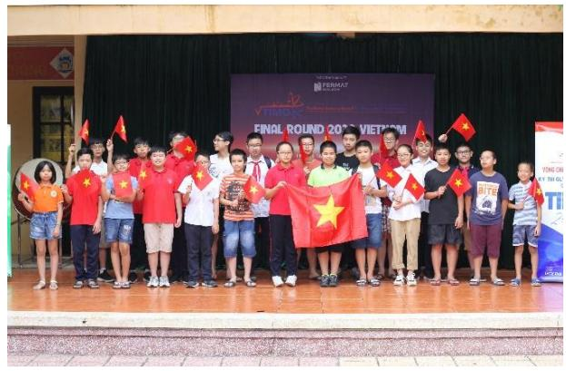

Hội đồng thi trường THCS Thái Thịnh, Đống Đa, Hà Nội năm học 2019 - 2020

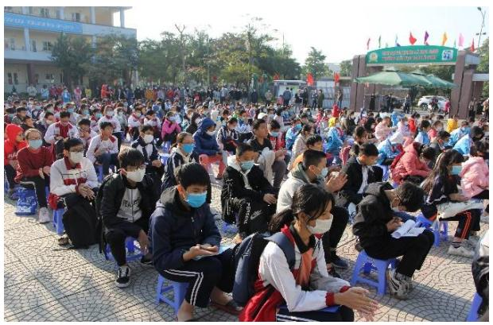

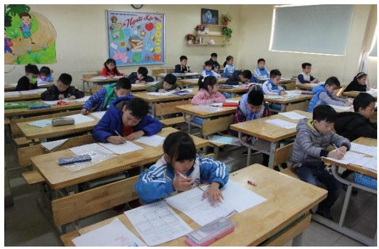

Hội đồng thi trường TH Cao Bá Quát, Gia Lâm, Hà Nội năm học 2020 - 2021

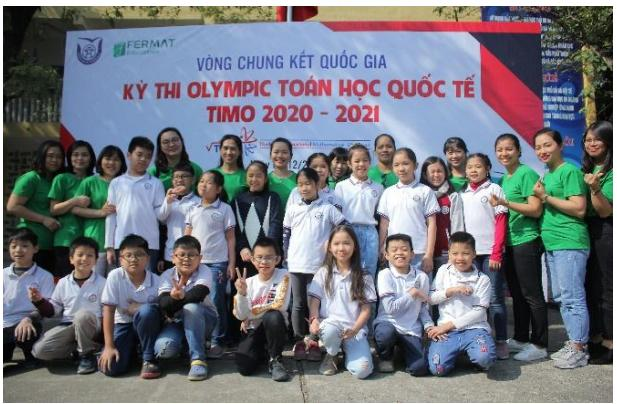

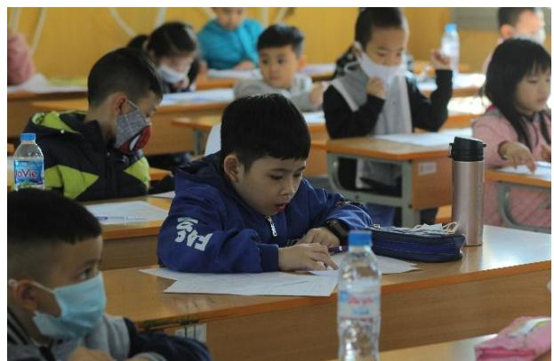

Hội đồng thi Trường Đại học Thủ Đô Hà Nội năm học 2020 - 2021

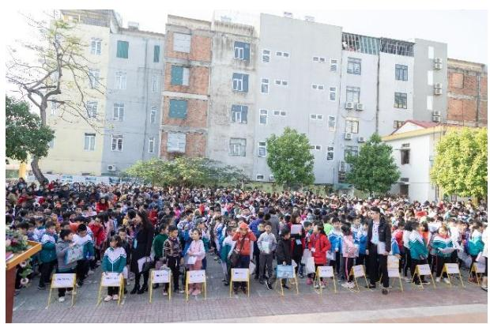

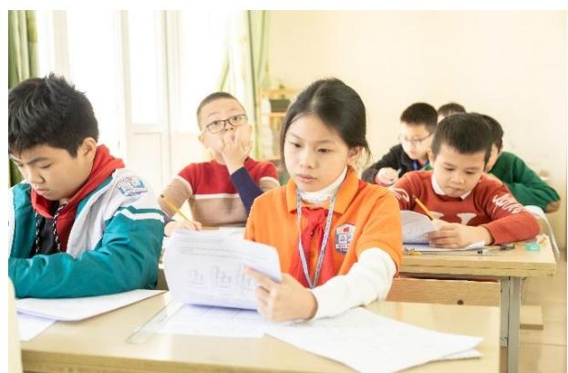

Hội đồng thi tỉnh Thanh Hóa năm học 2020 - 2021

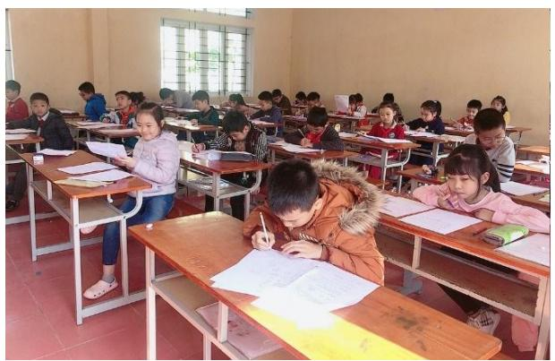

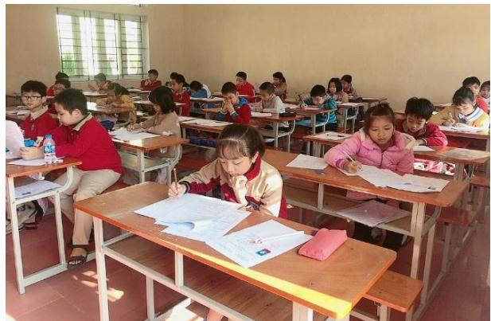

Hội đồng thi tỉnh Nam Định năm học 2020 - 2021

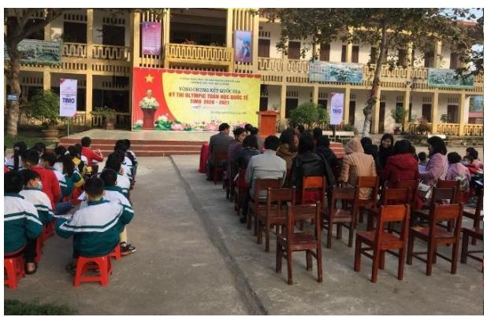

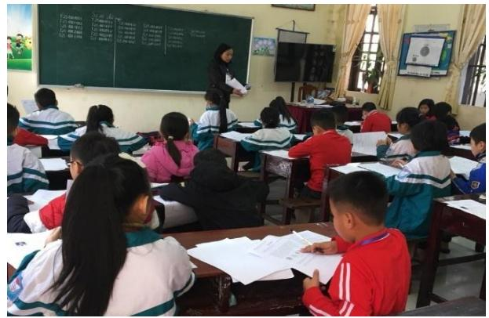

Hội đồng thi trường TH Hải Cường, Nam Định năm học 2020 - 2021

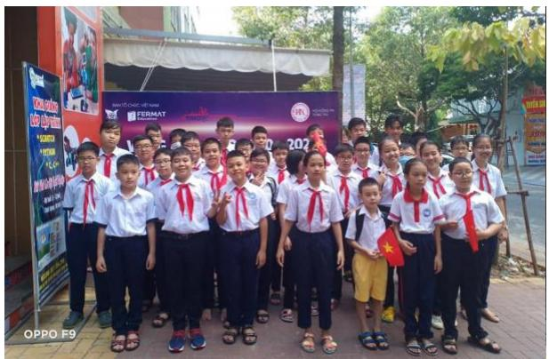

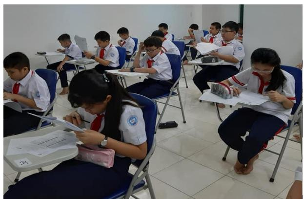

Hội đồng thi tỉnh Bà Rịa - Vũng Tàu năm học 2020 - 2021

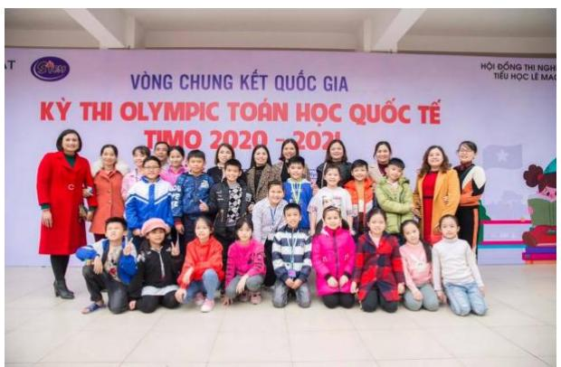

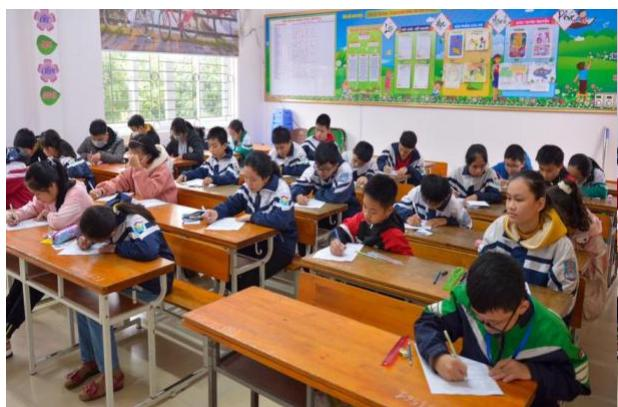

Hội đồng thi trường TH Lê Mao, Nghệ An năm học 2020 - 2021

SYLLABUS / KHUNG CHƢƠNG TRÌNH

<table><tr><td>TopicsChủ đề</td><td>Grade 4 / Khối 4</td></tr><tr><td>Logical thinkingTư duy logic</td><td>➢ Number &amp; Figure Pattern / Dãy số và dãy hình có quy luật➢ IQ Age Problem &amp; Date Problem / Tuôi và ngày tháng➢ Backward problems / Bài toán làm ngược lại➢ Assumption problems / Bài toán giả thiết tạm</td></tr><tr><td>ArithmeticSố học</td><td>➢ Smart addition and subtraction / Tính nhanh các phép cộng trừ➢ Distribution property for multiplication and division / Tính chất phân phối với phép nhân và phép chia➢ Arithmetic sequence and geometric sequence / Dãy số cách đều và dãy số nhân</td></tr><tr><td>Number theoryLý thuyết số</td><td>➢ Divisibility / Tính chia hết➢ New operation symbol / Định nghĩa phép toán mới➢ Find two numbers given sum and ratio, difference and ratio / Tìm hai số biết tổng tỉ, hiệu tỉ➢ Unit digit / Tìm chữ số tận cùng</td></tr><tr><td>GeometryHình học</td><td>➢ Counting on number rectangles in a grid / Đếm hình chữ nhật trong lưới ô vuông➢ Counting on number of 2-D &amp; 3-D Figures / Đếm hình 2D hoặc 3D➢ Perimeter and area; Surface area / Chu vi và diện tích; Diện tích bề mặt➢ Maximum and minimum value / Giá trị lớn nhất và giá trị nhỏ nhất</td></tr><tr><td>CombinatoricsTổ hợp</td><td>➢ Routing problem / Bài toán đếm đường đi➢ Counting on specific numbers or cases / Đếm các số hoặc các trường hợp đặc biệt➢ Worst case scenario / Dạng toán trường hợp xấu nhất➢ Formation of numbers / Thành lập số</td></tr></table>

*Khung chương trình mang tính chất tham khảo. 

# PRELIMINARY ROUND / VÒNG LOẠI QUỐC GIA

# ĐỀ SỐ 1: Đề thi Vòng loại quốc gia năm học 2020 – 2021

## Logical thinking / Tƣ duy lô-gic

1. According to the pattern shown below, how many suns are there from the 1st to the 29th symbol counting from the left? 

Dựa vào quy luật dưới đây, hỏi có bao nhiêu hình mặt trời tính từ hình thứ nhất phía bên trái đến hình thứ 29? 

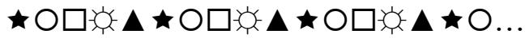

A. 6 

B. 5 

C. 4 

D. 7 

2. Today is Tuesday. Which day of the week will it be 23 days later? 

Hôm nay là thứ Ba. Hỏi 23 ngày nữa là thứ mấy? 

A. Monday (Thứ Hai) 

B. Wednesday (Thứ Tư) 

C. Tuesday (Thứ Ba) 

D. Thursday (Thứ Năm) 

3. People can buy couple tickets or single tickets to see a performance. The staff counted and found that there were a total of 50 people and 30 tickets. How many people went to the theatre alone? 

Người ta có thể mua vé đôi hoặc mua vé đơn để xem một buổi biểu diễn. Nhân viên đếm và thấy rằng có tất cả 50 người nhưng chỉ có 30 vé. Hỏi có bao nhiêu người đến rạp hát một mình? 

A. 10 

B. 20 

C. 30 

D. 40 

4. According to the pattern below, find the next term in the sequence. 

Dựa vào quy luật dưới đây, tìm số tiếp theo ở trong dãy. 

, 2, 4, 7, , 6, 22, < 

A. 24 

B. 38 

C. 23 

D. 29 

5. A fruit store had a basket of oranges. They sold half of the oranges in the first day. In the 2nd day, they sold 25 oranges and threw away 7 rotten oranges. They found that there were 50 oranges left. How many oranges does the store have originally? 

Một cửa hàng hoa quả có một rổ cam. Họ bán một nửa số cam trong ngày đầu. Trong ngày thứ hai, họ bán 25 quả cam và bỏ đi 7 quả cam bị hỏng. Họ thấy rằng vẫn còn 50 quả cam. Hỏi lúc đầu cửa hàng có bao nhiêu quả cam? 

A. 36 

B. 164 

C. 136 

D. 82 

## Arithmetic / Số học

6. Calculate 360 2 360 3 360 5     . 

Tính 360 2 360 3 360 5     . 

A. 36 

B. 300 

C. 372 

D. 272 

7. Find the value of $1 + 2 + 3 + . . . + 1 0 0 + 1 0 1 + 1 0 0 + . . . + 3 + 2 + 1 .$ 

Tìm giá trị của 1 2 3 ... 100 101 100 ... 3 2 1           . 

A. 10302 

B. 5151 

C. 10101 

D. 10201 

8. Calculate 130 42 260 19 30 130      . 

Tính 130 42 260 19 30 130     . 

A. 6500 

B. 1300 

C. 26000 

D. 3000 

9. Find the value of 100 95 90 85 80 75 ... 10 5         . 

Tìm giá trị của 100 95 90 85 80 75 ... 10 5         . 

A. 100 

B. 50 

C. 45 

D. 40 

10. Today is 1st November 2020. Find the product of today’s day, month and year. 

Hôm nay là ngày 1 tháng Mười một năm 2020. Tìm tích của ngày, tháng và năm nay. 

A. 22220 

B. 2032 

C. 2222 

D. 20201 

## Number theory / Lý thuyết số

11. What is the largest 4-digit number that can be divisible by 5 and 3? 

Hỏi số lớn nhất có 4 chữ số chia hết cho 5 và 3 là số nào? 

A. 9000 

B. 9995 

C. 9990 

D. 9090 

12. Find the last digit of $5 { \times } 1 5 { \times } 2 5 { \times } \ldots { \times } 8 5 { \times } 9 5$ . 

Tìm chữ số tận cùng của $5 { \times } 1 5 { \times } 2 5 { \times } \ldots { \times } 8 5 { \times } 9 5$ . 

A. 5 

B. 9 

C. 7 

D. 0 

13. Define the operation symbol $a \oplus b = ( a - b ) \times ( a + b )$ . Find the value of  243 143  . 

Định nghĩa phép toán sau  a b a b a b      ( ) ( ) . Tìm giá trị của  243 143  . 

A. 38600 

B. 386 

C. 486 

D. 48600 

14. The sum of two natural numbers A and B is 2020. A is 3 times of B. Find the difference between A and B. 

Tổng của hai số tự nhiên A và B là 2020. A gấp 3 lần B. Tìm hiệu giữa hai số A và B. 

A. 505 

B. 1010 

C. 1515 

D. 1000 

15. Given  A A 1234 is a 6-digit number divisible by 9 và 2, find the value of A. 

Biết rằng  A A 1234 là một số có 6 chữ số chia hết cho 9 và 2, tìm giá trị của A. 

A. 1 

B. 8 

C. 4 

D. 9 

## Geometry / Hình học

16. How many rectangles in the figure below contain the shaded region? 

Trong hình dưới đây có bao nhiêu hình chữ nhật chứa phần tô đậm? 

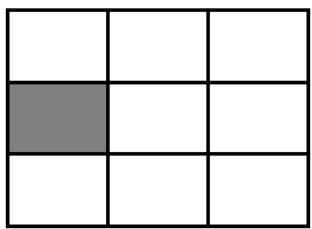

A. 9 

B. 10 

C. 11 

D. 12 

17. A big square is formed by 16 squares with side length 24 cm. How many cm is the perimeter of the big square? 

Một hình vuông lớn được ghép lại từ 16 hình vuông nhỏ có cạnh dài 24cm. Hỏi chu vi của hình vuông lớn là bao nhiêu cm? 

A. 256 

B. 576 

C. 96 

D. 384 

18. The area of a rectangle is 20. If the sides of the rectangle are natural numbers, how many different value(s) of the perimeter of this rectangle is / are there? 

Diện tích của hình chữ nhật là 20. Nếu cạnh của hình chữ nhật là các số tự nhiên, hỏi chu vi của hình chữ nhật có thể có bao nhiêu giá trị khác nhau? 

A. 3 

B. 6 

C. 1 

D. 2 

19. An Egyptian pyramid with a square base has the shape as the figure below. How many sides does it have? 

Một kim tự tháp Ai Cập với đáy là hình vuông như hình dưới đây. Hỏi kim tự tháp đó có bao nhiêu cạnh? 

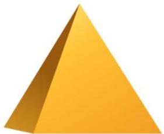

A. 5 

B. 8 

C. 10 

D. 12 

20. Donald had a square sheet of paper. He cut along the dotted line to get rid of 4 corners and got a smaller square with perimeter 40cm. Find the area of the original sheet of paper in cm2. 

Donald có một mảnh giấy hình vuông. Anh ý cắt dọc theo đường nét đứt để bỏ đi 4 góc giấy và được một hình vuông nhỏ hơn có chu vi 40cm. Tìm diện tích của mảnh giấy ban đầu theo cm2. 

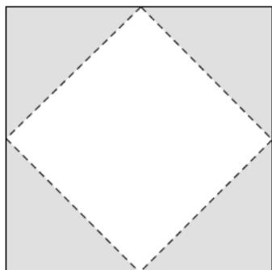

A. 200 

B. 100 

C. 400 

D. 300 

## Combinatorics / Tổ hợp

21. How many 2-digit numbers that are divisible by both 2 and 5 are there? 

Hỏi có bao nhiêu số có hai chữ số mà chia hết cho cả 2 và 5? 

A. 10 

B. 9 

C. 45 

D. 15 

22. How many 3-digit numbers whose sums of digits are 4 are there? 

Hỏi có bao nhiêu số có 3 chữ số mà tổng các chữ số là 4? 

A. 12 

B. 6 

C. 10 

D. 8 

23. Each cell in the grid below is painted with one in 3 colors red, blue and yellow. How many ways to paint the grid are there if two adjacent cells must have different colors? 

Mỗi ô trong bảng dưới đây được tô bởi một trong ba màu đỏ, xanh và vàng. Hỏi có bao nhiêu cách tô để hai ô cạnh nhau phải có màu khác nhau? 

<table><tr><td></td><td></td><td></td></tr></table>

A. 6 

B. 24 

C. 3 

D. 12 

24. Choose 3 digits, without repetition, from 1, 2, 4, 6, 8 to form 3-digit even numbers. How many numbers are there? 

Chọn 3 chữ số khác nhau từ các chữ số 1, 2, 4, 6, 8 để lập thành số chẵn có 3 chữ số. Hỏi có bao nhiêu số như vậy? 

A. 64 

B. 60 

C. 48 

D. 40 

25. The map below shows different ways that Mickey can go from home to school. Given that he can only move northwards or eastwards, how many ways are there? 

Bản đồ dưới đây biểu diễn những đoạn đường Mickey có thể đi từ nhà đến trường. Biết rằng anh ấy chỉ có thể đi về phía bắc hoặc về phía đông, hỏi có bao nhiêu cách đi từ nhà đến trường? 

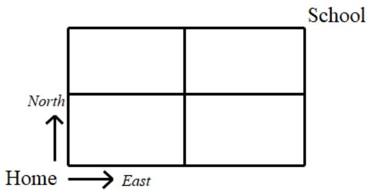

A. 8 

B. 6 

C. 4 

D. 2 

## ĐỀ SỐ 2

## Logical thinking / Tƣ duy Lô-gic

1. Each day, Tom’s chicken can lay 2 eggs. Given that he has 20 eggs right now, how many eggs will be there 11 days later? 

Mỗi ngày, con gà của Tom đẻ được 2 quả trứng. Biết rằng hiện tại anh ấy đang có 20 quả trứng. Hỏi sau 11 ngày, anh ấy sẽ có bao nhiêu quả trứng? 

A. 42 

B. 40 

C. 31 

D. 33 

2. If 19th February 2021 is Friday, which day of the week will 21st February 2022 be? Biết ngày 19 tháng 2 năm 2021 là thứ Sáu, hỏi ngày 21 tháng 2 năm 2022 là thứ mấy? 

A. Sunday (Chủ Nhật) 

C. Saturday (Thứ Bảy) 

B. Monday (Thứ Hai) 

D. Tuesday (Thứ Ba) 

3. What is the 8th number in the sequence with pattern below? 

Tìm số thứ 8 trong dãy có quy luật dưới đây? 

2 , 5 , 0 , 7 , 26 , 37 , < 

A. 60 

B. 62 

C. 64 

D. 65 

4. Four tables below have number filled according to the same pattern but some cells are being covered. Which number is being covered at the position of symbol “”? 

Bốn bảng dưới đây được điền số dựa trên cùng một quy luật. Tuy nhiên, có một vài ô đang bị che khuất. Hỏi số bị che khuất ở vị trí “ ” là số nào? 

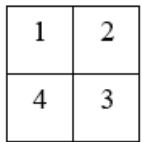

A. 11 

<table><tr><td>1</td><td></td><td>3</td></tr><tr><td></td><td>9</td><td></td></tr><tr><td>7</td><td></td><td>5</td></tr></table>

B. 14 

<table><tr><td>1</td><td></td><td></td><td>4</td></tr><tr><td></td><td>13</td><td>14</td><td></td></tr><tr><td></td><td>16</td><td>15</td><td></td></tr><tr><td>10</td><td></td><td></td><td>7</td></tr></table>

C. 15 

<table><tr><td>1</td><td></td><td></td><td></td><td>5</td></tr><tr><td></td><td>17</td><td></td><td>19</td><td></td></tr><tr><td>✘</td><td></td><td>25</td><td></td><td></td></tr><tr><td></td><td>23</td><td></td><td>21</td><td></td></tr><tr><td>13</td><td></td><td></td><td></td><td>9</td></tr></table>

D. 7 

5. Find the missing number in the table below. 

Tìm số còn thiếu trong bảng dưới đây. 

<table><tr><td>2</td><td>5</td><td>1</td><td>11</td></tr><tr><td>3</td><td>6</td><td>2</td><td>20</td></tr><tr><td>4</td><td>7</td><td>3</td><td>31</td></tr><tr><td>5</td><td>8</td><td>4</td><td>?</td></tr></table>

A. 42 

B. 40 

C. 41 

D. 44 

## Arithmetic / Số học

6. Find the value of $1 2 \times 1 6 + 8 \times 1 7 + 2 4 \times 3$ . 

Tìm giá trị của $1 2 \times 1 6 + 8 \times 1 7 + 2 4 \times 3$ . 

A. 400 

B. 300 

C. 410 

D. 310 

7. Find the value of 115 17 128 17 90 17.     

Tìm giá trị của 115 17 128 17 90 17.     

A. 7 

B. 9 

C. 8 

D. 10 

8. Find the value of 5 + 0 + 5 + 20 + < + 95 + 200. 

Tính giá trị của 5 + 10 + 15 + 20 + < + 195 + 200. 

A. 8200 

B. 4010 

C. 4000 

D. 4100 

9. Let each letter M, A, T, H, K, I, O represent a distinct 1-digit number. Find T. 

Biết chữ cái M, A, T, H, K, I, O biểu diễn các số có 1 chữ số khác nhau. Tìm giá trị của chữ cái T. 

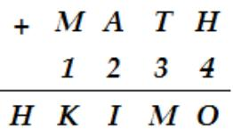

A. 4 

B. 5 

C. 6 

D. 7 

10. What is the value of K if the equation below is correct? 

Tìm giá trị của K để được phép tính đúng dưới đây. 

$$
1 + 3 + 9 + 2 7 + \dots + 7 2 9 = K
$$

A. 1039 

B. 1093 

C. 769 

D. 1193 

## Number theory / Lý thuyết số

11. A is 5 times B and the sum of A and B is 240. Find the value of A. 

Biết A gấp 5 lần B và tổng của A và B là 240. Tính giá trị của A. 

A. 200 

B. 192 

C. 300 

D. 160 

12. How many 2-digit numbers divisible by 2 or 5 are there? 

Hỏi có bao nhiêu số có 2 chữ số chia hết cho 2 hoặc 5? 

A. 70 

B. 63 

C. 54 

D. 58 

13. 10-digit number  20212022AB is divisible by 45, find the smallest value of A. 

Biết số có 10 chữ số 20212022AB chia hết cho 45, tìm giá trị nhỏ nhất của A. 

A. 2 

B. 7 

C. 1 

D. 0 

14. Define the new operation symbol $a \otimes b = ( 2 \times b - a ) \times \left( a + b \right)$ , find the value of  3 (5 3)   . 

Định nghĩa kí hiệu phép toán mới như sau: $a \otimes b = ( 2 \times b - a ) \times \left( a + b \right)$ , tính  3 (5 3)   . 

A. 134 

B. 143 

C. 613 

D. 6431 

15. Wendy writes down a 2-digit number. Amy adds a digit “ ” to the right of Wendy’s number and sees that the number increases 856. Find Wendy’s number. 

Wendy viết một số có 2 chữ số. Amy viết thêm một chữ số 1 vào bên phải số của Wendy thì thấy số đó tăng thêm 856 đơn vị. Tìm số của Wendy. 

A. 95 

B. 90 

C. 855 

D. 96 

## Geometry / Hình học

16. Each cell in the grid below has side length 2. Find the area of the shaded region. Mỗi ô vuông trong lưới dưới đây có độ dài cạnh bằng 2. Tính diện tích phần tô đậm. 

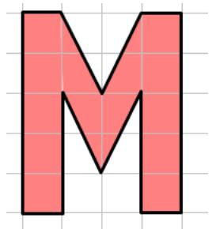

A. 28 

B. 72 

C. 56 

D. 64 

17. They want to paint all surface of the figure below. At least how many squares do they have to paint over? 

Người ta muốn sơn toàn bộ bề mặt của hình dưới đây. Hỏi họ cần sơn ít nhất bao nhiêu hình vuông? 

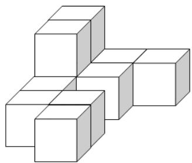

A. 42 

B. 21 

C. 22 

D. 44 

18. A rectangle has perimeter 28cm. When its length increases 3cm, the area increases 18cm2. Find the area of the new rectangle in cm2. 

Một hình chữ nhật có chu vi 28cm. Khi chiều dài của nó tăng thêm 3cm thì diện tích hình chữ nhật cũng tăng thêm 18cm2. Tính diện tích của hình chữ nhật mới theo cm2. 

A. 34 

B. 48 

C. 66 

D. 64 

19. How many rectangles containing both triangles are there in the figure below? 

Hỏi có bao nhiêu hình chữ nhật chứa cả hai tam giác trong hình dưới đây? 

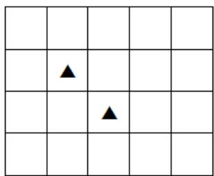

A. 12 

B. 18 

C. 36 

D. 24 

20. Eight identical rectangles with perimeter 36 each are combined to form a big square as follows. Find the perimeter of the square. 

Tám hình chữ nhật y hệt nhau đều có chu vi là 36 được ghép thành hình vuông như sau. Tính chu vi của hình vuông đó. 

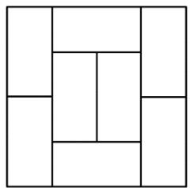

A. 84 

B. 96 

C. 144 

D. 72 

## Combinatorics / Tổ hợp

21. In an assembly after Tet Holiday, there are 81 primary students, 67 secondary students and 53 high school students. The principal calls students randomly by name to give red envelopes. At least how many students does the principal need to call to ensure that 5 primary students and 7 secondary students receive the gifts? 

Buổi lễ chào cờ sau Tết có sự tham gia của 81 học sinh tiểu học, 67 học sinh trung học cơ sở và 53 học sinh trung học phổ thông. Thầy hiệu trưởng gọi tên ngẫu nhiên để lì xì cho học sinh. Hỏi thầy cần gọi ít nhất bao nhiêu em để chắc chắn trong số đó có 5 học sinh tiểu học và 7 học sinh trung học cơ sở nhận được lì xì? 

A. 65 

B. 12 

C. 125 

D. 141 

22. Sarah must take 1 or 2 pills a day. She has 10 pills in total. How many different ways are there for Sarah to take all those pills? 

Mỗi ngày Sarah phải uống 1 hoặc 2 viên thuốc. Biết rằng cô ấy có tất cả 10 viên thuốc. Hỏi có bao nhiêu cách khác nhau để Sarah uống hết số thuốc đó? 

A. 89 

B. 20 

C. 98 

D. 30 

23. Given a 100-digit number with pattern as follows. Find the unit digit of A. 

Cho số có 100 chữ số với quy luật dưới đây. Tìm chữ số hàng đơn vị của A. 

$$
\mathrm{A} = \overline {{1 2 3 4 5 6 7 8 9 1 0 1 1 1 2 1 3 1 4 \dots}}
$$

A. 3 

B. 4 

C. 5 

D. 6 

24. Use 4 distinct digits from 0, 2, 4, 5, 6, 7 to form 4-digit numbers greater than 4756. How many different numbers can be formed? 

Chọn 4 chữ số khác nhau từ các số 0, 2, 4, 5, 6, 7 để lập thành số có 4 chữ số lớn hơn 4756. Hỏi có thể tạo được bao nhiêu số như vậy? 

A. 180 

B. 183 

C. 182 

D. 181 

25. Anna needs to fill numbers in the strip below so that any 3 consecutive cells have the sum being 100. Which number should be filled in the last cell? 

Anna cần điền các số vào dải băng dưới đây sao cho 3 ô liên tiếp có tổng bằng 100. Hỏi cần điền số nào vào ô cuối cùng của dải băng đó? 

<table><tr><td></td><td>23</td><td></td><td></td><td></td><td></td><td>41</td><td>?</td></tr></table>

A. 36 

B. 41 

C. 23 

D. 59 

# ĐỀ SỐ 3

# Logical Thinking / Tƣ duy lô-gic

1. Amy gets 58 marks in Chinese exam and she gets 85 in English exam. If she has an average of 74 marks on Chinese, English and Mathematics exam, how many marks does she get in Mathematics exam? 

Amy được 58 điểm trong bài kiểm tra tiếng Trung và 85 điểm trong bài kiểm tra tiếng Anh. Biết số điểm trung bình của bài kiểm tra tiếng Trung, tiếng Anh và Toán của cô ấy là 74. Hỏi cô ấy được bao nhiêu điểm trong bài kiểm tra Toán? 

A. 79 

B. 89 

C. 72 

D. 82 

2. Now, the sum of father’s and mother’s ages is 93. If the age of father 3 years ago was the same as the age of mother 8 years later, how old is father now? 

Hiện tại, tổng tuổi bố và mẹ là 93 tuổi. Tuổi của bố 3 năm trước bằng tuổi của mẹ 8 năm nữa. Hỏi bây giờ bố bao nhiêu tuổi? 

A. 41 

B. 50 

C. 52 

D. 49 

3. A stationery store had a batch of pencils. One half of the batch were sold on the first day. One half of the remaining part were sold on the second day. Finally, 20 pencils are left. How many pencil(s) did the stationery store have originally? 

Một cửa hàng văn phòng phẩm có một số bút chì. Ngày đầu, người ta bán được một nửa số bút. Ngày thứ hai, người ta bán được một nửa số bút còn lại. Cuối cùng, cửa hàng chỉ còn 20 chiếc bút chì. Hỏi lúc đầu cửa hàng có bao nhiêu chiếc bút? 

A. 40 

B. 60 

C. 80 

D. 100 

4. 28th March is Thursday. Which day of the week is 23rd August in the same year? Ngày 28 tháng 3 là thứ Năm. Hỏi ngày 23 tháng 8 cùng năm là thứ mấy? 

A. Sunday (Chủ Nhật) 

C. Thursday (Thứ Năm) 

B. Friday (Thứ Sáu) 

D. Saturday (Thứ Bảy) 

5. There are a total of 28 chickens and rabbits in a farm. The animals have a total of 72 legs. How many chickens are there? 

Có tất cả 28 con vật gồm cả gà và thỏ trong một nông trại. Tổng số chân của chúng là 72 chân. Hỏi có bao nhiêu con gà? 

A. 28 

B. 12 

C. 8 

D. 20 

## Arithmetic / Số học

6. Find the value of 6 7 8 ... 43 44     . 

Tính giá trị của 6 7 8 ... 43 44      . 

A. 1950 

B. 975 

C. 950 

D. 1900 

7. Find the value of 111 111 . 

Tính giá trị của 111 111 . 

A. 12321 

B. 123321 

C. 123123 

D. 32123 

8. Find the value of 24 17 17 28 2    . 

Tính giá trị của  24 17 17 28 2     . 

A. 1350 

B. 1630 

C. 884 

D. 1360 

9. Find the value of 132 6 234 6 384 6     . 

Tính giá trị của 132 6 234 6 384 6      . 

A. 100 

B. 125 

C. 150 

D. 175 

10. Find the value of 49 46 43 ... 4 1     . 

Tính giá trị của  49 46 43 ... 4 1      . 

A. 425 

B. 850 

C. 1225 

D. 400 

## Number Theory / Lý thuyết số

11. If 9-digit number  20180104A is divisible by 9, find the value of A. 

Biết số có 9 chữ số 20180104A chia hết cho 9, tìm giá trị của A. 

A. 4 

B. 5 

C. 2 

D. 0 

12. Find the unit digit of A if $A = \underbrace { 2 \times 2 \times 2 \times . . . \times 2 } _ { 2 0 ^ { * } s } \times \underbrace { 3 \times 3 \times 3 \times . . . \times 3 } _ { 1 8 ^ { * } s } \times 5 .$ 18 '  s 

Tìm chữ số hàng đơn vị của A biết rằng $A = \underbrace { 2 \times 2 \times 2 \times . . . \times 2 } _ { 2 0 ^ { * } s } \times \underbrace { 3 \times 3 \times 3 \times . . . \times 3 } _ { 1 8 ^ { * } s } \times 5$ 

A. 6 

B. 0 

C. 4 

D. 5 

13. Given that a b a b b    2 , calculate 7 9 . 

Biết rằng a b a b b     2 , tính 7 9  . 

A. 81 

B. 77 

C. 126 

D. 16 

14. The sum of positive integers A and B is 540. A is 4 times of B. Find A. 

Tổng của hai số nguyên dương A và B là 540. A gấp 4 lần B. Tìm A. 

A. 108 

B. 540 

C. 135 

D. 432 

15. How many 2-digit numbers are divisible by both 3 and 5? 

Có bao nhiêu số có 2 chữ số chia hết cho cả 3 và 5? 

A. 7 

B. 16 

D. 15 

## Geometry/ Hình học

16. How many rectangles are there in the figure below? 

Có bao nhiêu hình chữ nhật trong hình dưới đây? 

<table><tr><td></td><td></td><td></td></tr><tr><td></td><td></td><td></td></tr><tr><td></td><td></td><td></td></tr></table>

A. 20 

B. 36 

C. 24 

D. 14 

17. The area of a rectangle is 72cm2. If sides of the rectangle are integers, how many different value(s) of perimeter of rectangle is/are there? 

Diện tích của một hình chữ nhật là 72cm2. Biết độ dài các cạnh của hình chữ nhật là số nguyên, hỏi hình chữ nhật đó có thể có bao nhiêu giá trị chu vi khác nhau? 

A. 4 

B. 6 

C. 5 

D. 12 

18. The rectangle below is cut into 7 squares. If the perimeter of the rectangle is 160cm, find the area of the larger square. 

Hình chữ nhật dưới đây được cắt thành 7 hình vuông. Biết chu vi của hình chữ nhật là 160cm, tính diện tích của hình vuông lớn. 

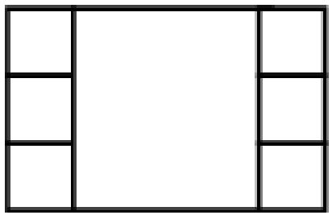

A. 900cm2 

B. 1800cm2 

C. 3600cm2 

D. 1600cm2 

19. The perimeter of an equilateral triangle is 90cm. Now Andy cut the triangle to 4 identical equilateral triangles. What is the sum of perimeter of the small triangles? 

Chu vi của một hình tam giác đều là 90cm. Andy cắt hình tam giác này thành 4 tam giác đều y hệt nhau. Hỏi tổng chu vi của các tam giác nhỏ này là bao nhiêu? 

A. 180cm 

B. 90cm 

C. 360cm 

D. 270cm 

20. How many right-angled triangle(s) is / are there in the figure below? 

Hỏi có bao nhiêu tam giác vuông trong hình dưới đây? 

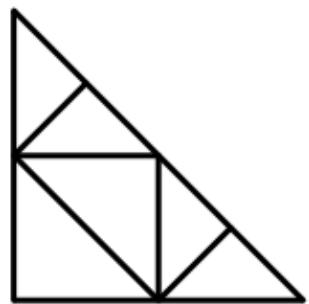

A. 7 

B. 8 

C. 10 

D. 9 

## Combinatorics / Tổ hợp

21. Amy has 4 different shirts, 3 different skirts and 2 different pairs of shoes. How many different outfits can she mix? 

Amy có 4 chiếc áo khác nhau, 3 chân váy khác nhau và 2 đôi giày khác nhau. Hỏi cô bé có thể phối được bao nhiêu bộ đồ khác nhau? 

A. 8 

B. 24 

C. 12 

D. 36 

22. Use all digits 2, 3, 5 and 6 to form a 4-digit number such that the tens digit and thousands digit are even while the units digit and hundreds digit are odd. How many such 4-digit numbers are there? 

Sử dụng tất cả các chữ số 2, 3, 5 và 6 để lập thành số có 4 chữ số sao cho chữ số hàng chục và chữ số hàng nghìn là số chẵn. Chữ số hàng đơn vị và chữ số hàng trăm là số lẻ. Hỏi có thể lập được bao nhiêu số có 4 chữ số như vậy? 

A. 8 

B. 2 

C. 4 

D. 6 

23. Andy has 13 $1 and $2 coins altogether. He has $20 in total. How many $1 coins does he have? 

Andy có 13 xu gồm xu 1 đô và xu 2 đô. Anh ấy có tất cả 20 đô. Hỏi anh ấy có bao nhiêu xu 1 đô? 

A. 9 

B. 8 

C. 7 

D. 6 

24. How many 2-digit numbers without digit “4” are there? 

Hỏi có bao nhiêu số có 2 chữ số không chứa chữ số 4? 

A. 72 

B. 81 

C. 71 

D. 70 

25. If Andy goes from point A to point B, each step can only move up or move right along the line. How many way(s) is / are there? 

Nếu Andy đi từ A đến B và mỗi lần đi chỉ có thể di chuyển lên trên hoặc sang phải dọc theo đường kẻ. Hỏi có bao nhiêu cách đi như vậy? 

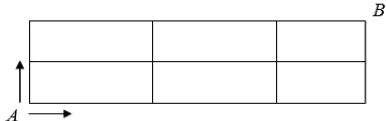

A. 8 

B. 6 

C. 10 

D. 12 

# ĐỀ SỐ 4

## Logical Thinking / Tƣ duy lô-gic

Alice has 5 marks and Peter has 6 marks in Mathematics exam. If the average mark of Alice, Peter and Mary is 58, what is Mary’s exam marks? 

Trong bài kiểm tra toán, Alice được 51 điểm còn Peter được 61 điểm. Số điểm trung bình của các bạn Alice, Peter và Mary là 58. Hỏi Mary được bao nhiêu điểm? 

A. 55 

B. 62 

C. 56 

D. 60 

2. The sum of Alice’s and Peter’s ages is 47. If the age of Alice 2 years ago was the half of the age of Peter 6 years later, how old is Alice now? 

Tổng số tuổi của Alice và Peter là 47. Biết tuổi của Alice 2 năm trước bằng một nửa tuổi của Peter 6 năm nữa. Hỏi bây giờ Alice bao nhiêu tuổi? 

A. 19 

B. 20 

C. 18 

D. 17 

3. A book store had a box of books. One half of the box were sold on the first day. Two thirds of the remaining part were sold on the second day. Finally, 8 books are left. How many books were in the box originally? 

Một hiệu sách có một thùng sách. Một nửa thùng được bán trong ngày đầu tiên. Hai phần ba của phần còn lại được bán trong ngày thứ hai. Cuối cùng chỉ còn 8 quyển sách. Hỏi lúc đầu trong thùng có bao nhiêu quyển sách? 

A. 36 

B. 24 

C. 48 

D. 32 

4. 5th May is Friday. Which day of the week is st April in the same year? 

Ngày 15 tháng 5 là thứ Sáu. Hỏi ngày 1 tháng 4 cùng năm là thứ mấy? 

A. Wednesday (Thứ Tư) 

B. Sunday (Chủ Nhật) 

C. Monday (Thứ Hai) 

D. Tuesday (Thứ Ba) 

5. There are a total of 36 chickens and rabbits in a farm. The animals have a total of 80 legs. How many chicken(s) is / are there? 

Có tất cả 36 con vật bao gồm cả gà và thỏ trong một nông trại. Chúng có tất cả 80 chân. Hỏi trong đó có bao nhiêu con gà? 

A. 16 

B. 20 

C. 4 

D. 32 

## Arithmetic / Số học

6. Find the value of 33 34 35 36 ... 66 67      . 

Tính giá trị của 33 34 35 36 ... 66 67      . 

A. 1700 

B. 3400 

C. 3500 

D. 1750 

7. Find the value of 111 11 101  . 

Tính giá trị của 111 11 101  . 

A. 123321 

B. 12321 

C. 123123 

D. 1234321 

8. Find the value of $1 7 \times 6 2 + 1 9 \times 3 4$ . 

Tính giá trị của 17 62 19 34    . 

A. 1500 

B. 1700 

C. 1377 

D. 1733 

9. Find the value of 1000 2 1000 10 1000 100     . 

Tính giá trị của 1000 2 1000 10 1000 100      . 

A. 8 

B. 600 

C. 610 

D. 9 

10. Find the value of  2 4 6 8 10 ... 28 30        . 

Tính giá trị của  2 4 6 8 10 ... 28 30        . 

A. 224 

B. 120 

C. 240 

D. 480 

## Number Theory / Lý thuyết số

11. If a 9-digit number  20190513A is divisible by 2, find the value of A. 

Nếu số có 9 chữ số 20190513A chia hết cho 12, tính giá trị của A. 

A. 8 

B. 6 

C. 4 

D. 2 

12. Find the unit digit of A given that $A = \underbrace { 2 \times 2 \times \ldots \times 2 } _ { 5 0 ^ { \prime } s } \times \underbrace { 3 \times 3 \times \ldots \times 3 } _ { 5 0 ^ { \prime } s }$ 50 '  s . 

Tìm chữ số tận cùng của A biết rằng $A = \underbrace { 2 \times 2 \times \ldots \times 2 } _ { 5 0 ^ { \prime } s } \times \underbrace { 3 \times 3 \times \ldots \times 3 } _ { 5 0 ^ { \prime } s }$ . 

A. 6 

B. 8 

C. 4 

D. 9 

13. Given that a b b a a    ( ) ( 2) , calculate 10 15 . 

Biết rằng  a b b a a      ( ) ( 2) , tính 10 15  . 

A. 150 

B. 50 

C. 85 

D. 60 

14. The sum of A and B is 936. A is 8 times of B. Find B. 

Biết tổng của A và B là 936. A gấp 8 lần B. Tìm B. 

A. 117 

B. 104 

C. 114 

D. 107 

15. How many 2-digit number(s) either divisible by 5 or divisible by 2 is / are there? 

Hỏi có bao nhiêu số có 2 chữ số chia hết cho 5 hoặc 2? 

A. 54 

B. 63 

C. 9 

D. 72 

## Geometry / Hình học

16. How many rectangles are there in the figure below? 

Hỏi có bao nhiêu hình chữ nhật trong hình dưới đây? 

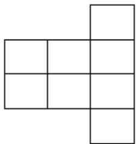

A. 15 

B. 20 

C. 25 

D. 26 

17. The perimeter of a rectangle is 36. If sides of the rectangle are integers, find the minimum value of the area of the rectangle. 

Biết chu vi của một hình chữ nhật là 36. Nếu các cạnh của hình chữ nhật là các số nguyên, tìm diện tích nhỏ nhất có thể của hình chữ nhật đó. 

A. 324 

B. 35 

C. 17 

D. 81 

18. The square below is cut into 5 squares and rectangle. If the perimeter of the original square is 20cm, find the area of the rectangle. 

Hình vuông dưới đây được cắt thành 5 hình vuông và 1 hình chữ nhật. Nếu chu vi của hình vuông ban đầu là 120cm, tính diện tích của hình chữ nhật. 

<table><tr><td colspan="5"></td></tr><tr><td></td><td></td><td></td><td></td><td></td></tr></table>

A. 720cm2 

B. 108cm2 

C. 540cm2 

D. 900cm2 

19. The perimeter of a square is 40cm. Now Alice combines 36 such squares to a big square. What is the perimeter of the big square? 

Chu vi của một hình vuông là 40cm. Alice ghép 36 hình vuông như vậy thành một hình vuông lớn. Tính chu vi của hình vuông lớn? 

A. 120cm 

B. 320cm 

C. 1440cm 

D. 240cm 

20. How many right-angled triangles are there in the figure below? 

Hỏi có bao nhiêu tam giác vuông trong hình dưới đây? 

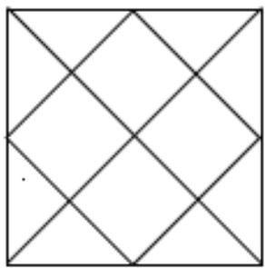

A. 8 

B. 12 

C. 16 

D. 20 

## Combinatorics / Tổ hợp

21. A flight of stairs has 5 steps. Mary can go up for step or 2 steps each time. How many ways are there for Mary to go up the stairs? 

Một cầu thang có 5 bậc. Mỗi lần bước, Mary có thể bước lên 1 bậc hoặc 2 bậc. Hỏi Mary có bao nhiêu cách để đi hết cầu thang? 

A. 5 

B. 6 

C. 7 

D. 8 

22. 66 students are either wearing XL, L, M, S or XS size uniforms. Then number of students wearing M size is the greatest among all sizes. At least how many student(s) is / are wearing the M size? 

66 học sinh đang mặc một trong các cỡ đồng phục XL, L, M, S hoặc XS. Số học sinh mặc cỡ M là nhiều nhất so với các cỡ khác. Hỏi có thể có ít nhất bao nhiêu bạn mặc cỡ M? 

A. 13 

B. 14 

C. 15 

D. 12 

23. Alice has 40 coins, including $ and $2 coins. She has $58 in total. How many $ coins does she have? 

Alice có 40 đồng xu, gồm xu 1 đô và xu 2 đô. Cô ấy có tất cả 58 đô. Hỏi cô ấy có bao nhiêu đồng xu 1 đô? 

A. 22 

B. 18 

C. 36 

D. 4 

24. How many 3-digit numbers are there such that the number does not contain digit “0” or “ ”? 

Hỏi có bao nhiêu số có 3 chữ số mà không chứa chữ số 0 hoặc 1? 

A. 512 

B. 336 

C. 343 

D. 500 

25. Andy goes from point A to point B. Each step he can only move up or move right. How many ways are there? 

Andy đi từ A đến B và chỉ được đi lên trên hoặc đi sang phải. Hỏi có bao nhiêu cách đi như vậy? 

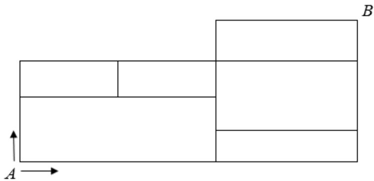

A. 6 

B. 8 

C. 10 

D. 12 

## ĐỀ SỐ 5

# Logical Thinking / Tƣ duy Lô-gic

1. Refer to the pattern below, find the 30th figure in the sequence. 

Dựa vào quy luật dưới đây để tìm hình thứ 30 trong dãy. 

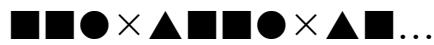

A.  

B. 

C.  

D.  

2. The sum of father’s and mother’s ages is currently 79. If the age of father 4 years later is the same as the age of mother 7 years later, how old is mother now? 

Tổng số tuổi của bố và mẹ đang là 79. Tuổi bố 4 năm nữa bằng tuổi của mẹ 7 năm nữa. Hỏi bây giờ mẹ bao nhiêu tuổi? 

A. 38 

B. 39 

C. 40 

D. 41 

3. Grandmother’s age this year adds 4, multiples 7, minuses 79 and then divides by 10. The result will be 60 years old. How old is Ming’s grandmother this year? 

Lấy tuổi của bà năm nay cộng 4, nhân 7, trừ 79 rồi chia cho 10. Kết quả bằng 60 tuổi. Hỏi năm nay bà bao nhiêu tuổi? 

A. 90 

B. 95 

C. 101 

D. 93 

4. Now is Saturday 1st September. In the same year, Hong Kong International Science Olympiad will be held on 16th December. How many day(s) is / are remaining to hold the event? 

Bây giờ là thứ Bảy ngày 1 tháng 9. Cùng năm đó, kì thi Khoa học quốc tế HKISO được tổ chức vào ngày 16 tháng 12. Hỏi còn bao nhiêu ngày nữa sẽ đến kì thi? 

A. 104 

B. 105 

C. 106 

D. 107 

5. Now we add 2 numbers A and B. The tens digit of A is written from 4 correctly to 8 wrongly and the hundreds digit of B is written from 6 correctly to 2 wrongly. The wrong sum is 7328. What is the correct sum? 

Ta cộng 2 số với nhau. Chữ số hàng chục của A bị viết nhầm từ 4 thành 8. Chữ số hàng trăm của B bị viết nhầm từ 6 thành 2. Do đó, tổng bị tính sai thành 7328. Hỏi tổng đúng phải là bao nhiêu? 

A. 7768 

B. 7688 

C. 6968 

D. 6888 

## Arithmetic / Số học

6. Find the value of 10+ 11 + 12 + ... + 28 +29 + 30. 

Tính giá trị của 10+ 11 + 12 + ... + 28 +29 + 30. 

A. 840 

B. 420 

C. 600 

D. 400 

7. Find the value of 50 209 + 20930 + 209 20. 

Tính giá trị của 50 209 + 20930 + 209 20. 

A. 2900 

B. 2090 

C. 20900 

D. 29000 

8. Find the value of 2400  8 + 3200  4 + 4000 10. 

Tính giá trị của 2400  8 + 3200  4 + 4000 10. 

A. 1500 

B. 1250 

C. 1000 

D. 2500 

9. Find the value of 192  8 + 192 16 + 192  32. 

Tính giá trị của 192  8 + 192 16 + 192  32. 

A. 3 

B. 4 

C. 40 

D. 42 

10. Find the value of 243 + 123 + 998 + 247 + 757 + 2 + 753 + 877. 

Tính giá trị của 243 + 123 + 998 + 247 + 757 + 2 + 753 + 877. 

A. 2000 

B. 3000 

C. 4000 

D. 5000 

## Number Theory / Lý thuyết số

11. If a 9-digit number  20180513A is divisible by 8, find the value of A. 

Biết số có 9 chữ số  20180513A chia hết cho 8, tìm A. 

A. 0 

B. 2 

C. 4 

D. 6 

12. Find the unit digit of A. 

Tìm chữ số hàng đơn vị của A. 

$$
A = \underbrace {4 \times 4 \times 4 \times \dots \times 4} _ {2 5 ^ {\prime} s} \times \underbrace {6 \times 6 \times 6 \times \dots \times 6} _ {1 2 ^ {\prime} s}.
$$

A. 2 

B. 4 

D. 8 

13. How many positive integers is 100 divisible by? 

Hỏi số 100 chia hết cho bao nhiêu số nguyên dương? 

A. 10 

B. 8 

C. 9 

D. 7 

14. The difference of A and B is 280. A is 3 times of B. Find the value of A. 

Hiệu của A và B là 280. A gấp 3 lần B. Tìm giá trị của A. 

A. 420 

B. 140 

C. 210 

D. 70 

15. How many 2-digit numbers divisible by 7 are there? 

Hỏi có bao nhiêu số có 2 chữ số chia hết cho 7? 

A. 12 

B. 13 

C. 14 

D. 15 

## Geometry / Hình học

16. How many rectangle(s) is / are there in the figure below? 

Hỏi có bao nhiêu hình chữ nhật trong hình dưới đây? 

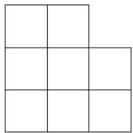

A. 21 

B. 23 

C. 25 

D. 27 

17. The area of a rectangle is 20. The length is 5 times as the width. Find its perimeter. 

Diện tích của một hình chữ nhật là 20. Chiều dài gấp 5 lần chiều rộng. Tính chu vi của hình chữ nhật đó. 

A. 36 

B. 48 

C. 12 

D. 24 

18. The perimeter of an equilateral triangle is 42. Find the value of the side length. 

Chu vi của một tam giác đều là 42. Tìm độ dài của một cạnh. 

A. 14 

B. 6 

C. 7 

D. 12 

19. How many edges does a cube have? 

Hỏi một hình lâp phương có bao nhiêu cạnh? 

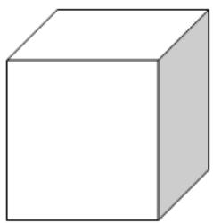

A. 4 

B. 8 

C. 12 

D. 10 

20. At most how many parts can we divide a circle by using 5 straight lines? 

Hỏi với 5 đường thẳng, ta có thể chia một hình tròn thành nhiều nhất bao nhiêu phần? 

A. 11 

B. 16 

C. 18 

D. 12 

## Combinatorics / Tổ hợp

21. It is given that the total weight of 3 apples and 3 melons is 900g. The weight of a melon is the same as that of 2 apples. What is the weight of 1 apple? 

Biết rằng tổng cân nặng của 3 quả táo và 3 quả dưa là 900g. Một quả dưa nặng bằng 2 quả táo. Hỏi 1 quả táo nặng bao nhiêu? 

A. 100g 

B. 200g 

C. 300g 

D. 50g 

22. Lucy goes from point B to point A. Each step she can only move down or move left. How many ways are there? 

Lucy đi từ điểm B đến điểm A. Mỗi bước, cô bé chỉ có thể đi xuống dưới hoặc đi sang trái. Hỏi có bao nhiêu cách đi như vậy? 

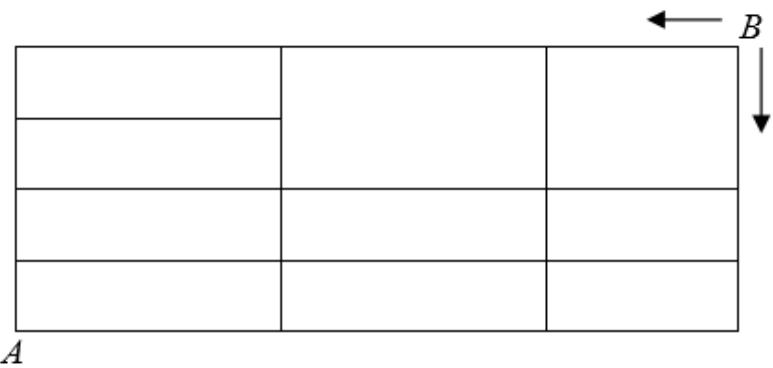

A. 22 

B. 21 

C. 20 

D. 19 

23. How many 3-digit numbers are there such that the number contains digit “0”? 

Hỏi có bao nhiêu số có 3 chữ số chứa chữ số “0”? 

A. 270 

B. 180 

C. 181 

D. 171 

24. Use 4 different digits: 1, 2, 3 and 4 to form a 4-digit odd number. How many such 4-digit numbers are there? 

Dùng 4 chữ số khác nhau: 1, 2, 3 và 4 để lập thành một số lẻ có 4 chữ số. Hỏi có thể lập được bao nhiêu số có 4 chữ số như vậy? 

A. 8 

B. 10 

C. 12 

D. 14 

25. Find the largest sum of two 5-digit numbers formed by using all ten digits from 0 to 9 without repetition. 

Tìm tổng lớn nhất của hai số có 5 chữ số được tạo bằng cách sử dụng tất cả 10 chữ số từ 0 đến 9. (Các chữ số không được lặp lại). 

A. 183951 

B. 141975 

C. 193951 

D. 183961 

# HEAT ROUND / VÒNG CHUNG KẾT QUỐC GIA

# ĐỀ SỐ 1: Đề thi Vòng Chung kết quốc gia năm học 2020 – 2021

## Logical Thinking / Tƣ duy lô-gic

1. This month is March. Which month will it be 184 months later? 

March: Tháng 3; Later: Sau. 

2. According to the pattern shown below, how many triangle(s) is / are there from the 1st to the 300th symbol counting from the left? 

Pattern: Quy luật; Triangles: Hình tam giác; Symbol: Hình; Counting from the left: Đếm từ phía bên trái. 

$\begin{array} { r }  \textsc  \hphantom { \hphantom { \hphantom { \hphantom { \hphantom { \hphantom { \hphantom { \hphantom { \hphantom { \ddots } } } } } } } } } \textsc { \hphantom { \hphantom { \hphantom { \hphantom { \ddots } } } } } \textsc { \hphantom { \hphantom { \hphantom { \hphantom { \ddots } } } } } \textsc { \hphantom { \times } } \textsc { \hphantom { \hphantom { \hphantom { \hphantom { \ddots } } } } } \textsc { \hphantom { \times } } \boxed  \begin{array} { r l } { \boxed { \begin{array} { r l } { \boxed { \begin{array} { r l } { \hphantom { \hphantom { \ddots } } } } & { \hphantom { \ddots } } } \\ { \hphantom { \ddots } } \end{array} } } \end{array} \end{array} \end{array}$ 

3. There are a total of 36 chickens and rabbits in a farm. The animals have a total of 96 legs. How many rabbit(s) is / are there? 

Total: Tổng số. 

4. Betty now has a few coins. If the number of coins minuses 13, then is divided by 10, adds 3 and is multiplied by 7. The result will be 91. How many coins does Betty have? 

Minuses: Trừ; Divided: Chia; Adds: Cộng; Multiplied: Nhân; Result: Kết quả. 

5. According to the pattern shown below, how many ＃ is / are there in the 9th group? 

Pattern: Quy luật; 9th group: Hình thứ 9. 

## Arithmetic / Số học

6. Find the value of 26 7 37 7 10 7 3 7       . 

Value: Giá trị. 

7. Find the value of 81 6 9 31 3 26     . 

Value: Giá trị. 

8. Find the value of 2020 18 15 24 100    . 

Value: Giá trị. 

9. Find the value of $3 4 + 4 1 + 4 8 + 5 5 + 6 2 + 6 9 + 7 6 + 8 3 + 9 0 + 9 7$ 

Value: Giá trị. 

10. Using the method of S S S   2 , find the value of $7 + 1 4 + 2 8 + \ldots + 8 9 6$ . 

Method: Phương pháp; Value: Giá trị. 

## Number Theory / Lý thuyết số

11. The sum of 9 consecutive odd numbers is 1035. Find the value of the largest number. 

Sum: Tổng; Consecutive odd numbers: Các số lẻ liên tiếp; Value: Giá trị; The largest number: Số lớn nhất. 

12. Define the operation symbol $a \otimes b = \left( a \times 3 + b - 1 \right) \times \left( a - b \right)$ , find the value of 6 4 40   . 

Define: Định nghĩa; Operation symbol: Kí hiệu phép toán; Value: Giá trị. 

13. Find the unit digit of A if $A = 3 \times 8 \times 1 3 \times 1 8 \times 2 3 \times 2 8 \times . . . \times 2 0 2 3 \times 2 0 2 8$ 

Unit digit: Chữ số hàng đơn vị. 

14. If a 10-digit number  2021 2723 A A is divisible by 6, find the value of A. 

10-digit number: Số có 10 chữ số; Divisible: Chia hết; Value: Giá trị. 

15. Mr. Wong gives some pencils to students. If everyone gets 9 pencils, 5 pencils will be left. If everyone gets 8 pencils, 19 pencils will be left. How many pencil(s) does Mr Wong have? 

Left: Còn thừa. 

## Geometry / Hình học

16. The figure below is formed by 4 identical right-angled triangles. The areas of the big and the small squares are 64 and 36 respectively. Find the perimeter of the triangle. 

Figure: Hình vẽ; Identical right-angled triangles: Các tam giác vuông bằng nhau; Square: Hình vuông; Respectively: Lần lượt; Area: Diện tích; Perimeter: Chu vi. 

Question 16

17. The area of a rectangle is 162. If the sides of the rectangle are integers, find the maximum of the perimeter of the rectangle. 

Area: Diện tích; Rectangle: Hình chữ nhật; Sides: Cạnh; Integers: Số nguyên; Maximum of the perimeter: Chu vi lớn nhất. 

18. At least how many squares can be seen if viewing the figure below from the right? 

At least: Ít nhất; Squares: Hình vuông; Viewing: Quan sát; Figure: Hình vẽ; From the right: Từ phía bên phải. 

Question 18

19. According to the pattern shown below, how many cubes are there in $1 0 ^ { \mathrm { t h } }$ group? 

Pattern: Quy luật; Cubes: Hình lập phương; 10th group: Hình thứ 10. 

1" group

2nd group

3d group

Question 19

20. How many rectangle(s) with “*” is / are there in the figure below? 

Rectangles: Hình chữ nhật; Figure: Hình. 

Question 20

## Combinatorics / Tổ hợp

21. Numbers are drawn from the 30 integers: 6 to 35. At least how many numbers are drawn at random to ensure that there are two numbers whose product is 80? 

Drawn: Được chọn ra; Integers: Số nguyên; At least: Ít nhất; At random: Ngẫu nhiên; Product: Tích. 

22. How many 3-digit number(s) is / are there such that the number without digital repetition does not contain digit “0” or “8”? 

3-digit number: Số có 3 chữ số; Without digital repetition: Các chữ số không được lặp lại; Digit: Chữ số. 

23. How many 3-digit odd number(s) is/are there so that the product of digits is 16? 

3-digit odd number: Số lẻ có 3 chữ số; Product of the digits: Tích các chữ số. 

24. Find the smallest difference of two 3-digit numbers formed by using 6 digits from 0, 1, 3, 5, 7, 8, 9 without repetition. 

The smallest difference: Hiệu nhỏ nhất; Two 3-digit numbers: Hai số có 3 chữ số; Digits: Chữ số; Without repetition: Các chữ số không được lặp lại. 

25. If Andy goes from point A to point B, each step can only move up or move right along the line. How many way(s) is / are there? 

Point: Điểm; Move up: Đi lên trên; Move right: Đi sang phải; Line: Đường kẻ. 

Question 25

# ĐỀ SỐ 2: Đề thi Vòng Chung kết quốc gia năm học 2019-2020

## Logical Thinking / Tƣ duy lô-gic

1. Today is Sunday. Which day of the week will 616 days be later? 

Sunday: Chủ Nhật; Day of the week: Thứ trong tuần; Later: Sau. 

2. There are a total of 20 chickens and rabbits in a farm. The animals have a total of 66 legs. 

How many chicken(s) is / are there? 

Total: Tổng cộng. 

3. It requires 22 minutes to cut a piece of wood into 12 sections. If the time required to cut 

into each section is the same, how many minute(s) is / are required to cut into 6 sections? 

Requires: Cần; Sections: Phần; The same: Giống nhau. 

4. Chris’s grandfather’s age this year minuses 11, then is divided by 9, adds 5 and 

multiplied by 6. The result will be 66 years old. How old is Chris’s grandfather this year? 

Minuses: Trừ; Divided: Chia; Adds: Cộng; Multiplied: Nhân; Result: Kết quả. 

5. According to the pattern below, how many ※ is / are there in the 9th group 

Pattern: Quy luật. 

<table><tr><td></td><td>※</td><td>※</td><td>※</td><td></td></tr><tr><td>※</td><td></td><td>※</td><td></td><td>※</td></tr><tr><td>※</td><td>※</td><td></td><td>※</td><td>※</td></tr><tr><td>※</td><td></td><td>※</td><td></td><td>※</td></tr><tr><td></td><td>※</td><td>※</td><td>※</td><td></td></tr></table>

<table><tr><td></td><td>※</td><td>※</td><td>※</td><td>※</td><td>※</td><td></td></tr><tr><td>※</td><td></td><td>※</td><td>※</td><td>※</td><td></td><td>※</td></tr><tr><td>※</td><td>※</td><td></td><td>※</td><td></td><td>※</td><td>※</td></tr><tr><td>※</td><td>※</td><td>※</td><td></td><td>※</td><td>※</td><td>※</td></tr><tr><td>※</td><td>※</td><td></td><td>※</td><td></td><td>※</td><td>※</td></tr><tr><td>※</td><td></td><td>※</td><td>※</td><td>※</td><td></td><td>※</td></tr><tr><td></td><td>※</td><td>※</td><td>※</td><td>※</td><td>※</td><td></td></tr></table>

1st Group 

2nd Group 

3rd Group 

4th Group 

## Arithmetic / Số học

6. Find the value of 10201 121 . 

Value: Giá trị. 

7. Find the value of 171 3 171 9 171 19     . 

Value: Giá trị. 

8. Find the value of 80 12 160 11 18 40     . 

Value: Giá trị. 

9. Find the value of $1 0 1 + 1 1 1 + 1 2 1 + 1 3 1 + 1 4 1 + 1 5 1 + 1 6 1 + 1 7 1 + 1 8 1 .$ . Value: Giá trị. 

10. Using the method of S S S   2 , find the value of $2 + 4 + 8 + . . . + 1 2 8$ Value: Giá trị. 

## Number Theory / Lý thuyết số

11. If 9-digit number  20206423A is divisible by 12, find the value of A. 9-digit number: Số có 9 chữ số; Divisible: Chia hết; Value: Giá trị. 

12. Find the unit digit of A if $A = \underbrace { 2 \times 2 \times 2 \times . . . \times 2 } _ { 2 0 1 9 ^ { * } s } \times \underbrace { 4 \times 4 \times 4 \times . . . \times 4 } _ { 2 0 1 9 ^ { * } s } \times \underbrace { 6 \times 6 \times 6 \times . . . \times 6 } _ { 2 0 1 9 ^ { * } s } .$ Unit digit: Chữ số tận cùng. 

13. Define the operation symbol  a $\scriptstyle \langle \otimes b = ( a + b ) \times ( a - b )$ , find the value of  6 5 9   . Operation symbol: Kí hiệu phép toán; Value: Giá trị. 

14. The sum of positive numbers A and B is 846. A is 8 times of B. Find the value of A. Sum: Tổng; Positive numbers: Số dương; 8 times: Gấp 8 lần; Value: Giá trị. 

15. How many factors does 2020 have? Factors: Ước số. 

## Geometry / Hình học

16. How many rectangle(s) with “*” is / are there in the figure below? Rectangles: Hình chữ nhật; Figure: Hình vẽ. 

<table><tr><td></td><td></td><td></td><td></td><td></td></tr><tr><td></td><td></td><td></td><td></td><td></td></tr><tr><td></td><td>*</td><td></td><td></td><td></td></tr><tr><td></td><td></td><td></td><td></td><td></td></tr></table>

17. How many right-angled triangle(s) is / are there in the figure below? Right-angled triangles: Tam giác vuông; Figure: Hình vẽ. 

18. The perimeter of a rectangle is 22cm. If sides of the rectangle are integers, find the maximum value of the area of the rectangle in cm2. 

Perimeter: Chu vi; Rectangle: Hình chữ nhật; Sides: Cạnh; Integers: Số nguyên; Maximum value: Giá trị lớn nhất; Area: Diện tích. 

19. The square below is cut into 3 squares and 2 rectangles and  AB BD  , BC CD DE EF  , . If the perimeter of the original square is 64cm, find the area of the smallest square in cm2. 

Square: Hình vuông; Rectangles: Hình chữ nhật; Perimeter: Chu vi; Original: Ban đầu; Area: Diện tích. 

20. The perimeter of a square is 60cm. Now Amy combines 9 squares to form a new rectangle. Find the maximum value of the perimeter of the rectangle in centimeter. 

Perimeter: Chu vi; Square: Hình vuông; Rectangle: Hình chữ nhật; Maximum value: Giá trị lớn nhất; Perimeter: Chu vi. 

## Combinatorics / Tổ hợp

21. 69 students are arranged in class 4A, 4B, 4C or 4D. No class has more students than class 4A. At least how many student(s) is / are there in class 4A? 

At least: Ít nhất. 

22. Find the smallest difference of two 5-digit numbers formed by using all 10 digits from 0 to 9 without repetition. 

Smallest difference: Hiệu nhỏ nhất; 5-digit numbers: Số có 5 chữ số; Digit: Chữ số; Without repetition: Không lặp lại. 

23. It is given that the total weight of 3 apples and 2 oranges is 390g. The weight of 2 apples is the same as that of 3 oranges. What is the weight (g) of 1 apple? 

Total weight: Tổng cân nặng; The same as: Bằng với. 

24. A flight of stairs has 9 steps. David can go up for 1 step, 2 steps or 3 steps each time. How many way(s) is / are there for David to go up the stairs? 

Flight of stairs: Cầu thang; Step: Bậc thang. 

25. How many 3-digit number(s) is / are there such that the number does not contain digit “0”, “ ” or “2”? 

3-digit number: Số có 3 chữ số; Digit: Chữ số. 

# ĐỀ SỐ 3: Đề thi Vòng Chung kết quốc gia năm học 2018-2019

## Logical Thinking / Tƣ duy lô-gic

1. What is the value of the number to represent “?” in the following sequence? 

Value: Giá trị; Represent: Biểu diễn; Sequence: Dãy số. 

2, 3, 5, 9, 17, 33, ? , 129, … 

According to the pattern shown below, how many triangle(s) is / are there from the 1st to the 500th figure counting from the left? 

Pattern: Quy luật; Triangles: Tam giác; Figure: Hình vẽ; Counting from the left: Tính từ phía bên trái. 

$\begin{array} { r } { \textsf { O } \Delta \boxed { \varTheta } \Delta \circ \Delta \boxed { \varTheta } \Delta \boxed { \varTheta } \Delta \circ \ldots } \end{array}$ 

3. It requires 12 minutes to cut a piece of wood into 5 sections. If the time required to cut into each section is the same, how many minutes are required to cut into 23 sections? 

Require: Cần; Sections: Phần; The same: Giống nhau. 

4. Today is Sunday. Which day of the week will 1002 days be later? 

Sunday: Chủ Nhật; Day of the week: Thứ trong tuần; Later: Sau. 

5. Andy’s grandfather’s age this year adds 7, is divided by 5, minuses 2 and multiplied by 7. The result will be 9 years old. How old is Andy’s grandfather this year? 

Adds: Cộng; Divided: Chia; Minuses: Trừ; Multiplied: Nhân; Result: Kết quả. 

## Arithmetic / Số học

6. Find the value of 48 1 48 2 48 3     . 

Value: Giá trị. 

7. Find the value of 3 6 9 12 15 18 21 24 27 30 33 36 39             . 

Value: Giá trị. 

8. Find the value of 11 14 17 20 23 26 29 32 35 38         . 

Value: Giá trị. 

9. Find the value of 123 23 246 20 37 123     . 

Value: Giá trị. 

10. Find the value of 11 111 1111  . 

Value: Giá trị. 

## Number Theory / Lý thuyết số

11. What is the smallest 4-digit number that can be divisible by 4 and 6? 

Smallest 4-digit number: Số nhỏ nhất có 4 chữ số; Divisible: Chia hết. 

12. Find the unit digit of A if $A = \underbrace { 5 \times 5 \times 5 \times . . . \times 5 } _ { 2 0 1 8 ^ { \prime } s } \times \underbrace { 3 \times 3 \times 3 \times . . . \times 3 } _ { 2 0 1 8 ^ { \prime } s } .$ 

Unit digit: Chữ số tận cùng. 

13. Define the operation symbol $a \oplus b = ( a + b ) \times ( a - b )$ , find the value of  (145 135)  . 

Operation symbol: Kí hiệu phép toán; Value: Giá trị. 

14. The product of positive numbers A and B is 363. A is 3 times of B. Find the value of A. 

Product: Tích; Positive numbers: Số dương; 3 times: Gấp 3 lần; Value: Giá trị. 

15. If a 9-digit number  20181013A is divisible by 18, find the value of A. 

9-digit number: Số có 9 chữ số; Divisible: Chia hết; Value: Giá trị. 

## Geometry / Hình học

16. How many rectangle(s) with “*” is / are there in the figure below? 

Rectangles: Hình chữ nhật; Figure: Hình vẽ. 

<table><tr><td></td><td></td><td></td></tr><tr><td></td><td>*</td><td></td></tr><tr><td></td><td></td><td></td></tr><tr><td></td><td></td><td></td></tr></table>

Question 16

17. It is known as the lengths of shorter sides for a right-angled triangle are 5cm and 12cm respectively. Find the length of the longest side. 

Lengths: Độ dài; Shorter sides: Các cạnh ngắn hơn; Right-angled triangle: Tam giác vuông; Longest side: Cạnh dài nhất. 

18. The area of a rectangle is $8 0 c m ^ { 2 }$ . If the sides of the rectangle are integers, how many different value(s) of the perimeter of this rectangle is / are there? 

Area: Diện tích; Rectangle: Hình chữ nhật; Sides: Cạnh; Integers: Số nguyên; Value: Giá trị; Perimeter: Chu vi. 

19. A big square is formed by 25 squares with side length 7 cm. How many cm is the perimeter of the big square? 

Square: Hình vuông; Side length: Độ dài cạnh; Perimeter: Chu vi. 

20. How many right-angled triangle(s) is / are there in the figure below? 

Right-angled triangles: Tam giác vuông; Figure: Hình vẽ. 

Question 20

## Combinatorics / Tổ hợp

21. Find the smallest difference of two 4-digit numbers formed by using all 8 digits from 0 to 7 without repetition. 

Smallest difference: Hiệu nhỏ nhất; 4-digit numbers: Số có 4 chữ số; Digits: Chữ số; Without repetition: Không lặp lại. 

22. It is given that the total weight of 3 apples and 3 oranges is 600g. The weight of an apple is the same as that of 3 oranges. What is the weight (g) of 1 apple? 

Total weight: Tổng cân nặng; The same as: Bằng với. 

23. It requires 10 people to take 8 days to complete a task. How many day(s) is / are needed for 16 people to finish the same task? 

Requires: Cần; Complete a task: Hoàn thành một công việc. 

24. There are a total of 14 chickens and rabbits in a farm. The animals have a total of 32 legs. How many rabbit(s) is / are there? 

Total: Tổng số. 

25. How many 2-digit numbers are there such that the number contains digit “8”? 

2-digit number: Số có 2 chữ số; Digit: Chữ số. 

# ĐỀ SỐ 4: Đề thi Vòng Chung kết quốc gia năm học 2017-2018

## Logical Thinking / Tƣ duy lô-gic

1. What is the value of the number to represent “?” in the following sequence? 

Value: Giá trị; Represent: Biểu diễn; Sequence: Dãy số. 

1, 1, 2, 4, 7, 13, 24, ？, 81, 149, … 

According to the pattern shown below, how many circle(s) is / are there from the 1st to the 200th figure counting from the left? 

Pattern: Quy luật; Circles: Hình tròn; Figure: Hình vẽ. 

○ △ □ ○ ○ △ △ □ □ ○ ○ ○ △ △ △ □ □ □… 

3. A stationery store had a batch of ball pens. One half but 2 fewer pens were sold on the first day. One half of the remaining part but 3 fewer pens were sold on the second day. Finally, 11 ball pens are left. How many ball pen(s) did the stationery store have originally? 

One half: Một nửa; Fewer: Ít hơn; Remaining: Còn lại; Originally: Lúc đầu. 

4. John wrote a 3-digit number on a piece of paper and asked Peter to guess it. 

Peter asked: “Is the number 723?” 

John replied: “One of the digits is correct. The position of that digit is also correct.” 

Peter asked again: “Is the number 745?” 

John replied: “One of the digits is correct. The position of that digit is wrong.” 

Peter asked again: “Is the number 842?” 

John said: “One of the digits is correct. The position of that digit is also correct.” 

Given that all the digits in that 3-digit number are all different, what is the number written by John? 

3-digit number: Số có 3 chữ số; Digit: Chữ số; Position: Vị trí. 

5. There are a total of 40 tigers and cranes in a zoo. The animals have a total of 104 legs. 

How many tiger(s) is / are there? 

Total: Tổng cộng. 

## Arithmetic / Số học

6. Find the value of 2052 19 2052 3 2052 9     . 

Value: Giá trị. 

7. Find the value of 13131313 8080808 4 11111111 5    . 

Value: Giá trị. 

8. Find the value of 1 2 3 ... 49 50 49 ... 3 2 1          . 

Value: Giá trị. 

9. Find the value of 10 10 9 9 8 8 7 7 6 6 5 5 4 4 3 3 2 2 1 1                   . 

Value: Giá trị. 

10. Find the value of 12345654321 12321  . 

Value: Giá trị. 

## Number Theory / Lý thuyết số

11. If 9-digit number  20171221A is divisible by 9, find the value of A. 

9-digit number: Số có 9 chữ số; Divisible: Chia hết; Value: Giá trị. 

12. Find the unit digit of A if $\begin{array} { r } { A = \underbrace { 5 \times 5 \times 5 \times . . . \times 5 } _ { 2 0 1 7 ^ { \prime } s } \times \underbrace { 6 \times 6 \times 6 \times . . . \times 6 } _ { 2 0 1 7 ^ { \prime } s } . } \end{array}$ 

Unit digit: Chữ số hàng đơn vị. 

13. Define the operation symbol  a b b b a a      , find the value of  (121 131)  . 

Operation symbol: Kí hiệu phép toán; Value: Giá trị. 

14. The product of positive numbers A and B is 392. A is 2 times of B. Find the value of A. 

Product: Tích; Positive numbers: Số dương; 2 times: Gấp 2 lần; Value: Giá trị. 

15. What is the greatest 3-digit number that can be divisible by 3 and 5? 

Greatest: Lớn nhất; 3-digit number: Số có 3 chữ số; Divisible: Chia hết. 

## Geometry / Hình học

16. How many rectangle(s) is / are there in the figure below? 

Rectangles: Hình chữ nhật; Figure: Hình vẽ. 

<table><tr><td></td><td></td><td></td><td></td><td></td><td></td><td></td></tr><tr><td></td><td></td><td></td><td></td><td></td><td></td><td></td></tr><tr><td></td><td></td><td></td><td></td><td></td><td></td><td></td></tr></table>

17. Find the perimeter of the figure shown on the right in cm. 

Perimeter: Chu vi; Figure: Hình vẽ. 

18. Find the area of the figure shown below in cm2. 

Area: Diện tích; Figure: Hình vẽ. 

19. A big square is formed by 36 small squares with side length 5 cm. What is the perimeter of the big square in centimeter? 

Square: Hình vuông; Side length: Độ dài cạnh; Perimeter: Chu vi. 

20. How many right-angled triangle(s) is / are there in the figure below? 

Right-angled triangles: Tam giác vuông; Figure: Hình vẽ. 

## Combinatorics / Tổ hợp

21. A flight of stairs has 7 steps. David can go up for 1 step or 2 steps each time. How many way(s) is / are there for David to go up the stairs? 

Flight of stairs: Cầu thang; Step: Bậc. 

22. Two boys Bobby, Benny and two girls Grace, Gloria are to be seated in a row according to the rule that a boy will not sit next to another boy and a girl will not sit next to another girl. Find the number of the combination(s) satisfying the above condition. 

Row: Hàng ngang; Combinations: Cách sắp xếp; Condition: Điều kiện. 

23. Choose 2 digits, without repetition, from 1, 2, 4, 6, 7 to form 2-digit numbers. How many number(s) can be divisible by 3? 

Digits: Chữ số; Without repetition: Không lặp lại; 2-digit numbers: Số có 2 chữ số. Divisible: Chia hết. 

24. How many 2-digit number(s) is / are there such that the number contains digit “6” and no digits are repeated? 

2-digit number: Số có 2 chữ số; Digit: Chữ số; Repeated: Lặp lại. 

25. If Andy goes from point A to point B, each step can only move up or move right along the lines. How many way(s) is / are there? 

Move up: Đi lên trên; Move right: Đi sang phải; Lines: Đường kẻ. 

# ĐỀ SỐ 5: Đề thi Vòng Chung kết quốc gia năm học 2016-2017

## Logical Thinking / Tƣ duy Lô-gic

1. There are 20 problems in a mathematics competition. The scores of each problem are given in the following ways: 5 marks will be given for a correct answer, 2 marks will be deducted for each incorrect or unanswered answer. How many questions does Amy answer correctly if her score is 58? 

Problems: Bài toán; Score: Điểm; Deducted: Bị trừ 

2. If today is Tuesday, which day of the week will it be 100 days later? 

Tuesday: Thứ Ba; Day of the week: Thứ trong tuần; Later: Sau. 

3. There are a total of 30 tigers and cranes in a zoo. The animals have a total of 90 legs. How many tigers are there? 

Total: Tổng cộng. 

4. John wrote a 3-digit number on a piece of paper and asked Peter to guess it. Peter asked: “Is the number 73?” 

John replied: “One of the digits is correct, the position of that digit is also correct.” Peter asked again: “Is the number 32?” 

John replied: “Two digits are correct, but the positions of those digits are both wrong.” 

Peter asked again: “Is the number 324?” 

John said: “All three digits are correct, but the digits are all in the wrong places.” What is the number written by John? 

3-digit number: Số có 3 chữ số; Digit: Chữ số; Position: Vị trí. 

5. According to the pattern shown below, how many circles are there in the 25th group? 

Pattern: Quy luật; Circles: Hình tròn. 

## Arithmetic / Số học

6. Find the value of 1366 3987 1166 13 495 126 876 445       . 

Value: Giá trị. 

7. Find the value of  22222 22222  . 

Value: Giá trị. 

8. Find the value of 5 10 15 20 ... 125 130      . 

Value: Giá trị. 

9. Find the value of $1 3 \times 2 7 + 2 6 \times 1 1 + 3 9 \times 1 7$ . 

Value: Giá trị. 

10. Find the value of 360 10 360 6 360 3 360 1       . 

Value: Giá trị. 

## Number Theory / Lý thuyết số

11. If a 5-digit number  81 76 A is divisible by 9, find the value of A. 

5-digit number: Số có 5 chữ số; Divisible: Chia hết; Value: Giá trị. 

12. Find the unit digit of A if $A = \underbrace { 3 \times 3 \times 3 \times . . . \times 3 } _ { 1 0 0 ^ { \prime } s } \times \underbrace { 6 \times 6 \times 6 \times . . . \times 6 } _ { 1 0 0 ^ { \prime } s } .$ 

Unit digit: Chữ số hàng đơn vị. 

13. The difference of A and B is 144. A is 5 times of B. Find the value of B. 

Difference: Hiệu; 5 times: Gấp 5 lần; Value: Giá trị. 

14. The sum of A and B is 168. A is larger than B by 6 times. Find the value of A. 

Sum: Tổng; A is larger than B by 6 times: A nhiều hơn B đúng bằng 6 lần B; Value: Giá trị. 

15. What is the largest three-digit number that can be divisible by 6 and 8? 

Largest: Lớn nhất; Three-digit number: Số có 3 chữ số; Divisible: Chia hết. 

## Geometry / Hình học

16. The figure below is formed by 3 squares with areas 16cm2, 36cm2 and 16cm2 respectively. Find the perimeter of the following figure in centimeter. 

Figure: Hình; Squares: Hình vuông; Area: Diện tích; Respectively: Lần lượt; Perimeter: Chu vi. 

17. According to the pattern shown below, how many cubes are there in the 10th layer from the top given that the figure is solid and made of identical cubes? 

Pattern: Quy luật; 10th layer: Tầng thứ 10 từ trên xuống; Figure: Hình; Solid: Đặc. 

18. The figure below is made of 16 equilateral triangles. If the perimeter of figure below is 36cm, what is the difference of the total perimeter between before combination and after combination? 

Figure: Hình vẽ; Equilateral triangles: Tam giác đều; Perimeter: Chu vi; Difference: Hiệu; Combination: Ghép. 

19. The figure below is made of 2 squares. Find the area of the shaded region below in cm2? 

Figure: Hình vẽ; Area: Diện tích; Shaded region: Phần được tô đậm. 

20. How many rectangles are there in the figure below? 

Rectangles: Hình chữ nhật; Figure: Hình vẽ. 

<table><tr><td></td><td></td><td></td><td></td><td></td><td></td></tr><tr><td></td><td></td><td></td><td></td><td></td><td></td></tr><tr><td></td><td></td><td></td><td></td><td></td><td></td></tr><tr><td></td><td></td><td></td><td></td><td></td><td></td></tr></table>

## Combinatorics / Tổ hợp

21. A flight of stairs has 10 steps. David can go up for 1 step or 2 steps at a time. How many ways are there for David to go up the stairs? 

Flight of stairs: Cầu thang; Step: Bậc thang. 

22. Choose 6 numbers, without repetition, from 1, 4, 5, 6, 7, 9 to form 2 three-digit numbers. Find the maximum value of the difference between these 2 numbers. 

Without repetition: Không lặp lại; Three-digit numbers: Số có 3 chữ số; Maximum value: Giá trị lớn nhất. 

23. Numbers are drawn from the 80 integers 1 to 80. At least how many numbers are drawn at random to ensure that there are two numbers whose sum is 100? 

Integers: Số nguyên; At least: Ít nhất; At random: Ngẫu nhiên; Ensure: Chắc chắn rằng; Sum: Tổng. 

24. Now there are 1-dollar, 2-dollar, 5-dollar and 10-dollar coins and 2 coins for each type. How many different amounts of money can be formed? 

Each type: Mỗi loại; Different amounts of money: Các giá trị tiền khác nhau. 

25. How many 3-digits numbers are there so that the sum of digits is 8? 

3-digit numbers: Số có 3 chữ số; Sum of digits: Tổng các chữ số. 

## ĐÁP ÁN THAM KHẢO

## PRELIMINARY ROUND / VÒNG LOẠI QUỐC GIA

ĐỀ SỐ 1: Đề thi Vòng loại quốc gia Năm học 2020 - 2021 

<table><tr><td colspan="3">Logical Thinking</td><td colspan="3">Number Theory</td><td colspan="3">Combinatorics</td></tr><tr><td>4</td><td>1)A</td><td>4</td><td>4</td><td>11)C</td><td>4</td><td>4</td><td>21)B</td><td>4</td></tr><tr><td>4</td><td>2)D</td><td>4</td><td>4</td><td>12)A</td><td>4</td><td>4</td><td>22)C</td><td>4</td></tr><tr><td>4</td><td>3)A</td><td>4</td><td>4</td><td>13)A</td><td>4</td><td>4</td><td>23)D</td><td>4</td></tr><tr><td>4</td><td>4)D</td><td>4</td><td>4</td><td>14)B</td><td>4</td><td>4</td><td>24)C</td><td>4</td></tr><tr><td>4</td><td>5)B</td><td>4</td><td>4</td><td>15)C</td><td>4</td><td>4</td><td>25)B</td><td>4</td></tr><tr><td colspan="3">Arithmetic</td><td colspan="3">Geometry</td><td colspan="3"></td></tr><tr><td>4</td><td>6)C</td><td>4</td><td>4</td><td>16)D</td><td>4</td><td rowspan="5" colspan="3"></td></tr><tr><td>4</td><td>7)D</td><td>4</td><td>4</td><td>17)D</td><td>4</td></tr><tr><td>4</td><td>8)A</td><td>4</td><td>4</td><td>18)A</td><td>4</td></tr><tr><td>4</td><td>9)B</td><td>4</td><td>4</td><td>19)B</td><td>4</td></tr><tr><td>4</td><td>10)A</td><td>4</td><td>4</td><td>20)A</td><td>4</td></tr></table>

ĐỀ SỐ 2

<table><tr><td colspan="3">Logical Thinking</td><td colspan="3">Number Theory</td><td colspan="3">Combinatorics</td></tr><tr><td>4</td><td>1)A</td><td>4</td><td>4</td><td>11)A</td><td>4</td><td>4</td><td>21)D</td><td>4</td></tr><tr><td>4</td><td>2)B</td><td>4</td><td>4</td><td>12)C</td><td>4</td><td>4</td><td>22)A</td><td>4</td></tr><tr><td>4</td><td>3)D</td><td>4</td><td>4</td><td>13)A</td><td>4</td><td>4</td><td>23)C</td><td>4</td></tr><tr><td>4</td><td>4)C</td><td>4</td><td>4</td><td>14)B</td><td>4</td><td>4</td><td>24)B</td><td>4</td></tr><tr><td>4</td><td>5)D</td><td>4</td><td>4</td><td>15)A</td><td>4</td><td>4</td><td>25)C</td><td>4</td></tr><tr><td colspan="3">Arithmetic</td><td colspan="3">Geometry</td><td colspan="3"></td></tr><tr><td>4</td><td>6)A</td><td>4</td><td>4</td><td>16)C</td><td>4</td><td rowspan="5" colspan="3"></td></tr><tr><td>4</td><td>7)B</td><td>4</td><td>4</td><td>17)A</td><td>4</td></tr><tr><td>4</td><td>8)D</td><td>4</td><td>4</td><td>18)C</td><td>4</td></tr><tr><td>4</td><td>9)C</td><td>4</td><td>4</td><td>19)D</td><td>4</td></tr><tr><td>4</td><td>10)B</td><td>4</td><td>4</td><td>20)B</td><td>4</td></tr></table>

ĐỀ SỐ 3

<table><tr><td colspan="3">Logical Thinking</td><td colspan="3">Number Theory</td><td colspan="3">Combinatorics</td></tr><tr><td>4</td><td>1)A</td><td>4</td><td>4</td><td>11)C</td><td>4</td><td>4</td><td>21)B</td><td>4</td></tr><tr><td>4</td><td>2)C</td><td>4</td><td>4</td><td>12)B</td><td>4</td><td>4</td><td>22)C</td><td>4</td></tr><tr><td>4</td><td>3)C</td><td>4</td><td>4</td><td>13)A</td><td>4</td><td>4</td><td>23)D</td><td>4</td></tr><tr><td>4</td><td>4)B</td><td>4</td><td>4</td><td>14)D</td><td>4</td><td>4</td><td>24)A</td><td>4</td></tr><tr><td>4</td><td>5)D</td><td>4</td><td>4</td><td>15)C</td><td>4</td><td>4</td><td>25)C</td><td>4</td></tr><tr><td colspan="3">Arithmetic</td><td colspan="3">Geometry</td><td colspan="3"></td></tr><tr><td>4</td><td>6)B</td><td>4</td><td>4</td><td>16)C</td><td>4</td><td rowspan="5" colspan="3"></td></tr><tr><td>4</td><td>7)A</td><td>4</td><td>4</td><td>17)B</td><td>4</td></tr><tr><td>4</td><td>8)D</td><td>4</td><td>4</td><td>18)A</td><td>4</td></tr><tr><td>4</td><td>9)B</td><td>4</td><td>4</td><td>19)A</td><td>4</td></tr><tr><td>4</td><td>10)A</td><td>4</td><td>4</td><td>20)D</td><td>4</td></tr></table>

ĐỀ SỐ 4

<table><tr><td colspan="3">Logical Thinking</td><td colspan="3">Number Theory</td><td colspan="3">Combinatorics</td></tr><tr><td>4</td><td>1)B</td><td>4</td><td>4</td><td>11)B</td><td>4</td><td>4</td><td>21)D</td><td>4</td></tr><tr><td>4</td><td>2)A</td><td>4</td><td>4</td><td>12)A</td><td>4</td><td>4</td><td>22)B</td><td>4</td></tr><tr><td>4</td><td>3)C</td><td>4</td><td>4</td><td>13)D</td><td>4</td><td>4</td><td>23)A</td><td>4</td></tr><tr><td>4</td><td>4)A</td><td>4</td><td>4</td><td>14)B</td><td>4</td><td>4</td><td>24)A</td><td>4</td></tr><tr><td>4</td><td>5)D</td><td>4</td><td>4</td><td>15)A</td><td>4</td><td>4</td><td>25)C</td><td>4</td></tr><tr><td colspan="3">Arithmetic</td><td colspan="3">Geometry</td><td colspan="3"></td></tr><tr><td>4</td><td>6)D</td><td>4</td><td>4</td><td>16)C</td><td>4</td><td rowspan="5" colspan="3"></td></tr><tr><td>4</td><td>7)A</td><td>4</td><td>4</td><td>17)C</td><td>4</td></tr><tr><td>4</td><td>8)B</td><td>4</td><td>4</td><td>18)A</td><td>4</td></tr><tr><td>4</td><td>9)C</td><td>4</td><td>4</td><td>19)D</td><td>4</td></tr><tr><td>4</td><td>10)C</td><td>4</td><td>4</td><td>20)C</td><td>4</td></tr></table>

ĐỀ SỐ 5

<table><tr><td colspan="3">Logical Thinking</td><td colspan="3">Number Theory</td><td colspan="3">Combinatorics</td></tr><tr><td>4</td><td>1)D</td><td>4</td><td>4</td><td>11)D</td><td>4</td><td>4</td><td>21)A</td><td>4</td></tr><tr><td>4</td><td>2)A</td><td>4</td><td>4</td><td>12)B</td><td>4</td><td>4</td><td>22)B</td><td>4</td></tr><tr><td>4</td><td>3)D</td><td>4</td><td>4</td><td>13)C</td><td>4</td><td>4</td><td>23)D</td><td>4</td></tr><tr><td>4</td><td>4)C</td><td>4</td><td>4</td><td>14)A</td><td>4</td><td>4</td><td>24)C</td><td>4</td></tr><tr><td>4</td><td>5)B</td><td>4</td><td>4</td><td>15)B</td><td>4</td><td>4</td><td>25)A</td><td>4</td></tr><tr><td colspan="3">Arithmetic</td><td colspan="3">Geometry</td><td colspan="3"></td></tr><tr><td>4</td><td>6)B</td><td>4</td><td>4</td><td>16)D</td><td>4</td><td rowspan="5" colspan="3"></td></tr><tr><td>4</td><td>7)C</td><td>4</td><td>4</td><td>17)D</td><td>4</td></tr><tr><td>4</td><td>8)A</td><td>4</td><td>4</td><td>18)A</td><td>4</td></tr><tr><td>4</td><td>9)D</td><td>4</td><td>4</td><td>19)C</td><td>4</td></tr><tr><td>4</td><td>10)C</td><td>4</td><td>4</td><td>20)B</td><td>4</td></tr></table>

## HEAT ROUND / VÒNG CHUNG KẾT QUỐC GIA

ĐỀ SỐ 1: Đề thi Vòng Chung kết quốc gia năm học 2020 – 2021 

<table><tr><td colspan="3">Logical Thinking</td><td colspan="3">Number Theory</td><td colspan="3">Combinatorics</td></tr><tr><td>4</td><td>1) July</td><td>4</td><td>4</td><td>11) 123</td><td>4</td><td>4</td><td>21) 30</td><td>4</td></tr><tr><td>4</td><td>2) 86</td><td>4</td><td>4</td><td>12) 330</td><td>4</td><td>4</td><td>22) 336</td><td>4</td></tr><tr><td>4</td><td>3) 12</td><td>4</td><td>4</td><td>13) 4</td><td>4</td><td>4</td><td>23) 3</td><td>4</td></tr><tr><td>4</td><td>4) 113</td><td>4</td><td>4</td><td>14) 4</td><td>4</td><td>4</td><td>24) 6</td><td>4</td></tr><tr><td>4</td><td>5) 84</td><td>4</td><td>4</td><td>15) 131</td><td>4</td><td>4</td><td>25) 124</td><td>4</td></tr><tr><td colspan="3">Arithmetic</td><td colspan="3">Geometry</td><td colspan="3"></td></tr><tr><td>4</td><td>6) 8</td><td>4</td><td>4</td><td>16) 14</td><td>4</td><td rowspan="5" colspan="3"></td></tr><tr><td>4</td><td>7) 687</td><td>4</td><td>4</td><td>17) 326</td><td>4</td></tr><tr><td>4</td><td>8) 404</td><td>4</td><td>4</td><td>18) 9</td><td>4</td></tr><tr><td>4</td><td>9) 655</td><td>4</td><td>4</td><td>19) 29</td><td>4</td></tr><tr><td>4</td><td>10) 1785</td><td>4</td><td>4</td><td>20) 16</td><td>4</td></tr></table>

ĐỀ SỐ 2: Đề thi Vòng Chung kết quốc gia năm học 2019 – 2020

<table><tr><td colspan="3">Logical Thinking</td><td colspan="3">Number Theory</td><td colspan="3">Combinatorics</td></tr><tr><td>4</td><td>1)Sunday</td><td>4</td><td>4</td><td>11)2</td><td>4</td><td>4</td><td>21)18</td><td>4</td></tr><tr><td>4</td><td>2)7</td><td>4</td><td>4</td><td>12)2</td><td>4</td><td>4</td><td>22)247</td><td>4</td></tr><tr><td>4</td><td>3)10</td><td>4</td><td>4</td><td>13)40</td><td>4</td><td>4</td><td>23)90</td><td>4</td></tr><tr><td>4</td><td>4)65</td><td>4</td><td>4</td><td>14)752</td><td>4</td><td>4</td><td>24)149</td><td>4</td></tr><tr><td>4</td><td>5)256</td><td>4</td><td>4</td><td>15)12</td><td>4</td><td>4</td><td>25)343</td><td>4</td></tr><tr><td colspan="3">Arithmetic</td><td colspan="3">Geometry</td><td colspan="3"></td></tr><tr><td>4</td><td>6)1234321</td><td>4</td><td>4</td><td>16)48</td><td>4</td><td colspan="3" rowspan="5"></td></tr><tr><td>4</td><td>7)85</td><td>4</td><td>4</td><td>17)9</td><td>4</td></tr><tr><td>4</td><td>8)2000</td><td>4</td><td>4</td><td>18)30</td><td>4</td></tr><tr><td>4</td><td>9)1269</td><td>4</td><td>4</td><td>19)16</td><td>4</td></tr><tr><td>4</td><td>10)254</td><td>4</td><td>4</td><td>20)300</td><td>4</td></tr><tr><td>4</td><td>1)65</td><td>4</td><td>4</td><td>11)1008</td><td>4</td><td>4</td><td>21)247</td><td>4</td></tr><tr><td>4</td><td>2)250</td><td>4</td><td>4</td><td>12)5</td><td>4</td><td>4</td><td>22)150</td><td>4</td></tr><tr><td>4</td><td>3)66</td><td>4</td><td>4</td><td>13)2800</td><td>4</td><td>4</td><td>23)5</td><td>4</td></tr><tr><td>4</td><td>4)Monday</td><td>4</td><td>4</td><td>14)33</td><td>4</td><td>4</td><td>24)2</td><td>4</td></tr><tr><td>4</td><td>5)68</td><td>4</td><td>4</td><td>15)2</td><td>4</td><td>4</td><td>25)18</td><td>4</td></tr><tr><td colspan="3">Arithmetic</td><td colspan="3">Geometry</td><td colspan="3"></td></tr><tr><td>4</td><td>6)88</td><td>4</td><td>4</td><td>16)24</td><td>4</td><td colspan="3" rowspan="5"></td></tr><tr><td>4</td><td>7)21</td><td>4</td><td>4</td><td>17)13</td><td>4</td></tr><tr><td>4</td><td>8)245</td><td>4</td><td>4</td><td>18)5</td><td>4</td></tr><tr><td>4</td><td>9)12300</td><td>4</td><td>4</td><td>19)140</td><td>4</td></tr><tr><td>4</td><td>10)1356531</td><td>4</td><td>4</td><td>20)13</td><td>4</td></tr><tr><td>4</td><td>1) 44</td><td>4</td><td>4</td><td>11) 2</td><td>4</td><td>4</td><td>21) 21</td><td>4</td></tr><tr><td>4</td><td>2) 68</td><td>4</td><td>4</td><td>12) 0</td><td>4</td><td>4</td><td>22) 8</td><td>4</td></tr><tr><td>4</td><td>3) 28</td><td>4</td><td>4</td><td>13) 2520</td><td>4</td><td>4</td><td>23) 6</td><td>4</td></tr><tr><td>4</td><td>4) 853</td><td>4</td><td>4</td><td>14) 28</td><td>4</td><td>4</td><td>24) 17</td><td>4</td></tr><tr><td>4</td><td>5) 12</td><td>4</td><td>4</td><td>15) 990</td><td>4</td><td>4</td><td>25) 20</td><td>4</td></tr><tr><td colspan="3">Arithmetic</td><td colspan="3">Geometry</td><td colspan="3"></td></tr><tr><td>4</td><td>6) 564</td><td>4</td><td>4</td><td>16) 147</td><td>4</td><td colspan="3" rowspan="5"></td></tr><tr><td>4</td><td>7) 101,010,100</td><td>4</td><td>4</td><td>17) 46</td><td>4</td></tr><tr><td>4</td><td>8) 2500</td><td>4</td><td>4</td><td>18) 40</td><td>4</td></tr><tr><td>4</td><td>9) 55</td><td>4</td><td>4</td><td>19) 120</td><td>4</td></tr><tr><td>4</td><td>10) 1,002,001</td><td>4</td><td>4</td><td>20) 16</td><td>4</td></tr><tr><td>4</td><td>1) 14</td><td>4</td><td>4</td><td>11) 5</td><td>4</td><td>4</td><td>21) 89</td><td>4</td></tr><tr><td>4</td><td>2) Thursday</td><td>4</td><td>4</td><td>12) 6</td><td>4</td><td>4</td><td>22) 831</td><td>4</td></tr><tr><td>4</td><td>3) 15</td><td>4</td><td>4</td><td>13) 36</td><td>4</td><td>4</td><td>23) 51</td><td>4</td></tr><tr><td>4</td><td>4) 243</td><td>4</td><td>4</td><td>14) 147</td><td>4</td><td>4</td><td>24) 36</td><td>4</td></tr><tr><td>4</td><td>5) 325</td><td>4</td><td>4</td><td>15) 984</td><td>4</td><td>4</td><td>25) 36</td><td>4</td></tr><tr><td colspan="3">Arithmetic</td><td colspan="3">Geometry</td><td colspan="3"></td></tr><tr><td>4</td><td>6) 5000</td><td>4</td><td>4</td><td>16) 40</td><td>4</td><td colspan="3" rowspan="5"></td></tr><tr><td>4</td><td>7) 493,817,284</td><td>4</td><td>4</td><td>17) 361</td><td>4</td></tr><tr><td>4</td><td>8) 1755</td><td>4</td><td>4</td><td>18) 108</td><td>4</td></tr><tr><td>4</td><td>9) 1300</td><td>4</td><td>4</td><td>19) 14</td><td>4</td></tr><tr><td>4</td><td>10) 576</td><td>4</td><td>4</td><td>20) 210</td><td>4</td></tr></table>

# HEAT ROUND ANSWER SHEET

# MẪU PHIẾU TRẢ LỜI VÒNG CHUNG KẾT QUỐC GIA

<table><tr><td>Admission ID: Số báo danh:</td><td></td><td></td><td></td><td></td><td></td><td></td><td></td><td></td><td></td><td></td><td>Centre No: Số phòng thi:</td><td></td></tr><tr><td>Contestant Name: Họ tên thí sinh:</td><td colspan="12"></td></tr><tr><td>Date of Birth: Ngày sinh:</td><td colspan="10"></td><td>Contestant Grade: Khôi thi:</td><td></td></tr><tr><td>School Name: Tên trường:</td><td colspan="10"></td><td>City / Province: Thành phố / Tỉnh:</td><td></td></tr></table>

Fill all the information above in BLOCK LETTER. 

Điền đầy đủ thông tin, trong đó mỗi ô của số báo danh điền đúng 1 chữ số hoặc 1 chữ cái. 

<table><tr><td colspan="3">Logical Thinking</td><td colspan="3">Number Theory</td><td colspan="3">Combinatorics</td></tr><tr><td>4</td><td>1)</td><td>4</td><td>4</td><td>11)</td><td>4</td><td>4</td><td>21)</td><td>4</td></tr><tr><td>4</td><td>2)</td><td>4</td><td>4</td><td>12)</td><td>4</td><td>4</td><td>22)</td><td>4</td></tr><tr><td>4</td><td>3)</td><td>4</td><td>4</td><td>13)</td><td>4</td><td>4</td><td>23)</td><td>4</td></tr><tr><td>4</td><td>4)</td><td>4</td><td>4</td><td>14)</td><td>4</td><td>4</td><td>24)</td><td>4</td></tr><tr><td>4</td><td>5)</td><td>4</td><td>4</td><td>15)</td><td>4</td><td>4</td><td>25)</td><td>4</td></tr><tr><td colspan="3">Arithmetic / Algebra</td><td colspan="3">Geometry</td><td colspan="3"></td></tr><tr><td>4</td><td>6)</td><td>4</td><td>4</td><td>16)</td><td>4</td><td rowspan="5" colspan="3"></td></tr><tr><td>4</td><td>7)</td><td>4</td><td>4</td><td>17)</td><td>4</td></tr><tr><td>4</td><td>8)</td><td>4</td><td>4</td><td>18)</td><td>4</td></tr><tr><td>4</td><td>9)</td><td>4</td><td>4</td><td>19)</td><td>4</td></tr><tr><td>4</td><td>10)</td><td>4</td><td>4</td><td>20)</td><td>4</td></tr></table>

## Proctor’s Signature

Cán bộ coi thi kí và ghi rõ họ tên 

## Contestant’s Signature

Thí sinh kí và ghi rõ họ tên 

## MỘT SỐ CÁC KỲ THI OLYMPIC QUỐC TẾ TIÊU BIỂU KHÁC

Đón đầu xu thế hội nhập và hợp tác quốc tế trong lĩnh vực giáo dục v| đ|o tạo, tiếp cận cuộc cách mạng công nghiệp 4.0, đến nay Công ty Cổ phần Giáo dục FERMAT đã chứng tỏ được năng lực làm việc với các tổ chức giáo dục có uy tín trên thế giới v| được tin tưởng ủy quyền triển khai, tổ chức và phối hợp tổ chức cùng c{c đơn vị giáo dục Việt Nam nhiều kỳ thi Olympic về Toán, Tin, Khoa học và tiếng Anh. 

Các kỳ thi tổ chức tại nhiều hội đồng thi trên khắp cả nước, với đông đảo học sinh từ mẫu gi{o cho đến lớp 12 tại h|ng trăm trường học tham dự. 

Lễ khai mạc Vòng Chung kết quốc gia HKIMO 2021 tại trường THCS Lê Lợi, Hà Đông, Hà Nội

Đoàn học sinh check-in tại Vòng loại quốc gia HIPPO 2021

Đoàn trường TH Hạ Long, Quảng Ninh tham gia Vòng Chug kết quốc tế TIMO 2021

1. Các Kỳ thi Olympic Toán quốc tế

International Online STEMOlympiad 

ATRADITIONOFEXCELLENCE 

stemco 

Best yoursel! 

FISO 

World International Mathematical Olympiad 

IMEConline 

2. Các Kỳ thi Olympic Tiếng Anh và Ngôn ngữ quốc tế

HIPPO 

## EURASIAN SPELLING BE

Lexical Skills Competition 

KGL 

CONTEST 

## Willkommen

ELPC 

3. Các Kỳ thi Olympic Khoa học, Tin học, Nghệ Thuật

GLOBALMATHEMATICS CODING COMPETITION 

FISO 

Best yoursel! 

International Online 

STEM Olympiad 

4. Một số hình ảnh, khoảnh khắc đẹp qua các mùa thi a. Hình ảnh thí sinh tham gia dự thi 

b. Hình ảnh Huy chương, Giấy chứng nhận

## THÔNG TIN LIÊN HỆ

Để biết thêm thông tin cập nhật về các kỳ thi Olympic, quý lãnh đạo, quý thầy cô, quý phụ huynh và các em học sinh vui lòng truy cập c{c địa chỉ dưới đ}y: 

- Fanpage: Tổng hợp các Kỳ thi Olympic Quốc tế - Olympic Việt Nam - https://www.facebook.com/Olympic.FERMAT/ 

- Website: http://olympic.fermat.edu.vn/ 

## Ban Tổ chức các Kỳ thi Olympic

Công ty Cổ phần Giáo dục FERMAT 

. Địa chỉ: Số 6A1, Tiểu khu Ngọc Khánh, Ba Đình, H| Nội. 

2. Qua email: Olympic.FERMAT@gmail.com 

3. Qua số điện thoại hỗ trợ: 0917 830455 - 024 66572055 

## TAI LIEU LUU HANH NOI BO Su dung cho Vong loai quoc gia & Vong chung ket quoc gia

Cuon sach Cüng co va On luyen Toan la mot tai lieu dé ren luyén va nang cao nang luc va pham chat hoc sinh do tac gia Lé Duc Thuan lam Tong Chu bien. Noi dung cuon sach gom cac chuong, bai bam sat Chuong trinh va SGK mon Toan hien hanh.Trong mibai,sau phan tom tat ly thuyet la hé thong cac cau hoi,bai tap dugc da duoc phan dang tuong minh,dugc lua chon ki cang,bao gom bön muc do biet, hieu, van dung va van dung cao.Voi dac diem nhu vay,hoc sinh co thé vua truc tiep thuc hanh tim toi, kham pha cac tri thuc toan hocan chua trong mi bai tap,vua luyen tap van dung cac kien thuc, ky näng toán hoc vao cac tinh huong  cac muc d khac nhau. 

B sach Cung co va On luyen 3 mon Toan - Van - Anh dang duqc ban rong rai tai tat ca cac nha sach tren toan quoc 

## CONG TY CO PHAN GIAO DUC FERMAT

Diachi:So6A1,Tieukhu NgocKhanh,Ba Dinh,Ha Noi-Dien thoai:0246 6572055/0917830 455 

Website:www.olympic.fermat.edu.vn-Fanpage:www.fb.com/fermateducation 