## TAI LIEU LUU HANH NOI BO

## Su dung cho Vong loai quoc gia & Vong chung ket quoc gia

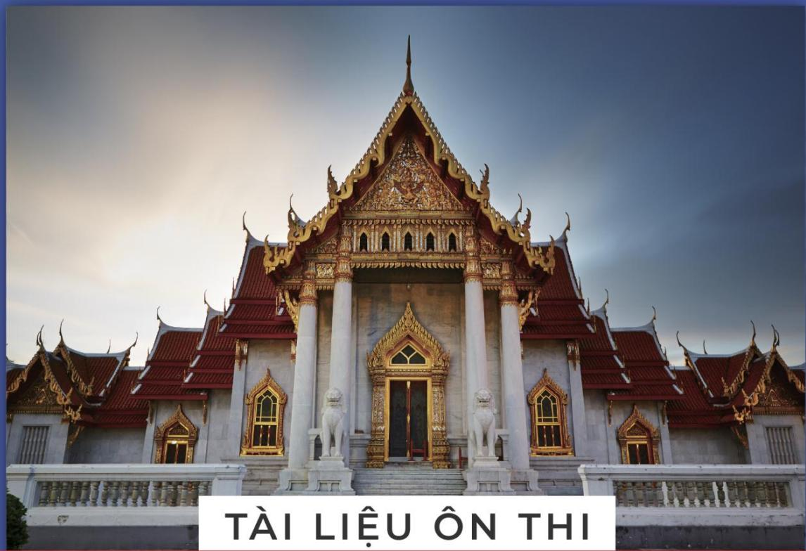

## OLYMPIC TOAN HQC QUOC TE

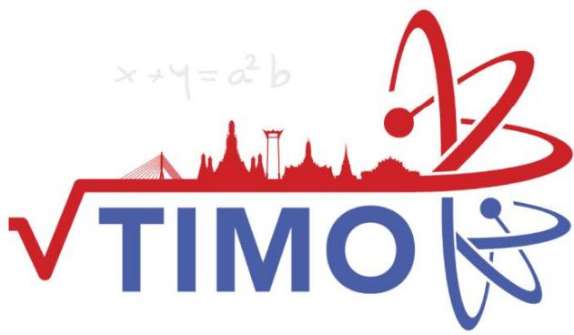

## Thailand International Mathematical Olympiad

KHOI5 

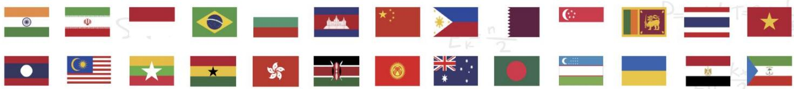

## MỤC LỤC

Giới thiệu Kỳ thi Olympic Toán học quốc tế TIMO . 

Danh sách các trường tham gia tích cực và đạt thành tích cao tại các kỳ TIMO .. .6 

Một số hình ảnh tiêu biểu của Kỳ thi Olympic Toán học quốc tế TIMO tại Việt Nam .......8 

Syllabus/ Khung chƣơng trình... 11 

Đề thi Đáp án 

## PRELIMINARY ROUND / VÒNG LOẠI QUỐC GIA

Đề số 1... .. 12 ..........51 

Đề số 2... .. 16 ..........52 

Đề số 3.... ... 21 ..........53 

Đề số 4.... .. 25 ..........54 

Đề số 5.... .. 29 ..........55 

## HEAT ROUND / VÒNG CHUNG KẾT QUỐC GIA

Đề số 1... . 33 ..........56 

Đề số 2... ... 37 ..........57 

Đề số 3.... ... 40 ..........58 

Đề số 4.... .. 43 ..........59 

Đề số 5.... ... 47 ..........60 

Heat Round Answer Sheet/ Phiếu Trả Lời Vòng Chung Kết Quốc Gia. ..61 

Một số kỳ thi Olympic quốc tế tiêu biểu khác . ...62 

Thông tin liên hệ ... ...66 

# GIỚI THIỆU KỲ THI OLYMPIC TOÁN HỌC QUỐC TẾ TIMO

Kỳ thi Olympic Toán học quốc tế TIMO (Thailand International Mathematical Olympiad) được tổ chức hàng năm bởi Trung tâm Giáo dục Vô địch Olympiad Hong Kong (Olympiad Champion Education Centre from Hong Kong) hợp tác cùng Tổ chức Du lịch Thái Lan (Tourism Authority of Thailand) nhằm tạo cơ hội cho tất cả học sinh các khối lớp từ mẫu giáo đến trung học phổ thông có sở thích về Toán học tham gia, mục đích kích thích và nuôi dưỡng niềm yêu thích toán học của giới trẻ, tăng cường khả năng tư duy sáng tạo của học sinh, mở rộng mối quan hệ giao lưu văn hóa quốc tế. Với các thí sinh tham dự kỳ thi TIMO và đạt huy chương Vàng tại vòng Chung kết quốc tế sẽ được tham dự vòng Chung kết kỳ thi Olympic Toán học Thế giới WIMO vào tháng hàng năm. 

Trong mỗi lần tổ chức, Kỳ thi Olympic Toán học quốc tế TIMO đã thu hút hàng trăm nghìn thí sinh tham dự đến từ nhiều quốc gia và vùng lãnh thổ khác nhau trên thế giới như: Australia, Brazil, Bulgaria, Cambodia, England, France, Georgia, Ghana, Hong Kong, Indonesia, India, Iran, Kazakhstan, Kyrgyzstan, Malaysia, Myanmar, Philippines, Singapore, Sri Lanka, Switzerland, Taiwan, Turkey, Thailand, Vietnam, ... 

Năm học 2021-2022 là lần thứ ba Kỳ thi được tổ chức tại Việt Nam. Trong lần thứ hai tham dự, tại Vòng Chung kết quốc gia, các thí sinh Việt Nam đã rất xuất sắc với 74% đạt giải trong đó Cúp Vô địch, 2 Cúp Á quân , 3 Cúp Á quân 2; 7% Huy chương Vàng, 9% Huy chương Bạc, 38% Huy chương Đồng và 10% giải Khuyến khích. Đặc biệt, trong vòng Chung kết quốc tế, đội tuyển Việt Nam đã xuất sắc đạt thành tích cao bao gồm 36 giải Vàng, 87 giải Bạc, 163 giải Đồng, trong đó có Cúp Ngôi sao thế giới dành cho thí sinh cao điểm nhất Việt Nam, Cúp Vô địch dành cho thí sinh cao điểm nhất toàn cầu và 1 Cúp Á quân 2 dành cho thí sinh cao điểm thứ 3 toàn cầu tại mỗi khối lớp. 

Với mong muốn góp phần tạo dựng thêm sân chơi giao lưu quốc tế dành cho học sinh Việt Nam, đồng thời góp phần nâng cao trình độ và cơ hội hợp tác cho giáo viên và cán bộ giáo dục, tiếp cận các nền giáo dục tiên tiến trên thế giới, Ban Tổ chức kỳ thi mong muốn nhận được sự ủng hộ, hỗ trợ và tham gia của các Sở, Phòng Giáo dục và Đào tạo, nhà trường, phụ huynh và các em học sinh để các kỳ thi quốc tế tại Việt Nam đạt được hiệu quả cao nhất. 

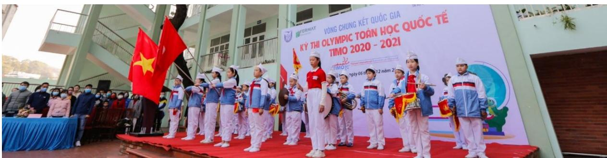

Hội đồng thi trường TH Hạ Long, Quảng Ninh tại Vòng Chung kết quốc gia TIMO 2020 – 2021

## Thông tin chi tiết về Kỳ thi Olympic Toán học quốc tế TIMO

## 1. Quy định về độ tuổi, cấu trúc đề thi

## a. Về độ tuổi

Tất cả các học sinh yêu thích môn Toán từ Lớp mẫu giáo tới Lớp 12 trung học phổ thông. 

## b. Về cấu trúc đề thi

<table><tr><td colspan="2">Vòng thi</td><td>Vòng loại quốc gia</td><td>Vòng Chung kết quốc gia</td><td>Vòng Chung kết quốc tế</td></tr><tr><td colspan="2">Số câu hỏi</td><td>25</td><td>25</td><td>30</td></tr><tr><td colspan="2">Điểm mỗi câu hỏi</td><td>4</td><td>4</td><td>5</td></tr><tr><td colspan="2">Tổng điểm</td><td>100</td><td>100</td><td>150</td></tr><tr><td rowspan="5">Chủ đề</td><td>Tự duy lôgic</td><td>5</td><td>5</td><td>6</td></tr><tr><td>Số học/Đại số</td><td>5</td><td>5</td><td>6</td></tr><tr><td>Lý thuyết số</td><td>5</td><td>5</td><td>6</td></tr><tr><td>Hình học</td><td>5</td><td>5</td><td>6</td></tr><tr><td>Tổ hợp</td><td>5</td><td>5</td><td>6</td></tr><tr><td colspan="2">Thời gian</td><td>60 phút</td><td>90 phút</td><td>120 phút</td></tr><tr><td colspan="2">Dạng đề thi</td><td>Trắc nghiệm</td><td>Điền đáp án</td><td>Điền đáp án</td></tr><tr><td colspan="2">Ngôn ngữ</td><td>Song ngữ Anh – Việt</td><td>Tiếng Anh (có trích dẫn thuật ngữ tiếng Việt)</td><td>Tiếng Anh</td></tr></table>

## 2. Cơ cấu giải thưởng

a. Giải thƣởng của Ban Tổ chức quốc tế 

<table><tr><td rowspan="2">Huy chương</td><td colspan="2">Điều kiện xét giải</td><td rowspan="2">Giải thường</td></tr><tr><td>Vòng Chung kết quốc gia</td><td>Vòng Chung kết quốc tế</td></tr><tr><td>Ngôi sao thế giới (World Star)</td><td></td><td>Thí sinh cao điểm nhất mỗi khu vực.</td><td>- Cúp Ngôi sao thế giới;- Miễn lệ phí tham dự Vòng Chung kết quốc tế.</td></tr><tr><td>Giải Xuất sắc (Champion 1stRunner-up 2ndRunner-up)</td><td>03 thí sinh cao điểm nhất mỗi khối thi.</td><td>03 thí sinh điểm cao nhất mỗi khởi thi.</td><td>- Cúp Vô dịch;- Cúp Á quân 1;- Cúp Á quân 2.</td></tr><tr><td>Giải Vàng (Gold Award)</td><td>Thí sinh chiến thắng đạt từ 80 điểm trở lên.</td><td>Thí sinh chiến thắng đạt từ 120 điểm trở lên.</td><td>Huy chương và Giấy chứng nhận.</td></tr><tr><td>Giải Bạc (Silver Award)</td><td>Thí sinh chiến thắng đạt từ 60 điểm trở lên.</td><td>Thí sinh chiến thắng đạt từ 90 điểm trở lên.</td><td>Huy chương và Giấy chứng nhận.</td></tr><tr><td>Giải Đồng (Bronze Award)</td><td>Thí sinh chiến thắng đạt từ 40 điểm trở lên.</td><td>Thí sinh chiến thắng đạt từ 60 điểm trở lên.</td><td>Huy chương và Giấy chứng nhận.</td></tr><tr><td>Giải Khuyến khích (Merit)</td><td>Thí sinh chiến thắng đạt từ 20 điểm trở lên.</td><td>Thí sinh chiến thắng đạt từ 30 điểm trở lên.</td><td>Giấy chứng nhận.</td></tr></table>

Đặc biệt, các thí sinh đạt Huy chương Vàng Vòng Chung kết quốc tế TIMO được tham dự (miễn lệ phí thi) Vòng Chung kết Kỳ thi Olympic Toán thế giới WIMO vào tháng 1 năm tới. 

## Lưu ý:

- Vòng loại quốc gia không xếp giải. Khoảng 70% thí sinh có điểm cao nhất của Vòng loại quốc gia được đăng ký tham gia Vòng Chung kết quốc gia. 

- Ban Tổ chức sắp xếp kết quả giảm dần dựa trên điểm thi và ngày sinh. Do đó, các thí sinh bằng điểm có thể nhận hai giải khác nhau. Nếu một giải thưởng đã đủ chỉ tiêu, thí sinh tiếp theo sẽ nhận giải thưởng mức liền kề phía dưới. 

- Các mốc điểm đạt giải có thể thay đổi dựa trên kết quả thi thực tế của tất cả thí sinh. 

## b. Giải thƣởng của Ban Tổ chức Việt Nam

* Đối với thí sinh: 

- Thí sinh cao điểm nhất Vòng Chung kết quốc gia được giải thưởng tiền mặt 5.000.000 đồng (năm triệu đồng). 

- Với mỗi khối có từ 100 thí sinh tham dự Vòng loại quốc gia, thí sinh cao điểm nhất khối thi Vòng Chung kết quốc gia được giải thưởng tiền mặt 2.000.000 đồng (hai triệu đồng); 

Với các giải thưởng tiền mặt phía trên, nếu có nhiều hơn một thí sinh đạt giải, số tiền thưởng được chia đều cho các thí sinh đạt giải. 

- Thí sinh đạt huy chương Vàng vòng Chung kết quốc gia và đạt giải Vòng Chung kết quốc tế TIMO được đặc cách miễn Vòng loại quốc gia các kỳ thi HKIMO, BBB cùng năm học và các tặng thưởng lệ phí khi tham gia các kỳ thi có trong Thông báo của mỗi kỳ thi. 

* Đối với Trường có học sinh tham dự: 

- Trường có từ 300 học sinh tham gia Kỳ thi sẽ được tặng Giấy khen, Kỷ niệm chương và quảng bá logo của trường trên tất cả các ấn phẩm truyền thông các Kỳ thi của Ban Tổ chức. 

- Trường có từ 150 học sinh tham gia Kỳ thi sẽ được tặng Giấy khen, Kỷ niệm chương và quảng bá logo của trường trên tất cả các ấn phẩm truyền thông về Kỳ thi. 

- Trường có từ 50 học sinh tham gia Kỳ thi sẽ được tặng Giấy khen tham dự tích cực trong Kỳ thi quốc tế. 

## Danh sách các trường tham gia tích cực và đạt thành tích cao tại các kỳ TIMO

. TH Điện Biên , Thanh Hóa 

2. TH Nguyễn Văn Trỗi, Thanh Hóa 

3. TH Lê Mao, Nghệ An 

4. TH Xuân La, Hà Nội 

5. TH Cầu Giát, Nghệ An 

6. TH Cầu Diễn, Hà Nội 

7. IQ School , Hà Nội 

8. TH Chu Văn An, Hà Nội 

9. TH Nghĩa Tân, Hà Nội 

0. TH Lê Ngọc Hân, Hà Nội 

. TH Xuân Đỉnh, Hà Nội 

12. TH,THCS,THPT Đông Bắc Ga, Thanh Hóa 

3. THCS Lê Lợi, Hà Nội 

14. TH I-sắc Niu-tơn, Hà Nội 

5. TH Đông Thái, Hà Nội 

16. TH Nam Thành Công, Hà Nội 

7. TH Đội Cung, Nghệ An 

8. TH Thị trấn Phùng, Hà Nội 

9. TH Đông Ngạc B, Hà Nội 

20. THCS Chu Văn An, Hà Nội 

2 . TH Cao Bá Quát, Hà Nội 

22. TH, THCS & THPT Vinschool, Hồ Chí Minh 

23. TH Hưng Dũng , Nghệ An 

24. TH Tây Sơn, Hà Nội 

25. TH,THCS&THPT Nobel school, Thanh Hóa 

26. TH Đồng Mỹ, Quảng Bình 

27. TH NEWTON GOLDMARK, Hà Nội 

28. THCS Thị Trấn Nghĩa Đàn, Nghệ An 

29. TH Ba Trại A, Hà Nội 

30. TH Quảng An, Hà Nội 

3 . TH Nhật Tân, Hà Nội 

32. TH Gia Thượng, Hà Nội 

33. TH Thượng Sơn, Nghệ An 

34. TH Lam Sơn 3, Thanh Hóa 

35. TH Thanh Trì, Hà Nội 

36. TH Dương Xá, Hà Nội 

37. THCS Xuân Diệu, Hà Tĩnh 

38. TH Tây Tựu B, Hà Nội 

39. TH Chu Văn An, Nam Định 

40. TH Giáp Bát, Hà Nội 

4 . TH Hà Huy Tập 2, Nghệ An 

42. TH Minh Khai A, Hà Nội 

43. TH Lê Lợi, Nghệ An 

44. IQ School, Ninh Bình 

45. TH Ba Trại B, Hà Nội 

46. TH Phương Canh, Hà Nội 

47. TH Mỹ Đình 2, Hà Nội 

48. THCS Đông Thái, Hà Nội 

49. TH Phú Phương, Hà Nội 

50. TH Vạn Thắng, Hà Nội 

5 . TH Hải Cường, Nam Định 

52. THCS Thái Thịnh, Hà Nội 

53. Hanoi Academy, Hà Nội 

54. TH Phúc Diễn, Hà Nội 

55. THCS Bạch Liêu, Nghệ An 

56. THCS Phú Diễn, Hà Nội 

57. TH Lưu Sơn, Nghệ An 

58. THCS Cao Bá Quát, Hà Nội 

59. TH Bến Thủy, Nghệ An 

60. THCS & THPT Lê Quý Đôn, Hà Nội 

6 . THCS Minh Khai, Hà Nội 

62. THCS Trần Phú, Thanh Hóa 

63. THCS Văn Đức, Hà Nội 

64. TH Lê Ngọc Hân, Hà Nội 

65. TH Ngô Đức Kế, Hà Tĩnh 

66. THCS Xuân Đỉnh, Hà Nội 

67. THCS Trung Lương, Hà Tĩnh 

68. TH Hưng Dũng 2, Nghệ An 

69. TH An Dương, Hà Nội 

70. TH Đô Thị Việt Hưng, Hà Nội 

7 . TH Thịnh Sơn, Nghệ An 

72. TH Quang Trung, Hà Nội 

73. THCS - THPT Newton, Hà Nội 

74. THCS Ngô Gia Tự, Hà Nội 

75. THCS Xuân La, Hà Nội 

76. THCS Hà Huy Tập, Hà Nội 

77. TH Tòng Bạt, Hà Nội 

78. TH&THCS NEWTON 5, Hà Nội 

79. TH Cổ Nhuế 2B, Hà Nội 

80. TH Hòa Hiếu I, Nghệ An 

8 . THCS Đông Ngạc, Hà Nội 

82. TH Đồng Nhân, Hà Nội 

83. THCS Nguyễn Trường Tộ, Hà Nội 

84. THCS Ninh Hiệp, Hà Nội 

85. TH Vật Lại, Hà Nội 

86. TH Tây Đằng A, Hà Nội 

87. THCS Thượng Cát, Hà Nội 

88. TH Đại Từ, Hà Nội 

89. TH Quang Tiến, Nghệ An 

90. TH Đức Thắng, Hà Nội 

9 . TH Thuận Sơn, Nghệ An 

92. TH và THCS Fansipan, Thanh Hóa 

93. THCS Vĩnh Quỳnh, Hà Nội 

94. TH Phú Châu, Hà Nội 

95. TH Quỳnh Hồng, Nghệ An 

96. THCS Tứ Hiệp, Hà Nội 

97. THCS Phan Đăng Lưu, Nghệ An 

98. TH Ngô Đức Kế, Hà Tĩnh 

99. THCS Hồ Xuân Hương, Nghệ An 

00. Trường Quốc tế song ngữ UK Academy, Quảng Ngãi 

0 . TH Nguyễn Thị Minh Khai, Hải Phòng 

02. TH Gia Khánh A, Vĩnh Phúc 

## Một số hình ảnh tiêu biểu của Kỳ thi Olympic Toán học quốc tế TIMO tại Việt Nam

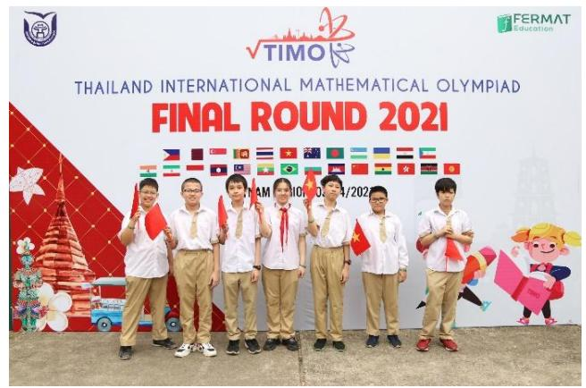

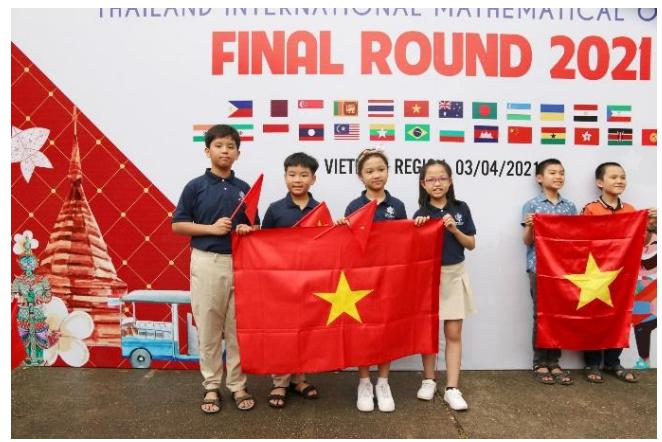

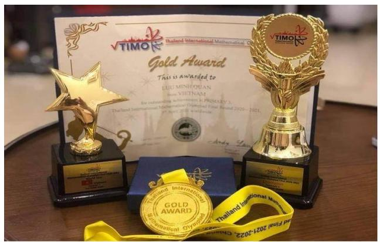

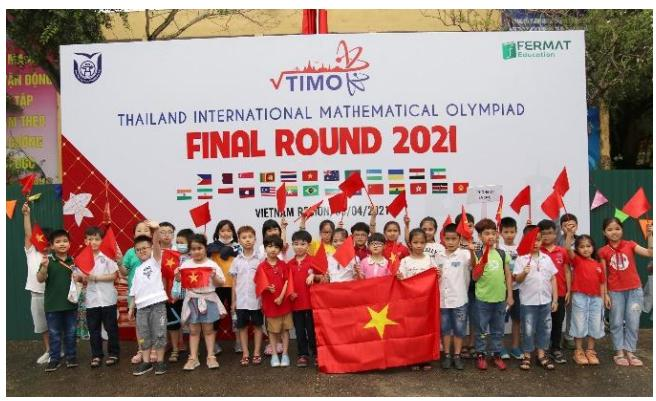

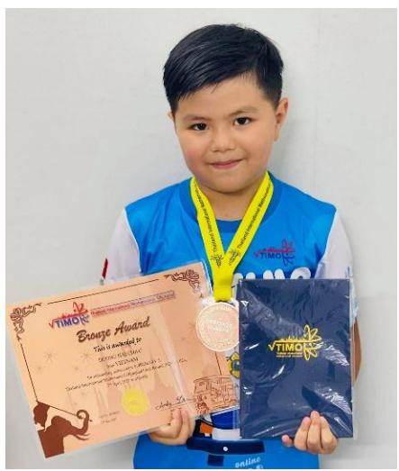

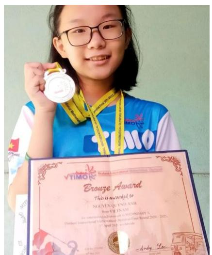

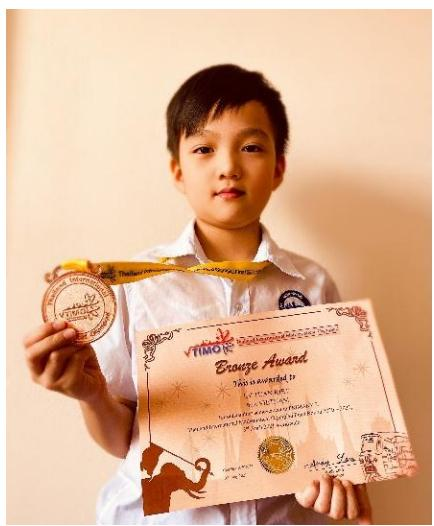

Vòng Chung kết quốc tế TIMO 2020 - 2021 

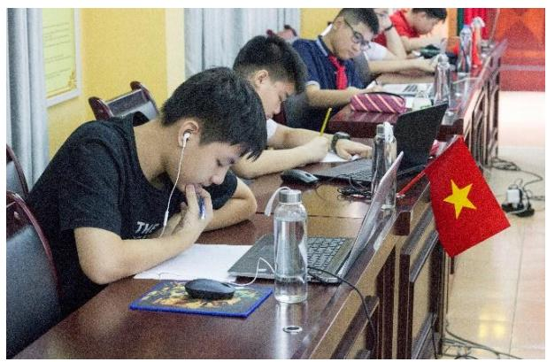

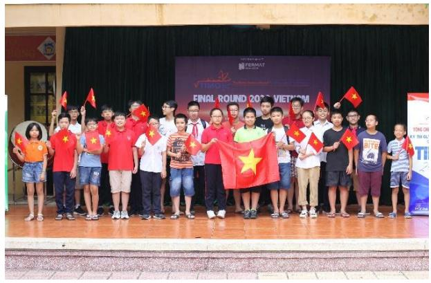

Hội đồng thi trường THCS Thái Thịnh, Đống Đa, Hà Nội năm học 2019 - 2020

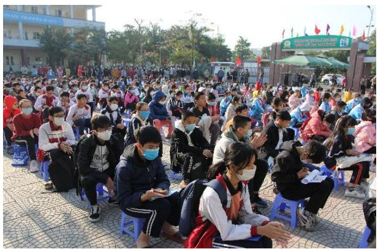

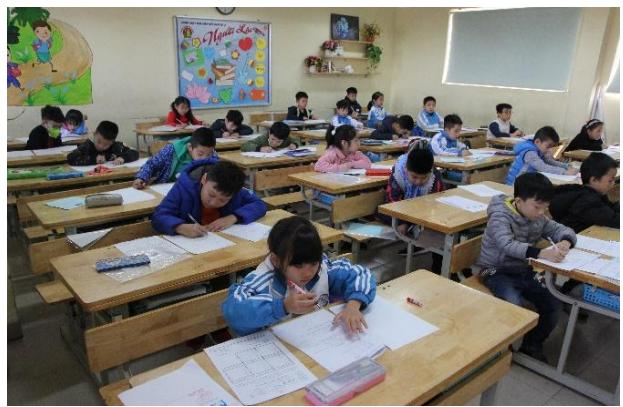

Hội đồng thi trường TH Cao Bá Quát, Gia Lâm, Hà Nội năm học 2020 - 2021

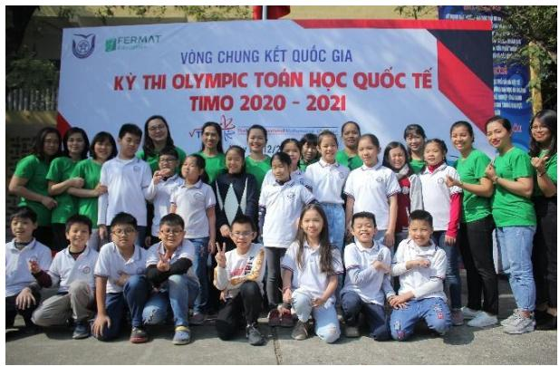

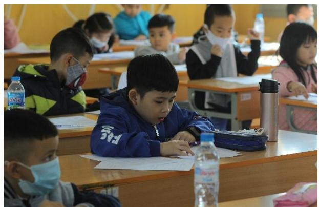

Hội đồng thi Trường Đại học Thủ Đô Hà Nội năm học 2020 - 2021

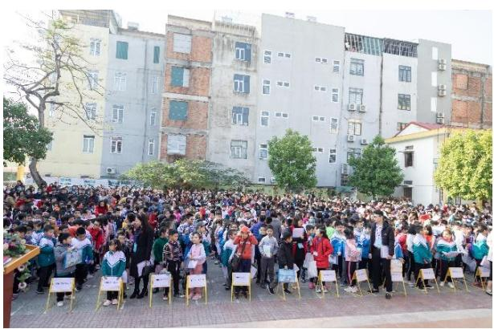

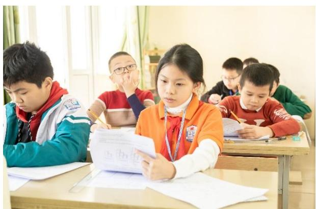

Hội đồng thi tỉnh Thanh Hóa năm học 2020 - 2021

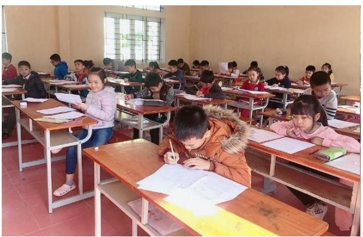

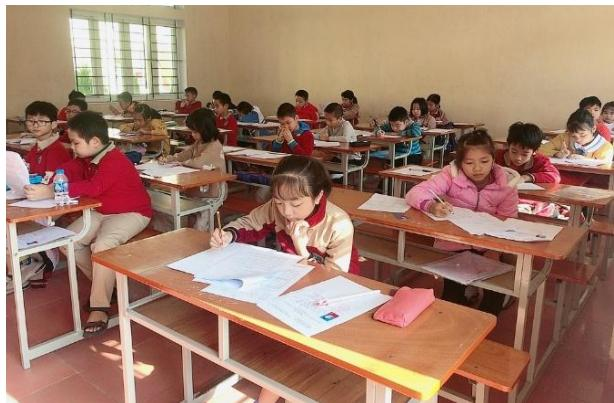

Hội đồng thi tỉnh Nam Định năm học 2020 - 2021

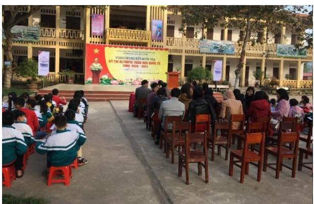

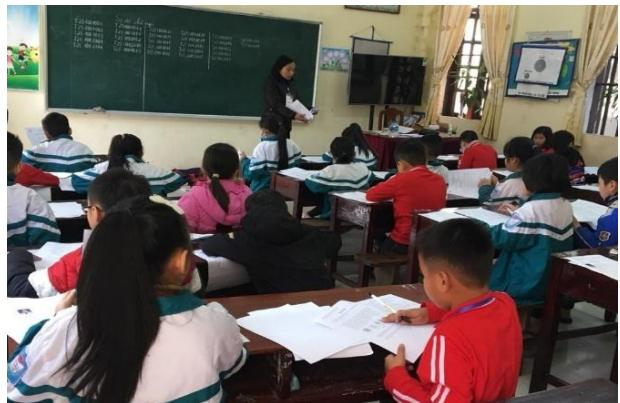

Hội đồng thi trường TH Hải Cường, Nam Định năm học 2020 - 2021

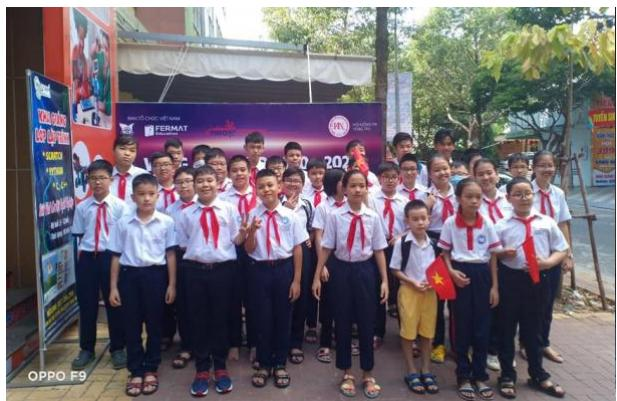

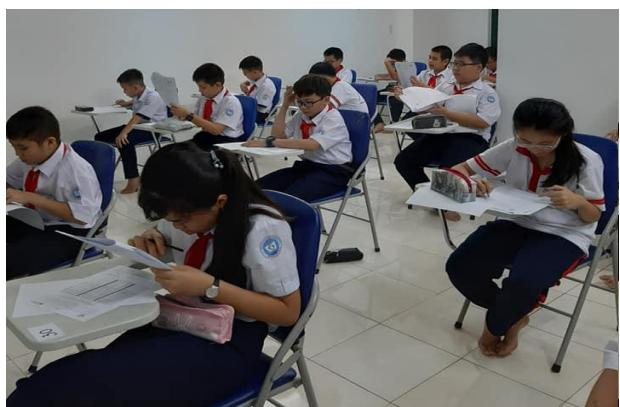

Hội đồng thi tỉnh Bà Rịa - Vũng Tàu năm học 2020 - 2021

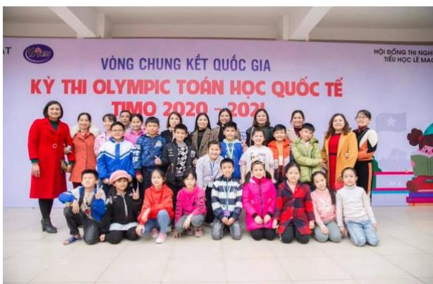

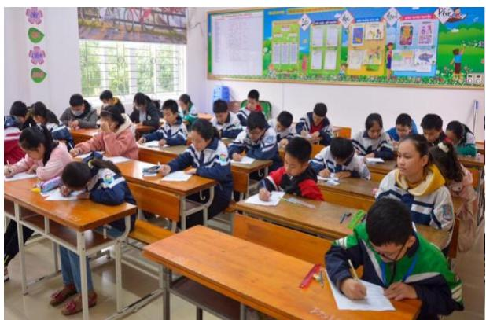

Hội đồng thi trường TH Lê Mao, Nghệ An năm học 2020 - 2021

SYLLABUS / KHUNG CHƢƠNG TRÌNH

<table><tr><td>TopicsChủ đề</td><td>Grade 5 / Khối 5</td></tr><tr><td>Logical thinkingTư duy logic</td><td>➢ Number &amp; Figure Pattern / Dãy số và dãy hình có quy luật➢ IQ Age Problem &amp; Date Problem / Tuôi và ngày tháng➢ Backward problems / Bài toán làm ngược lại➢ Assumption problems / Bài toán giả thiết tạm</td></tr><tr><td>ArithmeticSố học</td><td>➢ Addition and subtraction on fractions / Các phép cộng trừ phân số➢ Distribution property for multiplication and division / Tính chất phân phối với phép nhân và phép chia➢ Arithmetic sequence and geometric sequence / Dãy số cách đều và dãy số nhân➢ Continued fractions / Liên phân số</td></tr><tr><td>Number theoryLý thuyết số</td><td>➢ Divisibility / Tính chia hết➢ New operation symbol / Định nghĩa phép toán mới➢ Find the number of factors / Tìm số uốc➢ Unit digit / Tìm chữ số tận cùng➢ Forming equation / Bài toán lập phương trình</td></tr><tr><td>GeometryHình học</td><td>➢ Counting on number rectangles in a grid / Đếm hình chữ nhật trong lưới ô vuông➢ Counting on number of 2-D &amp; 3-D Figures / Đếm hình 2D hoặc 3D➢ Perimeter and area / Chu vi và diện tích➢ Volume and Surface area / Thể tích và diện tích bề mặt➢ Simple angles / Các góc đơn giản</td></tr><tr><td>CombinatoricsTổ hợp</td><td>➢ Routing problem / Bài toán đếm đường đi➢ Counting on specific numbers or cases / Đếm các số hoặc các trường hợp đặc biệt➢ Worst case scenario / Dạng toán trường hợp xấu nhất➢ Formation of numbers / Thành lập số</td></tr></table>

*Khung chương trình mang tính chất tham khảo. 

## PRELIMINARY ROUND / VÒNG LOẠI QUỐC GIA

# ĐỀ SỐ 1: Đề thi vòng loại quốc gia năm học 2020 - 2021

## Logical Thinking / Tƣ duy lô-gic

1. Refer to the number pattern below. Find the 5th term in the sequence. 

Dựa vào quy luật số dưới đây, tìm số thứ 5 trong dãy. 

1 、 8 、 27 、 64 、 __ 、…. 

A. 125 

B. 100 

C. 65 

D. 105 

2. Tomorrow is Friday. Which day of the week was it 84 days ago? 

Ngày mai là thứ Sáu. Hỏi 84 ngày trước là thứ mấy? 

A. Saturday (Thứ Bảy) 

B. Thursday (Thứ Năm) 

C. Tuesday (Thứ Ba) 

D. Friday (Thứ Sáu) 

3. It requires 4 minutes to cut a piece of wood into 2 sections. If the time required to cut into each section is the same, how many minutes are required to cut a piece of wood into 3 sections? 

Người ta cần 4 phút để cưa 1 khúc gỗ thành 2 phần. Biết rằng thời gian mỗi lần cưa gỗ là như nhau, hỏi cần bao nhiêu phút để cưa khúc gỗ đó thành 3 phần? 

A. 8 

B. 6 

C. 5 

D. 10 

4. 100 students went on a school trip by coaches. At least how many coaches are required to carry all of the students, given that each coach can carry no more than 23 students? 

100 học sinh đi tham quan với trường bằng xe khách. Hỏi cần ít nhất bao nhiêu xe để chở hết số học sinh đó biết rằng mỗi xe được chở không quá 23 học sinh? 

A. 3 

B. 6 

C. 4 

D. 5 

5. According to the pattern below, find the most suitable figure for group 5 among 4 answers A, B, C and D. 

Dựa vào quy luật dưới đây, tìm đáp án thích hợp nhất cho nhóm 5 trong 4 hình A, B, C, D. 

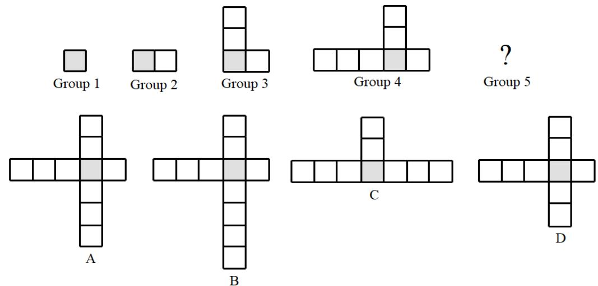

## Arithmetic / Số học

6. Find the value of  x , given that $5 x + 7 = 1 2 2$ . 

Tìm giá trị của  x biết rằng $5 x + 7 = 1 2 2$ 

A. 21 

B. 22 

C. 23 

D. 24 

7. Find the value of $0 + 3 + 6 + 9 + . . . + 5 7 + 6 0$ . 

Tìm giá trị của $0 + 3 + 6 + 9 + . . . + 5 7 + 6 0$ 

A. 1260 

B. 1800 

C. 1890 

D. 630 

8. Calculate $2 3 { \times } 1 8 + 3 9 { \times } 2 3 - 7 { \times } 2 3$ . 

Tính $2 3 \times 1 8 + 3 9 \times 2 3 - 7 \times 2 3$ . 

A. 1150 

B. 1510 

C. 5150 

D. 1105 

9. Find the value of $2 0 2 0 - 2 0 0 0 + 1 9 8 0 - 1 9 6 0 + . . . + 6 0 - 4 0 + 2 0 - 0$ . 

Tìm giá trị của  2020 2000 1980 1960 ... 60 40 20 0         . 

A. 1000 

B. 1020 

C. 2040 

D. 2000 

10. Find the value of ${ \frac { 1 } { 2 \times 3 } } { + } { \frac { 1 } { 3 \times 4 } } { + } { \frac { 1 } { 4 \times 5 } } { + } . . . { + } { \frac { 1 } { 9 8 \times 9 9 } } { + } { \frac { 1 } { 9 9 \times 1 0 0 } } .$ 

Tính giá trị của ${ \frac { 1 } { 2 \times 3 } } { + } { \frac { 1 } { 3 \times 4 } } { + } { \frac { 1 } { 4 \times 5 } } { + } . . . { + } { \frac { 1 } { 9 8 \times 9 9 } } { + } { \frac { 1 } { 9 9 \times 1 0 0 } } .$ 

A. $\frac { 4 9 } { 1 0 0 }$ 

B. $\frac { 9 9 } { 1 0 0 }$ 

C. $\frac { 4 9 } { 5 0 }$ 

D. $\frac { 1 } { 2 }$ 

## Number Theory / Lý thuyết số

11. If an 8-digit number 1112020A is divisible by 3 and 4, find the value of A. 

Biết rằng số có 8 chữ số 1112020A chia hết cho cả 3 và 4, tìm giá trị của A. 

A. 2 

B. 6 

C. 8 

D. 4 

12. Find the unit digit of $6 { \times } 1 6 { \times } 2 6 { \times } . . . { \times } 9 6 { \times } 1 0 6$ . 

Tìm chữ số hàng đơn vị của $6 { \times } 1 6 { \times } 2 6 { \times } \ldots { \times } 9 6 { \times } 1 0 6$ 

A. 5 

B. 9 

C. 7 

D. 6 

13. The sum of A and B is 2020. The value of A is four times the value of B. Find the value of A. 

Tổng của A và B là 2020. Giá trị của A gấp 4 lần giá trị của B. Tìm A. 

A. 505 

B. 1616 

C. 404 

D. 2525 

14. Given that X and Y are two 3-digit odd numbers. What is the largest possible difference between X and Y? 

Biết rằng X và Y là hai số lẻ có 3 chữ số. Hỏi hiệu giữa hai số X và Y lớn nhất có thể là bao nhiêu? 

A. 899 

B. 999 

C. 898 

D. 900 

15. How many 3-digit numbers that are divisible by both 3 and 4 are there? 

Hỏi có bao nhiêu số có ba chữ số chia hết cho cả 3 và 4? 

A. 80 

B. 75 

C. 150 

D. 70 

## Geometry / Hình học

16. How many right-angled triangles are there in the figure below? 

Hỏi có bao nhiêu tam giác vuông trong hình dưới đây? 

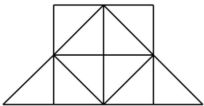

A. 14 

B. 15 

C. 17 

D. 19 

17. A big cube is formed by 8 identical cubes with side length 10 cm. Find the side length of the big cube in cm? 

Một khối lập phương lớn được tạo ra bằng cách ghép 8 khối lập phương giống nhau có cạnh dài 10 cm. Tìm độ dài cạnh của khối lập phương lớn theo cm. 

A. 30 cm 

B. 40 cm 

C. 80 cm 

D. 20 cm 

18. Given a rectangle ABCD and a right-angled triangle EDC as the figure below. Find the length of line segment BC given that  ED cm EC cm DC cm    6 , 8 , 10 . 

Cho hình chữ nhật ABCD và tam giác vuông EDC như hình dưới đây. Tìm độ dài đoạn BC biết rằng  ED cm EC cm DC cm    6 , 8 , 10 . 

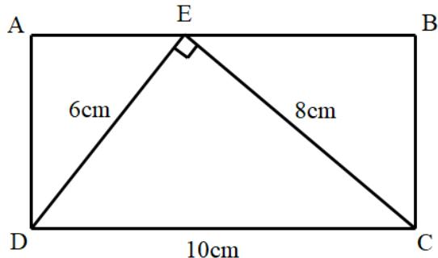

A. 4.8 cm 

B. 2.4 cm 

C. 4 cm 

D. 5 cm 

19. The figure on the right is composed of identical cubes with side length 5 cm. If they paint all top faces of the solid, what is the value of the painted area in cm2? 

Hình bên gồm các khối lập phương giống nhau có độ dài cạnh 5cm. Nếu người ta sơn toàn bộ mặt trên của hình đó, hỏi diện tích của phần được sơn là bao nhiêu cm2? 

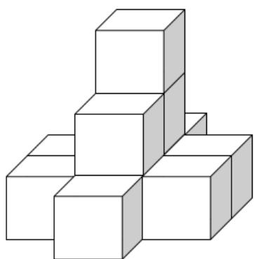

A. 160 

B. 200 

C. 180 

D. 175 

20. A square tile has the following pattern. Given that the area of the shaded region is 20 cm2. Find the perimeter of the square tile in cm. 

Một miếng gạch lát hình vuông có họa tiết như hình dưới đây. Biết rằng phần in đậm có diện tích 20cm2. Tính chu vi của miếng gạch lát theo cm. 

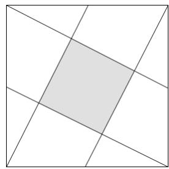

A. 40 cm 

B. 60 cm 

C. 80 cm 

D. 20 cm 

## Combinatorics / Tổ hợp

21. How many 2-digit numbers with no repeated digits are there? 

Hỏi có bao nhiêu số có 2 chữ số khác nhau? 

A. 72 

B. 90 

C. 81 

D. 80 

22. In how many ways can we arrange 4 students in a row? 

Hỏi có bao nhiêu cách sắp xếp 4 học sinh thành 1 hàng ngang? 

A. 24 

B. 4 

C. 12 

D. 10 

23. In how many ways can 48 workers be divided into groups of equal size given that the number of groups must be more than 1? 

Hỏi có bao nhiêu cách để có thể chia 48 người công nhân thành các nhóm có số người như nhau biết rằng số nhóm phải lớn hơn 1? 

A. 7 

B. 8 

C. 9 

D. 10 

24. There are 15 black pens, 14 blue pens and 13 red pens in a box. At least how many pens should be drawn without looking so that we can get pens in three colors? 

Trong hộp có 15 bút đen, 14 bút xanh và 13 bút đỏ. Hỏi nếu không nhìn vào hộp thì cần lấy ra ít nhất bao nhiêu cái bút để chắc chắn rằng ta lấy được bút cả ba loại màu? 

A. 42 

B. 30 

C. 3 

D. 28 

25. How many rectangles containing the shaded region are there? 

Hỏi có bao nhiêu hình chữ nhật chứa phần in đậm dưới đây? 

<table><tr><td></td><td></td><td></td><td></td></tr><tr><td></td><td></td><td></td><td></td></tr><tr><td></td><td></td><td></td><td></td></tr><tr><td></td><td></td><td></td><td></td></tr><tr><td></td><td></td><td></td><td></td></tr><tr><td></td><td></td><td></td><td></td></tr></table>

A. 16 

B. 14 

C. 12 

D. 10 

# ĐỀ SỐ 2

## Logical Thinking / Tƣ duy lô-gic

Refer to the pattern below. How many triangles are there in the first 2021 figures counting from left to right? 

Xét quy luật dưới đây. Hỏi có bao nhiêu hình tam giác trong 2021 hình đầu tiên tính từ trái sang phải? 

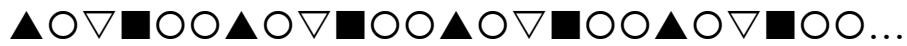

A. 674 

B. 673 

C. 809 

D. 336 

2. Andy has a number of cans to contain an amount of gasoline. If he pours 3 liters in each can then he has 10 liters left. If he pours 4 liters in each can then he has 2 liters left. How many liters of gasoline does Andy have in total? 

Andy có một số can để đựng một lượng xăng. Nếu anh ấy đổ 3 lít xăng vào mỗi can thì vẫn còn thừa 10 lít. Nếu anh ấy đổ 4 lít xăng vào mỗi can thì vẫn còn thừa 2 lít. Hỏi Andy có tất cả bao nhiêu lít xăng? 

A. 24 

B. 34 

C. 38 

D. 8 

3. What is the 8th number in the sequence with pattern below? 

Tìm số thứ 8 trong dãy số có quy luật dưới đây? 

1 , 2 , 5 , 14 , 41 , … 

A. 1049 

B. 1000 

C. 122 

D. 1094 

4. Observe the pattern below to find the sum of A + B + C. 

Quan sát quy luật dưới đây để tìm tổng A + B + C. 

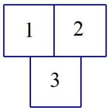

A. 75 

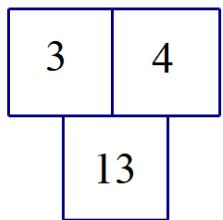

B. 62 

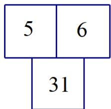

C. 72 

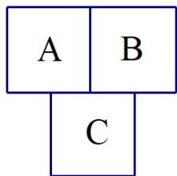

D. 57 

5. A math test has 10 questions. Each correct answer receives 1 point. Wrong answer or empty answer receives 0 point. At least how many students are required to do the test to ensure that there are 2 students having the same score? 

Một bài kiểm tra toán có 10 câu hỏi. Mỗi câu trả lời đúng được 1 điểm. Trả lời sai hoặc không trả lời thì không có điểm. Hỏi cần ít nhất bao nhiêu học sinh làm bài kiểm tra để chắc chắn có hai bạn bằng điểm nhau? 

A. 12 

B. 11 

C. 10 

D. 20 

## Arithmetic / Số học

6. Find the value of $\frac { 1 } { 2 \times 4 } + \frac { 1 } { 4 \times 6 } + \frac { 1 } { 6 \times 8 } + . . . + \frac { 1 } { 2 0 2 0 \times 2 0 2 2 }$ 

Tìm giá trị của $\frac { 1 } { 2 \times 4 } + \frac { 1 } { 4 \times 6 } + \frac { 1 } { 6 \times 8 } + \ldots + \frac { 1 } { 2 0 2 0 \times 2 0 2 2 }$ 

A. $\frac { 1 } { 2 }$ 

B. $\frac { 5 0 5 } { 1 0 1 1 }$ 

C. $\frac { 5 0 5 } { 2 0 2 2 }$ 

D. $\frac 1 4$ 

7. Find the value of $\frac { 1 } { 2 + { \frac { 3 } { 4 } } }$ 

Tìm giá trị của $\frac { 1 } { 2 + { \frac { 3 } { 4 } } }$ 

A. $\frac { 1 1 } { 4 }$ 

B. $\frac { 4 } { 1 1 }$ 

C. $\frac { 4 } { 5 }$ 

D. $\frac { 5 } { 4 }$ 

8. Find the value of $2 + 7 + 1 2 + 1 7 + \ldots + 1 9 7 + 2 0 2$ . 

Tính giá trị của $2 + 7 + 1 2 + 1 7 + \ldots + 1 9 7 + 2 0 2 .$ . 

A. 4281 

B. 8364 

C. 10302 

D. 4182 

9. What is the value of P if the equation below is correct? 

Tìm giá trị của P để được phép tính đúng dưới đây. 

$$
2 \times P = 2 + 6 + 1 8 + 5 4 + \dots + 4 3 7 4
$$

A. 3820 

B. 3280 

C. 2380 

D. 2830 

10. Let each letter M, A, T, H, K, I, O represent distinct digits. Find the value of I. Biết các chữ cái M, A, T, H, K, I, O biểu diễn các chữ số khác nhau. Tìm giá trị của I. 

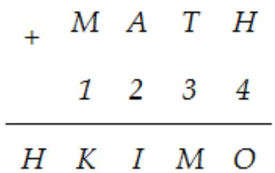

A. 3 

B. 2 

C. 4 

D. 5 

## Number Theory / Lý thuyết số

11. The weight of Ashley and Ben is 75kg. The weight of Ben and Chelsea is 81kg. The weight of Chelsea and Ashley is 84kg. Dan weighs 3kg more than the average weight of 4 friends. Find Dan’s weight in $k g$ . 

Ashley và Ben nặng 75kg. Ben và Chelsea nặng 81kg. Chelsea và Ashley nặng 84kg. Biết rằng Dan nặng hơn số cân trung bình của cả 4 bạn là 3kg. Hỏi Dan nặng bao nhiêu kg? 

A. 44 

B. 43 

C. 42 

D. 41 

12. Find the largest 3-digit number such that it leaves remainder 6 when divided by 7. Tìm số lớn nhất có 3 chữ số sao cho số đó chia 7 dư 6. 

A. 1000 

B. 993 

C. 994 

D. 995 

13. If the 10-digit number  20212022AB is divisible by 18, find the maximum possible value for A. 

Biết số có 10 chữ số 20212022AB chia hết cho 18, hỏi giá trị lớn nhất có thể của A là bao nhiêu? 

A. 8 

B. 9 

C. 5 

D. 3 

14. Given that 2 3 3 5    , 3 4 4 7 10     , 4 5 5 9 13 17      . Find the value of  4 6 . Biết rằng 2 3 3 5   , 3 4 4 7 10    , 4 5 5 9 13 17     . Tính 4 6. 

A. 50 

B. 72 

C. 10 

D. 48 

15. To write all page numbers of a book with 100 pages, how many digits 0 do we have to use? 

Để đánh số toàn bộ số trang của 1 quyển sách 100 trang thì cần bao nhiêu chữ số 0? 

A. 9 

B. 10 

C. 11 

D. 12 

## Geometry / Hình học

16. Each cell in the grid below has side length 4. Find the area which are painted red. Mỗi ô vuông trong lưới dưới đây có độ dài cạnh 4. Tính diện tích phần màu đỏ. 

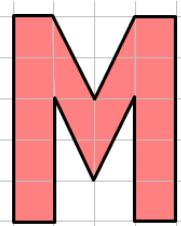

A. 150 

B. 300 

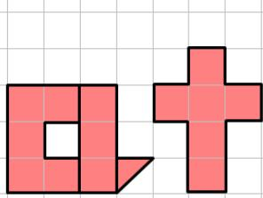

C. 600 

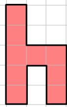

D. 664 

17. 10 small cubes with side length 2cm are combined to form the figure below. What is the value of its total surface area in cm2? 

10 hình lập phương với cạnh dài 2cm được ghép lại thành hình dưới đây. Hỏi diện tích toàn phần của hình dưới đây là bao nhiêu cm2? 

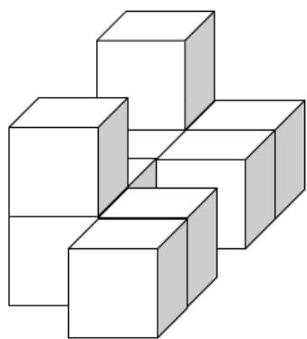

A. 160 

B. 80 

C. 40 

D. 200 

18. How many rectangles are there in the figure below? 

Hỏi có bao nhiêu hình chữ nhật trong hình dưới đây? 

<table><tr><td></td><td></td><td></td><td></td></tr><tr><td></td><td></td><td></td><td></td></tr><tr><td></td><td></td><td></td><td></td></tr></table>

A. 24 

B. 54 

C. 34 

D. 44 

19. Nine identical squares are combined to form the figure below with perimeter 48. Find the area of the shadowed region. 

Chín hình vuông y hệt nhau được ghép lại thành hình dưới đây có chu vi là 48. Hãy tính diện tích của phần được tô đậm. 

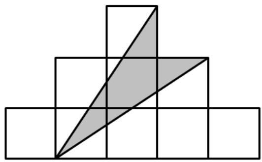

A. 24 

B. 18 

C. 16 

D. 27 

20. Andy had a square piece of paper with perimeter 72 as figure 1. Then he cut the paper into 2 identical parts to combine it into a rectangle as figure 2. Find the perimeter of the figure 2. 

Andy có một mảnh giấy hình vuông có chu vi 72 như hình 1. Sau đó, anh ấy cắt mảnh giấy thành 2 mảnh y hệt nhau để ghép thành hình 2. Tính chu vi của hình 2. 

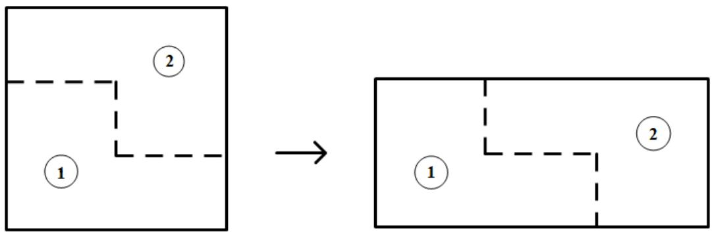

Figure 1

A. 80 

B. 78 

C. 76 

D. 74 

## Combinatorics / Tổ hợp

21. How many 3-digit numbers are there so that the number does not contain digit “ ”? Hỏi có bao nhiêu số có 3 chữ số mà không chứa chữ số 1? 

A. 488 

B. 252 

C. 729 

D. 648 

22. Sarah must take 2 or 3 pills a day. She has 13 pills in total. How many different ways are there for Sarah to take all those pills? 

Mỗi ngày Sarah phải uống 2 hoặc 3 viên thuốc. Biết rằng cô ấy có tất cả 13 viên thuốc. Hỏi có bao nhiêu cách khác nhau để Sarah uống hết số thuốc đó? 

A. 13 

B. 12 

C. 16 

D. 18 

23. Choose 8 digits, without repetition, from 0 to 7 to form two 4-digit numbers. (E.g. 2357 and 4016). Find the greatest possible sum of these two numbers. 

Chọn 8 chữ số (không lặp lại) từ số 0 đến số 7 để lập thành hai số có 4 chữ số (Ví dụ: chọn số 2357 và 4016). Tìm tổng lớn nhất có thể của hai số đó. 

A. 13951 

B. 10864 

C. 19351 

D. 18064 

24. Use 4 distinct digits from 0, 2, 4, 5, 6, 7 to form 4-digit numbers divisible by 5. How many different numbers can be formed? 

Chọn 4 chữ số khác nhau từ các số 0, 2, 4, 5, 6, 7 để lập thành số có 4 chữ số chia hết cho 5. Hỏi có thể tạo được bao nhiêu số như vậy? 

A. 54 

B. 108 

C. 120 

D. 240 

25. Anna needs to fill numbers in a long strip given below so that any 3 consecutive cells have the sum being 100. Which number should be filled in the 100th cell counting from the left? 

Anna cần điền số vào một dải băng dài dưới đây sao cho 3 ô liền nhau có tổng là 100. Hỏi cần điền số bao nhiêu vào ô thứ 100 tính từ phía bên trái? 

<table><tr><td></td><td>23</td><td></td><td></td><td></td><td></td><td>41</td><td>...</td></tr></table>

A. 36 

B. 41 

C. 23 

D. 59 

# ĐỀ SỐ 3

## Logical Thinking / Tƣ duy lô-gic

Given A and B are two non-zero digits and the 2-digit numbers formed by these two digits have the following properties: 

1.  AB is divisible by 8. 

2.  BA is a product of 3 different prime numbers. 

Find the 3-digit number  ABA. 

Cho A và B là hai chữ số khác 0 và các số có 2 chữ số được tạo bởi 2 chữ số này có các tính chất sau: 

1. AB chia hết cho 8. 

2.  BA là tích của 3 số nguyên tố khác nhau. (Biết rằng số nguyên tố là số lớn hơn 1, chỉ chia hết cho 1 và chính nó). 

Tìm số có 3 chữ số ABA. 

A. 424 

B. 565 

C. 242 

D. 656 

2. There are some chickens and rabbits, where the number of legs of chickens is 26 more than the number of legs of rabbits. If there are 362 legs in total, how many rabbits are there? 

Có một số con gà và thỏ, biết rằng số chân gà nhiều hơn số chân thỏ là 26 chân. Nếu có tất cả 362 chân, có bao nhiêu con thỏ? 

A. 42 

B. 55 

C. 84 

D. 97 

3. A stationery store had a batch of ball pens. One half and 3 more pens were sold on the first day. One half of the remaining part and 9 more pens were sold on the second day. Finally, 54 ball pens are left. How many ball pens did the stationery store have originally? 

Một cửa hàng văn phòng phẩm có một lô bút bi. Ngày thứ nhất, cửa hàng bán được một nửa và 3 chiếc bút nữa. Ngày thứ hai, cửa hàng bán được một nửa số bút còn lại và 9 chiếc bút nữa. Cuối cùng còn lại 54 chiếc bút. Hỏi ban đầu cửa hàng đó có bao nhiêu chiếc bút bi? 

A. 54 

B. 66 

C. 204 

D. 258 

4. John needs 36 days to finish a project. Mary needs 12 days to finish the same project. If John and Mary do the project together, how many days do they need to finish it? 

John cần 36 ngày để hoàn thành một dự án. Mary cần 12 ngày để hoàn thành cùng dự án đó. Nếu John và Mary thực hiện dự án cùng nhau, họ cần bao nhiêu ngày để hoàn thành dự án đó? 

A. 3 

B. 9 

C. 24 

D. 48 

5. There are 8 blue balls, 7 red balls and 9 green balls in a bag. At least how many balls should be taken at random to ensure there are 2 balls of each color? 

Có 8 quả bóng xanh dương, 7 quả bóng đỏ và 9 quả bóng xanh lá trong túi. Hỏi cần lấy ra ngẫu nhiên ít nhất bao nhiêu quả bóng để chắc chắn rằng có 2 quả bóng mỗi màu? 

A. 20 

B. 19 

C. 18 

D. 17 

## Arithmetic / Số học

6. Find the value of 111 1111 . 

Tìm giá trị của 111 1111 . 

A. 12321 

B. 1234123 

C. 123321 

D. 1234321 

7. Find the value of ${ \frac { 1 } { 3 \times 4 } } + { \frac { 1 } { 4 \times 5 } } + { \frac { 1 } { 5 \times 6 } } + \ldots + { \frac { 1 } { 1 5 \times 1 6 } } + { \frac { 1 } { 1 6 \times 1 7 } }$ 

Tìm giá trị của $\frac { 1 } { 3 \times 4 } + \frac { 1 } { 4 \times 5 } + \frac { 1 } { 5 \times 6 } + . . . + \frac { 1 } { 1 5 \times 1 6 } + \frac { 1 } { 1 6 \times 1 7 } .$ 

A. $\frac { 1 3 } { 4 8 }$ 

B. $\frac { 1 4 } { 5 1 }$ 

C. $\frac { 1 9 } { 4 8 }$ 

D. $\frac { 2 0 } { 5 1 }$ 

8. Calculate $1 \times 2 + 2 \times 3 + 3 \times 4 + 4 \times 5 + 5 \times 6 + 6 \times 7 + 7 \times 8 + 8 \times 9 + 9 \times 1 0$ . 

Tính $1 \times 2 + 2 \times 3 + 3 \times 4 + 4 \times 5 + 5 \times 6 + 6 \times 7 + 7 \times 8 + 8 \times 9 + 9 \times 1 0$ . 

A. 330 

B. 329 

C. 190 

D. 99 

9. Find the value of $1 6 { \times } 6 4 - 2 8 { \times } 2 8$ . 

Tìm giá trị của $1 6 \times 6 4 - 2 8 \times 2 8$ 

A. 52 

B. 996 

C. 1052 

D. 240 

10. Find the value of ${ \frac { 1 } { 3 } } + { \frac { 1 } { 9 } } + { \frac { 1 } { 2 7 } } + { \frac { 1 } { 8 1 } } + { \frac { 1 } { 2 4 3 } } + { \frac { 1 } { 7 2 9 } }$   

Tìm giá trị của ${ \frac { 1 } { 3 } } + { \frac { 1 } { 9 } } + { \frac { 1 } { 2 7 } } + { \frac { 1 } { 8 1 } } + { \frac { 1 } { 2 4 3 } } + { \frac { 1 } { 7 2 9 } }$ 

A. $\frac { 3 6 1 } { 7 2 9 }$ 

B. $\frac { 1 2 1 } { 2 4 3 }$ 

C. $\frac { 3 6 4 } { 7 2 9 }$ 

D. $\frac { 2 8 3 } { 7 2 9 }$ 

## Number Theory / Lý thuyết số

11. If 2018 905A B is divisible by 9, find the maximum value of A B . 

Nếu $s \widehat { o } ^ { \prime } \overline { { 2 0 1 8 A 9 0 5 B } }$ chia hết cho 9, tìm giá trị lớn nhất của  A B . 

A. 2 

B. 11 

C. 20 

D. 29 

12. Find the number of factors for 480. 

Tìm số ước của 480. 

A. 26 

B. 24 

D. 18 

13. Define the operation symbol $a \otimes b = a \times b - b - 7$ , find the value of11 (8 9)   . 

Định nghĩa phép tính $a \otimes b = a \times b - b - 7$ , tìm giá trị của $1 1 \otimes ( 8 \otimes 9 )$ . 

A. 609 

B. 598 

C. 563 

D. 553 

14. Teacher gives some candies to students. If everyone gets 11 candies, 23 candies will be left. If everyone gets 7 candies, 91 candies will be left. How many candies do teacher have? 

Cô giáo phát một số kẹo cho các bạn học sinh. Nếu mỗi học sinh được chia 11 viên kẹo thì còn thừa 23 viên kẹo. Nếu mỗi học sinh được chia 7 viên kẹo thì còn thừa 91 viên kẹo. Hỏi cô giáo có bao nhiêu cái kẹo? 

A. 210 

B. 187 

C. 278 

D. 142 

15. How many 2-digit numbers divisible by 3 are there? 

Có bao nhiêu số có 2 chữ số chia hết cho 3? 

A. 32 

B. 31 

D. 30 

## Geometry/ Hình học

16. How many rectangles are there in the figure below? 

Có bao nhiêu hình chữ nhật trong hình bên dưới? 

<table><tr><td></td><td></td><td></td><td></td></tr><tr><td></td><td></td><td></td><td></td></tr><tr><td></td><td></td><td></td><td></td></tr></table>

A. 64 

B. 50 

C. 60 

D. 54 

17. Combine 9 identical squares of side length 2cm to get a bigger square. Find the perimeter of the big square in cm. 

Ghép 9 hình vuông y hệt nhau, mỗi hình có cạnh 2cm để được một hình vuông lớn. Tìm chu vi của hình vuông lớn theo cm. 

A. 36 

B. 48 

C. 24 

D. 18 

18. 28 cubes with side length 1cm are placed on top of each other to get the figure with the top view below. Find its surface area in cm2. 

28 hình lập phương cạnh dài 1cm được đặt chồng lên nhau thành hình dưới đây có góc nhìn từ phía trên xuống tương ứng. Tính diện tích toàn phần của hình đó theo cm2. 

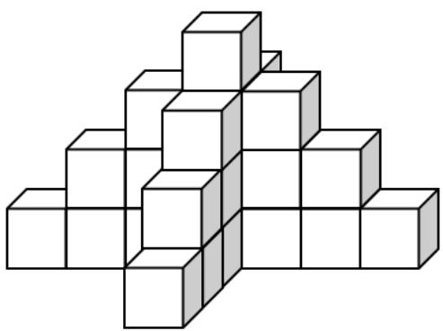

A. 82 

B. 85 

C. 77 

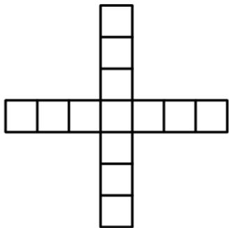

Top view

19. What is sum of interior angles of a square? 

Tổng số đo các góc trong một hình vuông là bao nhiêu? 

A. 360 

B. 180 

C. 270 

D. 90 

20. Find the area of the non-shaded region in the figure. Tìm diện tích của phần không tô đậm trong hình vẽ. 

A. 64 

B. 122 

C. 42 

D. 172 

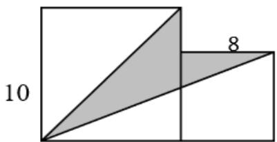

## Combinatorics / Tổ hợp

21. The map from Trisha’s school to her home is given as follows. How many different ways are there for Trisha to go from her school to her house? 

Cho bản đồ từ trường về nhà của Trisha trong hình vẽ sau. Hỏi có bao nhiêu cách khác nhau để Trisha có thể đi từ trường cô ấy về đến nhà? 

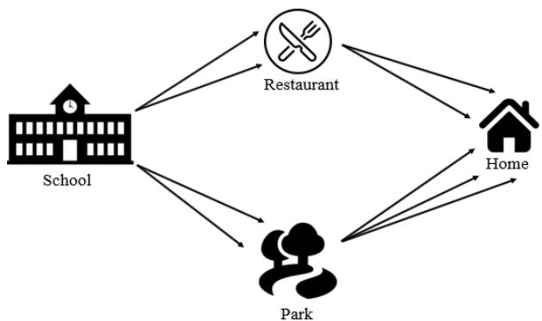

A.5 

B. 9 

C. 12 

D. 10 

22. Five students join a competition. Only top 3 students can get $1000 scholarships. How many different ways are there to choose the students getting the scholarships? 

Năm học sinh tham gia một cuộc thi. Chỉ 3 học sinh xuất sắc nhất mới có thể được nhận học bổng trị giá $1000. Hỏi có bao nhiêu cách khác nhau để chọn học sinh được trao học bổng? 

A. 20 

B. 10 

C. 15 

D. 60 

23. Andy has 28 $1 coins and $2 coins altogether. He has $37 in total. How many $2 coins does he have? 

Andy có tất cả 28 đồng xu $1 và $2. Anh ấy có tất cả $37. Hỏi anh ấy có bao nhiêu đồng xu $2? 

A. 19 

B. 4 

C. 13 

D. 9 

24. Numbers are drawn from 55 integers 1 to 55. At least how many numbers are drawn at random to ensure that there are two numbers whose sum is 24? 

Chọn ngẫu nhiên các số từ 55 số nguyên từ 1 đến 55. Hỏi cần chọn ngẫu nhiên ít nhất bao nhiêu số để chắc chắn rằng có hai số có tổng là 24? 

A. 45 

B. 32 

C. 44 

D. 12 

25. If Alice goes from point A to point B, each step can only move up or move right along the line. How many ways are there? 

Nếu Alice đi từ điểm A đến điểm B, mỗi bước chỉ có thể đi lên trên hoặc đi sang phải dọc theo đường kẻ. Hỏi có bao nhiêu cách đi như vậy? 

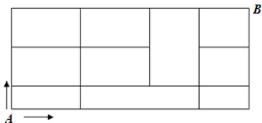

A. 12 

B. 7 

C. 19 

D. 9 

# ĐỀ SỐ 4

# Logical Thinking / Tƣ duy lô-gic

1. According to the pattern shown below, what is the number in the question mark? 

Dựa vào quy luật dưới đây, tìm số thích hợp điền vào dấu hỏi chấm. 

20 、 15 、 18 、 18 、 16 、 21 、? 、…. 

A. 14 

B. 18 

C. 10 

D. 24 

2. There are some chickens and rabbits, where the number of chickens is 28 more than the number of rabbits. If there are 320 legs in total, how many rabbits are there? 

Có một số con gà và thỏ, biết rằng số gà nhiều hơn số thỏ là 28 con. Nếu có tất cả 320 cái chân, hỏi có bao nhiêu con thỏ? 

A. 34 

B. 62 

C. 44 

D. 72 

3. A bookstore had a box of books. One half but 2 more books were sold on the first day. Two third of the remaining part and 3 fewer books were sold on the second day. Finally, 9 books are left. How many books did the bookstore have originally? 

Một hiệu sách có một thùng sách. Ngày đầu tiên họ bán được một nửa và 2 cuốn sách nữa. Ngày thứ hai họ bán được ít hơn 3 cuốn sách so với hai phần ba số sách còn lại. Cuối cùng còn lại 9 cuốn sách. Hỏi ban đầu hiệu sách đó có bao nhiêu cuốn sách? 

A. 28 

B. 76 

C. 40 

D. 58 

4. Alice needs 60 days to finish a project. Peter needs 15 days to finish the same project. If Alice and Peter do the project together, how many days do they need to finish it? 

Alice cần 60 ngày để hoàn thành một dự án. Peter cần 15 ngày để hoàn thành cùng dự án đó. Nếu Alice và Peter thực hiện dự án cùng nhau, họ cần bao nhiêu ngày thì xong? 

A. 75 

B. 12 

C. 45 

D. 20 

5. There are 10 blue balls, 18 red balls and 5 green balls in a bag. At least how many balls should be picked up at random to ensure there are 3 balls for each colour? 

Có 10 quả bóng xanh dương, 18 quả bóng đỏ và 5 quả bóng xanh lá trong một chiếc túi. Hỏi cần lấy ra ngẫu nhiên ít nhất bao nhiêu quả bóng để chắc chắn rằng có 3 quả bóng mỗi màu? 

A. 31 

B. 26 

C. 33 

D. 18 

## Arithmetic / Số học

6. Find the value of 11 111 . 

Tìm giá trị của 11 111 . 

A. 12221 

B. 1221 

C. 121 

D. 12321 

7. Find the value of $\displaystyle { \left( { \frac { 3 } { 2 } } + { \frac { 3 } { 4 } } + { \frac { 3 } { 6 } } + { \frac { 3 } { 8 } } \right) } \div { \left( { \frac { 9 } { 5 } } + { \frac { 9 } { 1 0 } } + { \frac { 9 } { 1 5 } } + { \frac { 9 } { 2 0 } } \right) }$ 8  

Tìm giá trị của $\displaystyle { \left( { \frac { 3 } { 2 } } + { \frac { 3 } { 4 } } + { \frac { 3 } { 6 } } + { \frac { 3 } { 8 } } \right) } \div { \left( { \frac { 9 } { 5 } } + { \frac { 9 } { 1 0 } } + { \frac { 9 } { 1 5 } } + { \frac { 9 } { 2 0 } } \right) }$ 

A. $\frac { 2 5 } { 8 }$ 

B. $\frac { 1 5 } { 4 }$ 

C. $\frac { 4 } { 5 }$ 

D. $\frac { 5 } { 6 }$ 

8. Find the value of $2 0 0 \div 4 + 4 0 0 \div 8 + 6 0 0 \div 1 2 + 8 0 0 \div 1 6$ . 

Tính giá trị của 200 4 400 8 600 12 800 16        . 

A. 200 

B. 250 

C. 240 

D. 150 

9. Find the value of $3 4 \times 3 4 - 8 \times 3 2$ . 

Tìm giá trị của 34 34 8 32    . 

A. 900 

B. 1412 

C. 1156 

D. 256 

10. Find the value of $\frac { 1 } { 2 } + \frac { 1 } { 4 } + \frac { 1 } { 8 } + \ldots + \frac { 1 } { 5 1 2 } + \frac { 1 } { 1 0 2 4 }$ 

Tìm giá trị của $\frac { 1 } { 2 } + \frac { 1 } { 4 } + \frac { 1 } { 8 } + \ldots + \frac { 1 } { 5 1 2 } + \frac { 1 } { 1 0 2 4 }$ 

A. $\frac { 1 0 1 5 } { 1 0 2 4 }$ 

B. $\frac { 5 1 1 } { 5 1 2 }$ 

C. $\frac { 1 0 2 3 } { 1 0 2 4 }$ 

D. $\frac { 1 2 7 } { 1 8 8 }$ 

## Number Theory / Lý thuyết số

11. If 10-digit number  201905139B is divisible by 12, find the value of  B . 

Nếu số có 10 chữ số 201905139B chia hết cho 12, tìm giá trị của  B . 

A. 2 

B. 6 

D. 8 

12. Find the last 4-digits of $( 1 4 1 \times 1 4 4 \times 1 4 7 \times . . . \times 1 8 6 \times 1 8 9 \times 1 9 2 )$ . 

Tìm 4 chữ số tận cùng của $( 1 4 1 \times 1 4 4 \times 1 4 7 \times . . . \times 1 8 6 \times 1 8 9 \times 1 9 2 ) .$ 

A. 4000 

B. 2800 

C. 0900 

D. 0000 

13. Define the operation symbol $a \oplus b = 3 \times a - 2 \times b$ , find the value of 11 (6 4)   . 

Định nghĩa ký hiệu phép toán $a \oplus b = 3 \times a - 2 \times b$ , tìm giá trị của 11 (6 4)   . 

A. 13 

B. 8 

C. 33 

D. 55 

14. Teacher gives some candies to students. If everyone gets 9 candies, 2 candies will be left. If everyone gets 7 candies, 18 candies will be left. How many candies do teacher have? 

Cô giáo phát một số kẹo cho các bạn học sinh. Nếu mỗi học sinh được chia 9 viên kẹo thì còn thừa 2 viên kẹo. Nếu mỗi học sinh được chia 7 viên kẹo thì còn thừa 18 viên kẹo. Hỏi cô giáo có bao nhiêu cái kẹo? 

A. 56 

B. 72 

C. 74 

D. 90 

15. How many 3 - digit numbers that can be divisible by 4 with unit digit 2 are there? 

Có bao nhiêu số có 3 chữ số chia hết cho 4 và có chữ số hàng đơn vị là 2? 

A. 54 

B. 27 

C. 36 

D. 45 

## Geometry / Hình học

16. How many rectangles are there in the figure below? 

Có bao nhiêu hình chữ nhật trong hình vẽ dưới đây? 

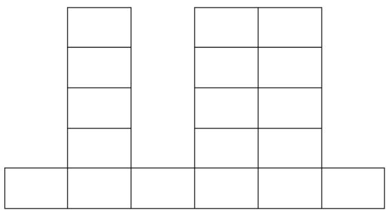

A. 63 

B. 71 

C. 77 

D. 78 

17. A square is formed by 128 rectangles that are 2cm 1cm. Find the decrease in perimeter in cm after the combination. 

Một hình vuông được ghép bởi 128 hình chữ nhật có kích thước 2cm  1cm. Hỏi chu vi của hình đã giảm đi bao nhiêu cm sau khi ghép? 

A. 640 

B. 832 

C. 768 

D. 704 

18. 22 small cubes with side length 1cm are stacked to get the figure below. Find its surface area in cm2. 

22 khối lập phương nhỏ với cạnh dài 1cm được xếp chồng lên nhau như hình dưới. Tìm diện tích toàn phần của hình theo cm2. 

A. 60 

B. 67 

C. 55 

D. 58 

19. Find the size of one angle in an equilateral triangle. 

Tính số đo của một góc trong một tam giác đều. 

A. 90o 

B. 60o 

C. 45o 

D. 30o 

20. ABDF is a square. ⊿FDE and ⊿BDC are right isosceles triangles. Find the area of ACDE given that FE = BC = 10. 

ABDF là hình vuông. FDE và BDC là hai tam giác vuông cân (tam giác có 1 góc vuông và 2 cạnh góc vuông bằng nhau). Tính diện tích của ACDE biết rằng FE = BC = 10. 

A. 125 

B. 100 

C. 75 

D. 50 

## Combinatorics / Tổ hợp

21. A flight of stairs has 9 steps. Alice can go up for 1 step, 2 steps or 3 steps each time. The 4th step cannot be stepped on as it is destroyed. How many ways are there for Alice to go up the stairs? 

Một cầu thang có 9 bậc. Alice có thể bước lên 1 bậc, 2 bậc hoặc 3 bậc mỗi lần. Biết rằng bậc thứ 4 không thể bước lên được do bị hỏng. Hỏi có bao nhiêu cách để Alice đi hết cầu thang? 

A. 44 

B. 125 

C. 149 

D. 58 

22. 12 students join a competition. Only top 4 students can advance to next round. How many different cases of advancing are there? 

12 học sinh tham gia một cuộc thi. Chỉ có 4 học sinh xuất sắc nhất mới được vào vòng trong. Có bao nhiêu trường hợp vào vòng trong khác nhau? 

A. 924 

B. 495 

C. 1188 

D. 1320 

23. Amy’s walking speed is 6m/s. She walks from home to the shopping mall in 4 minutes. What is the distance between Amy’s home and the shopping mall in meter? 

Vận tốc đi bộ của Amy là 6m/s. Cô ấy đi bộ từ nhà đến trung tâm mua sắm trong 4 phút. Hỏi khoảng cách từ nhà của Amy đến trung tâm mua sắm là bao nhiêu mét? 

A. 2400 

B. 1440 

C. 144 

D. 240 

24. Numbers are drawn from 80 integers: 20 to 99. At least how many numbers are drawn at random to ensure that there are two numbers whose sum is 70? 

Các số được chọn từ 80 số nguyên từ 20 đến 99. Hỏi cần chọn ngẫu nhiên ít nhất bao nhiêu số để chắc chắn rằng có hai số có tổng là 70? 

A. 65 

B. 30 

C. 66 

D. 35 

25. Alice goes from point A to point B. She can only move up or move right along the line. How many ways are there? 

Alice đi từ điểm A đến điểm B và chỉ có thể đi lên trên hoặc đi sang phải dọc theo đường kẻ. Hỏi có bao nhiêu cách đi? 

A. 53 

B. 60 

C. 63 

D. 65 

# ĐỀ SỐ 5

# Logical Thinking / Tƣ duy lô-gic

1. Given that A and B are two non-zero digits such that $A B$ is divisible by 5 and also a square number. Find the 2-digit number $A B$ . 

A và B là 2 chữ số khác 0 sao cho $\overline { { A B } }$ chia hết cho 5 và $\overline { { A B } }$ cũng là số chính phương. Tìm số có hai chữ số $\overline { { A B } }$ . 

A. 75 

B. 25 

C. 52 

D. 40 

Peter walks for 300m and his walking speed is 5 m/s. How many seconds are required to finish the walk? 

Peter đi bộ 300m với vận tốc 5m/s. Hỏi anh ấy đã đi trong bao nhiêu giây? 

A. 6000 

B. 600 

C. 60 

D. 6 

John needs 21 days to finish a project. Mary needs 42 days to finish the same project. If John and Mary do the project together, how long do they need to finish it? 

John cần 21 ngày để hoàn thành một dự án. Mary cần 42 ngày để hoàn thành cùng dự án đó. Nếu John và Mary thực hiện dự án cùng nhau, họ cần bao lâu để hoàn thành dự án đó? 

A. 21 

B. 63 

C. 14 

D. 42 

4. Ming’s grandmother’s age this year adds 4, multiples 2, minuses 56 and then divides by 9. The result will be 16 years old. How old is Ming’s grandmother this year? 

Lấy tuổi bà của Ming năm nay cộng 14, rồi nhân 2, trừ 56 và sau đó chia cho 9. Kết quả thu được là 16 tuổi. Hỏi bà của Ming năm nay bao nhiêu tuổi? 

A. 88 

B. 86 

C. 74 

D. 57 

5. A stationery store had a batch of ball pens. One half and 5 more pens were sold on the first day. One half of the remaining part and 8 more pens were sold on the second day. Finally, 24 ball pens are left. How many ball pens did the stationery store have initially? 

Một cửa hàng văn phòng phẩm có một lô bút bi. Ngày thứ nhất cửa hàng bán được một nửa và 5 chiếc bút nữa. Ngày thứ hai họ bán được một nửa số bút còn lại và 8 chiếc bút nữa. Cuối cùng còn lại 24 chiếc bút. Hỏi ban đầu cửa hàng văn phòng phẩm đó có bao nhiêu chiếc bút bi? 

A. 138 

B. 133 

C. 69 

D. 64 

## Arithmetic / Số học

6. Find the value of 121  111. 

Tìm giá trị của 121  111. 

A. 134431 

B. 1331 

C. 1234321 

D. 13431 

7. Find the value of $1 \times 2 + 2 \times 3 + 3 \times 4 + \ldots + 1 7 \times 1 8 + 1 8 \times 1 9 + 1 9 \times 2 0$ 

Tìm giá trị của 1 2 2 3 3 4 17 18 18 19 19 20           . 

A. 2660 

B. 260 

C. 380 

D. 1660 

8. Find the value of $1 0 0 3 { \times } 1 0 0 3 { \scriptstyle - } 9 9 7 { \times } 9 9 7$ . 

Tìm giá trị của $1 0 0 3 { \times } 1 0 0 3 { \scriptstyle - } 9 9 7 { \times } 9 9 7$ . 

A. 1005012 

B. 12000 

C. 993006 

D. 1200 

9. Find the value of $\frac { 1 } { 2 } + \frac { 1 } { 4 } + \frac { 1 } { 8 } + \frac { 1 } { 1 6 } + \frac { 1 } { 3 2 } + \frac { 1 } { 6 4 }$ 

Tìm giá trị của ${ \frac { 1 } { 2 } } + { \frac { 1 } { 4 } } + { \frac { 1 } { 8 } } + { \frac { 1 } { 1 6 } } + { \frac { 1 } { 3 2 } } + { \frac { 1 } { 6 4 } } .$ 

A. $\frac { 6 4 } { 6 3 }$ 

B. $\frac { 3 2 } { 6 4 }$ 

C. $\frac { 6 3 } { 6 4 }$ 

D. $\frac { 3 1 } { 6 4 }$ 

10. Find the value of $2 . 0 1 { \times } 1 0 + 2 . 0 1 { \times } 2 0 + 2 . 0 1 { \times } 3 0 + 2 . 0 1 { \times } 4 0$ 

Tìm giá trị của $2 . 0 1 \times 1 0 + 2 . 0 1 \times 2 0 + 2 . 0 1 \times 3 0 + 2 . 0 1 \times 4 0 .$ 

A. 603 

B. 804 

C. 402 

D. 201 

## Number Theory / Lý thuyết số

11. Define the operation symbol $a \otimes b = a \times b + b + 7$ , find the value of the operation 4 2 3     . 

Định nghĩa phép tính $a \otimes b = a \times b + b + 7$ , tìm giá trị của  4 2 3     . 

A. 64 

B. 87 

C. 71 

D. 80 

12. Find the number of factors for 143. 

Tìm số ước của 143. 

A. 4 

B. 2 

C. 3 

D. 1 

13. The sum of 5 consecutive numbers is 125. Find the middle number. 

Tổng của 5 số tự nhiên liên tiếp là 125. Tìm số ở giữa. 

A. 24 

B. 27 

C. 26 

D. 25 

14. The sum of positive numbers A and B is 480. A is 5 times of B. Find the value of A. Tổng của hai số dương A và B là 480. A gấp 5 lần B. Tìm giá trị của A. 

A. 80 

B. 420 

C. 400 

D. 480 

15. How many 3-digit numbers divisible by 3 with unit digit 5 are there? 

Có bao nhiêu số có ba chữ số chia hết cho 3 và có chữ số hàng đơn vị là 5? 

A. 30 

B. 28 

C. 24 

D. 20 

## Geometry / Hình học

16. The volume of a cube is 27cm3. Find its surface area in cm2. 

Thể tích của một hình lập phương là $2 7 c m ^ { 3 }$ . Tính diện tích toàn phần của hình đó theo cm2. 

A. 54 

B. 12 

C. 36 

D. 18 

17. Given a rectangle with integral side lengths. Its perimeter is 100. What is the minimum value of its area? 

Cho một hình chữ nhật có độ dài cạnh là số nguyên. Chu vi của hình là 100. Hỏi diện tích nhỏ nhất của hình chữ nhật là bao nhiêu? 

A. 50 

B. 99 

C. 49 

D. 25 

18. A pyramid has 1002 vertices, how many faces does this pyramid have? 

Một hình chóp có 1002 đỉnh, hỏi hình chóp đó có bao nhiêu mặt? 

A. 1001 

B. 501 

C. 502 

D. 1002 

19. Find the area of the shaded region in the figure. 

Tìm diện tích phần tô đậm trong hình vẽ sau. 

A. 10 

B. 42 

C. 36 

D. 21 

20. At most how many lines can be formed by using 18 points on a plane? 

Có thể tạo được nhiều nhất bao nhiêu đường thẳng từ 18 điểm trong mặt phẳng? 

A. 171 

B. 153 

C. 136 

D. 120 

## Combinatorics / Tổ hợp

21. Andy goes from point B to point A. He can only move down or move left along the line. How many ways are there? 

Andy đi từ điểm B đến điểm A. Anh ấy chỉ có thể đi xuống dưới hoặc đi sang trái. Hỏi có bao nhiêu cách đi? 

A. 19 

B. 21 

C. 30 

D. 40 

22. Use all four digits 1, 2, 3 and 4 to form a 4-digit number such that the tens digit and thousands digit are even while the hundreds digit and units digit are odd. How many such 4-digit number(s) is / are there? 

Sử dụng cả bốn chữ số 1, 2, 3 và 4 để tạo thành một số có 4 chữ số sao cho chữ số hàng chục và chữ số hàng nghìn là chẵn, trong khi chữ số hàng trăm và chữ số hàng đơn vị là lẻ. Hỏi có thể lập được bao nhiêu số có 4 chữ số như thế? 

A. 3 

B. 4 

C. 1 

D. 2 

23. How many 2-digit numbers are there such that the number contains digit “2”? 

Có bao nhiêu số có hai chữ số có chứa chữ số “2”? 

A. 18 

B. 19 

C. 17 

D. 20 

24. It is given that the total weight of 3 apples and 3 melons is 1800g. The weight of a melon is the same as that of 4 apples. What is the weight of 1 apple in grams? 

Biết rằng tổng khối lượng của 3 quả táo và 3 quả dưa là 1800g. Khối lượng của một quả dưa bằng khối lượng của 4 quả táo. Hỏi khối lượng của 1 quả táo là bao nhiêu gam? 

A. 480 

B. 30 

C. 60 

D. 120 

25. There are 42 students in Grade 5. Each student has to choose at least 1 favorite ball game between basketball and volleyball. There are 29 students like playing basketball and 28 students like playing volleyball. Find the number of students who likeboth ball games. 

Có 42 học sinh lớp 5. Mỗi học sinh phải chọn ít nhất 1 trò chơi bóng ưa thích giữa bóng rổ và bóng chuyền. Có 29 học sinh thích chơi bóng rổ và 28 học sinh thích chơi bóng chuyền. Tìm số học sinh thích chơi cả 2 môn bóng. 

A. 14 

B. 16 

C. 15 

D. 13 

# HEAT ROUND / VÒNG CHUNG KẾT QUỐC GIA

# ĐỀ SỐ 1: Đề thi Vòng Chung kết quốc gia năm học 2020 – 2021

## Logical Thinking / Tƣ duy lô-gic

1. This month is October. Which month will 2451 months later be? 

Month: Tháng; October: Tháng 10; Later: Sau. 

2. There are a total of 56 chickens, ducks and rabbits in a farm. These animals have a total of 146 legs. If the number of rabbits has 10 more than ducks, find the difference between the number of chickens and rabbits. 

Total: Tổng số; More than: Nhiều hơn; Difference: Hiệu. 

3. According to the pattern shown below, what is the number in the blank? 

Pattern: Quy luật; The blank: Chỗ trống. 

4. It requires 12 people to take 34 days to complete a task. How many day(s) is / are needed for 8 people to finish the same task? 

Requires: Cần; Complete a task: Hoàn thành một công việc. 

5. According to the pattern shown below, how many ＃ is / are there in the 8th group? 

Pattern: Quy luật; 8th group: Hình thứ 8. 

## Arithmetic / Số học

Value: Giá trị (Thuật ngữ dành cho câu 6 đến câu 10). 

6. Find the value of $8 1 \times 8 1 - 1 9 \times 1 9$ . 

7. Find the value of 17 18 19 1615 13     . 

8. Find the value of $\frac { 3 } { 4 \times 8 } + \frac { 3 } { 8 \times 1 2 } + \ldots + \frac { 3 } { 4 0 \times 4 4 } + \frac { 3 } { 4 4 \times 4 8 } .$ 

9. Find the value of $4 + 1 2 + 3 6 + 1 0 8 + . . . + 2 9 1 6$ . 

10. Find the value of $( \frac { 5 } { 2 } + \frac { 5 } { 4 } + \frac { 5 } { 6 } ) \div ( \frac { 1 } { 1 } + \frac { 1 } { 2 } + \frac { 1 } { 3 } + \frac { 1 } { 4 } )$ . 6  

## Number Theory / Lý thuyết số

11. Define the operation symbol $a \otimes b = { \frac { ( a + 1 ) ( b - 2 ) } { a \times 2 + b \times 3 } }$ find the value of the operation $( 7 \otimes 7 ) { \times } ( 6 \otimes 4 )$ . 

Define: Định nghĩa; Operation symbol: Kí hiệu phép toán; Value: Giá trị. 

12. If a 10-digit number  202 1777 7 A B is divisible by 99, find the value of A . 

10-digit number: Số có 10 chữ số; Divisible: Chia hết; Value: Giá trị. 

13. The product of positive numbers A and B is 448. A is 7 times of B. Find A. 

Product: Tích; Positive numbers: Số dương; 7 times of: Gấp 7 lần. 

14. Find the unit digit of A if $A = \underbrace { 2 0 2 1 \times 2 0 2 1 \times . . . \times 2 0 2 1 } _ { 2 0 2 1 ^ { \prime } s } \times 3 \times 1 3 \times 2 3 \times . . . \times 2 0 2 3 .$ 

Unit digit: Chữ số hàng đơn vị. 

15. Mr. Lee gives some pencils to students. If everyone gets 17 pencils, 1 pencil will be left. If everyone gets 14 pencils, 28 pencils will be left. How many pencils does Mr. Lee have? 

Left: Còn thừa. 

## Geometry / Hình học

16. The following figure is formed by 4 identical cuboids and 1 cylinder. The length, width and height of the cuboid are 7, 5 and 12 respectively. If the surface area of the figure is 3000, what is the surface area of the cylinder? 

Figure: Hình vẽ; Identical cuboids: Các hình hộp chữ nhật bằng nhau; Cylinder: Hình trụ; Length: Chiều dài; Width: Chiều rộng; Height: Chiều cao; Respectively: Lần lượt; Surface area: Diện tích toàn phần. 

Question 16

17. The figure below is formed by 3 identical parallelograms ABCD, FGHI, FECJ. Their side lengths are 12 and 5 respectively. Find the perimeter of the shaded region KLMN. 

Figure: Hình vẽ; Identical parallelograms: Các hình bình hành y hệt nhau; Side lengths: Độ dài cạnh; Respectively: Lần lượt; Perimeter: Chu vi; Shaded region: Phần được tô đậm. 

Question 17

18. According to the pattern shown below, how many cube(s) is / are there in the 8th generation? 

Pattern: Quy luật; Cubes: Hình lập phương; 8th generation: Hình thứ 8. 

19. A cube with side length 9 is divided into cubes with side length 3. By how much does the surface area increase? 

Cube: Hình lập phương; Side length: Độ dài cạnh; Divided into: Được chia thành; Surface area: Diện tích toàn phần; Increase: Tăng. 

20. How many rectangle(s) with “*” is / are there in the figure below? 

Rectangles: Hình chữ nhật; Figure: Hình vẽ. 

## Combinatorics / Tổ hợp

21. A flight of stairs has 11 steps. Bobby can go up for 1 step or 2 steps each time. How many way(s) is / are there for Bobby to go up the stairs? 

A flight of stairs: Cầu thang; Steps: Bậc thang. 

22. Numbers are drawn from the 120 integers 31 to 150. At least how many numbers are drawn at random to ensure that there are two numbers whose sum is 88? 

Drawn: Được chọn ra; Integers: Số nguyên; At least: Ít nhất; At random: Ngẫu nhiên; Ensure: Chắc chắn; Sum: Tổng. 

23. How many 4-digit odd number(s) is / are there so that the product of 4 digits is 32? 

4-digit odd numbers: Số lẻ có 4 chữ số; Product of 4 digits: Tích 4 chữ số. 

24. There are 12 boys and 8 girls in a class. Choose 3 boys and 2 girls to form a research group. How many way(s) is / are there in total? 

Choose: Chọn ra; Research group: Nhóm nghiên cứu; In total: Tổng số. 

25. If Harry goes from point A to point B, each step can only move up or move right. How many way(s) is / are there? 

Point: Điểm; Move up: Đi lên trên; Move right: Đi sang phải. 

Question 25

# ĐỀ SỐ 2: Đề thi Vòng Chung kết quốc gia năm học 2019 - 2020

## Logical Thinking / Tƣ duy lô-gic

Andy’s father’s age this year minuses 2, is divided by 4, adds 7 and is multiplied by 12. The result will be 252 years old. How old is Andy’s father this year? 

Minus: Trừ; Divide: Chia; Add: Cộng; Multiply: Nhân; Result: Kết quả. 

2. There are a total of 30 chickens and rabbits in a farm. The animals have a total of 74 legs. How many rabbit(s) is / are there? 

Total: Tất cả. 

3. There are 16 blue balls, 28 red balls and 30 green balls in a bag. At least how many balls should be picked up to ensure there are 5 balls for each colour? 

At least: Ít nhất; Ensure: Chắc chắn; Each: Mỗi. 

4. It requires 8 people to take 21 days to complete a task. How many day(s) is / are needed for 12 people to finish the same task? 

Require: Cần; Complete a task: Hoàn thành công việc; The same: Giống nhau. 

5. According to the pattern shown below, how many ※ is / are there in the 10th group? 

Pattern: Quy luật; 10th group: Nhóm thứ 10. 

1st Group 

2nd Group 

3rd Group 

4h Group 

## Arithmetic / Số học

Value: Giá trị (Thuật ngữ dành cho câu 6 đến câu 10). 

6. Find the value of x if ${ \frac { 3 x - 8 } { 7 } } = 7$ . 

7. Find the value of $1 6 + 2 0 + 2 4 + . . . + 6 4 + 6 8$ 

8. Find the value of $1 3 { \times } 8 1 + 2 7 { \times } 1 2 { - } 9 { \times } 1 2 3$ . 

9. Find the value of $\frac { 1 } { 7 \times 8 } { + } \frac { 1 } { 8 \times 9 } { + } \ldots { + } \frac { 1 } { 2 6 \times 2 7 } { + } \frac { 1 } { 2 7 \times 2 8 } .$ 

10. Find the value of ${ \Bigg ( } { \frac { 5 } { 3 } } + { \frac { 5 } { 6 } } + { \frac { 5 } { 9 } } + { \frac { 5 } { 1 2 } } { \Bigg ) } \div { \Bigg ( } { \frac { 8 } { 6 } } + { \frac { 8 } { 1 2 } } + { \frac { 8 } { 1 8 } } + { \frac { 8 } { 2 4 } } { \Bigg ) } .$ 

## Number Theory / Lý thuyết số

11. If a 9-digit number  20204621A is divisible by 11, find the value of A. 

9-digit number: Số có 9 chữ số; Divisible: Chia hết; Value: Giá trị. 

12. Define the operation symbol $a \otimes b = { \frac { \left( a + b \right) \times \left( a - b \right) } { \left( a - 1 \right) \times b } } , a \neq 1$ and $b \neq 0$ , find the value of 19 (6 4)   . 

Define: Định nghĩa; Operation symbol: Ký hiệu phép toán; Value: Giá trị. 

13. How many 3-digit numbers that can be divisible by 11 or 19 is / are there? 

3-digit number: Số có 3 chữ số; Divisible: Chia hết. 

14. The sum of two positive numbers A and B is 198. Find the minimum value of the product of A and B. 

Sum: Tổng; Positive number: Số tự nhiên lớn hơn $O ;$ Minimum value: Giá trị nhỏ nhất; Product: Tích. 

15. Find the last 2 digits of $6 { \times } 1 6 { \times } 2 6 { \times } 3 6 { \times } . . . { \times } 2 1 6$ . 

Digit: Chữ số; Last: Tận cùng. 

## Geometry / Hình học

16. How many rectangle(s) is / are there in the figure below? 

Rectangle: Hình chữ nhật; Figure: Hình vẽ. 

<table><tr><td></td><td></td><td></td><td></td></tr><tr><td></td><td></td><td></td><td></td></tr><tr><td></td><td></td><td></td><td></td></tr><tr><td></td><td></td><td></td><td></td></tr><tr><td></td><td></td><td></td><td></td></tr><tr><td></td><td></td><td></td><td></td></tr></table>

17. How many side(s) does a regular polygon which has $3 6 ^ { \circ }$ exterior angle have? 

Side: Cạnh; Regular polygon: Đa giác đều; Exterior: Bên ngoài; Angle: Góc. 

18. How many right-angled triangle(s) is / are there in the figure below? Right-angled triangle: Tam giác vuông; Figure: Hình vẽ. 

19. 18 small cubes with side length 1cm are combined. According to the pattern shown below, find the surface area in cm2. Cube: Hình lập phương; Pattern: Quy luật; Surface area: Diện tích bề mặt. 

20. A square is formed by 162 rectangles that are 1cm 2cm. Find the decrease in perimeter in cm. Square: Hình vuông; Rectangle: Hình chữ nhật; Decrease: Giảm; Perimeter: Chu vi. 

## Combinatorics / Tổ hợp

21. How many way(s) is / are there to split 256 students in groups of equal sizes? Way: Cách; Split: Chia; Equal: Bằng nhau. 

22. A flight of stairs has 11 steps. Peter can go up for 1 step or 3 steps each time. How many way(s) is / are there for Peter to go up the stairs? Flight of stairs: Cầu thang; Steps: Bậc thang. 

23. Choose 3 digits, without repetition, from 1, 3, 5, 7, 9 to form 3-digit numbers. How many number(s) can be divisible by 11? Without repetition: Không lặp lại; Form: Tạo thành; Divisible: Chia hết. 

24. Numbers are drawn from the 81 integers 100 to 180. At least how many numbers are drawn at random to ensure that there are two numbers whose sum is 300? Drawn: Được chọn ra; Integers: Số nguyên; At least: Ít nhất; At random: Ngẫu nhiên; Ensure: Chắc chắn; Sum: Tổng. 

25. 5 identical black books and 4 identical white books are put from left to right. How many different permutation(s) is / are there? Identical: Giống nhau; Permutation: Cách sắp xếp vị trí. 

# ĐỀ SỐ 3: Đề thi Vòng Chung kết quốc gia năm học 2018 - 2019

## Logical Thinking / Tƣ duy lô-gic

1. What is the value of the number to represent “?” in the following sequence? 

Value: Giá trị; Sequence: Dãy số. 

1, 4, 9, 16, 25, 36, ? , 64, … 

2. Today is 13th October. In the same year, World International Mathematical Olympiad Final will be held on 29th December. How many day(s) is / are remaining? 

October: Tháng Mười; The same year: Cùng năm đó; Held: Tổ chức; December: Tháng Mười hai Remaining: Còn lại. 

3. It requires 16 minutes to cut a piece of wood into 5 sections. If the time required to cut into each section is the same, how many minute(s) is / are required to cut a piece of wood into 13 sections? 

Require: Cần; Piece of wood: Miếng gỗ; Each: Mỗi; Section: Phần. 

Andy’s father’s age this year minuses 7, is divided by 8, adds 4 and multiplies 8. The result will be 72 years old. How old is Andy’s father this year? 

Minus: Trừ; Divide: Chia; Add: Cộng; Multiply: Nhân; Result: Kết quả. 

5. It requires 10 people to take 12 days to complete a task. How many day(s) is / are needed for 15 people to finish the same task? 

Require: Cần; Complete a task: Hoàn thành công việc. 

## Arithmetic / Số học

Value: Giá trị (Thuật ngữ dành cho câu 6 đến câu 10). 

6. Find the value of x if 3 4 11x   . 

7. Find the value of $2 0 1 8 ^ { 2 } - 1 0 1 3 ^ { 2 }$ . 

8. Find the value of 3 6 9 ... 45 48 51      . 

9. Find the value of 1 4 9 16 ... 121 144 169       . 

10. Find the value of $1 1 1 \times 2 3 5 + 3 3 3 \times 1 0 3 + 2 2 2 \times 2 2 8 .$ 

## Number Theory / Lý thuyết số

11. If a 9-digit number  20181014A is divisible by 6, find the value of A. 

9-digit number: Số có 9 chữ số; Divisible: Chia hết; Value: Giá trị. 

12. Find the unit digit of A if $A = 1 \times 2 \times 3 \times \ldots \times 8 \times 9$ . 

Unit digit: Chữ số hàng đơn vị. 

13. Define the operation symbol $a \otimes b = ( b - a ) ^ { 2 }$ , find the value of  (16 13) 8   . 

Define: Định nghĩa; Operation symbol: Ký hiệu phép toán; Value: Giá trị. 

14. The product of two numbers A and B is 576. A is 4 times of B. Find the value of B. 

Product: Tích; Times: Nhân; Value: Giá trị. 

15. How many 3-digit numbers that can be divisible by 6 or 8 is / are there? 

3-digit number: Số có 3 chữ số; Divisible: Chia hết. 

## Geometry / Hình học

16. It is known that the lengths of shorter sides for a right-angled triangle are 20cm and 21cm respectively. Find the length of the longest side. 

Length: Độ dài; Side: Cạnh; Right-angled triangle: Tam giác vuông. 

17. A cube with side length 6cm is divided into cubes with side length 2cm. By how much does the surface area increase? (Unit in cm2). 

Cube: Hình lập phương; Divide: Chia; Surface: Bề mặt; Area: Diện tích; Increase: Tăng. 

18. P is a point in parallelogram ABCD. Given that area of $\Delta A P D = 3 9 c m ^ { 2 }$ , area of  BCP equals to 37% of parallelogram ABCD. What is the area of parallelogram ABCD (in cm2)? 

Point: Điểm; Parallelogram: Hình bình hành; Area: Diện tích; Equal: Bằng. 

19. The figure below is formed by two squares. Their side lengths are 12cm and 8cm respectively. Find the area of the shaded region. (Unit in 2cm ). 

Figure: Hình vẽ; Square: Hình vuông; Side: Cạnh; Length: Độ dài; Respectively: Lần lượt; Shaded region: Phần tô đậm. 

20. How many right-angled triangle(s) is / are there in the figure below? 

Right-angled triangle: Tam giác vuông; Figure: Hình vẽ. 

## Combinatorics / Tổ hợp

21. Find the smallest difference by using all 8 digits from 0 to 7 with repetition to form two 4-digit numbers. 

Difference: Hiệu; With repetition: Có thể lặp lại; 4-digit number: Số có 4 chữ số. 

22. There are a total of 24 chickens and rabbits in a farm. The animals have a total of 64 legs. How many chicken(s) is / are there? 

Total: Tất cả. 

23. Choose 3 digits, without repetition, from 1, 3, 5, 7, 9 to construct 3-digit numbers. Of these 3-digit numbers, how many of them are divisible by 9? 

Without repetition: Không lặp lại; Construct: Tạo thành; 3-digit number: Số có 3 chữ số; Divisible: Chia hết. 

24. Numbers are drawn from the 100 integers 1 to 100. At least how many numbers are drawn at random to ensure that there are two numbers whose difference is 21? 

Drawn: Được chọn ra; Integers: Số nguyên; At least: Ít nhất; At random: Ngẫu nhiên; Ensure: Chắc chắn; Difference: Hiệu. 

25. How many way(s) is / are there to split 2018 students into groups of equal sizes? 

Way: Cách; Split: Chia; Groups: Các nhóm; Equal: Bằng nhau. 

# ĐỀ SỐ 4: Đề thi Vòng Chung kết quốc gia năm học 2017 – 2018

## Logical Thinking / Tƣ duy lô-gic

1. Find the 2-digit number  CA , given that A and C are two non-zero digits and the 2-digit numbers formed by these two digits have the following properties: 

1.  CA is divisible by 13; 

2.  AC is a square number; 

Non-zero: Khác không; Digit: Chữ số; 2-digit number: Số có 2 chữ số; Property: Tính chất; Divisible: Chia hết; Square number: Số chính phương. 

2. 5 numbers, A, B, C, D and E, represent different numbers from 1 to 9. 

Given the following conditions: 

1. The sum of A and E is less than the sum of C and 5. 

2. The sum of A, C and E equals D. 

3. The sum of A and D equals B. 

4. D is divisible by C. 

5. The sum of A and C is less than E. 

6. D is greater than 6. 

Find the number to represent D. 

Different: Khác nhau; Condition: Điều kiện; Sum: Tổng; Less than: Bé hơn; Equal: Bằng; 

Divisible: Chia hết; Greater than: Lớn hơn. 

3. A stationery store had a batch of ball pens. One half but 6 fewer pens were sold on the first day. One half of the remaining part and 8 more pens were sold on the second day. Finally, 20 ball pens are left. How many ball pen(s) did the stationery store have originally? 

Half: Một nửa; Remaining: Phần còn lại; Left: Còn lại; Originally: Ban đầu. 

4. John wrote a 4-digit number on a piece of paper and asked Peter to guess it. 

Peter asked: “Is the number 703?” 

John replied: “Two of the digits are correct. The positions of those digits are also correct.” 

Peter asked again: “Is the number 2745?” 

John replied: “Two of the digits are correct. The positions of those digits are all wrong.” 

Peter asked again: “Is the number 354 ?” 

John said: “All the digits are correct. The positions of those digits are all wrong.” 

Given all the digits in that 4-digit number are all different, what is the number written by John? 

4-digit number: Số có 4 chữ số; Guess: Đoán; Digit: Chữ số; Correct: Đúng; Position: Vị trí; Wrong: Sai; Different: Khác nhau. 

5. Given that there are 12 signs of the zodiac, at least how many student(s) is / are there such that there exists at least 11 of them having the same sign of the zodiac? 

Zodiac: Cung hoàng đạo; Exist: Tồn tại; At least: Ít nhất; The same: Giống nhau. 

## Arithmetic / Số học

Value: Giá trị (Thuật ngữ dành cho câu 6 đến câu 10). 

6. Find the value of $1 3 \times 4 2 + 2 6 \times 1 1 + 3 9 \times 1 2$ . 

7. Find the value of $2 0 1 7 ^ { 2 } - 1 0 1 7 ^ { 2 }$ . 

8. Find the value of $1 + 3 + 5 + 7 + . . . + 2 0 1 5 + 2 0 1 7$ . 

9. Find the value of $1 + 2 + 3 + 4 + 5 + . . . + 2 0 1 6 + 2 0 1 7 + 2 0 1 6 + 2 0 1 5 + . . . + 3 + 2 + 1 .$ 

10. Find the value of 123456787654321 1234321 . 

## Number Theory / Lý thuyết số

11. If 10-digit number  2017 1221 A B is divisible by 72, find the value of  A B . 

10-digit number: Số có 10 chữ số; Divisible: Chia hết; Value: Giá trị. 

12. Find the unit digit of $A = \underbrace { 2 0 1 7 \times 2 0 1 7 \times 2 0 1 7 \times . . . \times 2 0 1 7 } _ { 2 0 1 7 \cdot s } \times \underbrace { 1 2 2 1 \times 1 2 2 1 \times . . . \times 1 2 2 1 } _ { 1 2 2 1 ^ { \prime } s } .$ 

Unit digit: Chữ số hàng đơn vị. 

13. Define the operation symbol $a \otimes b = b \times b - 2 \times a \times b + a \times a$ , find the value of (13 14) 15   . 

Define: Định nghĩa; Operation symbol: Ký hiệu phép toán; Value: Giá trị. 

14. The sum of two positive numbers A and B is 96. Find the maximum value of the product of A and B. 

Sum: Tổng; Positive number: Số tự nhiên lớn hơn 0; Maximum value: Giá trị lớn nhất; Product: Tích. 

15. How many 3-digit number(s) that can be divisible by 3 or 5 is / are there? 

3-digit number: Số có 3 chữ số; Divisible: Chia hết. 

## Geometry / Hình học

16. How many rectangle(s) is / are there in the figure below? 

Rectangle: Hình chữ nhật; Figure: Hình vẽ. 

<table><tr><td></td><td></td><td></td><td></td><td></td><td></td><td></td></tr><tr><td></td><td></td><td></td><td></td><td></td><td></td><td></td></tr><tr><td></td><td></td><td></td><td></td><td></td><td colspan="2"></td></tr></table>

17. As shown in the figure below, ABCD is a rectangle. If the areas of  BEG and  CFG are 2017 cm2 and 1221 cm2 respectively, find the area of the shaded region in cm2. 

Figure: Hình vẽ; Rectangle: Hình chữ nhật; Area: Diện tích; Respectively: Lần lượt; Shaded region: Phần tô đậm. 

18. 35 small cubes with side length 1cm are combined according to the pattern shown below, find the surface area in cm2. 

Cube: Hình lập phương; Side: Cạnh; Length: Độ dài; Combine: Ghép lại; Pattern: Quy luật; Surface area: Diện tích bề mặt. 

19. A big rectangle is formed by 2017 small squares with side length 1cm. What is the perimeter of that rectangle in cm? 

Rectangle: Hình chữ nhật; Square: Hình vuông; Side: Cạnh; Length: Độ dài; Perimeter: Chu vi. 

20. How many right-angled triangle(s) is / are there in the figure below? 

Right-angled triangle: Tam giác vuông; Figure: Hình vẽ. 

## Combinatorics / Tổ hợp

21. A flight of stairs has 9 steps. David can go up for 1 step or 2 steps each time. How many way(s) is / are there for David to go up the stairs? 

Flight of stair: Cầu thang; Step: Bước. 

22. Two boys Bobby, Benny and two girls Grace, Gloria are to be seated in a row according to the following rules: 

1) A boy will not sit next to another boy. A girl will not sit next to another girl. 

2) Benny must sit next to Gloria. 

Find the number of the combination(s) satisfying the above condition. 

Seat: Ngồi; Row: Hàng; Rule: Quy luật; Next to: Bên cạnh; Combination: Cách sắp xếp; Condition: Điều kiện. 

23. Choose 3 digits, without repetition, from 1, 2, 4, 6, 7 to form 3-digit numbers. How many number(s) can be divisible by 3? 

Digit: Chữ số; Without repetition: Không lặp lại; 3-digit number: Số có 3 chữ số; Divisible: Chia hết. 

24. Numbers are drawn from 100 integers 1 to 100. At least how many number(s) is / are drawn at random to ensure that there are two numbers whose sum is 30? 

Drawn: Được chọn ra; Integers: Số nguyên; At least: Ít nhất; At random: Ngẫu nhiên; Ensure: Chắc chắn; Sum: Tổng. 

25. If Alice goes from point A to point B, each step can only move up or move right. How many way(s) is / are there? 

Step: Bước; Way: Cách. 

# ĐỀ SỐ 5: Đề thi Vòng Chung kết quốc gia năm học 2016 - 2017

## Logical Thinking / Tƣ duy lô-gic

1. There are 20 problems in a mathematics competition. The scores of each problem are allocated in the following ways: 5 marks will be given for a correct answer, 2 marks will be deducted for each incorrect or unanswered answer. How many questions does Amy answer correctly if her score is 79? 

Problem: Bài toán; Score: Điểm số; Allocate: Phân bổ; Mark: Điểm; Correct: Đúng; Incorrect: Sai; Unanswered: Không trả lời; Deduct: Trừ. 

2. Given that 9th August 2016 is Tuesday, which day of the week is 19th October 2016? 

August: Tháng Tám; Tuesday: Thứ Ba; Day of the week: Ngày trong tuần, thứ; October: Tháng Mười. 

3. Now Andy needs to cut a melon. At least how many cuts are required to ensure that he can get 8 equal parts? 

Melon: Quả dưa; At least: Ít nhất; Require: Cần; Ensure: Chắc chắn; Equal: Bằng nhau. 

4. John wrote a 3-digit number on a piece of paper and asked Peter to guess it. 

Peter asked again: “Is the number 32 ?” 

John replied: “Two digits are correct, but the positions of those digits are both wrong.” 

Peter asked again: “Is the number 732?” 

John said: “All three digits are correct, but the digits are all in the wrong places.” 

What is the number written by John? 

3-digit number: Số có 3 chữ số; Guess: Đoán; Digit: Chữ số; Correct: Đúng; Position: Vị trí; Wrong: Sai. 

5. According to the pattern shown below, how many circles are there from the 1st group to the 10th group? 

Pattern: Quy luật; Circle: Hình tròn; 1st group: Nhóm thứ nhất; 10th group: Nhóm thứ 10. 

## Arithmetic / Số học

Value: Giá trị (Thuật ngữ dành cho câu 6 đến câu 10). 

6. Find the value of $1 ^ { 2 } + 2 ^ { 2 } + 3 ^ { 2 } + 4 ^ { 2 } + 5 ^ { 2 } + 6 ^ { 2 }$ . 

7. Find the value of 22222 33333 . 

8. Find the value of 4 10 16 22 ... 124 130      . 

9. Find the value of 13 36 26 24 108     . 

10. Find the value of  2400 10 2400 6 2400 3 2400 1        . 

## Number Theory / Lý thuyết số

11. If a 5-digit number  81 76 A is divisible by 36, find the value of A. 

5-digit number: Số có 5 chữ số; Divisible: Chia hết; Value: Giá trị. 

12. Find the unit digit of A if  3 3 3 ... 3 7 7 7 ... 7A           . 

$$
1 0 0 ^ {\prime} s \quad 1 0 0 ^ {\prime} s
$$

Unit digit: Chữ số hàng đơn vị. 

13. The difference of A and B is 144. A is 7 times of B. Find the value of B. 

Difference: Hiệu; Times: Gấp; Greater than: Lớn hơn; Value: Giá trị. 

14. The sum of A and B is 168. A is larger than B by 10 times of B. Find the value of A. 

Sum: Tổng; Larger than: Lớn hơn; Times: Lần; Value: Giá trị. 

15. What is the smallest three-digit number that can be divisible by 6 and 8? 

Three-digit number: Số có 3 chữ số; Divisible: Chia hết. 

## Geometry / Hình học

16. The figure is formed by 3 squares with areas 64 2cm , 121 2cm and 64 2cm respectively. Find the perimeter of the following figure in cm. 

Figure: Hình vẽ; Square: Hình vuông; Area: Diện tích; Respectively: Lần lượt; Perimeter: Chu vi. 

17. According to the pattern below, if there are 10 layers, how many cubes are there? 

Pattern: Quy luật; Layer: Tầng; Cube: Hình lập phương. 

18. The figure below is made of 16 small equilateral triangles. If the perimeter of figure below is 72cm, what is the difference between before combination and after combination? 

Figure: Hình vẽ; Equilateral triangle: Tam giác đều; Perimeter: Chu vi; Difference: Hiệu; Combination: Kết hợp, ghép lại. 

19. The figure below is made of 2 squares. Find the area of the shaded region below in cm2. Figure: Hình vẽ; Area: Diện tích; Shaded region: Phần tô đậm. 

20. How many rectangles are there in the figure below? 

Rectangle: Hình chữ nhật; Figure: Hình vẽ. 

<table><tr><td></td><td></td><td></td><td></td><td></td><td></td></tr><tr><td></td><td></td><td></td><td></td><td></td><td></td></tr><tr><td></td><td></td><td></td><td></td><td></td><td></td></tr><tr><td></td><td></td><td></td><td></td><td></td><td></td></tr><tr><td></td><td></td><td></td><td></td><td></td><td></td></tr><tr><td></td><td></td><td></td><td></td><td></td><td></td></tr></table>

## Combinatorics / Tổ hợp

21. A flight of stairs has 10 steps. David can go up for 1 step, 2 steps, or 3 steps at a time. How many ways are there for David to go up the stairs? 

Flight of stair: Cầu thang; Step: Bước. 

22. Choose 6 numbers, without repetition, from 1, 4, 5, 6, 7, 9 to form 2 three-digit number. Find the minimum value of the difference between these 2 numbers. 

Without repetition: Không lặp lại; Form: Tạo thành; Three-digit number: Số có 3 chữ số; Minimum value: Giá trị nhỏ nhất; Difference: Hiệu. 

23. Numbers are drawn from the 80 integers 1 to 80. At least how many numbers are drawn at random to ensure that there are two numbers whose sum is 50? 

Drawn: Được chọn ra; Integers: Số nguyên; At least: Ít nhất; At random: Ngẫu nhiên; Ensure: Chắc chắn; Sum: Tổng. 

24. If Andy goes from point A to point B, each step can only move up or move right. How many methods are there? 

Step: Bước; Method: Cách đi. 

25. How many 4-digit numbers are there so that the sum of digits is 6? 

4-digit number: Số có 4 chữ số; Sum: Tổng; Digit: Chữ số. 

## ĐÁP ÁN THAM KHẢO

## PRELIMINARY ROUND / VÒNG LOẠI QUỐC GIA

ĐỀ SỐ 1: Đề thi Vòng loại quốc gia Năm học 2020 - 2021 

<table><tr><td colspan="3">Logical Thinking</td><td colspan="3">Number Theory</td><td colspan="3">Combinatorics</td></tr><tr><td>4</td><td>1)A</td><td>4</td><td>4</td><td>11)C</td><td>4</td><td>4</td><td>21)C</td><td>4</td></tr><tr><td>4</td><td>2)B</td><td>4</td><td>4</td><td>12)D</td><td>4</td><td>4</td><td>22)A</td><td>4</td></tr><tr><td>4</td><td>3)A</td><td>4</td><td>4</td><td>13)B</td><td>4</td><td>4</td><td>23)C</td><td>4</td></tr><tr><td>4</td><td>4)D</td><td>4</td><td>4</td><td>14)C</td><td>4</td><td>4</td><td>24)B</td><td>4</td></tr><tr><td>4</td><td>5)B</td><td>4</td><td>4</td><td>15)B</td><td>4</td><td>4</td><td>25)A</td><td>4</td></tr><tr><td colspan="3">Arithmetic</td><td colspan="3">Geometry</td><td colspan="3"></td></tr><tr><td>4</td><td>6)C</td><td>4</td><td>4</td><td>16)D</td><td>4</td><td rowspan="5" colspan="3"></td></tr><tr><td>4</td><td>7)D</td><td>4</td><td>4</td><td>17)D</td><td>4</td></tr><tr><td>4</td><td>8)A</td><td>4</td><td>4</td><td>18)A</td><td>4</td></tr><tr><td>4</td><td>9)B</td><td>4</td><td>4</td><td>19)B</td><td>4</td></tr><tr><td>4</td><td>10)A</td><td>4</td><td>4</td><td>20)A</td><td>4</td></tr></table>

ĐỀ SỐ 2

<table><tr><td colspan="3">Logical Thinking</td><td colspan="3">Number Theory</td><td colspan="3">Combinatorics</td></tr><tr><td>4</td><td>1)A</td><td>4</td><td>4</td><td>11)A</td><td>4</td><td>4</td><td>21)D</td><td>4</td></tr><tr><td>4</td><td>2)B</td><td>4</td><td>4</td><td>12)B</td><td>4</td><td>4</td><td>22)C</td><td>4</td></tr><tr><td>4</td><td>3)D</td><td>4</td><td>4</td><td>13)A</td><td>4</td><td>4</td><td>23)A</td><td>4</td></tr><tr><td>4</td><td>4)C</td><td>4</td><td>4</td><td>14)D</td><td>4</td><td>4</td><td>24)B</td><td>4</td></tr><tr><td>4</td><td>5)A</td><td>4</td><td>4</td><td>15)C</td><td>4</td><td>4</td><td>25)B</td><td>4</td></tr><tr><td colspan="3">Arithmetic</td><td colspan="3">Geometry</td><td colspan="3"></td></tr><tr><td>4</td><td>6)C</td><td>4</td><td>4</td><td>16)C</td><td>4</td><td rowspan="5" colspan="3"></td></tr><tr><td>4</td><td>7)B</td><td>4</td><td>4</td><td>17)A</td><td>4</td></tr><tr><td>4</td><td>8)D</td><td>4</td><td>4</td><td>18)D</td><td>4</td></tr><tr><td>4</td><td>9)B</td><td>4</td><td>4</td><td>19)B</td><td>4</td></tr><tr><td>4</td><td>10)C</td><td>4</td><td>4</td><td>20)B</td><td>4</td></tr></table>

ĐỀ SỐ 3

<table><tr><td colspan="3">Logical Thinking</td><td colspan="3">Number Theory</td><td colspan="3">Combinatorics</td></tr><tr><td>4</td><td>1)C</td><td>4</td><td>4</td><td>11)B</td><td>4</td><td>4</td><td>21)D</td><td>4</td></tr><tr><td>4</td><td>2)A</td><td>4</td><td>4</td><td>12)B</td><td>4</td><td>4</td><td>22)B</td><td>4</td></tr><tr><td>4</td><td>3)D</td><td>4</td><td>4</td><td>13)D</td><td>4</td><td>4</td><td>23)D</td><td>4</td></tr><tr><td>4</td><td>4)B</td><td>4</td><td>4</td><td>14)A</td><td>4</td><td>4</td><td>24)A</td><td>4</td></tr><tr><td>4</td><td>5)B</td><td>4</td><td>4</td><td>15)D</td><td>4</td><td>4</td><td>25)C</td><td>4</td></tr><tr><td colspan="3">Arithmetic</td><td colspan="3">Geometry</td><td colspan="3"></td></tr><tr><td>4</td><td>6)C</td><td>4</td><td>4</td><td>16)C</td><td>4</td><td rowspan="5" colspan="3"></td></tr><tr><td>4</td><td>7)B</td><td>4</td><td>4</td><td>17)C</td><td>4</td></tr><tr><td>4</td><td>8)A</td><td>4</td><td>4</td><td>18)D</td><td>4</td></tr><tr><td>4</td><td>9)D</td><td>4</td><td>4</td><td>19)A</td><td>4</td></tr><tr><td>4</td><td>10)C</td><td>4</td><td>4</td><td>20)B</td><td>4</td></tr></table>

ĐỀ SỐ 4

<table><tr><td colspan="3">Logical Thinking</td><td colspan="3">Number Theory</td><td colspan="3">Combinatorics</td></tr><tr><td>4</td><td>1)A</td><td>4</td><td>4</td><td>11)B</td><td>4</td><td>4</td><td>21)D</td><td>4</td></tr><tr><td>4</td><td>2)C</td><td>4</td><td>4</td><td>12)D</td><td>4</td><td>4</td><td>22)B</td><td>4</td></tr><tr><td>4</td><td>3)C</td><td>4</td><td>4</td><td>13)A</td><td>4</td><td>4</td><td>23)B</td><td>4</td></tr><tr><td>4</td><td>4)B</td><td>4</td><td>4</td><td>14)C</td><td>4</td><td>4</td><td>24)C</td><td>4</td></tr><tr><td>4</td><td>5)A</td><td>4</td><td>4</td><td>15)D</td><td>4</td><td>4</td><td>25)C</td><td>4</td></tr><tr><td colspan="3">Arithmetic</td><td colspan="3">Geometry</td><td colspan="3"></td></tr><tr><td>4</td><td>6)B</td><td>4</td><td>4</td><td>16)C</td><td>4</td><td rowspan="5" colspan="3"></td></tr><tr><td>4</td><td>7)D</td><td>4</td><td>4</td><td>17)D</td><td>4</td></tr><tr><td>4</td><td>8)A</td><td>4</td><td>4</td><td>18)A</td><td>4</td></tr><tr><td>4</td><td>9)A</td><td>4</td><td>4</td><td>19)B</td><td>4</td></tr><tr><td>4</td><td>10)C</td><td>4</td><td>4</td><td>20)D</td><td>4</td></tr></table>

ĐỀ SỐ 5

<table><tr><td colspan="3">Logical Thinking</td><td colspan="3">Number Theory</td><td colspan="3">Combinatorics</td></tr><tr><td>4</td><td>1)B</td><td>4</td><td>4</td><td>11)B</td><td>4</td><td>4</td><td>21)D</td><td>4</td></tr><tr><td>4</td><td>2)C</td><td>4</td><td>4</td><td>12)A</td><td>4</td><td>4</td><td>22)B</td><td>4</td></tr><tr><td>4</td><td>3)C</td><td>4</td><td>4</td><td>13)D</td><td>4</td><td>4</td><td>23)A</td><td>4</td></tr><tr><td>4</td><td>4)B</td><td>4</td><td>4</td><td>14)C</td><td>4</td><td>4</td><td>24)D</td><td>4</td></tr><tr><td>4</td><td>5)A</td><td>4</td><td>4</td><td>15)A</td><td>4</td><td>4</td><td>25)C</td><td>4</td></tr><tr><td colspan="3">Arithmetic</td><td colspan="3">Geometry</td><td colspan="3"></td></tr><tr><td>4</td><td>6)D</td><td>4</td><td>4</td><td>16)A</td><td>4</td><td rowspan="5" colspan="3"></td></tr><tr><td>4</td><td>7)A</td><td>4</td><td>4</td><td>17)C</td><td>4</td></tr><tr><td>4</td><td>8)B</td><td>4</td><td>4</td><td>18)D</td><td>4</td></tr><tr><td>4</td><td>9)C</td><td>4</td><td>4</td><td>19)B</td><td>4</td></tr><tr><td>4</td><td>10)D</td><td>4</td><td>4</td><td>20)B</td><td>4</td></tr></table>

# HEAT ROUND / VÒNG CHUNG KẾT QUỐC GIA

ĐỀ SỐ 1: Đề thi Vòng Chung kết quốc gia năm học 2020 – 2021 

<table><tr><td colspan="3">Logical Thinking</td><td colspan="3">Number Theory</td><td colspan="3">Combinatorics</td></tr><tr><td>4</td><td>1) January</td><td>4</td><td>4</td><td>11)<eq>\frac{2}{3}</eq></td><td>4</td><td>4</td><td>21) 144</td><td>4</td></tr><tr><td>4</td><td>2) 15</td><td>4</td><td>4</td><td>12) 7</td><td>4</td><td>4</td><td>22) 108</td><td>4</td></tr><tr><td>4</td><td>3) 69</td><td>4</td><td>4</td><td>13) 56</td><td>4</td><td>4</td><td>23) 12</td><td>4</td></tr><tr><td>4</td><td>4) 51</td><td>4</td><td>4</td><td>14) 7</td><td>4</td><td>4</td><td>24) 6160</td><td>4</td></tr><tr><td>4</td><td>5) 136</td><td>4</td><td>4</td><td>15) 154</td><td>4</td><td>4</td><td>25) 67</td><td>4</td></tr><tr><td colspan="3">Arithmetic</td><td colspan="3">Geometry</td><td colspan="3"></td></tr><tr><td>4</td><td>6) 6200</td><td>4</td><td>4</td><td>16) 1848</td><td>4</td><td rowspan="5" colspan="3"></td></tr><tr><td>4</td><td>7) 323</td><td>4</td><td>4</td><td>17) 14</td><td>4</td></tr><tr><td>4</td><td>8)<eq>\frac{11}{64}</eq></td><td>4</td><td>4</td><td>18) 164</td><td>4</td></tr><tr><td>4</td><td>9) 4372</td><td>4</td><td>4</td><td>19) 972</td><td>4</td></tr><tr><td>4</td><td>10)<eq>2\frac{1}{5}</eq></td><td>4</td><td>4</td><td>20) 15</td><td>4</td></tr></table>

ĐỀ SỐ 2: Đề thi Vòng Chung kết quốc gia năm học 2019 – 2020

<table><tr><td colspan="3">Logical Thinking</td><td colspan="3">Number Theory</td><td colspan="3">Combinatorics</td></tr><tr><td>4</td><td>1)58</td><td>4</td><td>4</td><td>11)8</td><td>4</td><td>4</td><td>21)9</td><td>4</td></tr><tr><td>4</td><td>2)7</td><td>4</td><td>4</td><td>12)20</td><td>4</td><td>4</td><td>22)41</td><td>4</td></tr><tr><td>4</td><td>3)63</td><td>4</td><td>4</td><td>13)124</td><td>4</td><td>4</td><td>23)8</td><td>4</td></tr><tr><td>4</td><td>4)14</td><td>4</td><td>4</td><td>14)197</td><td>4</td><td>4</td><td>24)52</td><td>4</td></tr><tr><td>4</td><td>5)199</td><td>4</td><td>4</td><td>15)36</td><td>4</td><td>4</td><td>25)126</td><td>4</td></tr><tr><td colspan="3">Arithmetic</td><td colspan="3">Geometry</td><td colspan="3"></td></tr><tr><td>4</td><td>6)19</td><td>4</td><td>4</td><td>16)117</td><td>4</td><td rowspan="5" colspan="3"></td></tr><tr><td>4</td><td>7)588</td><td>4</td><td>4</td><td>17)10</td><td>4</td></tr><tr><td>4</td><td>8)270</td><td>4</td><td>4</td><td>18)24</td><td>4</td></tr><tr><td>4</td><td>9)<eq>\frac{3}{28}</eq></td><td>4</td><td>4</td><td>19)56</td><td>4</td></tr><tr><td>4</td><td>10)<eq>1\frac{1}{4}</eq></td><td>4</td><td>4</td><td>20)900</td><td>4</td></tr></table>

ĐỀ SỐ 3: Đề thi Vòng Chung kết quốc gia năm học 2018 – 2019

<table><tr><td colspan="3">Logical Thinking</td><td colspan="3">Number Theory</td><td colspan="3">Combinatorics</td></tr><tr><td>4</td><td>1) 49</td><td>4</td><td>4</td><td>11) 4</td><td>4</td><td>4</td><td>21) 0</td><td>4</td></tr><tr><td>4</td><td>2) 77</td><td>4</td><td>4</td><td>12) 0</td><td>4</td><td>4</td><td>22) 16</td><td>4</td></tr><tr><td>4</td><td>3) 48</td><td>4</td><td>4</td><td>13) 1</td><td>4</td><td>4</td><td>23) 6</td><td>4</td></tr><tr><td>4</td><td>4) 47</td><td>4</td><td>4</td><td>14) 12</td><td>4</td><td>4</td><td>24) 59</td><td>4</td></tr><tr><td>4</td><td>5) 8</td><td>4</td><td>4</td><td>15) 225</td><td>4</td><td>4</td><td>25) 3</td><td>4</td></tr><tr><td colspan="3">Arithmetic</td><td colspan="3">Geometry</td><td colspan="3"></td></tr><tr><td>4</td><td>6) 5</td><td>4</td><td>4</td><td>16) 29</td><td>4</td><td rowspan="5" colspan="3"></td></tr><tr><td>4</td><td>7) 3,046,155</td><td>4</td><td>4</td><td>17) 432</td><td>4</td></tr><tr><td>4</td><td>8) 459</td><td>4</td><td>4</td><td>18) 300</td><td>4</td></tr><tr><td>4</td><td>9) 819</td><td>4</td><td>4</td><td>19) 56</td><td>4</td></tr><tr><td>4</td><td>10) 111,000</td><td>4</td><td>4</td><td>20) 19</td><td>4</td></tr></table>

ĐỀ SỐ 4: Đề thi Vòng Chung kết quốc gia năm học 2017 – 2018

<table><tr><td colspan="3">Logical Thinking</td><td colspan="3">Number Theory</td><td colspan="3">Combinatorics</td></tr><tr><td>4</td><td>1)52</td><td>4</td><td>4</td><td>11)11</td><td>4</td><td>4</td><td>21)55</td><td>4</td></tr><tr><td>4</td><td>2)8</td><td>4</td><td>4</td><td>12)7</td><td>4</td><td>4</td><td>22)6</td><td>4</td></tr><tr><td>4</td><td>3)100</td><td>4</td><td>4</td><td>13)196</td><td>4</td><td>4</td><td>23)24</td><td>4</td></tr><tr><td>4</td><td>4)1453</td><td>4</td><td>4</td><td>14)2304</td><td>4</td><td>4</td><td>24)87</td><td>4</td></tr><tr><td>4</td><td>5)121</td><td>4</td><td>4</td><td>15)420</td><td>4</td><td>4</td><td>25)23</td><td>4</td></tr><tr><td colspan="3">Arithmetic</td><td colspan="3">Geometry</td><td colspan="3"></td></tr><tr><td>4</td><td>6)1300</td><td>4</td><td>4</td><td>16)129</td><td>4</td><td rowspan="5" colspan="3"></td></tr><tr><td>4</td><td>7)3,034,000</td><td>4</td><td>4</td><td>17)3238</td><td>4</td></tr><tr><td>4</td><td>8)1,018,081</td><td>4</td><td>4</td><td>18)86</td><td>4</td></tr><tr><td>4</td><td>9)4,068,289</td><td>4</td><td>4</td><td>19)4036</td><td>4</td></tr><tr><td>4</td><td>10)100,020,001</td><td>4</td><td>4</td><td>20)36</td><td>4</td></tr></table>

ĐỀ SỐ 5: Đề thi Vòng Chung kết quốc gia năm học 2016 – 2017

<table><tr><td colspan="3">Logical Thinking</td><td colspan="3">Number Theory</td><td colspan="3">Combinatorics</td></tr><tr><td>4</td><td>1) 17</td><td>4</td><td>4</td><td>11) 5</td><td>4</td><td>4</td><td>21) 274</td><td>4</td></tr><tr><td>4</td><td>2) Wednesday</td><td>4</td><td>4</td><td>12) 1</td><td>4</td><td>4</td><td>22) 17</td><td>4</td></tr><tr><td>4</td><td>3) 3</td><td>4</td><td>4</td><td>13) 24</td><td>4</td><td>4</td><td>23) 57</td><td>4</td></tr><tr><td>4</td><td>4) 273</td><td>4</td><td>4</td><td>14) 154</td><td>4</td><td>4</td><td>24) 70</td><td>4</td></tr><tr><td>4</td><td>5) 220</td><td>4</td><td>4</td><td>15) 120</td><td>4</td><td>4</td><td>25) 56</td><td>4</td></tr><tr><td colspan="3">Arithmetic</td><td colspan="3">Geometry</td><td colspan="3"></td></tr><tr><td>4</td><td>6) 91</td><td>4</td><td>4</td><td>16) 76</td><td>4</td><td rowspan="5" colspan="3"></td></tr><tr><td>4</td><td>7) 740,725,926</td><td>4</td><td>4</td><td>17) 1330</td><td>4</td></tr><tr><td>4</td><td>8) 1474</td><td>4</td><td>4</td><td>18) 216</td><td>4</td></tr><tr><td>4</td><td>9) 1200</td><td>4</td><td>4</td><td>19) 26</td><td>4</td></tr><tr><td>4</td><td>10) 3840</td><td>4</td><td>4</td><td>20) 441</td><td>4</td></tr></table>

# HEAT ROUND ANSWER SHEET

# MẪU PHIẾU TRẢ LỜI VÒNG CHUNG KẾT QUỐC GIA

<table><tr><td>Admission ID:Số báo danh:</td><td></td><td></td><td></td><td></td><td></td><td></td><td></td><td></td><td></td><td></td><td>Centre No:Số phòng thi:</td><td></td></tr><tr><td>Contestant Name:Họ tên thí sinh:</td><td colspan="12"></td></tr><tr><td>Date of Birth:Ngày sinh:</td><td colspan="10"></td><td>Contestant Grade:Khối thi:</td><td></td></tr><tr><td>School Name:Tên trường:</td><td colspan="10"></td><td>City / Province:Thành phố / Tỉnh:</td><td></td></tr></table>

Fill all the information above in BLOCK LETTER. 

Điền đầy đủ thông tin, trong đó mỗi ô của số báo danh điền đúng 1 chữ số hoặc 1 chữ cái. 

<table><tr><td colspan="3">Logical Thinking</td><td colspan="3">Number Theory</td><td colspan="3">Combinatorics</td></tr><tr><td>4</td><td>1)</td><td>4</td><td>4</td><td>11)</td><td>4</td><td>4</td><td>21)</td><td>4</td></tr><tr><td>4</td><td>2)</td><td>4</td><td>4</td><td>12)</td><td>4</td><td>4</td><td>22)</td><td>4</td></tr><tr><td>4</td><td>3)</td><td>4</td><td>4</td><td>13)</td><td>4</td><td>4</td><td>23)</td><td>4</td></tr><tr><td>4</td><td>4)</td><td>4</td><td>4</td><td>14)</td><td>4</td><td>4</td><td>24)</td><td>4</td></tr><tr><td>4</td><td>5)</td><td>4</td><td>4</td><td>15)</td><td>4</td><td>4</td><td>25)</td><td>4</td></tr><tr><td colspan="3">Arithmetic / Algebra</td><td colspan="3">Geometry</td><td colspan="3"></td></tr><tr><td>4</td><td>6)</td><td>4</td><td>4</td><td>16)</td><td>4</td><td rowspan="5" colspan="3"></td></tr><tr><td>4</td><td>7)</td><td>4</td><td>4</td><td>17)</td><td>4</td></tr><tr><td>4</td><td>8)</td><td>4</td><td>4</td><td>18)</td><td>4</td></tr><tr><td>4</td><td>9)</td><td>4</td><td>4</td><td>19)</td><td>4</td></tr><tr><td>4</td><td>10)</td><td>4</td><td>4</td><td>20)</td><td>4</td></tr></table>

## Proctor’s Signature

Cán bộ coi thi kí và ghi rõ họ tên 

## Contestant’s Signature

Thí sinh kí và ghi rõ họ tên 

## MỘT SỐ CÁC KỲ THI OLYMPIC QUỐC TẾ TIÊU BIỂU KHÁC

Đón đầu xu thế hội nhập và hợp tác quốc tế trong lĩnh vực giáo dục và đào tạo, tiếp cận cuộc cách mạng công nghiệp 4.0, đến nay Công ty Cổ phần Giáo dục FERMAT đã chứng tỏ được năng lực làm việc với các tổ chức giáo dục có uy tín trên thế giới và được tin tưởng ủy quyền triển khai, tổ chức và phối hợp tổ chức cùng các đơn vị giáo dục Việt Nam nhiều kỳ thi Olympic về Toán, Tin, Khoa học và tiếng Anh. 

Các kỳ thi tổ chức tại nhiều hội đồng thi trên khắp cả nước, với đông đảo học sinh từ mẫu giáo cho đến lớp 12 tại hàng trăm trường học tham dự. 

Lễ khai mạc Vòng Chung kết quốc gia HKIMO 2021 tại trường THCS Lê Lợi, Hà Đông, Hà Nội

Đoàn học sinh check-in tại Vòng loại quốc gia HIPPO 2021

Đoàn trường TH Hạ Long, Quảng Ninh tham gia Vòng Chug kết quốc tế TIMO 2021

## 1. Các Kỳ thi Olympic Toán quốc tế

## 2. Các Kỳ thi Olympic Tiếng Anh và Ngôn ngữ quốc tế

## EURASIAN SPELLINGBE

Lexical Skills Competition 

## Willkommen

## 3. Các Kỳ thi Olympic Khoa học, Tin học, Nghệ Thuật

4. Một số hình ảnh, khoảnh khắc đẹp qua các mùa thi a. Hình ảnh thí sinh tham gia dự thi 

Email: olympic.fermat@gmail.com

b. Hình ảnh Huy chương, Giấy chứng nhận

## THÔNG TIN LIÊN HỆ

Để biết thêm thông tin cập nhật về các kỳ thi Olympic, quý lãnh đạo, quý thầy cô, quý phụ huynh và các em học sinh vui lòng truy cập các địa chỉ dưới đây: 

- Fanpage: Tổng hợp các Kỳ thi Olympic Quốc tế - Olympic Việt Nam - https://www.facebook.com/Olympic.FERMAT/ 

- Website: http://olympic.fermat.edu.vn/ 

## Ban Tổ chức các Kỳ thi Olympic

Công ty Cổ phần Giáo dục FERMAT 

. Địa chỉ: Số 6A1, Tiểu khu Ngọc Khánh, Ba Đình, Hà Nội. 

2. Qua email: Olympic.FERMAT@gmail.com 

3. Qua số điện thoại hỗ trợ: 0917 830455 - 024 66572055 

## TAI LIEU LUU HANH NOI BO Su dung cho Vong loai quoc gia & Vong chung ket quoc gia

Cuon sach Cüng co va On luyen Toan la mot tai lieu dé ren luyen va nang cao näng luc va phäm chat hoc sinh do tac gia Lé Duc Thuan lam Tong Chu bien.Noi dung cuon sach gom cac chuong,bai bam sat Chuong trinh va SGK mon Toan hien hanh.Trong moi bai,sau phan tom tat ly thuyet la he thong cac cau höi,bai tap dugc da duoc phan dang tuong minh,duqc lua chon ki cang,bao gom bön muc d biet, hieu,van dung va van dung cao.Voi dac diem nhu vay, hoc sinh có theé vua truc tiep thuc hanh tim toi, kham pha cac tri thuc toan hoc an chua trong moibai tap,vua luyén tap van dung cac kien thuc,ky näng toan hoc vao cac tinh huong δ cac muc do khac nhau. 

B sach Cung co va On luyen 3 mon Toan- Van- Anh dang duqc ban rong rai tai tat ca cac nha sach tren toan quoc 

## CONG TY CO PHAN GIAO DUC FERMAT

Diachi:So6A1,Tiéu khu Ngoc Khanh,Ba Dinh,Ha Noi-Dien thoai:0246 6572055/0917830 455 

Website:www.olympic.fermat.edu.vn-Fanpage:www.fb.com/fermateducation 